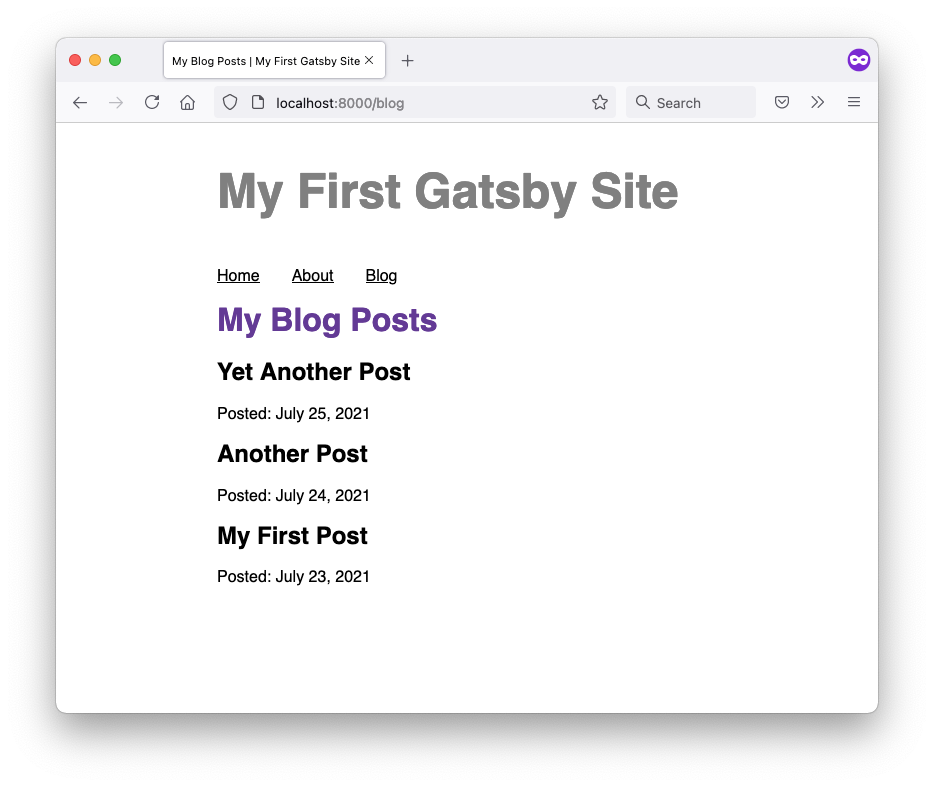
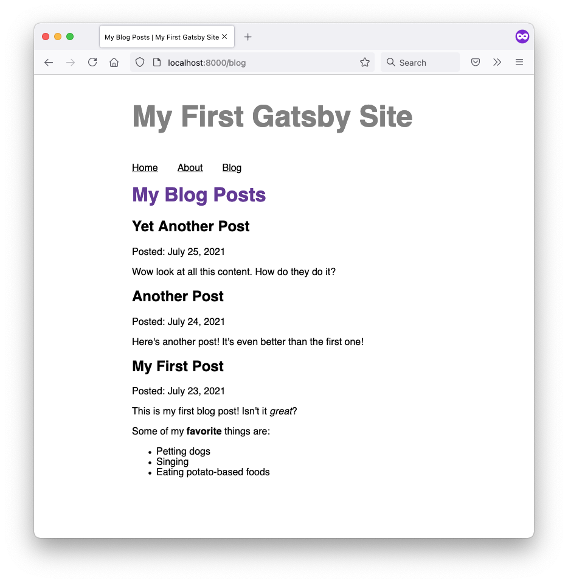

import { Announcement, Notification } from 'gatsby-interface'
import Collapsible from '@components/collapsible'
import { MdInfo } from 'react-icons/md'

<Notification
  Icon={MdInfo}
  tone="WARNING"
  variant="SECONDARY"
  content={
    <div>
      <p>
        <strong>Note:</strong> We{"'"}re still working on updating this Tutorial to use Gatsby v3.
        The first few parts of the new Tutorial have been released here, and subsequent parts
        will be added as we finish them.
      </p>
      <p style={{ marginBottom: 0 }}>
        If you{"'"}re looking for a full experience in the meantime, you can check out the (slightly outdated){" "}
        <a href="https://v2.gatsbyjs.com/docs/tutorial/">
          <strong>Gatsby v2 Tutorial</strong>
        </a>
        .
      </p>
    </div>
  }
/>

## Introduction

In Part 4, you used the `gatsby-source-filesystem` source plugin to build a Blog page that lists the names of your blog post files. But you weren't able to actually render the contents of your post files, because `gatsby-source-filesystem` doesn't provide a field for it. To do that, you'll need another type of plugin called a **transformer plugin**.

Sometimes, the format of the data you get from source plugins isn’t what you want to use to build your website. For example, the filesystem source plugin lets you query data *about* files, but it doesn't let you use the data *inside* the files themselves. To make this possible, Gatsby supports transformer plugins, which take the raw content from source plugins and transform it into something more usable.

In this part of the Tutorial, you'll learn about one particular transformer plugin, `gatsby-plugin-mdx`, which lets you use [MDX](https://mdxjs.com/), a file format that allows Markdown and JSX alongside your text content. (Fun fact: this Tutorial is actually written in MDX!) You'll use MDX to add some content to your blog post files, and then you'll use `gatsby-plugin-mdx` to render the contents of your posts on your Blog page.

By the end of this part of the Tutorial, you will be able to:

- Write an MDX file with Markdown formatting and frontmatter.
- Use the `gatsby-plugin-mdx` plugin to render the contents of your MDX files on your Blog page.
- Use the `sort` field to control the order of results in your GraphQL queries.

https://github.com/meganesu/gatsby-intro-workshop-example-site-with-v3/commit/207d5d11d72e972ac1ec5507159ff2c4460c98b9

## A closer look at Gatsby's GraphQL data layer

To understand how `gatsby-plugin-mdx` and other transformer plugins work, you need to know a bit more about how Gatsby’s GraphQL data layer works.

Inside the data layer, information is stored in objects called **nodes**. Different source plugins create different types of nodes, each of which have their own properties. For example, `gatsby-source-filesystem` creates File nodes.

A **transformer plugin** converts nodes from one type to another. For example, the `gatsby-plugin-mdx` plugin transforms File nodes that have the `.mdx` extension into MDX nodes, which have a different set of fields that you can query using GraphQL. Transformer plugins let you manipulate the raw data in the nodes created by source plugins, so that you can get it into the structure or format you need.


<Announcement style={{marginBottom: "1.5rem"}}>

**Note:** Even though it's called a transformer plugin, it's not actually *changing* the original nodes created by the source plugins. Each transformer plugin creates new nodes based on the data from the sourced nodes, but it doesn't actually change the source nodes themselves. So even though `gatsby-plugin-mdx` creates new MDX nodes, you can still access the original File nodes created by `gatsby-source-filesystem`.

</Announcement>

In this part of the Tutorial, you'll learn how to use a transformer plugin to create MDX nodes from your File nodes.

## Add some MDX content to your blog posts

In Part 4, you created empty files for your blog posts. Now, it's time to fill them in!

<Collapsible
  summary={<h3>Using Markdown formatting in MDX</h3>}
>

MDX files let you format text using Markdown, a markup language that uses a special syntax to add special formatting to your text elements. For example, if you can make text appear **strong** by wrapping it in `**double asterisks**`, or you can create a link by using a syntax like `[text to link](url)`.

Once you get used to what all the different symbols mean, Markdown can be easier to read than HTML, which makes it a popular format for written content like blog posts.

<Announcement style={{marginBottom: "1.5rem"}}>

**New to Markdown?** The MDX documentation includes a [table of components](https://mdxjs.com/table-of-components) that shows the different formatting options available. It includes things like headings, blockquotes, lists, and code blocks. 

</Announcement>

#### Frontmatter

With `gatsby-plugin-mdx`, you can also add **frontmatter** to your MDX files. Frontmatter is additional metadata about your file. It won't be rendered on your page, but it's a way for you to add some extra details about your content. For example, you might store your post title or the date it was published.

To add frontmatter to your post, put it between an opening and closing set of three hyphens (`---`) at the top of your MDX file. Within the opening and closing hyphens, you can create key-value pairs for any kind of data you want to store about your file.

Here's an example:

```mdx
---
name: "Fun Facts about Red Pandas"
datePublished: "2021-07-12"
author: "#1 Red Panda Fan"
---
```

You'll learn more about how to access the frontmatter for your posts later on.

</Collapsible>

Add some Markdown content to each of the `.mdx` files you created in your `/blog` directory in Part 4. 

Include frontmatter with fields for the title of each post and the date it was published. (Give each post a different date, to make it easier to add sorting later on.) After the frontmatter, write some post content using some Markdown syntax.

Here are some example posts that you can use for inspiration:

```mdx:title=blog/my-first-post.mdx
---
title: "My First Post"
date: "2021-07-23"
---

This is my first blog post! Isn't it *great*?

Some of my **favorite** things are:

* Petting dogs
* Singing
* Eating potato-based foods
```

```mdx:title=blog/another-post.mdx
---
title: "Another Post"
date: "2021-07-24"
---

Here's another post! It's even better than the first one!
```

```mdx:title=blog/yet-another-post.mdx
---
title: "Yet Another Post"
date: "2021-07-25"
---

Wow look at all this content. How do they do it?
```

## Render each post's contents on the Blog page

Now that you have some MDX content inside your blog posts, it's time set up the `gatsby-plugin-mdx` transformer plugin.

<Announcement>

**Quick Refresher:** Remember the process for adding a plugin to your site (from [Part 3](/docs/tutorial/part-3/))? See if you can remember the three steps from memory before checking your answer. (Science has shown that the act of trying to [actively recall information](https://www.cultofpedagogy.com/retrieval-practice/) helps you retain it better!)

</Announcement>

To render your posts on the Blog page, you'll complete a few different steps:

1. Install and configure the `gatsby-plugin-mdx` transformer plugin and its dependencies.
2. Update the Blog page query to use the `allMdx` field from `gatsby-plugin-mdx` instead of `allFile`.
3. Use the `MDXRenderer` component from `gatsby-plugin-mdx` to render your post's MDX contents in the JSX for your Blog page.


### Task: Install and configure the MDX transformer plugin (and dependencies)

The `gatsby-plugin-mdx` package requires a few additional dependencies to run: `@mdx-js/mdx` and `@mdx-js/react`. These are both packages that DO SOMETHING.

Run the command below in the terminal to install `gatsby-plugin-mdx` and its dependencies.

```shell
npm install gatsby-plugin-mdx @mdx-js/mdx @mdx-js/react
```

```js:title=gatsby-config.js
module.exports = {
  siteMetadata: {
    title: "My Super Cool Blog",
  },
  plugins: [
    "gatsby-plugin-gatsby-cloud",
    "gatsby-plugin-image",
    "gatsby-plugin-sharp",
    {
      resolve: `gatsby-source-filesystem`,
      options: {
        name: `blog`,
        path: `${__dirname}/blog/`,
      },
    },
    "gatsby-plugin-mdx", // highlight-line
  ],
};
```

// WORKSHOP

The `gatsby-plugin-mdx` plugin provides some new tools for you to use in your site:

* The `allMdx` and `mdx` fields (for your GraphQL queries)
* An `MDXRenderer` component (for processing and displaying MDX content)

You'll take a closer look at both of these pieces in the next few sections.

// END WORKSHOP

<Announcement style={{marginBottom: "1.5rem"}}>

**Tip:** There are a variety of [remark](https://remark.js.org/) plugins that you can use to add extra features to your Markdown. You can configure them using the [`gatsbyRemarkPlugins`](/plugins/gatsby-plugin-mdx/#gatsby-remark-plugins) option when you configure `gatsby-plugin-mdx` in your `gatsby-config.js` file.

Here are some popular remark plugins:

* [`gatsby-remark-images`](/plugins/gatsby-remark-images/): Use this if you want to use the Markdown image syntax (which looks like this: ``).
    * To use this plugin, you'll also need `gatsby-plugin-sharp`, which you installed already in Part 3.
* [`gatsby-remark-prismjs`](/plugins/gatsby-remark-prismjs/): Add syntax highlighting to your code blocks.
* [`gatsby-remark-autolink-headers`](/plugins/gatsby-remark-autolink-headers/): Automatically create links for all the headers in your Markdown content.

Try searching for `gatsby-remark-` in the [Gatsby Plugin Library](/plugins/) for a full list.

</Announcement>

### Task: query

In GraphiQL, there are now two new fields available for you to use in your queries: `allMdx` and `mdx`. In this part of the Tutorial, you'll use `allMdx` to add the contents of each blog post to your Blog page. (You'll use `mdx` later on, in Part 6.)

<Collapsible
  summary="allMdx field in GraphiQL"
>

<Announcement style={{marginBottom: "1.5rem"}}>

You can see fields from the original node in the `parent` field. TRY IT IN GRAPHIQL. THE ORIGINAL NODES WILL STILL BE THERE.

- SHOULD WE TEACH THEM ABOUT THE PARENT FIELD? possibly use the parent field to get access to the "changeTime" field, so they can add a "Updated: XXXXX" date to their post? (Possibly have to teach them about GraphQL fragments then...) (only as a callout.)

</Announcement>

</Collapsible>

Write a query to get your MDX content. Let's start by getting just the front matter. While you're at it, you can also grab the `id` field, which you can use as a React `key` for the items in your list.

You can change the format of the `date` string using [Moment.js formatting tokens](https://momentjs.com/docs/#/displaying/format/).

```graphql
query MyQuery {
  allMdx {
    nodes {
      frontmatter {
        title
        date(formatString: "MMMM DD, YYYY")
      }
      id
    }
  }
}
```

Sort posts by date

<Collapsible
  summary={"GraphQL fields with arguments"}
>

Sorting fields

</Collapsible>

```graphql
query MyQuery {
  allMdx(sort: {fields: frontmatter___date, order: DESC}) {
    nodes {
      frontmatter {
        title
        date(formatString: "MMMM DD, YYYY")
      }
      id
    }
  }
}
```

### Task: render frontmatter instead of filename

Swap out the existing page query in your Blog page with the one you built in GraphiQL. You'll also need to update the code for mapping over the nodes in the response.

```js
import * as React from 'react'
import { graphql } from 'gatsby'
import Layout from '../components/layout'

const BlogPage = ({ data }) => {
  return (
    <Layout pageTitle="My Blog Posts">
      {/* highlight-start */}
      {
      data.allMdx.nodes.map((node) => (
        <article key={node.id}>
          <h2>{node.frontmatter.title}</h2>
          <p>Posted: {node.frontmatter.date}</p>
        </article>
      ))
      }
      {/* highlight-end */}
    </Layout>
  );
}

// highlight-start
export const query = graphql`
  query {
    allMdx(sort: {fields: frontmatter___date, order: DESC}) {
      nodes {
        frontmatter {
          title
          date(formatString: "MMMM DD, YYYY")
        }
        id
      }
    }
  }
`
// highlight-end

export default BlogPage
```



### Task: render post body

The final step in this part of the Tutorial is to render the actual contents of your MDX blog posts. To do that, you'll need to add one more field to your GraphQL query: `body`. In GraphiQL, add the `body` field to your query.

```graphql
query MyQuery {
  allMdx(sort: {fields: frontmatter___date, order: DESC}) {
    nodes {
      frontmatter {
        title
        date(formatString: "MMMM DD, YYYY")
      }
      id
      body
    }
  }
}
```

Run the query to see what the response looks like. The `body` field should look something like this:

```json
"body": "var _excluded = [\"components\"];\n\nfunction _extends() { _extends = Object.assign || function (target) { for (var i = 1; i < arguments.length; i++) { var source = arguments[i]; for (var key in source) { if (Object.prototype.hasOwnProperty.call(source, key)) { target[key] = source[key]; } } } return target; }; return _extends.apply(this, arguments); }\n\nfunction _objectWithoutProperties(source, excluded) { if (source == null) return {}; var target = _objectWithoutPropertiesLoose(source, excluded); var key, i; if (Object.getOwnPropertySymbols) { var sourceSymbolKeys = Object.getOwnPropertySymbols(source); for (i = 0; i < sourceSymbolKeys.length; i++) { key = sourceSymbolKeys[i]; if (excluded.indexOf(key) >= 0) continue; if (!Object.prototype.propertyIsEnumerable.call(source, key)) continue; target[key] = source[key]; } } return target; }\n\nfunction _objectWithoutPropertiesLoose(source, excluded) { if (source == null) return {}; var target = {}; var sourceKeys = Object.keys(source); var key, i; for (i = 0; i < sourceKeys.length; i++) { key = sourceKeys[i]; if (excluded.indexOf(key) >= 0) continue; target[key] = source[key]; } return target; }\n\n/* @jsxRuntime classic */\n\n/* @jsx mdx */\nvar _frontmatter = {\n  \"title\": \"Yet Another Post\",\n  \"date\": \"2021-07-25\"\n};\nvar layoutProps = {\n  _frontmatter: _frontmatter\n};\nvar MDXLayout = \"wrapper\";\nreturn function MDXContent(_ref) {\n  var components = _ref.components,\n      props = _objectWithoutProperties(_ref, _excluded);\n\n  return mdx(MDXLayout, _extends({}, layoutProps, props, {\n    components: components,\n    mdxType: \"MDXLayout\"\n  }), mdx(\"p\", null, \"Wow look at all this content. How do they do it?\"));\n}\n;\nMDXContent.isMDXComponent = true;"
```

Woah, that's a lot of information! The `body` field actually contains a function that WHAT DOES IT DO? To render the contents of your MDX file, you'll use a component from `gatsby-plugin-mdx` called `MDXRenderer`, which knows how to parse the `body` field.

<Collapsible
  summary="MDXRenderer"
>

`gatsby-plugin-mdx` also includes a special component that you can use to render the contents from an MDX file: `MDXRenderer`.

`MDXRenderer` uses the `children` prop, similar to the `Layout` component you created earlier. You can pass in the value of the `body` field from an MDX node.

```javascript
import { MDXRenderer } from 'gatsby-plugin-mdx'

<MDXRenderer>
  { node.body }
</MDXRenderer>
```

</Collapsible>

1. Import the `MDXRenderer` component from `gatsby-plugin-mdx`.

```js:title=src/pages/blog.js
import * as React from 'react'
import { graphql } from 'gatsby'
import { MDXRenderer } from 'gatsby-plugin-mdx' // highlight-line
import Layout from '../components/layout'

// ...
```

2. Add the `body` field to your page query for your Blog page.

```js:title=src/pages/blog.js
import * as React from 'react'
import { graphql } from 'gatsby'
import { MDXRenderer } from 'gatsby-plugin-mdx'
import Layout from '../components/layout'

const BlogPage = ({ data }) => {
  return (
    // ...
  );
}

// highlight-start
export const query = graphql`
  query {
    allMdx(sort: {fields: frontmatter___date, order: DESC}) {
      nodes {
        frontmatter {
          title
          date(formatString: "MMMM DD, YYYY")
        }
        id
        body
      }
    }
  }
`
// highlight-end

export default BlogPage
```

3. In the JSX for your Blog page, use the `MDXRenderer` component to wrap the contents of the `body` field for each node:

```js:title=src/pages/blog.js
import * as React from 'react'
import { graphql } from 'gatsby'
import { MDXRenderer } from 'gatsby-plugin-mdx'
import Layout from '../components/layout'

const BlogPage = ({ data }) => {
  return (
    <Layout pageTitle="My Blog Posts">
      {
      data.allMdx.nodes.map((node) => (
        <article key={node.id}>
          <h2>{node.frontmatter.title}</h2>
          <p>Posted: {node.frontmatter.date}</p>
          {/* highlight-start */}
          <MDXRenderer>
            {node.body}
          </MDXRenderer>
          {/* highlight-end */}
        </article>
      ))
      }
    </Layout>
  );
}

export const query = graphql`
  query {
    allMdx(sort: {fields: frontmatter___date, order: DESC}) {
      nodes {
        frontmatter {
          title
          date(formatString: "MMMM DD, YYYY")
        }
        id
        body
      }
    }
  }
`

export default BlogPage
```



// SHOULD WE ADD SOME STYLES SO THIS LOOKS LESS LIKE TRASH?

## Summary

Take a moment to think back on what you've learned so far. Challenge yourself to answer the following questions from memory:

* ?

<Announcement style={{marginBottom: "1.5rem"}}>

**Ship It!** 🚀

Before you move on, deploy your changes to your live site on Gatsby Cloud so that you can share your progress!

First, run the following commands in a terminal to push your changes to your GitHub repository. (Make sure you're in the top-level directory for your Gatsby site!)

```shell
git add .
git commit -m "Finished Gatsby Tutorial Part 5"
git push
```

Once your changes have been pushed to GitHub, Gatsby Cloud should notice the update and rebuild and deploy the latest version of your site. (It may take a few minutes for your changes to be reflected on the live site. Watch your build's progress from your [Gatsby Cloud dashboard](/dashboard/).)

</Announcement>

### Key takeaways

* Data in Gatsby's GraphQL data layer is stored in **nodes**.
* Each source plugin creates a different type of node with different fields.
* Transformer plugins create new types of nodes, using data from existing source nodes as a starting point. Transformer plugins don't actually change the original source nodes.
* `gatsby-plugin-mdx` is a transformer plugin that lets you use MDX in your site. With MDX, you can create text content with Markdown formatting and embedded React components.

<Announcement style={{marginBottom: "1.5rem"}}>

**Share Your Feedback!**

Our goal is for this Tutorial to be helpful and easy to follow. We'd love to hear your feedback about what you liked or didn't like about this part of the Tutorial.

Use the "Was this doc helpful to you?" form at the bottom of this page to let us know what worked well and what we can improve.

</Announcement>

### What's coming next?

Right now, all your blog posts and their contents are being rendered in one long page. It would be better if each post lived on its own page, and then the Blog page could link out to all the different posts.

In Part 6, you'll learn how to use Gatsby's filesystem route API to dynamically create new pages for each of your blog posts.

<Notification
  Icon={MdInfo}
  tone="WARNING"
  variant="SECONDARY"
  content={
    <div>
      <p>
        <strong>Note:</strong> We{"'"}re still working on updating this Tutorial to use Gatsby v3.
        You've reached the end of the new content we've released so far. Subsequent parts
        will be added as we finish them.
      </p>
      <p style={{ marginBottom: 0 }}>
        If you{"'"}re looking for a full experience in the meantime, you can check out the (slightly outdated){" "}
        <a href="https://v2.gatsbyjs.com/docs/tutorial/">
          <strong>Gatsby v2 Tutorial</strong>
        </a>
        .
      </p>
    </div>
  }
/>
