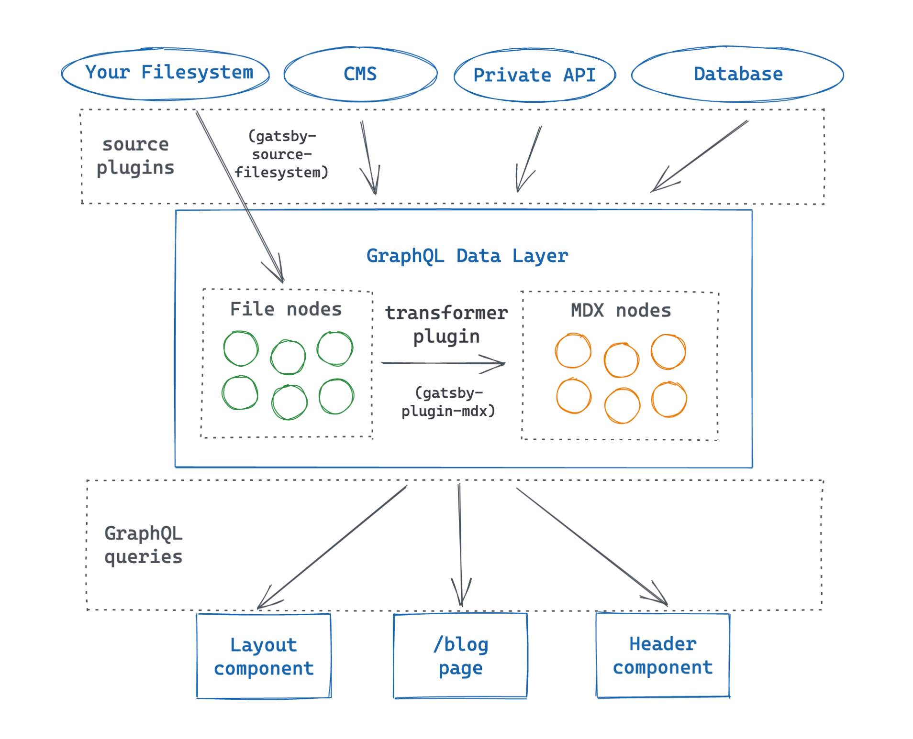

import { Announcement, Notification } from 'gatsby-interface'
import Collapsible from '@components/collapsible'
import { MdInfo } from 'react-icons/md'

<Notification
  Icon={MdInfo}
  tone="WARNING"
  variant="SECONDARY"
  content={
    <div>
      <p>
        <strong>Note:</strong> We{"'"}re still working on updating this Tutorial to use Gatsby v3.
        The first few parts of the new Tutorial have been released here, and subsequent parts
        will be added as we finish them.
      </p>
      <p style={{ marginBottom: 0 }}>
        If you{"'"}re looking for a full experience in the meantime, you can check out the (slightly outdated){" "}
        <a href="https://v2.gatsbyjs.com/docs/tutorial/">
          <strong>Gatsby v2 Tutorial</strong>
        </a>
        .
      </p>
    </div>
  }
/>

## Introduction

SET CONTEXT AND RELEVANCE FOR THIS SECTION. BIG IDEAS: TRANSFORMER PLUGINS LET YOU MANIPULATE DATA NODES IN THE DATA LAYER. SIDE NOTE: MDX IS A POWERFUL FORMAT FOR WRITING SITE CONTENT.

In this part of the Tutorial, you'll learn about how to ???.

By the end of this part of the Tutorial, you will be able to:

- Do something.
- SHOULD WE TEACH THEM ABOUT THE PARENT FIELD? possibly use the parent field to get access to the "changeTime" field, so they can add a "Updated: XXXXX" date to their post? (Possibly have to teach them about GraphQL fragments then...)

https://github.com/meganesu/gatsby-intro-workshop-example-site-with-v3/commit/207d5d11d72e972ac1ec5507159ff2c4460c98b9

## Tranformer plugins



<Announcement style={{marginBottom: "1.5rem"}}>

(It's called a transformer plugin, but it's not actually changing the original nodes. It creates new nodes based on the originals, but with different data fields. You can see fields from the original node in the `parent` field.)

</Announcement>

In this part of the Tutorial, you'll learn how to use a transformer plugin to create MDX nodes from your File nodes.

## Task: post contents

Add page contents with Markdown

<Collapsible>
Markdown format

Frontmatter
</Collapsible>

<Announcement>

Want to add photos to your Markdown? You'll need some additional plugins for that: [gatsby-remark-images](/plugins/gatsby-remark-images/) (for translating the images) and [gatsby-plugin-sharp](/plugins/gatsby-plugin-sharp/) (which you installed already in Part 3).

</Announcement>

```mdx:title=blog/my-first-post.mdx
---
title: "My First Post"
date: "2021-07-23"
---

This is my first blog post! Isn't it *great*?

Some of my **favorite** things are:

* Petting dogs
* Singing
* Eating potato-based foods
```

```mdx:title=blog/another-post.mdx
---
title: "Another Post"
date: "2021-07-24"
---

Here's another post! It's even better than the first one!
```

```mdx:title=blog/yet-another-post.mdx
---
title: "Yet Another Post"
date: "2021-07-25"
---

Wow look at all this content. How do they do it?
```

## Task: install and configure MDX plugin (and dependencies)

There's a plugin to help you add support for MDX content to your site: `gatsby-plugin-mdx`.

If you'll recall from Part 3, the three steps to add a plugin to your site are:

1. **Install** it (and any dependencies).
2. **Configure** it in your `gatsby-config.js` file.
3. **Use** the plugin's features in your site.

The `gatsby-plugin-mdx` package requires a few additional dependencies to run: `@mdx-js/mdx` and `@mdx-js/react`. These are both packages that DO SOMETHING.

Run the command below in the terminal to install `gatsby-plugin-mdx` and its dependencies.

```shell
npm install gatsby-plugin-mdx @mdx-js/mdx @mdx-js/react
```

```js:title=gatsby-config.js
module.exports = {
  siteMetadata: {
    title: "My Super Cool Blog",
  },
  plugins: [
    "gatsby-plugin-gatsby-cloud",
    "gatsby-plugin-image",
    "gatsby-plugin-sharp",
    {
      resolve: `gatsby-source-filesystem`,
      options: {
        name: `blog`,
        path: `${__dirname}/blog/`,
      },
    },
    "gatsby-plugin-mdx", // highlight-line
  ],
};
```

## Task: query

In GraphiQL, there are now two new fields available for you to use in your queries: `allMdx` and `mdx`. In this part of the Tutorial, you'll use `allMdx` to add the contents of each blog post to your Blog page. (You'll use `mdx` later on, in Part 6.)

<Collapsible>
allMdx field in GraphiQL
</Collapsible>

Write a query to get your MDX content. Let's start by getting just the front matter. While you're at it, you can also grab the `id` field, which you can use as a React `key` for the items in your list.

You can change the format of the `date` string using [Momment.js formatting tokens](https://momentjs.com/docs/#/displaying/format/).

```graphql
query MyQuery {
  allMdx {
    nodes {
      frontmatter {
        title
        date(formatString: "MMMM DD, YYYY")
      }
      id
    }
  }
}
```

Sort posts by date

<Collapsible
  summary={"GraphQL fields with arguments"}
>

Sorting fields

</Collapsible>

```graphql
query MyQuery {
  allMdx(sort: {fields: frontmatter___date, order: DESC}) {
    nodes {
      frontmatter {
        title
        date(formatString: "MMMM DD, YYYY")
      }
      id
    }
  }
}
```

## Task: render frontmatter instead of filename

Swap out the existing page query in your Blog page with the one you built in GraphiQL. You'll also need to update the code for mapping over the nodes in the response.

```js
import * as React from 'react'
import { graphql } from 'gatsby'
import Layout from '../components/layout'

const BlogPage = ({ data }) => {
  return (
    <Layout pageTitle="My Blog Posts">
      {/* highlight-start */}
      {
      data.allMdx.nodes.map((node) => (
        <article key={node.id}>
          <h2>{node.frontmatter.title}</h2>
          <p>Posted: {node.frontmatter.date}</p>
        </article>
      ))
      }
      {/* highlight-end */}
    </Layout>
  );
}

// highlight-start
export const query = graphql`
  query {
    allMdx(sort: {fields: frontmatter___date, order: DESC}) {
      nodes {
        frontmatter {
          title
          date(formatString: "MMMM DD, YYYY")
        }
        id
      }
    }
  }
`
// highlight-end

export default BlogPage
```


## Task: render post body

The final step in this part of the Tutorial is to render the actual contents of your MDX blog posts. To do that, you'll need to add one more field to your GraphQL query: `body`. In GraphiQL, add the `body` field to your query.

```graphql
query MyQuery {
  allMdx(sort: {fields: frontmatter___date, order: DESC}) {
    nodes {
      frontmatter {
        title
        date(formatString: "MMMM DD, YYYY")
      }
      id
      body
    }
  }
}
```

Run the query to see what the response looks like. The `body` field should look something like this:

```json
"body": "var _excluded = [\"components\"];\n\nfunction _extends() { _extends = Object.assign || function (target) { for (var i = 1; i < arguments.length; i++) { var source = arguments[i]; for (var key in source) { if (Object.prototype.hasOwnProperty.call(source, key)) { target[key] = source[key]; } } } return target; }; return _extends.apply(this, arguments); }\n\nfunction _objectWithoutProperties(source, excluded) { if (source == null) return {}; var target = _objectWithoutPropertiesLoose(source, excluded); var key, i; if (Object.getOwnPropertySymbols) { var sourceSymbolKeys = Object.getOwnPropertySymbols(source); for (i = 0; i < sourceSymbolKeys.length; i++) { key = sourceSymbolKeys[i]; if (excluded.indexOf(key) >= 0) continue; if (!Object.prototype.propertyIsEnumerable.call(source, key)) continue; target[key] = source[key]; } } return target; }\n\nfunction _objectWithoutPropertiesLoose(source, excluded) { if (source == null) return {}; var target = {}; var sourceKeys = Object.keys(source); var key, i; for (i = 0; i < sourceKeys.length; i++) { key = sourceKeys[i]; if (excluded.indexOf(key) >= 0) continue; target[key] = source[key]; } return target; }\n\n/* @jsxRuntime classic */\n\n/* @jsx mdx */\nvar _frontmatter = {\n  \"title\": \"Yet Another Post\",\n  \"date\": \"2021-07-25\"\n};\nvar layoutProps = {\n  _frontmatter: _frontmatter\n};\nvar MDXLayout = \"wrapper\";\nreturn function MDXContent(_ref) {\n  var components = _ref.components,\n      props = _objectWithoutProperties(_ref, _excluded);\n\n  return mdx(MDXLayout, _extends({}, layoutProps, props, {\n    components: components,\n    mdxType: \"MDXLayout\"\n  }), mdx(\"p\", null, \"Wow look at all this content. How do they do it?\"));\n}\n;\nMDXContent.isMDXComponent = true;"
```

Woah, that's a lot of information! The `body` field actually contains a function that WHAT DOES IT DO? To render the contents of your MDX file, you'll use a component from `gatsby-plugin-mdx` called `MDXRenderer`, which knows how to parse the `body` field.

<Collapsible
  summary="MDXRenderer"
>
MDXRenderer
</Collapsible>

1. Import the `MDXRenderer` component.

```js:title=src/pages/blog.js
import * as React from 'react'
import { graphql } from 'gatsby'
import { MDXRenderer } from 'gatsby-plugin-mdx' // highlight-line
import Layout from '../components/layout'

// ...
```

2. Add the `body` field to your page query for your Blog page.

```js:title=src/pages/blog.js
import * as React from 'react'
import { graphql } from 'gatsby'
import { MDXRenderer } from 'gatsby-plugin-mdx'
import Layout from '../components/layout'

const BlogPage = ({ data }) => {
  return (
    // ...
  );
}

// highlight-start
export const query = graphql`
  query {
    allMdx(sort: {fields: frontmatter___date, order: DESC}) {
      nodes {
        frontmatter {
          title
          date(formatString: "MMMM DD, YYYY")
        }
        id
        body
      }
    }
  }
`
// highlight-end

export default BlogPage
```

3. In the JSX for your Blog page, use the `MDXRenderer` component to wrap the contents of the `body` field for each node:

```js:title=src/pages/blog.js
import * as React from 'react'
import { graphql } from 'gatsby'
import { MDXRenderer } from 'gatsby-plugin-mdx'
import Layout from '../components/layout'

const BlogPage = ({ data }) => {
  return (
    <Layout pageTitle="My Blog Posts">
      {
      data.allMdx.nodes.map((node) => (
        <article key={node.id}>
          <h2>{node.frontmatter.title}</h2>
          <p>Posted: {node.frontmatter.date}</p>
          {/* highlight-start */}
          <MDXRenderer>
            {node.body}
          </MDXRenderer>
          {/* highlight-end */}
        </article>
      ))
      }
    </Layout>
  );
}

export const query = graphql`
  query {
    allMdx(sort: {fields: frontmatter___date, order: DESC}) {
      nodes {
        frontmatter {
          title
          date(formatString: "MMMM DD, YYYY")
        }
        id
        body
      }
    }
  }
`

export default BlogPage
```


// SHOULD WE ADD SOME STYLES SO THIS LOOKS LESS LIKE TRASH?

## Summary

Take a moment to think back on what you've learned so far. Challenge yourself to answer the following questions from memory:

* ?

<Announcement style={{marginBottom: "1.5rem"}}>

**Ship It!** 🚀

Before you move on, deploy your changes to your live site on Gatsby Cloud so that you can share your progress!

First, run the following commands in a terminal to push your changes to your GitHub repository. (Make sure you're in the top-level directory for your Gatsby site!)

```shell
git add .
git commit -m "Finished Gatsby Tutorial Part 5"
git push
```

Once your changes have been pushed to GitHub, Gatsby Cloud should notice the update and rebuild and deploy the latest version of your site. (It may take a few minutes for your changes to be reflected on the live site. Watch your build's progress from your [Gatsby Cloud dashboard](/dashboard/).)

</Announcement>

### Key takeaways

* .

<Announcement style={{marginBottom: "1.5rem"}}>

**Share Your Feedback!**

Our goal is for this Tutorial to be helpful and easy to follow. We'd love to hear your feedback about what you liked or didn't like about this part of the Tutorial.

Use the "Was this doc helpful to you?" form at the bottom of this page to let us know what worked well and what we can improve.

</Announcement>

### What's coming next?

In Part 6, you'll learn how to use Gatsby's filesystem route API to dynamically create new pages for each of your blog posts.

<Notification
  Icon={MdInfo}
  tone="WARNING"
  variant="SECONDARY"
  content={
    <div>
      <p>
        <strong>Note:</strong> We{"'"}re still working on updating this Tutorial to use Gatsby v3.
        You've reached the end of the new content we've released so far. Subsequent parts
        will be added as we finish them.
      </p>
      <p style={{ marginBottom: 0 }}>
        If you{"'"}re looking for a full experience in the meantime, you can check out the (slightly outdated){" "}
        <a href="https://v2.gatsbyjs.com/docs/tutorial/">
          <strong>Gatsby v2 Tutorial</strong>
        </a>
        .
      </p>
    </div>
  }
/>
