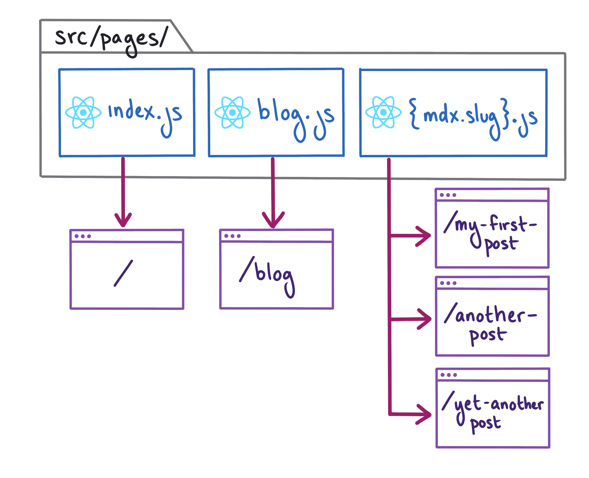
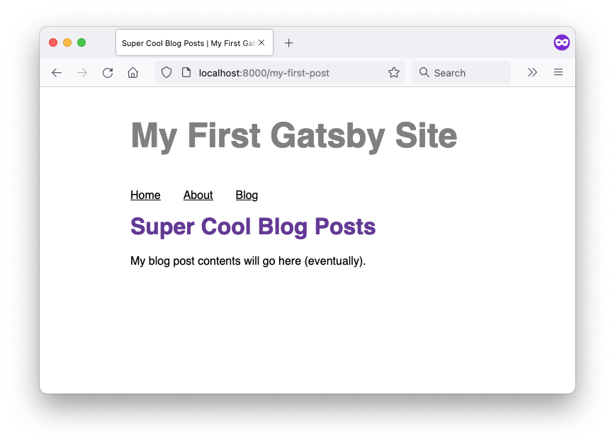
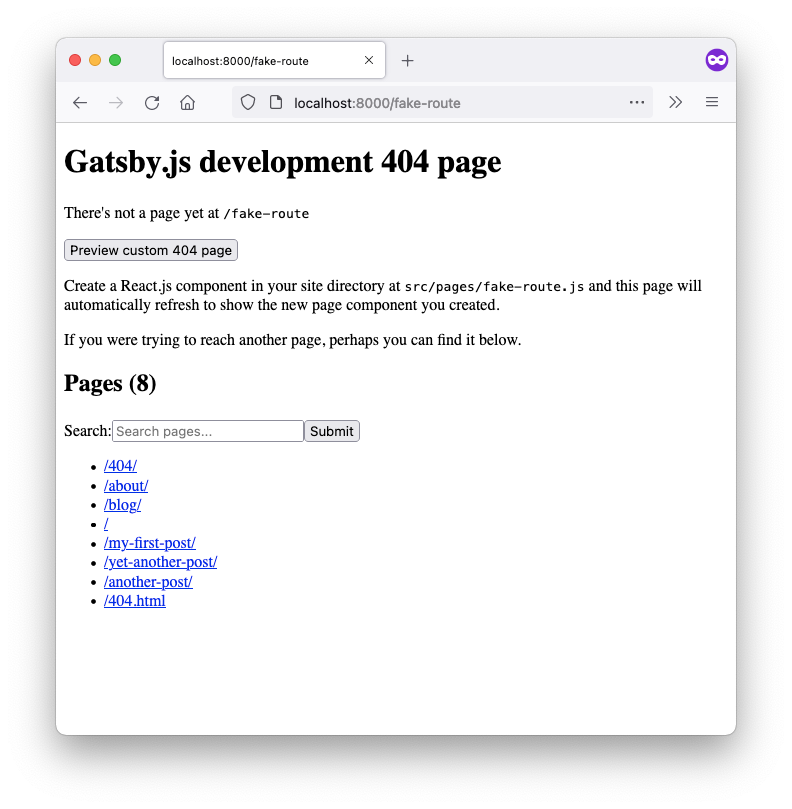
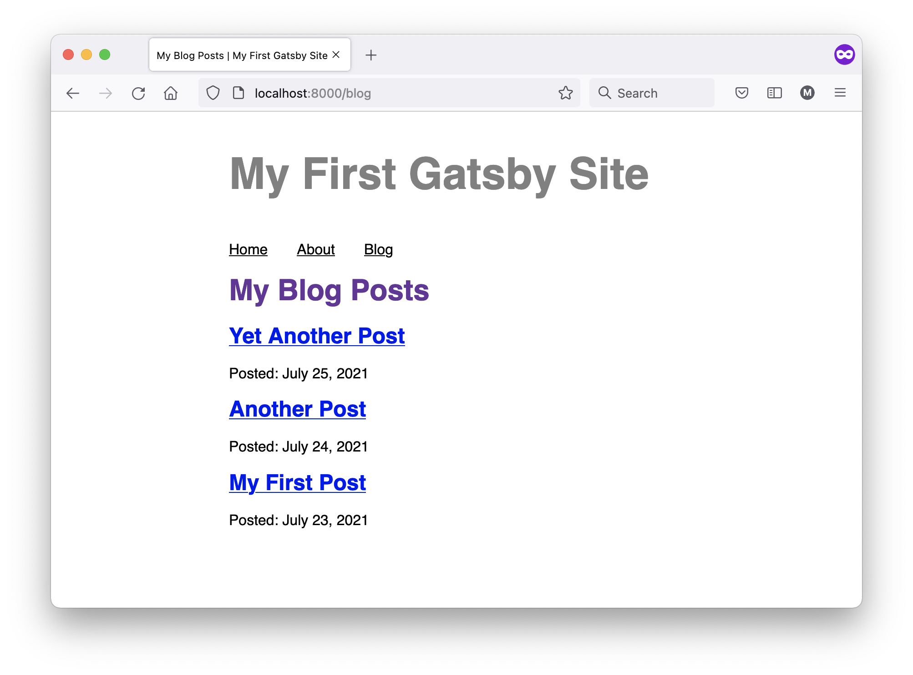

import { Announcement, Notification } from 'gatsby-interface'
import Collapsible from '@components/collapsible'
import { MdInfo } from 'react-icons/md'

<Notification
  Icon={MdInfo}
  tone="WARNING"
  variant="SECONDARY"
  content={
    <div>
      <p>
        <strong>Note:</strong> We{"'"}re still working on updating this Tutorial to use Gatsby v3.
        The first few parts of the new Tutorial have been released here, and subsequent parts
        will be added as we finish them.
      </p>
      <p style={{ marginBottom: 0 }}>
        If you{"'"}re looking for a full experience in the meantime, you can check out the (slightly outdated){" "}
        <a href="https://v2.gatsbyjs.com/docs/tutorial/">
          <strong>Gatsby v2 Tutorial</strong>
        </a>
        .
      </p>
    </div>
  }
/>

## Introduction

In Part 5, you added all of your blog posts to your Blog page. But that means that your Blog page will get longer and longer as you add more posts to your site. It would be better if each post lived on its own page, and then your Blog page could link out to all the different posts.

So far, the way you've created new pages for your Gatsby site is by creating a new file in the `src/pages` directory and hard-coding the page's contents in JSX. But manually creating a new page for each post would be quite repetitive, especially since each page has the same structure: render the frontmatter and contents of an MDX file.

In this part of the Tutorial, you'll learn how to create new pages dynamically using Gatsby's filesystem route API.

By the end of this part of the Tutorial, you will be able to:

- Use Gatsby's filesystem route API to dynamically create new pages for your blog posts.
- Add a query variable to a page query.

## Create new routes dynamically with Gatsby's File System Route API

When you build your Gatsby site, Gatsby creates a new route for each page component in your `src/pages` directory. So far, you've only been building one page per file: the `index.js` file creates the Home page, the `about.js` file creates the About page, and the `blog.js` file creates the Blog page.

But you can also use one page component to create multiple pages. Instead of hard-coding all the contents, you'll create a template to outline the basic structure of your page, and then Gatsby can dynamically add in the specific data for each page at build time. To do that, you'll use Gatsby's **file system route API**, which lets you create routes dynamically by naming your page files with a special syntax.

<Collapsible
  summary={<h3>Key Gatsby Concept: File System Route API</h3>}
>

Gatsby's file system route API defines a special syntax for naming the files in your `src/pages` directory, which lets you dynamically create new pages for your site based on a **collection** of nodes in the data layer.

For example, imagine your site had a bunch of `Product` nodes in the data layer. You could use the file system route API to create one product page template component. Then, when you built your site, Gatsby would combine that page template with the data for each `Product` node and generate a new page for each product. And if you decided you needed to make changes to your product page, you'd only have to edit the template component, and Gatsby would update all your product pages the next time it rebuilt the site.

To create a collection route:

1. Decide what type of node you want to create pages from.
2. Choose which field on that node to use in the route (the URL) for your pages.
3. Create a new page component in your `src/pages` directory using the following naming convention: `{nodeType.field}.js`.
    * Don't forget to include the curly braces (`{}`) in your filenames to indicate the dynamic part of the route! 

For example, if you wanted to create a separate page for each `Product` node, and you wanted to use the product's `name` field in the URL, you'd create a new file at `src/pages/{Product.name}.js`. Then Gatsby would create those pages at routes like `/water-bottle` or `/sweatshirt` or `/notebook`.

</Collapsible>

In this part of the Tutorial, you'll use Gatsby's file system route API to dynamically create new pages for each of your blog posts.

According to the file system route API, you need to decide on two things before creating a collection route:

* Which *type* of node to create pages from.
* Which *field* from that node type to use in the URL.

Since your blog posts are written in MDX, you'll use MDX as the node type to create pages from. But which field on the MDX nodes should you use?

`gatsby-plugin-mdx` automatically adds a `slug` field to each MDX node, which contains a string of the filename for the `.mdx` file (with the `.mdx` extension removed). You can see the `slug` field's value for each MDX node in GraphiQL. If you run the following query:

```graphql
{
  allMdx {
    nodes {
      slug
    }
  }
}
```

...you should get back something like the result below:

```json
{
  "data": {
    "allMdx": {
      "nodes": [
        {
          "slug": "my-first-post"
        },
        {
          "slug": "yet-another-post"
        },
        {
          "slug": "another-post"
        }
      ]
    }
  },
  "extensions": {}
}
```

That looks like a good format for a URL!

<Announcement style={{marginBottom: "1.5rem"}}>

**Note:** In this case, the `slug` field is a good choice because it's human readable, which means the URLs for your blog posts will be easier for users to understand. But you can use any field in your routes!

</Announcement>

### Task: Create blog post page template

Now that you know what node type and field to use, you can plug them into the file system routes naming convention. To create new pages from the `slug` field of your MDX nodes, you should make a new file at `src/pages/{mdx.slug}.js`.

The diagram below shows the different routes that Gatsby will create when it builds your site:



<Collapsible
  summary={<em>Expand for detailed description</em>}
>

When you build your site, Gatsby looks at the page components in your `src/pages` directory and creates new pages for your site.

* `src/pages/index.js` lives at the `/` route.
* `src/pages/blog.js` lives at the `/blog` route.
* `src/pages/{mdx.slug}.js` gets turned into multiple routes - one for each MDX node in the data layer.
    * Gatsby uses the MDX node with slug `my-first-post` to build a page that lives at the `/my-first-post` route.
    * Gatsby uses the MDX node with slug `another-post` to build a page that lives at the `/another-post` route.
    * Gatsby uses the MDX node with slug `yet-another-post` to build a page that lives at the `/yet-another-post` route.

</Collapsible>

1. Create a new file in your `src/pages` directory called `{mdx.slug}.js`. This will be the file for your blog post page template.

2. Create a basic page component in your new `{mdx.slug}.js` file. For now, add in the `Layout` component, but hard code the page title and page contents. (You'll make those dynamic later on.)
    ```js:title=src/pages/{mdx.slug}.js
    import * as React from 'react'
    import Layout from '../components/layout'

    const BlogPost = () => {
      return (
        <Layout pageTitle="Super Cool Blog Posts">
          <p>My blog post contents will go here (eventually).</p>
        </Layout>
      )
    }

    export default BlogPost
    ```

3. In a web browser, go to `localhost:8000/my-first-post` and you should see your hard-coded content. You can update your URL with the slugs for your other posts to check that identical pages were created for them too.



<Announcement style={{marginBottom: "1.5rem"}}>

**Pro Tip:** Not sure which pages were created? Check out the 404 page when you run `gatsby develop`. (You can get to it by trying to access the URL for a page that doesn't exist.) The bottom of the page lists the routes for all the pages Gatsby created for your site.

(If you're making changes to your routes, you'll have to stop and restart your local development server for the list of pages on the 404 page to update.)



</Announcement>

### Task: Update route to include a `/blog` path parameter

So far, each of your blog posts are created using just the 

BUT WAIT. WHAT IF WE WANT ALL OUR BLOG POSTS TO BE UNDER THE /blog PATH? SO URL WOULD BE `localhost:8000/blog/my-first-post`. HAVE TO CREATE A NEW FOLDER STRUCTURE INSIDE OF PAGES. PAGE URLS REFLECT THE FOLDER STRUCTURE.


1. CREATE src/pages/blog DIRECTORY
2. MOVE src/pages/{mdx.slug}.js TO src/pages/blog/{mdx.slug}.js
3. CHECK THAT PATHS IN BROWSER HAVE UPDATED. POSTS NOW AT `localhost:8000/blog/my-first-post`
4. FOR ORGANIZATION, MOVE src/pages/blog.js INTO src/pages/blog DIRECTORY. CHECK URL IN BROWSER. HAVE TO GO TO `localhost:8000/blog/blog`. (HAVE TO KILL AND RESTART DEVELOP SERVER TO SEE /blog/blog ON 404 PAGE LIST OF PAGES.)

<Announcement style={{marginBottom: "1.5rem"}}>

GATSBY CLEAN. MOVING STUFF AROUND CAN CAUSE PROBLEMS WITH WHAT GATSBY HAS CACHED. TO CLEAN THE CACHE, RUN gatsby clean. DON'T HAVE GATSBY GLOBALLY INSTALLED? RUN npx gatsby clean INSTEAD.

</Announcement>

5. UPDATE FILENAME TO src/pages/blog/index.js. CHECK THAT PAGE SHOWS UP AT `localhost:8000/blog`. HAVE TO KILL AND RESTART DEVELOP SERVER TO SEE IT SHOW UP IN 404 PAGE LIST OF PAGES.

## TASK: RENDER BLOG POST CONTENTS IN POST PAGE TEMPLATE

PRINT OUT PROPS, TO SEE THE PAGECONTEXT THAT GETS ADDED. FS ROUTE API ADDS ID AND THE FIELD YOU USED IN THE PATH.

```js:title=src/pages/{mdx.slug}.js
import * as React from 'react'

const BlogPost = (props) => {
  console.log(props)

  return (
    <p>My blog post contents will go in here (eventually).</p>
  )
}

export default BlogPost
```

```js
Object {
  // ...
  pageContext: Object { 
    id: "11b3a825-30c5-551d-a713-dd748e7d554a"
    slug: "my-first-post"
  }
  // ...
}
```
THESE ARE THE KEYS YOU CAN USE AS QUERY VARIABLES. id AND slug.
PAGECONTEXT GETS CONNECTED TO QUERY VARIABLES, SOMEHOW.

<Collapsible
  summary="query variables"
>

SHOW QUERYING FOR A SINGLE POST USING AN INLINE ARGUMENT (HARD-CODE THE SLUG).

THEN SWITCH TO USE QUERY VARIABLE.

</Collapsible>

CREATE BLOG POST QUERY, USING QUERY VARIABLE FROM PAGECONTEXT. SLUG FROM PAGECONTEXT GETS PASSED INTO QUERY AS QUERY VARIABLE (AUTOMATICALLY?).

```js:title=src/pages/{mdx.slug}.js
export const query = graphql`
query($id: String) {
  mdx(id: {eq: $id}) {
    frontmatter {
      date
      title
    }
    body
  }
}
`
```

ADD LAYOUT COMPONENT AND RENDER DATA IN PAGE TEMPLATE.

```js:title=src/pages/{mdx.slug}.js
import * as React from 'react'
import { graphql } from 'gatsby'
import Layout from '../../components/layout'
import { MDXRenderer } from 'gatsby-plugin-mdx'

const BlogPost = ({ data }) => {

  return (
    <Layout pageTitle={data.mdx.frontmatter.title}>
      <p>{data.mdx.frontmatter.date}</p>
      <MDXRenderer>
        {data.mdx.body}
      </MDXRenderer>
    </Layout>
  )
}

export const query = graphql`
query($id: String) {
  mdx(id: {eq: $id}) {
    frontmatter {
      date(formatString: "MMMM D, YYYY")
      title
    }
    body
  }
}
`

export default BlogPost
```

## TASK: UPDATE BLOG PAGE TO LINK TO PAGES

* DON'T NEED MDXRENDERER ANYMORE
* ADD SLUG TO QUERY, REMOVE BODY
* ADD LINK TO POST TITLE. NEED BLOG PART OF THE PATH.

```js
import * as React from 'react'
import { graphql, Link } from 'gatsby' // highlight-line
import Layout from '../../components/layout'

const BlogPage = ({ data }) => {
  return (
    <Layout pageTitle="My Blog Posts">
      {
        data.allMdx.nodes.map(node => (
          <article key={node.id}>
            {/* highlight-start */}
            <h2>
              <Link to={`/blog/${node.slug}`}>
                {node.frontmatter.title}
              </Link>
            </h2>
            {/* highlight-end */}
            <p>Posted: {node.frontmatter.date}</p>
          </article>
        ))
      }
    </Layout>
  )
}

// highlight-start
export const query = graphql`
  query {
    allMdx(sort: {fields: frontmatter___date, order: DESC}) {
      nodes {
        frontmatter {
          date(formatString: "MMMM D, YYYY")
          title
        }
        id
        slug
      }
    }
  }
`
// highlight-end

export default BlogPage
```



## Summary

Take a moment to think back on what you've learned so far. Challenge yourself to answer the following questions from memory:

* ?

<Announcement style={{marginBottom: "1.5rem"}}>

**Ship It!** 🚀

Before you move on, deploy your changes to your live site on Gatsby Cloud so that you can share your progress!

First, run the following commands in a terminal to push your changes to your GitHub repository. (Make sure you're in the top-level directory for your Gatsby site!)

```shell
git add .
git commit -m "Finished Gatsby Tutorial Part 6"
git push
```

Once your changes have been pushed to GitHub, Gatsby Cloud should notice the update and rebuild and deploy the latest version of your site. (It may take a few minutes for your changes to be reflected on the live site. Watch your build's progress from your [Gatsby Cloud dashboard](/dashboard/).)

</Announcement>

### Key takeaways

* .
* NAME OF FILE CONNECTS TO THE PATH TO THAT PAGE. COMES FROM FS ROUTE API.
* QUERY VARIABLES ONLY USABLE IN PAGE QUERIES.

<Announcement style={{marginBottom: "1.5rem"}}>

**Share Your Feedback!**

Our goal is for this Tutorial to be helpful and easy to follow. We'd love to hear your feedback about what you liked or didn't like about this part of the Tutorial.

Use the "Was this doc helpful to you?" form at the bottom of this page to let us know what worked well and what we can improve.

</Announcement>

### What's coming next?

In Part 7, you'll finish up your blog site by adding some hero images to your blog posts. 

<Notification
  Icon={MdInfo}
  tone="WARNING"
  variant="SECONDARY"
  content={
    <div>
      <p>
        <strong>Note:</strong> We{"'"}re still working on updating this Tutorial to use Gatsby v3.
        You've reached the end of the new content we've released so far. Subsequent parts
        will be added as we finish them. Part 7 has a tentative release date of August 11, 2021.
      </p>
      <p style={{ marginBottom: 0 }}>
        If you{"'"}re looking for a full experience in the meantime, you can check out the (slightly outdated){" "}
        <a href="https://v2.gatsbyjs.com/docs/tutorial/">
          <strong>Gatsby v2 Tutorial</strong>
        </a>
        .
      </p>
    </div>
  }
/>
