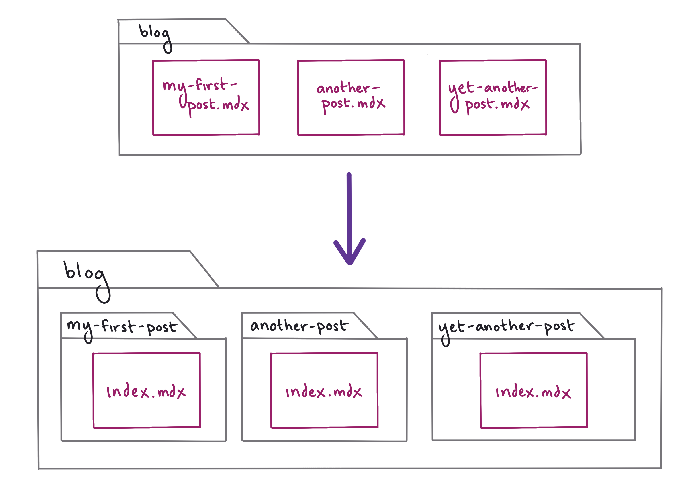
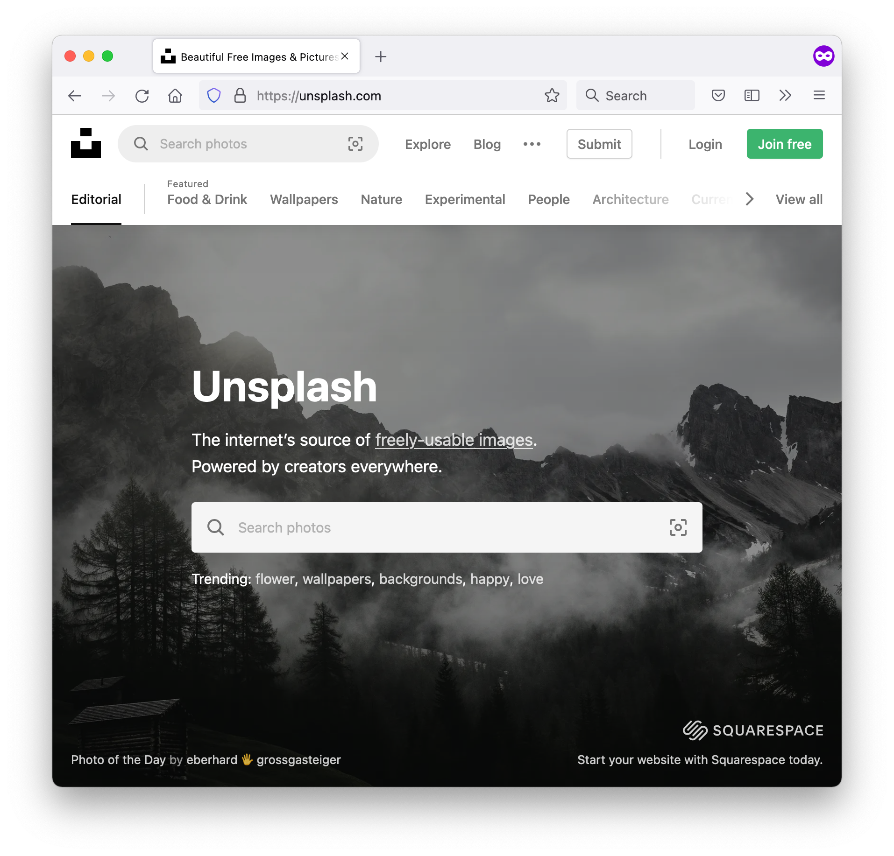
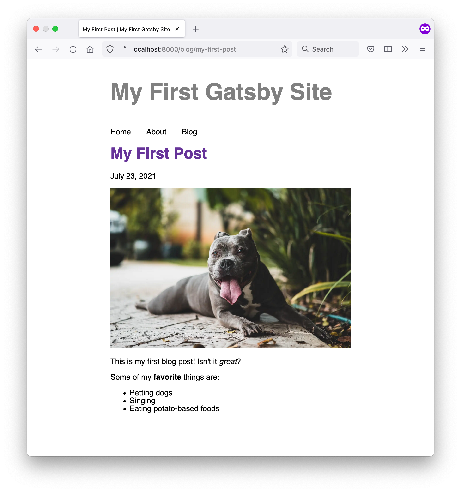
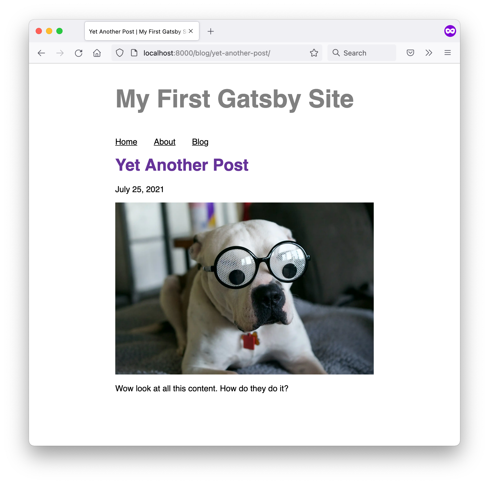
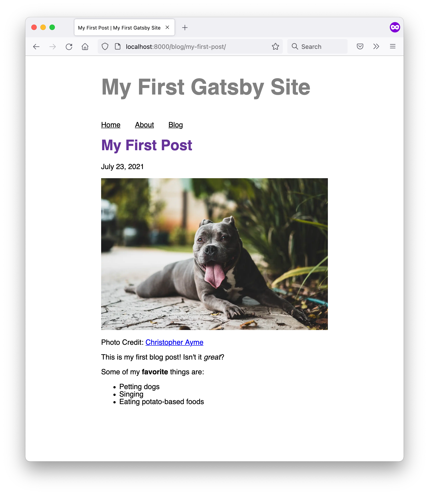

import { Announcement, LinkButton } from 'gatsby-interface'
import Collapsible from '@components/collapsible'
import { MdArrowForward } from 'react-icons/md'

## Introduction

In Part 3, you used `gatsby-plugin-image` to add static images to your home page. Now that you've worked a bit more with Gatsby's data layer, it's time to revisit `gatsby-plugin-image`. This time, you'll learn how to add dynamic images to your site.

In this part of the Tutorial, you'll use the dynamic `GatsbyImage` component to add hero images to each of your blog posts.

By the end of this part of the Tutorial, you will be able to:

- Use the `GatsbyImage` component to create images dynamically from data.

## Add hero images to blog post frontmatter

Many blog sites include a hero image at the top of each post. These images are usually large, high-quality photos that are meant to grab the reader's attention and make them want to stay on the page longer.

The steps below will help you find and download some photos for your hero images and add them to the frontmatter for each of your blog posts.

1. Start by organizing the `blog` directory with all your MDX posts. First, create a new subdirectory in your `blog` folder for each post. Then, rename each of your `.mdx` files to `index.mdx` (to prevent the routes from ending up with a duplicated path parameter, like `blog/my-post/my-post/`).
    * For example, a post at `blog/my-first-post.mdx` would move to `blog/my-first-post/index.mdx`. Similarly, a post at `blog/another-post.mdx` would move to `blog/another-post/index.mdx`.

<Announcement style={{marginBottom: "1.5rem"}}>

**Note:** After you move or rename your `.mdx` files, you'll need to stop and restart your local development server for your changes to be picked up.

</Announcement>



2. Use a website like [Unsplash](https://unsplash.com) to find some pretty, freely usable images. For best results, choose photos with a landscape (horizontal) orientation, since those will fit on your screen more easily.
    

2. When you've found a photo that you like, download it and add it to subdirectory for one of your blog posts. Continue downloading photos until you have a different hero image for each post.

3. Next, add some additional frontmatter fields to each of your blog posts:
    * `hero_image`: the relative path to the hero image file for that post
    * `hero_image_alt`: a short description of the image, to be used as alternative text for screen readers or in case the image doesn't load correctly
    * `hero_image_credit_text`: the text to display to give the photographer credit for the hero image
    * `hero_image_credit_link`: a link to the page where your hero image was downloaded from

```mdx:title=blog/my-first-post/index.js
---
title: "My First Post"
date: "2021-07-23"
// highlight-start
hero_image: "./christopher-ayme-ocZ-_Y7-Ptg-unsplash.jpg"
hero_image_alt: "A gray pitbull relaxing on the sidewalk with its tongue hanging out"
hero_image_credit_text: "Christopher Ayme"
hero_image_credit_link: "https://unsplash.com/photos/ocZ-_Y7-Ptg"
// highlight-end
---

...
```

```mdx:title=blog/another-post/index.js
---
title: "Another Post"
date: "2021-07-24"
// highlight-start
hero_image: "./anthony-duran-eLUBGqKGdE4-unsplash.jpg"
hero_image_alt: "A grey and white pitbull wading happily in a pool"
hero_image_credit_text: "Anthony Duran"
hero_image_credit_link: "https://unsplash.com/photos/eLUBGqKGdE4"
// highlight-end
---

...
```

```mdx:title=blog/yet-another-post/index.js
---
title: "Yet Another Post"
date: "2021-07-25"
// highlight-start
hero_image: "./jane-almon-7rriIaBH6JY-unsplash.jpg"
hero_image_alt: "A white pitbull wearing big googly-eye glasses"
hero_image_credit_text: "Jane Almon"
hero_image_credit_link: "https://unsplash.com/photos/7rriIaBH6JY"
// highlight-end
---

...
```


Now that your hero images are set up, it's time to connect them to the data layer so you can pull them into your blog post page template.

## TASK: CONFIGURE PLUGIN

Install `gatsby-transformer-sharp`. THIS DOES SOMETHING TO ADD IMAGE STUFF TO THE DATA LAYER NODES. WHICH NODES?

```shell
npm install gatsby-transformer-sharp
```

ADD TO GATSBY-CONFIG.JSON

```js:title=gatsby-config.js
module.exports = {
  siteMetadata: {
    title: "My First Gatsby Site",
  },
  plugins: [
    // ...existing plugins
    "gatsby-transformer-sharp", // highlight-line
  ],
}
```

MIGHT HAVE TO STOP AND START DEVELOP SERVER FOR CHANGES TO SHOW UP IN GraphiQL


## TASK: ADD HERO IMAGE TO BLOG POST PAGE TEMPLATE

COLLAPSIBLE: DYNAMIC IMAGES. WHAT IS CHILDIMAGESHARP? WHAT IS GATSBYIMAGEDATA?

`gatsbyImageData`: GRAPHQL RESOLVER ON SHARP NODES.

```graphql
query MyQuery($id: String) {
  mdx(id: {eq: $id}) {
    frontmatter {
      title
      date(formatString: "MMMM D, YYYY")
      // highlight-start
      hero_image {
        childImageSharp {
          gatsbyImageData
        }
      }
      hero_image_alt
      hero_image_credit_text
      hero_image_credit_link
      // highlight-end
    }
    body
  }
}
```

IMPORT

```js:title=src/pages/blog/{mdx.slug}.js
import { GatsbyImage, getImage } from 'gatsby-plugin-image'
```

ADD TO Query

```js:title=src/pages/blog/{mdx.slug}.js
export const query = graphql`
  query($slug: String) {
    mdx(slug: {eq: $slug}) {
      body
      frontmatter {
        date(formatString: "MMMM DD, YYYY")
        title
        hero_image {
          childImageSharp {
            gatsbyImageData
          }
        }
        hero_image_alt
        hero_image_credit_text
        hero_image_credit_link
      }
    }
  }
`
```

DEFINE IMAGE

<Announcement style={{marginBottom: "1.5rem"}}>

**Note:** `getImage` is just a helper function that takes in a file node and returns the `.childImageSharp.gatsbyImageData` object for that node. You can use it to keep your code a little cleaner and easier to read.

</Announcement>

```js:title=src/pages/blog/{mdx.slug}.js
const image = getImage(data.mdx.frontmatter.hero_image)
```

RENDER IMAGE IN JSX

```js:title=src/pages/blog/{mdx.slug}.js
return (
  <Layout pageTitle={data.mdx.frontmatter.title}>
    <p>Posted: {data.mdx.frontmatter.date}</p>
    <GatsbyImage
      image={image}
      alt={data.mdx.frontmatter.hero_image_alt}
    />
    <MDXRenderer>
      {data.mdx.body}
    </MDXRenderer>
  </Layout>
)
```






ADD IMAGE CREDIT PARAGRAPH. YOU NEED AN EXTRA {" "} TO GET THE SPACE TO SHOW UP IF YOU HAVE A NEWLINE BETWEEN THE PHOTO CREDIT TEXT AND THE LINK.

```js:title=src/pages/blog/{mdx.slug}.js
  return (
    <Layout
      pageTitle={data.mdx.frontmatter.title}
      heroImage={image}
    >
      <p>{data.mdx.frontmatter.date}</p>
      <GatsbyImage
        image={image}
        alt={data.mdx.frontmatter.hero_image_alt}
      />
      {/* highlight-start */}
      <p>
        Photo Credit:{" "}
        <Link to={data.mdx.frontmatter.hero_image_credit_link}>
          {data.mdx.frontmatter.hero_image_credit_text}
        </Link>
      </p>
      {/* highlight-end */}
      <MDXRenderer>
        {data.mdx.body}
      </MDXRenderer>
    </Layout>
  )
```



## Summary

Take a moment to think back on what you've learned so far. Challenge yourself to answer the following questions from memory:

* ?

<Announcement style={{marginBottom: "1.5rem"}}>

**Ship It!** 🚀

Before you move on, deploy your changes to your live site on Gatsby Cloud so that you can share your progress!

First, run the following commands in a terminal to push your changes to your GitHub repository. (Make sure you're in the top-level directory for your Gatsby site!)

```shell
git add .
git commit -m "Finished Gatsby Tutorial Part 7"
git push
```

Once your changes have been pushed to GitHub, Gatsby Cloud should notice the update and rebuild and deploy the latest version of your site. (It may take a few minutes for your changes to be reflected on the live site. Watch your build's progress from your [Gatsby Cloud dashboard](/dashboard/).)

</Announcement>

### Key takeaways

* .

<Announcement style={{marginBottom: "1.5rem"}}>

**Share Your Feedback!**

Our goal is for this Tutorial to be helpful and easy to follow. We'd love to hear your feedback about what you liked or didn't like about this part of the Tutorial.

Use the "Was this doc helpful to you?" form at the bottom of this page to let us know what worked well and what we can improve.

</Announcement>

### You did it!

Congratulations, you've reached the end of the official Gatsby Tutorial! 🥳

Want to know more? The next page includes some additional resources that you can use to continue learning about Gatsby.

<LinkButton
  to="/docs/tutorial/whats-next/"
  rightIcon={<MdArrowForward />}
  variant="SECONDARY"
>
  Continue to What's Next
</LinkButton>
