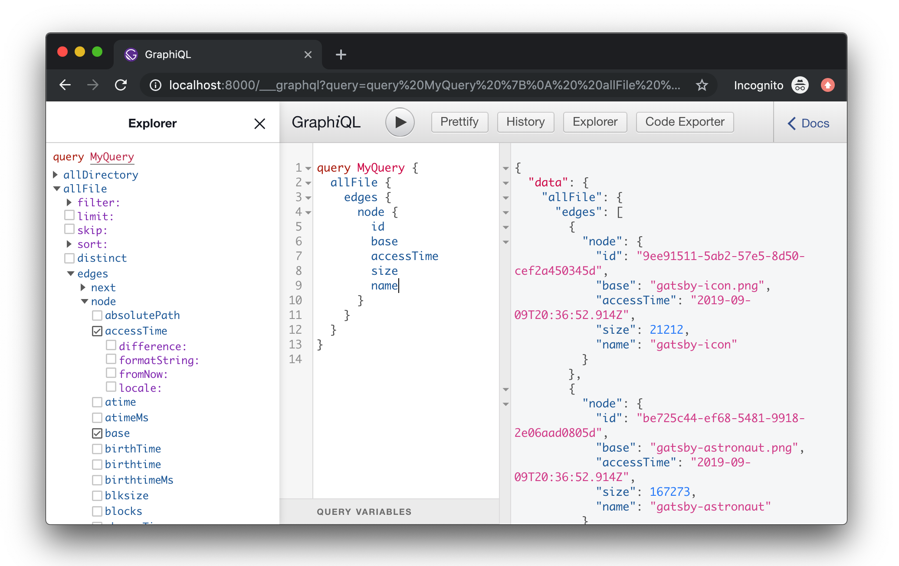
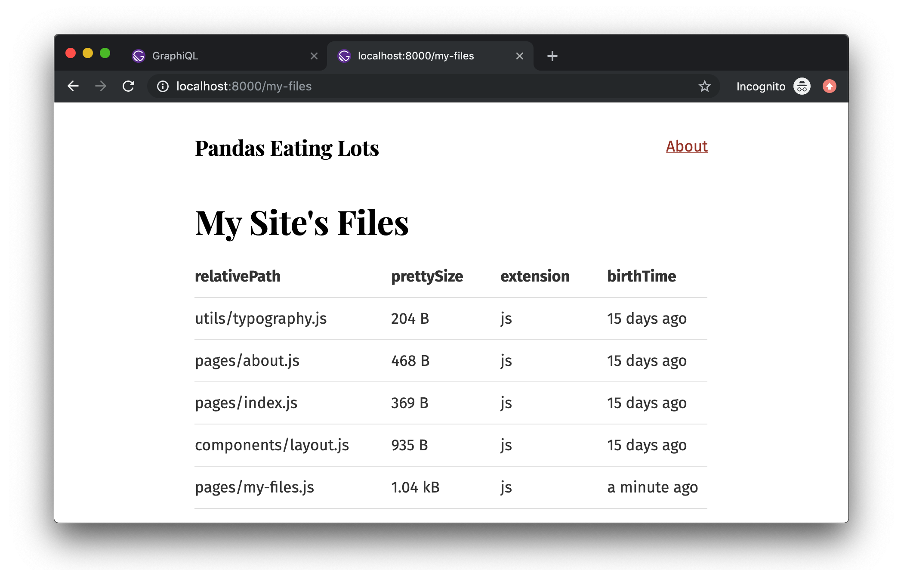

> This tutorial is part of a series about Gatsby’s data layer. Make sure you’ve gone through [part 4](/docs/tutorial/part-four/) before continuing here.

## What's in this tutorial?

In this tutorial, you'll be learning about how to pull data into your Gatsby site using GraphQL and source plugins. Before you learn about these plugins, however, you'll want to know how to use something called GraphiQL, a tool that helps you structure your queries correctly.

## Introducing GraphiQL

GraphiQL is the GraphQL integrated development environment (IDE). It's a powerful (and all-around awesome) tool you'll use often while building Gatsby websites.

You can access it when your site's development server is running—normally at `http://localhost:8000/___graphql`.

<video controls="controls" autoplay="true" loop="true">
  <source type="video/mp4" src="/graphiql-explore.mp4" />
  <p>Your browser does not support the video element.</p>
</video>

Poke around the built-in `Site` "type" and see what fields are available on it -- including the `siteMetadata` object you queried earlier. Try opening GraphiQL and play with your data! Press <kbd>Ctrl + Space</kbd> (or use <kbd>Shift + Space</kbd> as an alternate keyboard shortcut) to bring up the autocomplete window and <kbd>Ctrl + Enter</kbd> to run the GraphQL query. You'll be using GraphiQL a lot more through the remainder of the tutorial.

## Using the GraphiQL Explorer

The GraphiQL Explorer enables you to interactively construct full queries by clicking through available fields and inputs without the repetitive process of typing these queries out by hand.

<EggheadEmbed
  lessonLink="https://egghead.io/lessons/gatsby-build-a-graphql-query-using-gatsby-s-graphiql-explorer"
  lessonTitle="Build a GraphQL Query using Gatsby’s GraphiQL Explorer"
/>

## Source plugins

Data in Gatsby sites can come from anywhere: APIs, databases, CMSs, local files, etc.

Source plugins fetch data from their source. E.g. the filesystem source plugin knows how to fetch data from the file system. The WordPress plugin knows how to fetch data from the WordPress API.

Add [`gatsby-source-filesystem`](/plugins/gatsby-source-filesystem/) and explore how it works.

First, install the plugin at the root of the project:

```shell
npm install gatsby-source-filesystem
```

Then add it to your `gatsby-config.js`:

```javascript:title=gatsby-config.js
module.exports = {
  siteMetadata: {
    title: `Pandas Eating Lots`,
  },
  plugins: [
    // highlight-start
    {
      resolve: `gatsby-source-filesystem`,
      options: {
        name: `src`,
        path: `${__dirname}/src/`,
      },
    },
    // highlight-end
    `gatsby-plugin-emotion`,
    {
      resolve: `gatsby-plugin-typography`,
      options: {
        pathToConfigModule: `src/utils/typography`,
      },
    },
  ],
}
```

Save that and restart the gatsby development server. Then open up GraphiQL again.

In the explorer pane, you'll see `allFile` and `file` available as selections:


Click the `allFile` dropdown. Position your cursor after `allFile` in the query area, and then type <kbd>Ctrl + Enter</kbd>. This will pre-fill a query for the `id` of each file. Press "Play" to run the query:


In the Explorer pane, the `id` field has automatically been selected. Make selections for more fields by checking the field's corresponding checkbox. Press "Play" to run the query again, with the new fields:


Alternatively, you can add fields by using the autocomplete shortcut (<kbd>Ctrl + Space</kbd>). This will show queryable fields on the `File` nodes.


Try adding a number of fields to your query, press <kbd>Ctrl + Enter</kbd> each time to re-run the query. You'll see the updated query results:



The result is an array of `File` "nodes" (node is a fancy name for an object in a "graph"). Each `File` node object has the fields you queried for.

## Build a page with a GraphQL query

Building new pages with Gatsby often starts in GraphiQL. You first sketch out the data query by playing in GraphiQL then copy this to a React page component to start building the UI.

Let's try this.

Create a new file at `src/pages/my-files.js` with the `allFile` GraphQL query you just
created:

```jsx:title=src/pages/my-files.js
import React from "react"
import { graphql } from "gatsby"
import Layout from "../components/layout"

export default function MyFiles({ data }) {
  console.log(data) // highlight-line
  return (
    <Layout>
      <div>Hello world</div>
    </Layout>
  )
}

export const query = graphql`
  query {
    allFile {
      edges {
        node {
          relativePath
          prettySize
          extension
          birthTime(fromNow: true)
        }
      }
    }
  }
`
```

The `console.log(data)` line is highlighted above. It's often helpful when creating a new component to console out the data you're getting from the GraphQL query so you can explore the data in your browser console while building the UI.

If you visit the new page at `/my-files/` and open up your browser console you will see something like:


The shape of the data matches the shape of the GraphQL query.

Add some code to your component to print out the File data.

```jsx:title=src/pages/my-files.js
import React from "react"
import { graphql } from "gatsby"
import Layout from "../components/layout"

export default function MyFiles({ data }) {
  console.log(data)
  return (
    <Layout>
      {/* highlight-start */}
      <div>
        <h1>My Site's Files</h1>
        <table>
          <thead>
            <tr>
              <th>relativePath</th>
              <th>prettySize</th>
              <th>extension</th>
              <th>birthTime</th>
            </tr>
          </thead>
          <tbody>
            {data.allFile.edges.map(({ node }, index) => (
              <tr key={index}>
                <td>{node.relativePath}</td>
                <td>{node.prettySize}</td>
                <td>{node.extension}</td>
                <td>{node.birthTime}</td>
              </tr>
            ))}
          </tbody>
        </table>
      </div>
      {/* highlight-end */}
    </Layout>
  )
}

export const query = graphql`
  query {
    allFile {
      edges {
        node {
          relativePath
          prettySize
          extension
          birthTime(fromNow: true)
        }
      }
    }
  }
`
```

And now visit `http://localhost:8000/my-files`… 😲



## What's coming next?

Now you've learned how source plugins bring data _into_ Gatsby’s data system. In the next tutorial, you'll learn how transformer plugins _transform_ the raw content brought by source plugins. The combination of source plugins and transformer plugins can handle all data sourcing and data transformation you might need when building a Gatsby site. Learn about transformer plugins in [part six of the tutorial](/docs/tutorial/part-six/).
