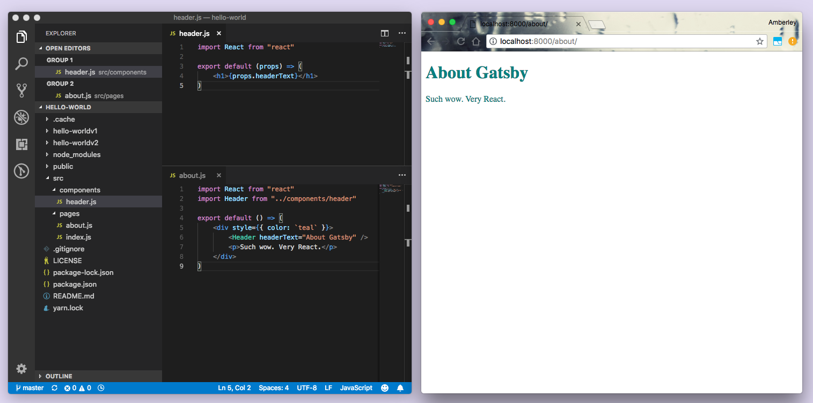
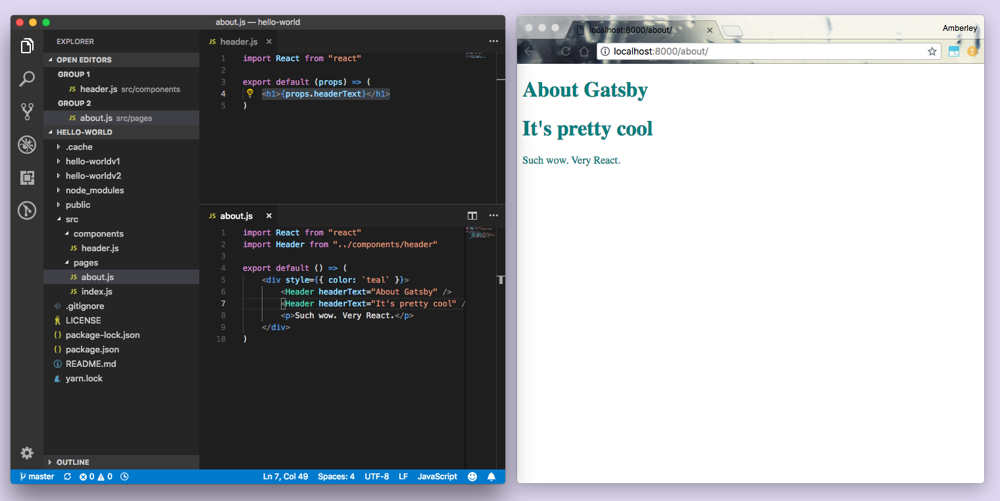

In the [**previous section**](/docs/tutorial/part-zero/), you prepared your local development environment by installing the necessary software and creating your first Gatsby site using the [**"hello world" starter**](https://github.com/gatsbyjs/gatsby-starter-hello-world). Now, take a deeper dive into the code generated by that starter.

## Using Gatsby starters

In [**tutorial part zero**](/docs/tutorial/part-zero/), you created a new site based on the "hello world" starter using the following command:

```shell
gatsby new hello-world https://github.com/gatsbyjs/gatsby-starter-hello-world
```

When creating a new Gatsby site, you can use the following command structure to create a new site based on any existing Gatsby starter:

```shell
gatsby new [SITE_DIRECTORY_NAME] [URL_OF_STARTER_GITHUB_REPO]
```

If you omit a URL from the end, Gatsby will automatically generate a site for you based on the [**default starter**](https://github.com/gatsbyjs/gatsby-starter-default). For this section of the tutorial, stick with the "Hello World" site you already created in tutorial part zero. You can learn more about [modifying starters](/docs/modifying-a-starter) in the docs.

### ✋ Open up the code

In your code editor, open up the code generated for your "Hello World" site and take a look at the different directories and files contained in the 'hello-world' directory. It should look something like this:


_Note: Again, the editor shown here is Visual Studio Code. If you're using a different editor, it will look a little different._

Let's take a look at the code that powers the homepage.

> 💡 If you stopped your development server after running `gatsby develop` in the previous section, start it up again now — time to make some changes to the hello-world site!

## Familiarizing with Gatsby pages

Open up the `/src` directory in your code editor. Inside is a single directory: `/pages`.

Open the file at `src/pages/index.js`. The code in this file creates a component that contains a single div and some text — appropriately, "Hello world!"

### ✋ Make changes to the "Hello World" homepage

1. Change the "Hello World!" text to "Hello Gatsby!" and save the file. If your windows are side-by-side, you can see that your code and content changes are reflected almost instantly in the browser after you save the file.

<video controls="controls" autoplay="true" loop="true">
  <source type="video/mp4" src="./02-demo-hot-reloading.mp4" />
  <p>Sorry! Your browser doesn't support this video.</p>
</video>

> 💡 Gatsby uses **hot reloading** to speed up your development process. Essentially, when you're running a Gatsby development server, the Gatsby site files are being "watched" in the background — any time you save a file, your changes will be immediately reflected in the browser. You don't need to hard refresh the page or restart the development server — your changes just appear.

2. Now you can make your changes a little more visible. Try replacing the code in `src/pages/index.js` with the code below and save again. You'll see changes to the text — the text color will be purple and the font size will be larger.

```jsx:title=src/pages/index.js
import React from "react"

export default function Home() {
  return <div style={{ color: `purple`, fontSize: `72px` }}>Hello Gatsby!</div>
}
```

> 💡 We'll be covering more about styling in Gatsby in [**part two**](/docs/tutorial/part-two/) of the tutorial.

3. Remove the font size styling, change the "Hello Gatsby!" text to a level-one header, and add a paragraph beneath the header.

```jsx:title=src/pages/index.js
import React from "react"

export default function Home() {
  return (
    {/* highlight-start */}
    <div style={{ color: `purple` }}>
      <h1>Hello Gatsby!</h1>
      <p>What a world.</p>
    {/* highlight-end */}
    </div>
  );
}
```


4. Add an image. (In this case, a random image from Unsplash).

```jsx:title=src/pages/index.js
import React from "react"

export default function Home() {
  return (
    <div style={{ color: `purple` }}>
      <h1>Hello Gatsby!</h1>
      <p>What a world.</p>
      {/* highlight-next-line */}
      
    </div>
  )
}
```


### Wait… HTML in our JavaScript?

_If you're familiar with React and JSX, feel free to skip this section._ If you haven't worked with the React framework before, you may be wondering what HTML is doing in a JavaScript function. Or why we're importing `react` on the first line but seemingly not using it anywhere. This hybrid "HTML-in-JS" is actually a syntax extension of JavaScript, for React, called JSX. You can follow along with this tutorial without prior experience with React, but if you're curious, here's a brief primer…

Consider the original contents of the `src/pages/index.js` file:

```jsx:title=src/pages/index.js
import React from "react"

export default function Home() {
  return <div>Hello world!</div>
}
```

In pure JavaScript, it looks more like this:

```javascript:title=src/pages/index.js
import React from "react"

export default function Home() {
  return React.createElement("div", null, "Hello world!")
}
```

Now you can spot the use of the `'react'` import! But wait. You're writing JSX, not pure HTML and JavaScript. How does the browser read that? The short answer: It doesn't. Gatsby sites come with tooling already set up to convert your source code into something that browsers can interpret.

## Building with components

The homepage you were just making edits to was created by defining a page component. What exactly is a "component"?

Broadly defined, a component is a building block for your site; It is a self-contained piece of code that describes a section of UI (user interface).

Gatsby is built on React. When we talk about using and defining **components**, we are really talking about **React components** — self-contained pieces of code (usually written with JSX) that can accept input and return React elements describing a section of UI.

One of the big mental shifts you make when starting to build with components (if you are already a developer) is that now your CSS, HTML, and JavaScript are tightly coupled and often living even within the same file.

While a seemingly simple change, this has profound implications for how you think about building websites.

Take the example of creating a custom button. In the past, you would create a CSS class (perhaps `.primary-button`) with your custom styles and then use it whenever you want to apply those styles. For example:

```html
<button class="primary-button">Click me</button>
```

In the world of components, you instead create a `PrimaryButton` component with your button styles and use it throughout your site like:

<!-- prettier-ignore -->
```jsx
<PrimaryButton>Click me</PrimaryButton>
```

Components become the base building blocks of your site. Instead of being limited to the building blocks the browser provides, e.g. `<button />`, you can easily create new building blocks that elegantly meet the needs of your projects.

### ✋ Using page components

Any React component defined in `src/pages/*.js` will automatically become a page. Let's see this in action.

You already have a `src/pages/index.js` file that came with the "Hello World" starter. Let's create an about page.

1. Create a new file at `src/pages/about.js`, copy the following code into the new file, and save.

```jsx:title=src/pages/about.js
import React from "react"

export default function About() {
  return (
    <div style={{ color: `teal` }}>
      <h1>About Gatsby</h1>
      <p>Such wow. Very React.</p>
    </div>
  )
}
```

2. Navigate to `http://localhost:8000/about/`


Just by putting a React component in the `src/pages/about.js` file, you now have a page accessible at `/about`.

### ✋ Using sub-components

Let's say the homepage and the about page both got quite large and you were rewriting a lot of things. You can use sub-components to break the UI into reusable pieces. Both of your pages have `<h1>` headers — create a component that will describe a `Header`.

1. Create a new directory at `src/components` and a file within that directory called `header.js`.
2. Add the following code to the new `src/components/header.js` file.

```jsx:title=src/components/header.js
import React from "react"

export default function Header() {
  return <h1>This is a header.</h1>
}
```

3. Modify the `about.js` file to import the `Header` component. Replace the `h1` markup with `<Header />`:

```jsx:title=src/pages/about.js
import React from "react"
import Header from "../components/header" // highlight-line

export default function About() {
  return (
    <div style={{ color: `teal` }}>
      <Header /> {/* highlight-line */}
      <p>Such wow. Very React.</p>
    </div>
  )
}
```


In the browser, the "About Gatsby" header text should now be replaced with "This is a header." But you don't want the "About" page to say "This is a header." You want it to say, "About Gatsby".

4. Head back to `src/components/header.js` and make the following change:

```jsx:title=src/components/header.js
import React from "react"

// highlight-start
export default function Header(props) {
  return <h1>{props.headerText}</h1>
  // highlight-end
}
```

5. Head back to `src/pages/about.js` and make the following change:

```jsx:title=src/pages/about.js
import React from "react"
import Header from "../components/header"

export default function About() {
  return (
    <div style={{ color: `teal` }}>
      <Header headerText="About Gatsby" /> {/* highlight-line */}
      <p>Such wow. Very React.</p>
    </div>
  )
}
```



You should now see your "About Gatsby" header text again!

### What are "props"?

Earlier, you defined React components as reusable pieces of code describing a UI. To make these reusable pieces dynamic you need to be able to supply them with different data. You do that with input called "props". Props are (appropriately enough) properties supplied to React components.

In `about.js` you passed a `headerText` prop with the value of `"About Gatsby"` to the imported `Header` sub-component:

```jsx:title=src/pages/about.js
<Header headerText="About Gatsby" />
```

Over in `header.js`, the header component expects to receive the `headerText` prop (because you've written it to expect that). So you can access it like so:

```jsx:title=src/components/header.js
<h1>{props.headerText}</h1>
```

> 💡 In JSX, you can embed any JavaScript expression by wrapping it with `{}`. This is how you can access the `headerText` property (or "prop!") from the "props" object.

If you had passed another prop to your `<Header />` component, like so...

```jsx:title=src/pages/about.js
<Header headerText="About Gatsby" arbitraryPhrase="is arbitrary" />
```

...you would have been able to also access the `arbitraryPhrase` prop: `{props.arbitraryPhrase}`.

6. To emphasize how this makes your components reusable, add an extra `<Header />` component to the about page, add the following code to the `src/pages/about.js` file, and save.

```jsx:title=src/pages/about.js
import React from "react"
import Header from "../components/header"

export default function About() {
  return (
    <div style={{ color: `teal` }}>
      <Header headerText="About Gatsby" />
      <Header headerText="It's pretty cool" /> {/* highlight-line */}
      <p>Such wow. Very React.</p>
    </div>
  )
}
```



And there you have it; A second header — without rewriting any code — by passing different data using props.

### Using layout components

Layout components are for sections of a site that you want to share across multiple pages. For example, Gatsby sites will commonly have a layout component with a shared header and footer. Other common things to add to layouts include a sidebar and/or a navigation menu.

You'll explore layout components in [**part three**](/docs/tutorial/part-three/).

## Linking between pages

You'll often want to link between pages — Let's look at routing in a Gatsby site.

### ✋ Using the `<Link />` component

1. Open the index page component (`src/pages/index.js`), import the `<Link />` component from Gatsby, add a `<Link />` component above the header, and give it a `to` property with the value of `"/contact/"` for the pathname:

```jsx:title=src/pages/index.js
import React from "react"
import { Link } from "gatsby" // highlight-line
import Header from "../components/header"

export default function Home() {
  return (
    <div style={{ color: `purple` }}>
      <Link to="/contact/">Contact</Link> {/* highlight-line */}
      <Header headerText="Hello Gatsby!" />
      <p>What a world.</p>
      
    </div>
  )
}
```

When you click the new "Contact" link on the homepage, you should see...


...the Gatsby development 404 page. Why? Because you're attempting to link to a page that doesn't exist yet.

2. Now you'll have to create a page component for your new "Contact" page at `src/pages/contact.js` and have it link back to the homepage:

```jsx:title=src/pages/contact.js
import React from "react"
import { Link } from "gatsby"
import Header from "../components/header"

export default function Contact() {
  return (
    <div style={{ color: `teal` }}>
      <Link to="/">Home</Link>
      <Header headerText="Contact" />
      <p>Send us a message!</p>
    </div>
  )
}
```

After you save the file, you should see the contact page and be able to follow the link to the homepage.

<video controls="controls" loop="true">
  <source type="video/mp4" src="./10-linking-between-pages.mp4" />
  <p>Sorry! Your browser doesn't support this video.</p>
</video>

The Gatsby `<Link />` component is for linking between pages within your site. For external links to pages not handled by your Gatsby site, use the regular HTML `<a>` tag.

## Deploying a Gatsby site

Gatsby is a _modern site generator_, which means there are no servers to set up or complicated databases to deploy. Instead, the Gatsby `build` command produces a directory of static HTML and JavaScript files which you can deploy to a static site hosting service.

Try using [Surge](https://surge.sh/) for deploying your first Gatsby website. Surge is one of many "static site hosts" which makes it possible to deploy Gatsby sites.

> Gatsby Cloud is another deployment option, built by the team behind Gatsby. In the next section, you'll find instructions for [deploying to Gatsby Cloud](/docs/tutorial/part-one/#alternative-deploying-to-gatsby-cloud).

If you haven't previously installed & set up Surge, open a new terminal window and install their command-line tool:

```shell
npm install --global surge

# Then create a (free) account with them
surge login
```

Next, build your site by running the following command in the terminal at the root of your site (tip: make sure you're running this command at the root of your site, in this case in the hello-world folder, which you can do by opening a new tab in the same window you used to run `gatsby develop`):

```shell
gatsby build
```

The build should take 15-30 seconds. Once the build is finished, it's interesting to take a look at the files that the `gatsby build` command just prepared to deploy.

Take a look at a list of the generated files by typing in the following terminal command into the root of your site, which will let you look at the `public` directory:

```shell
ls public
```

Then finally deploy your site by publishing the generated files to surge.sh. For newly-created surge account, you need to verify your email with surge before publishing your site (check your inbox first and verify your email).

```shell
surge public/
```

> Note that you will have to press the `enter` key after you see the `domain: some-name.surge.sh` information on your command-line interface.

Once this finishes running, you should see in your terminal something like:


Open the web address listed on the bottom line (`lowly-pain.surge.sh` in this
case) and you'll see your newly published site! Great work!

### Alternative: Deploying to Gatsby Cloud

[Gatsby Cloud](https://gatsbyjs.com) is a platform built specifically for Gatsby sites, with features like real-time previews, fast builds, and integrations with dozens of other tools. It's the best place to build and deploy sites built with Gatsby, and you can use Gatsby Cloud free for personal projects.

To deploy your site to Gatsby Cloud, create an account on [GitHub](https://github.com) if you don't have one. GitHub allows you to host and collaborate on code projects using Git for version control.

Create a new repository on GitHub. Since you're importing your existing project, you'll want a completely empty one, so don't initialize it with `README` or `.gitignore` files.

You can tell Git where the remote (i.e. not on your computer) repository is like this:

```shell
git remote add origin [GITHUB_REPOSITORY_URL]
```

When you created a new Gatsby project with a starter, it automatically made an initial `git commit`, or a set of changes. Now, you can push your changes to the new remote location:

```shell
git push -u origin master
```

Now you're ready to link this GitHub repository right to Gatsby Cloud! Check out the reference guide on [Deploying to Gatsby Cloud](/docs/how-to/previews-deploys-hosting/deploying-to-gatsby-cloud/#set-up-an-existing-gatsby-site).

## ➡️ What's Next?

In this section you:

- Learned about Gatsby starters, and how to use them to create new projects
- Learned about JSX syntax
- Learned about components
- Learned about Gatsby page components and sub-components
- Learned about React "props" and reusing React components

Now, move on to [**adding styles to your site**](/docs/tutorial/part-two/)!
