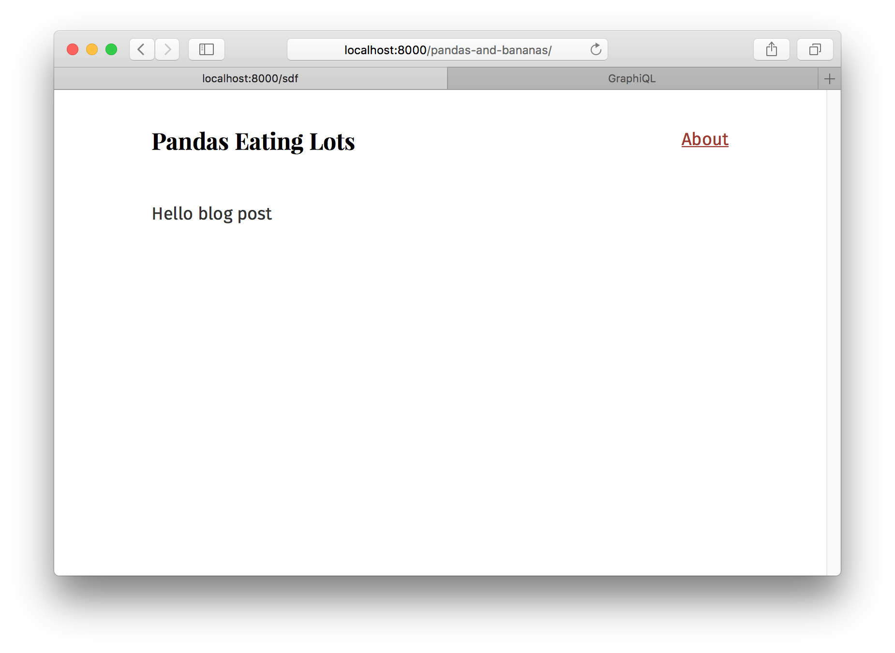

> This tutorial is part of a series about Gatsby’s data layer. Make sure you’ve gone through [part 4](/docs/tutorial/part-four/), [part 5](/docs/tutorial/part-five/), and [part 6](/docs/tutorial/part-six/) before continuing here.

## What's in this tutorial?

In the previous tutorial, you created a nice index page that queries markdown files and produces a list of blog post titles and excerpts. But you don't want to just see excerpts, you want actual pages for your markdown files.

You could continue to create pages by placing React components in `src/pages`. However, you'll now learn how to _programmatically_ create pages from _data_. Gatsby is _not_ limited to making pages from files like many static site generators. Gatsby lets you use GraphQL to query your _data_ and _map_ the query results to _pages_—all at build time. This is a really powerful idea. You'll be exploring its implications and ways to use it for the remainder of this part of the tutorial.

Let's get started.

## Creating slugs for pages

A ‘slug’ is the unique identifying part of a web address, such as the `/docs/tutorial/part-seven` part of the page `https://www.gatsbyjs.com/docs/tutorial/part-seven/`.

It is also referred to as the ‘path’ but this tutorial will use the term ‘slug’ for consistency.

Creating new pages has two steps:

1. Generate the "path" or "slug" for the page.
2. Create the page.

_**Note**: Often data sources will directly provide a slug or pathname for content — when working with one of those systems (e.g. a CMS), you don't need to create the slugs yourself as you do with markdown files._

To create your markdown pages, you'll learn to use two Gatsby APIs: [`onCreateNode`](/docs/reference/config-files/gatsby-node/#onCreateNode) and [`createPages`](/docs/reference/config-files/gatsby-node/#createPages). These are two workhorse APIs you'll see used in many sites and plugins.

We do our best to make Gatsby APIs simple to implement. To implement an API, you export a function with the name of the API from `gatsby-node.js`.

So, here's where you'll do that. In the root of your site, create a file named `gatsby-node.js`. Then add the following.

```javascript:title=gatsby-node.js
exports.onCreateNode = ({ node }) => {
  console.log(`Node created of type "${node.internal.type}"`)
}
```

This `onCreateNode` function will be called by Gatsby whenever a new node is created (or updated).

Stop and restart the development server. As you do, you'll see quite a few newly created nodes get logged to the terminal console.

In the next section, you will use this API to add slugs for your Markdown pages to `MarkdownRemark` nodes.

Change your function so it now only logs `MarkdownRemark` nodes.

```javascript:title=gatsby-node.js
exports.onCreateNode = ({ node }) => {
  // highlight-start
  if (node.internal.type === `MarkdownRemark`) {
    console.log(node.internal.type)
  }
  // highlight-end
}
```

You want to use each markdown file name to create the page slug. So `pandas-and-bananas.md` will become `/pandas-and-bananas/`. But how do you get the file name from the `MarkdownRemark` node? To get it, you need to _traverse_ the "node graph" to its _parent_ `File` node, as `File` nodes contain data you need about files on disk. To do that, you'll use the [`getNode()`](/docs/reference/config-files/node-api-helpers/#getNode) helper. Add it to `onCreateNode`'s function parameters, and call it to get the file node:

```javascript:title=gatsby-node.js
// highlight-next-line
exports.onCreateNode = ({ node, getNode }) => {
  if (node.internal.type === `MarkdownRemark`) {
    // highlight-start
    const fileNode = getNode(node.parent)
    console.log(`\n`, fileNode.relativePath)
    // highlight-end
  }
}
```

After restarting your development server, you should see the relative paths for your two markdown files print to the terminal screen.


Now you'll have to create slugs. As the logic for creating slugs from file names can get tricky, the `gatsby-source-filesystem` plugin ships with a function for creating slugs. Let's use that.

```javascript:title=gatsby-node.js
const { createFilePath } = require(`gatsby-source-filesystem`) // highlight-line

exports.onCreateNode = ({ node, getNode }) => {
  if (node.internal.type === `MarkdownRemark`) {
    console.log(createFilePath({ node, getNode, basePath: `pages` })) // highlight-line
  }
}
```

The function handles finding the parent `File` node along with creating the slug. Run the development server again and you should see logged to the terminal two slugs, one for each markdown file.

Now you can add your new slugs directly onto the `MarkdownRemark` nodes. This is powerful, as any data you add to nodes is available to query later with GraphQL. So, it'll be easy to get the slug when it comes time to create the pages.

To do so, you'll use a function passed to your API implementation called [`createNodeField`](/docs/reference/config-files/actions/#createNodeField). This function allows you to create additional fields on nodes created by other plugins. Only the original creator of a node can directly modify the node—all other plugins (including your `gatsby-node.js`) must use this function to create additional fields.

```javascript:title=gatsby-node.js
const { createFilePath } = require(`gatsby-source-filesystem`)
// highlight-next-line
exports.onCreateNode = ({ node, getNode, actions }) => {
  const { createNodeField } = actions // highlight-line
  if (node.internal.type === `MarkdownRemark`) {
    // highlight-start
    const slug = createFilePath({ node, getNode, basePath: `pages` })
    createNodeField({
      node,
      name: `slug`,
      value: slug,
    })
    // highlight-end
  }
}
```

Restart the development server and open or refresh GraphiQL. Then run this GraphQL query to see your new slugs.

```graphql
{
  allMarkdownRemark {
    edges {
      node {
        fields {
          slug
        }
      }
    }
  }
}
```

Now that the slugs are created, you can create the pages.

## Creating pages

In the same `gatsby-node.js` file, add the following.

```javascript:title=gatsby-node.js
const { createFilePath } = require(`gatsby-source-filesystem`)

exports.onCreateNode = ({ node, getNode, actions }) => {
  const { createNodeField } = actions
  if (node.internal.type === `MarkdownRemark`) {
    const slug = createFilePath({ node, getNode, basePath: `pages` })
    createNodeField({
      node,
      name: `slug`,
      value: slug,
    })
  }
}

// highlight-start
exports.createPages = async ({ graphql, actions }) => {
  // **Note:** The graphql function call returns a Promise
  // see: https://developer.mozilla.org/en-US/docs/Web/JavaScript/Reference/Global_Objects/Promise for more info
  const result = await graphql(`
    query {
      allMarkdownRemark {
        edges {
          node {
            fields {
              slug
            }
          }
        }
      }
    }
  `)

  console.log(JSON.stringify(result, null, 4))
}
// highlight-end
```

You've added an implementation of the [`createPages`](/docs/reference/config-files/gatsby-node/#createPages) API which Gatsby calls so plugins can add pages.

As mentioned in the intro to this part of the tutorial, the steps to programmatically creating pages are:

1. Query data with GraphQL
2. Map the query results to pages

The above code is the first step for creating pages from your markdown as you're using the supplied `graphql` function to query the markdown slugs you created. Then you're logging out the result of the query which should look like:


You need one additional thing beyond a slug to create pages: a page template component. Like everything in Gatsby, programmatic pages are powered by React components. When creating a page, you need to specify which component to use.

Create a directory at `src/templates`, and then add the following in a file named `src/templates/blog-post.js`.

```jsx:title=src/templates/blog-post.js
import React from "react"
import Layout from "../components/layout"

export default function BlogPost() {
  return (
    <Layout>
      <div>Hello blog post</div>
    </Layout>
  )
}
```

Then update `gatsby-node.js`

```javascript:title=gatsby-node.js
const path = require(`path`) // highlight-line
const { createFilePath } = require(`gatsby-source-filesystem`)

exports.onCreateNode = ({ node, getNode, actions }) => {
  const { createNodeField } = actions
  if (node.internal.type === `MarkdownRemark`) {
    const slug = createFilePath({ node, getNode, basePath: `pages` })
    createNodeField({
      node,
      name: `slug`,
      value: slug,
    })
  }
}

exports.createPages = async ({ graphql, actions }) => {
  const { createPage } = actions // highlight-line
  const result = await graphql(`
    query {
      allMarkdownRemark {
        edges {
          node {
            fields {
              slug
            }
          }
        }
      }
    }
  `)

  // highlight-start
  result.data.allMarkdownRemark.edges.forEach(({ node }) => {
    createPage({
      path: node.fields.slug,
      component: path.resolve(`./src/templates/blog-post.js`),
      context: {
        // Data passed to context is available
        // in page queries as GraphQL variables.
        slug: node.fields.slug,
      },
    })
  })
  // highlight-end
}
```

Restart the development server and your pages will be created! An easy way to find new pages you create while developing is to go to a random path where Gatsby will helpfully show you a list of pages on the site. If you go to `http://localhost:8000/sdf`, you'll see the new pages you created.


Visit one of them and you see:



Which is a bit boring and not what you want. Now you can pull in data from your markdown post. Change `src/templates/blog-post.js` to:

```jsx:title=src/templates/blog-post.js
import React from "react"
import { graphql } from "gatsby" // highlight-line
import Layout from "../components/layout"

// highlight-start
export default function BlogPost({ data }) {
  const post = data.markdownRemark
  // highlight-end
  return (
    <Layout>
      {/* highlight-start */}
      <div>
        <h1>{post.frontmatter.title}</h1>
        <div dangerouslySetInnerHTML={{ __html: post.html }} />
      </div>
      {/* highlight-end */}
    </Layout>
  )
}

// highlight-start
export const query = graphql`
  query($slug: String!) {
    markdownRemark(fields: { slug: { eq: $slug } }) {
      html
      frontmatter {
        title
      }
    }
  }
`
// highlight-end
```

And…


Sweet!

The last step is to link to your new pages from the index page.

Return to `src/pages/index.js`, query for your markdown slugs, and create links.

```jsx:title=src/pages/index.js
import React from "react"
import { css } from "@emotion/react"
import { Link, graphql } from "gatsby" // highlight-line
import { rhythm } from "../utils/typography"
import Layout from "../components/layout"

export default function Home({ data }) {
  return (
    <Layout>
      <div>
        <h1
          css={css`
            display: inline-block;
            border-bottom: 1px solid;
          `}
        >
          Amazing Pandas Eating Things
        </h1>
        <h4>{data.allMarkdownRemark.totalCount} Posts</h4>
        {data.allMarkdownRemark.edges.map(({ node }) => (
          <div key={node.id}>
            {/* highlight-start */}
            <Link
              to={node.fields.slug}
              css={css`
                text-decoration: none;
                color: inherit;
              `}
            >
              {/* highlight-end */}
              <h3
                css={css`
                  margin-bottom: ${rhythm(1 / 4)};
                `}
              >
                {node.frontmatter.title}{" "}
                <span
                  css={css`
                    color: #555;
                  `}
                >
                  — {node.frontmatter.date}
                </span>
              </h3>
              <p>{node.excerpt}</p>
            </Link> {/* highlight-line */}
          </div>
        ))}
      </div>
    </Layout>
  )
}

export const query = graphql`
  query {
    allMarkdownRemark(sort: { fields: [frontmatter___date], order: DESC }) {
      totalCount
      edges {
        node {
          id
          frontmatter {
            title
            date(formatString: "DD MMMM, YYYY")
          }
          # highlight-start
          fields {
            slug
          }
          # highlight-end
          excerpt
        }
      }
    }
  }
`
```

And there you go! A working, albeit small, blog!

## Challenge

Try playing more with the site. Try adding some more markdown files. Explore querying other data from the `MarkdownRemark` nodes and adding them to the front page or blog posts pages.

In this part of the tutorial, you've learned the foundations of building with Gatsby's data layer. You've learned how to _source_ and _transform_ data using plugins, how to use GraphQL to _map_ data to pages, and then how to build _page template components_ where you query for data for each page.

## What's coming next?

Now that you've built a Gatsby site, you're ready for the final tutorial, where you'll [prepare your site to go live](https://www.gatsbyjs.com/docs/tutorial/part-eight/)!

From there, you can:
- Share your Gatsby site on Twitter and see what other people have created by searching for [#gatsbytutorial](https://twitter.com/search?q=%23gatsbytutorial)! Make sure to mention [@GatsbyJS](https://twitter.com/gatsbyjs) in your tweet and include the hashtag `#gatsbytutorial` :)
- You could take a look at some [example sites](https://github.com/gatsbyjs/gatsby/tree/master/examples#gatsby-example-websites)
- Explore more [plugins](/docs/plugins/)
- See what [other people are building with Gatsby](/showcase/)
- Check out the documentation on [Gatsby's APIs](/docs/api-specification/), [nodes](/docs/reference/graphql-data-layer/node-interface/), or [GraphQL](/docs/graphql-reference/)
