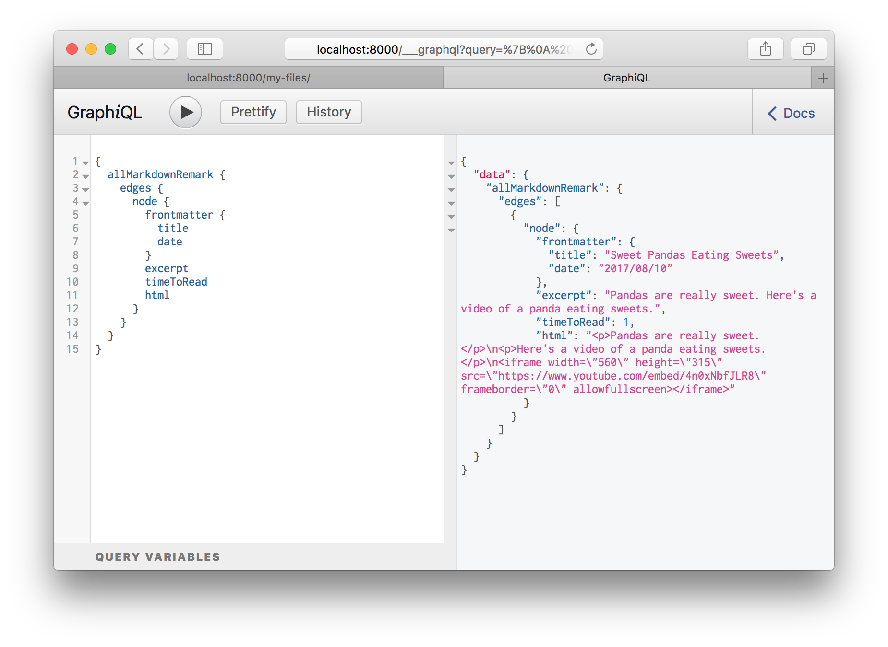

> This tutorial is part of a series about Gatsby’s data layer. Make sure you’ve gone through [part 4](/docs/tutorial/part-four/) and [part 5](/docs/tutorial/part-five/) before continuing here.

## What's in this tutorial?

The previous tutorial showed how source plugins bring data _into_ Gatsby’s data system. In this tutorial, you'll learn how transformer plugins _transform_ the raw content brought by source plugins. The combination of source plugins and transformer plugins can handle all data sourcing and data transformation you might need when building a Gatsby site.

## Transformer plugins

Often, the format of the data you get from source plugins isn't what you want to use to build your website. The filesystem source plugin lets you query data _about_ files but what if you want to query data _inside_ files?

To make this possible, Gatsby supports transformer plugins which take raw content from source plugins and _transform_ it into something more usable.

For example, markdown files. Markdown is nice to write in but when you build a page with it, you need the markdown to be HTML.

Add a markdown file to your site at `src/pages/sweet-pandas-eating-sweets.md` (This will become your first markdown blog post) and learn how to _transform_ it to HTML using transformer plugins and GraphQL.

```markdown:title=src/pages/sweet-pandas-eating-sweets.md
---
title: "Sweet Pandas Eating Sweets"
date: "2017-08-10"
---

Pandas are really sweet.

Here's a video of a panda eating sweets.

<iframe width="560" height="315" src="https://www.youtube.com/embed/4n0xNbfJLR8" frameborder="0" allowfullscreen></iframe>
```

Once you save the file, look at `/my-files/` again—the new markdown file is in the table. This is a very powerful feature of Gatsby. Like the earlier `siteMetadata` example, source plugins can live-reload data. `gatsby-source-filesystem` is always scanning for new files to be added and when they are, re-runs your queries.

Add a transformer plugin that can transform markdown files:

```shell
npm install gatsby-transformer-remark
```

Then add it to the `gatsby-config.js` like normal:

```javascript:title=gatsby-config.js
module.exports = {
  siteMetadata: {
    title: `Pandas Eating Lots`,
  },
  plugins: [
    {
      resolve: `gatsby-source-filesystem`,
      options: {
        name: `src`,
        path: `${__dirname}/src/`,
      },
    },
    `gatsby-transformer-remark`, // highlight-line
    `gatsby-plugin-emotion`,
    {
      resolve: `gatsby-plugin-typography`,
      options: {
        pathToConfigModule: `src/utils/typography`,
      },
    },
  ],
}
```

Restart the development server then refresh (or open again) GraphiQL and look at the autocomplete:


Select `allMarkdownRemark` again and run it as you did for `allFile`. You'll see there the markdown file you recently added. Explore the fields that are available on the `MarkdownRemark` node.



Ok! Hopefully, some basics are starting to fall into place. Source plugins bring data _into_ Gatsby's data system and _transformer_ plugins transform raw content brought by source plugins. This pattern can handle all data sourcing and data transformation you might need when building a Gatsby site.

## Create a list of your site's markdown files in `src/pages/index.js`

Now you'll have to create a list of your markdown files on the front page. Like many blogs, you want to end up with a list of links on the front page pointing to each blog post. With GraphQL you can _query_ for the current list of markdown blog posts so you won't need to maintain the list manually.

Like with the `src/pages/my-files.js` page, replace `src/pages/index.js` with the following to add a GraphQL query with some initial HTML and styling.

```jsx:title=src/pages/index.js
import React from "react"
import { graphql } from "gatsby"
import { css } from "@emotion/react"
import { rhythm } from "../utils/typography"
import Layout from "../components/layout"

export default function Home({ data }) {
  console.log(data)
  return (
    <Layout>
      <div>
        <h1
          css={css`
            display: inline-block;
            border-bottom: 1px solid;
          `}
        >
          Amazing Pandas Eating Things
        </h1>
        <h4>{data.allMarkdownRemark.totalCount} Posts</h4>
        {data.allMarkdownRemark.edges.map(({ node }) => (
          <div key={node.id}>
            <h3
              css={css`
                margin-bottom: ${rhythm(1 / 4)};
              `}
            >
              {node.frontmatter.title}{" "}
              <span
                css={css`
                  color: #bbb;
                `}
              >
                — {node.frontmatter.date}
              </span>
            </h3>
            <p>{node.excerpt}</p>
          </div>
        ))}
      </div>
    </Layout>
  )
}

export const query = graphql`
  query {
    allMarkdownRemark {
      totalCount
      edges {
        node {
          id
          frontmatter {
            title
            date(formatString: "DD MMMM, YYYY")
          }
          excerpt
        }
      }
    }
  }
`
```

Now the frontpage should look like:


But your one blog post looks a bit lonely. So let's add another one at `src/pages/pandas-and-bananas.md`

```markdown:title=src/pages/pandas-and-bananas.md
---
title: "Pandas and Bananas"
date: "2017-08-21"
---

Do Pandas eat bananas? Check out this short video that shows that yes! pandas do seem to really enjoy bananas!

<iframe width="560" height="315" src="https://www.youtube.com/embed/4SZl1r2O_bY" frameborder="0" allowfullscreen></iframe>
```


Which looks great! Except… the order of the posts is wrong.

But this is easy to fix. When querying a connection of some type, you can pass a variety of arguments to the GraphQL query. You can `sort` and `filter` nodes, set how many nodes to `skip`, and choose the `limit` of how many nodes to retrieve. With this powerful set of operators, you can select any data you want—in the format you need.

In your index page's GraphQL query, change `allMarkdownRemark` to `allMarkdownRemark(sort: { fields: [frontmatter___date], order: DESC })`. _Note: There are 3 underscores between `frontmatter` and `date`._ Save this and the sort order should be fixed.

Try opening GraphiQL and playing with different sort options. You can sort the `allFile` connection along with other connections.

For more documentation on our query operators, explore our [GraphQL reference guide.](/docs/graphql-reference/)

## Challenge

Try creating a new page containing a blog post and see what happens to the list of blog posts on the homepage!

## What's coming next?

This is great! You've just created a nice index page where you're querying your markdown files and producing a list of blog post titles and excerpts. But you don't want to just see excerpts, you want actual pages for your markdown files.

You could continue to create pages by placing React components in `src/pages`. However, you'll next learn how to _programmatically_ create pages from _data_. Gatsby is _not_ limited to making pages from files like many static site generators. Gatsby lets you use GraphQL to query your _data_ and _map_ the query results to _pages_—all at build time. This is a really powerful idea. You'll be exploring its implications and ways to use it in the next tutorial, where you'll learn how to [programmatically create pages from data](/docs/tutorial/part-seven/).
