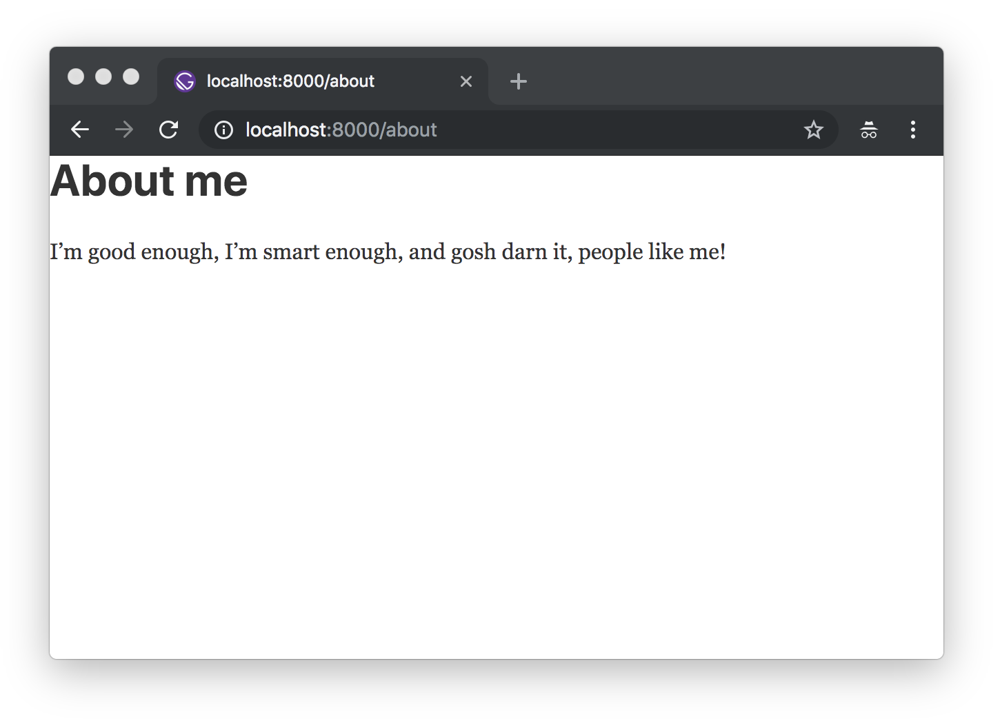

Welcome to part three!

## What's in this tutorial?

In this part, you'll learn about Gatsby plugins and creating "layout" components.

Gatsby plugins are JavaScript packages that help add functionality to a Gatsby site. Gatsby is designed to be extensible, which means plugins are able to extend and modify just about everything Gatsby does.

Layout components are for sections of your site that you want to share across multiple pages. For example, sites will commonly have a layout component with a shared header and footer. Other common things to add to layouts are a sidebar and/or navigation menu. On this page for example, the header at the top is part of gatsbyjs.com's layout component.

Let's dive into part three.

## Using plugins

You’re probably familiar with the idea of plugins. Many software systems support adding custom plugins to add new functionality or even modify the core workings of the software. Gatsby plugins work the same way.

Community members (like you!) can contribute plugins (small amounts of JavaScript code) that others can then use when building Gatsby sites.

> There are already hundreds of plugins! Explore the Gatsby [Plugin Library](/plugins/).

Our goal with plugins is to make them straightforward to install and use. You will likely be using plugins in almost every Gatsby site you build. While working through the rest of the tutorial you’ll have many opportunities to practice installing and using plugins.

For an initial introduction to using plugins, we'll install and implement the Gatsby plugin for Typography.js.

[Typography.js](https://kyleamathews.github.io/typography.js/) is a JavaScript library which generates global base styles for your site's typography. The library has a [corresponding Gatsby plugin](/plugins/gatsby-plugin-typography/) to streamline using it in a Gatsby site.

### ✋ Create a new Gatsby site

As we mentioned in [part two](/docs/tutorial/part-two/), at this point it's probably a good idea to close the terminal window(s) and project files from previous parts of the tutorial, to keep things clean on your desktop. Then open a new terminal window and run the following commands to create a new Gatsby site in a directory called `tutorial-part-three` and then move to this new directory:

```shell
gatsby new tutorial-part-three https://github.com/gatsbyjs/gatsby-starter-hello-world
cd tutorial-part-three
```

### ✋ Install and configure `gatsby-plugin-typography`

There are two main steps to using a plugin: Installing and configuring.

1. Install the `gatsby-plugin-typography` npm package.

```shell
npm install gatsby-plugin-typography react-typography typography typography-theme-fairy-gates
```

> Note: Typography.js requires a few additional packages, so those are included in the instructions. Additional requirements like this will be listed in the "install" instructions of each plugin.

2. Edit the file `gatsby-config.js` at the root of your project to the following:

```javascript:title=gatsby-config.js
module.exports = {
  plugins: [
    {
      resolve: `gatsby-plugin-typography`,
      options: {
        pathToConfigModule: `src/utils/typography`,
      },
    },
  ],
}
```

The `gatsby-config.js` is another special file that Gatsby will automatically recognize. This is where you add plugins and other site configuration.

> Check out the [doc on gatsby-config.js](/docs/reference/config-files/gatsby-config/) to read more, if you wish.

3. Typography.js needs a configuration file. Create a new directory called `utils` in the `src` directory. Then add a new file called `typography.js` to `utils` and copy the following into the file:

```javascript:title=src/utils/typography.js
import Typography from "typography"
import fairyGateTheme from "typography-theme-fairy-gates"

const typography = new Typography(fairyGateTheme)

export const { scale, rhythm, options } = typography
export default typography
```

4. Start the development server.

```shell
gatsby develop
```

Once you load the site, if you inspect the generated HTML using the Chrome developer tools, you’ll see that the typography plugin added a `<style>` element to the `<head>` element with its generated CSS:


### ✋ Make some content and style changes

Copy the following into your `src/pages/index.js` so you can see the effect of the CSS generated by Typography.js better.

```jsx:title=src/pages/index.js
import React from "react"

export default function Home() {
  return (
    <div>
      <h1>Hi! I'm building a fake Gatsby site as part of a tutorial!</h1>
      <p>
        What do I like to do? Lots of course but definitely enjoy building
        websites.
      </p>
    </div>
  )
}
```

Your site should now look like this:


Let's make a quick improvement. Many sites have a single column of text centered in the middle of the page. To create this, add the following styles to the `<div>` in `src/pages/index.js`.

```jsx:title=src/pages/index.js
import React from "react"

export default function Home() {
  return (
    // highlight-next-line
    <div style={{ margin: `3rem auto`, maxWidth: 600 }}>
      <h1>Hi! I'm building a fake Gatsby site as part of a tutorial!</h1>
      <p>
        What do I like to do? Lots of course but definitely enjoy building
        websites.
      </p>
    </div>
  )
}
```


Sweet. You've installed and configured your very first Gatsby plugin!

## Creating layout components

Now let's move on to learning about layout components. To get ready for this part, add a couple new pages to your project: an about page and a contact page.

```jsx:title=src/pages/about.js
import React from "react"

export default function About() {
  return (
    <div>
      <h1>About me</h1>
      <p>
        I’m good enough, I’m smart enough, and gosh darn it, people like me!
      </p>
    </div>
  )
}
```

```jsx:title=src/pages/contact.js
import React from "react"

export default function Contact() {
  return (
    <div>
      <h1>I'd love to talk! Email me at the address below</h1>
      <p>
        <a href="mailto:me@example.com">me@example.com</a>
      </p>
    </div>
  )
}
```

Let's see what the new about page looks like:



Hmm. It would be nice if the content of the two new pages were centered like the index page. And it would be nice to have some sort of global navigation so it's easy for visitors to find and visit each of the sub-pages.

You'll tackle these changes by creating your first layout component.

### ✋ Create your first layout component

1. Create a new directory at `src/components`.

2. Create a very basic layout component at `src/components/layout.js`:

```jsx:title=src/components/layout.js
import React from "react"

export default function Layout({ children }) {
  return (
    <div style={{ margin: `3rem auto`, maxWidth: 650, padding: `0 1rem` }}>
      {children}
    </div>
  )
}
```

3. Import this new layout component into your `src/pages/index.js` page component:

```jsx:title=src/pages/index.js
import React from "react"
import Layout from "../components/layout" // highlight-line

export default function Home() {
  return (
    <Layout> {/* highlight-line */}
      <h1>Hi! I'm building a fake Gatsby site as part of a tutorial!</h1>
      <p>
        What do I like to do? Lots of course but definitely enjoy building
        websites.
      </p>
    </Layout> {/* highlight-line */}
  );
}
```


Sweet, the layout is working! The content of your index page is still centered.

But try navigating to `/about/`, or `/contact/`. The content on those pages still won't be centered.

4. Import the layout component in `about.js` and `contact.js` (as you did for `index.js` in the previous step).

The content of all three of your pages is centered thanks to this single shared layout component!

### ✋ Add a site title

1. Add the following line to your new layout component:

```jsx:title=src/components/layout.js
import React from "react"

export default function Layout({ children }) {
  return (
    <div style={{ margin: `3rem auto`, maxWidth: 650, padding: `0 1rem` }}>
      <h3>MySweetSite</h3> {/* highlight-line */}
      {children}
    </div>
  )
}
```

If you go to any of your three pages, you'll see the same title added, e.g. the `/about/` page:


### ✋ Add navigation links between pages

1. Copy the following into your layout component file:

```jsx:title=src/components/layout.js
import React from "react"
// highlight-start
import { Link } from "gatsby"

const ListLink = props => (
  <li style={{ display: `inline-block`, marginRight: `1rem` }}>
    <Link to={props.to}>{props.children}</Link>
  </li>
)
// highlight-end

export default function Layout({ children }) {
  return (
    <div style={{ margin: `3rem auto`, maxWidth: 650, padding: `0 1rem` }}>
      {/* highlight-start */}
      <header style={{ marginBottom: `1.5rem` }}>
        <Link to="/" style={{ textShadow: `none`, backgroundImage: `none` }}>
          <h3 style={{ display: `inline` }}>MySweetSite</h3>
        </Link>
        <ul style={{ listStyle: `none`, float: `right` }}>
          <ListLink to="/">Home</ListLink>
          <ListLink to="/about/">About</ListLink>
          <ListLink to="/contact/">Contact</ListLink>
        </ul>
      </header>
      {/* highlight-end */}
      {children}
    </div>
  )
}
```


And there you have it! A three page site with basic global navigation.

_Challenge:_ With your new "layout component" powers, try adding headers, footers, global navigation, sidebars, etc. to your Gatsby sites!

## What's coming next?

Continue on to [part four of the tutorial](/docs/tutorial/part-four/) where you'll start learning about Gatsby's data layer and programmatically creating pages!
