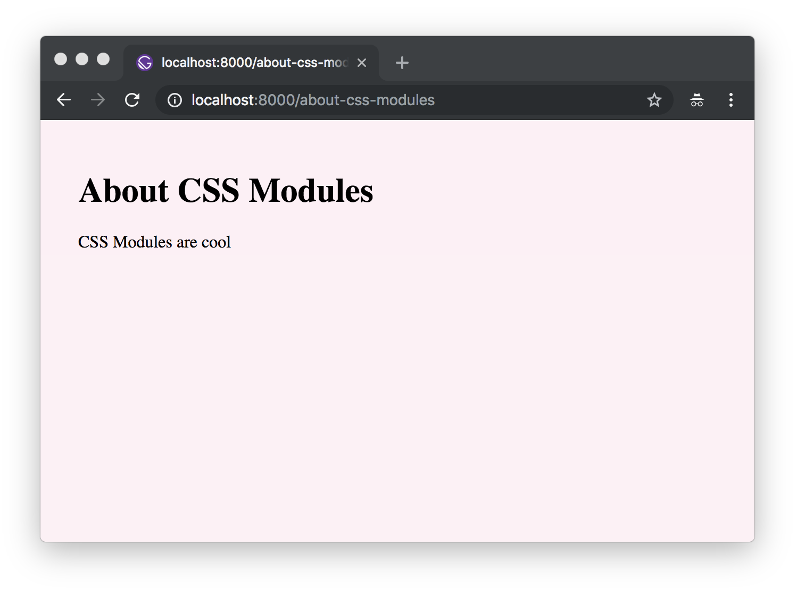
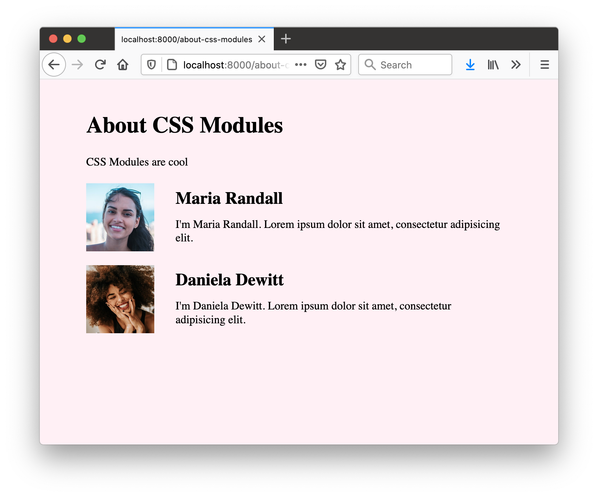

<!-- Idea: Create a glossary to refer to. A lot of these terms get jumbled -->

<!--
  - Global styles
  - Component css
  - CSS-in-JS
  - CSS Modules

-->

Welcome to part two of the Gatsby tutorial!

## What's in this tutorial?

In this part, you're going to explore options for styling Gatsby websites and dive deeper into using React components for building sites.

## Using global styles

Every site has some sort of global style. This includes things like the site's typography and background colors. These styles set the overall feel of the site — much like the color and texture of a wall sets the overall feel of a room.

### Creating global styles with standard CSS files

One of the most straightforward ways to add global styles to a site is using a global `.css` stylesheet.

#### ✋ Create a new Gatsby site

Start by creating a new Gatsby site. It may be best (especially if you're new to the command line) to close the terminal windows you used for [part one](/docs/tutorial/part-one/) and start a new terminal session for part two.

Open a new terminal window, create a new "hello world" Gatsby site in a directory called `tutorial-part-two`, and then move to this new directory:

```shell
gatsby new tutorial-part-two https://github.com/gatsbyjs/gatsby-starter-hello-world
cd tutorial-part-two
```

You now have a new Gatsby site (based on the Gatsby "hello world" starter) with the following structure:

```text
├── package.json
├── src
│   └── pages
│       └── index.js
```

#### ✋ Add styles to a CSS file

1. Create a `.css` file in your new project:

```shell
cd src
mkdir styles
cd styles
touch global.css
```

> Note: Feel free to create these directories and files using your code editor, if you'd prefer.

You should now have a structure like this:

```text
├── package.json
├── src
│   └── pages
│       └── index.js
│   └── styles
│       └── global.css
```

2. Define some styles in the `global.css` file:

```css:title=src/styles/global.css
html {
  background-color: lavenderblush;
}
```

> Note: The placement of the example CSS file in a `/src/styles/` folder is arbitrary.

#### ✋ Include the stylesheet in `gatsby-browser.js`

1. Create the `gatsby-browser.js`

```shell
cd ../..
touch gatsby-browser.js
```

Your project's file structure should now look like this:

```text
├── package.json
├── src
│   └── pages
│       └── index.js
│   └── styles
│       └── global.css
├── gatsby-browser.js
```

> 💡 What is `gatsby-browser.js`? Don't worry about this too much and for now, just know that `gatsby-browser.js` is one of a handful of special files that Gatsby looks for and uses (if they exist). Here, the naming of the file **is** important. If you do want to explore more now, check out [the docs](/docs/reference/config-files/gatsby-browser/).

2. Import your recently-created stylesheet in the `gatsby-browser.js` file:

```javascript:title=gatsby-browser.js
import "./src/styles/global.css"

// or:
// require('./src/styles/global.css')
```

> Note: Both CommonJS (`require`) and ES Module (`import`) syntax work here. If you’re not sure which to choose, `import` is usually a good default. When working with files that are only run in a Node.js environment however (like `gatsby-node.js`), `require` will need to be used.

3. Start the development server:

```shell
gatsby develop
```

If you take a look at your project in the browser, you should see a lavender background applied to the "hello world" starter:


> Tip: This part of the tutorial has focused on the quickest and most straightforward way to get started styling a Gatsby site — importing standard CSS files directly, using `gatsby-browser.js`. In most cases, the best way to add global styles is with a shared layout component. [Check out the docs](/docs/how-to/styling/global-css/) for more on that approach.

## Using component-scoped CSS

So far, we've talked about the more traditional approach of using standard CSS stylesheets. Now, we'll talk about various methods of modularizing CSS to tackle styling in a component-oriented way.

### CSS Modules

Let's explore **CSS Modules**. Quoting from
[the CSS Module homepage](https://github.com/css-modules/css-modules):

> A **CSS Module** is a CSS file in which all class names and animation names
> are scoped locally by default.

CSS Modules are very popular because they let you write CSS normally but with a lot more safety. The tool automatically generates unique class and animation names, so you don't have to worry about selector name collisions.

Gatsby works out of the box with CSS Modules. This approach is highly recommended for those new to building with Gatsby (and React in general).

#### ✋ Build a new page using CSS Modules

In this section, you'll create a new page component and style that page component using a CSS Module.

First, create a new `Container` component.

1. Create a new directory at `src/components` and then, in this new directory, create a file named `container.js` and paste the following:

```jsx:title=src/components/container.js
import React from "react"
import * as containerStyles from "./container.module.css"

export default function Container({ children }) {
  return <div className={containerStyles.container}>{children}</div>
}
```

You'll notice you imported a CSS module file named `container.module.css`. Let's create that file now.

2. In the same directory (`src/components`), create a `container.module.css` file and copy/paste the following:

```css:title=src/components/container.module.css
.container {
  margin: 3rem auto;
  max-width: 600px;
}
```

You'll notice that the file name ends with `.module.css` instead of the usual `.css`. This is how you tell Gatsby that this CSS file should be processed as a CSS module rather than plain CSS.

3. Create a new page component by creating a file at
   `src/pages/about-css-modules.js`:

```jsx:title=src/pages/about-css-modules.js
import React from "react"

import Container from "../components/container"

export default function About() {
  return (
    <Container>
      <h1>About CSS Modules</h1>
      <p>CSS Modules are cool</p>
    </Container>
  )
}
```

Now, if you visit `http://localhost:8000/about-css-modules/`, your page should look something like this:



#### ✋ Style a component using CSS Modules

In this section, you'll create a list of people with names, avatars, and short Latin biographies. You'll create a `<User />` component and style that component using a CSS module.

1. Create the file for the CSS at `src/pages/about-css-modules.module.css`.

2. Paste the following into the new file:

```css:title=src/pages/about-css-modules.module.css
.user {
  display: flex;
  align-items: center;
  margin: 0 auto 12px auto;
}

.user:last-child {
  margin-bottom: 0;
}

.avatar {
  flex: 0 0 96px;
  width: 96px;
  height: 96px;
  margin: 0;
}

.description {
  flex: 1;
  margin-left: 18px;
  padding: 12px;
}

.username {
  margin: 0 0 12px 0;
  padding: 0;
}

.excerpt {
  margin: 0;
}
```

3. Import the new `src/pages/about-css-modules.module.css` file into the `about-css-modules.js` page you created earlier by editing the first few lines of the file like so:

```javascript:title=src/pages/about-css-modules.js
import React from "react"
// highlight-next-line
import * as styles from "./about-css-modules.module.css"
import Container from "../components/container"

// highlight-next-line
console.log(styles)
```

The `console.log(styles)` code will log the resulting import so you can see the result of your processed `./about-css-modules.module.css` file. If you open the developer console (using e.g. Firefox or Chrome's developer tools, often by the F12 key) in your browser, you'll see:


If you compare that to your CSS file, you'll see that each class is now a key in the imported object pointing to a long string e.g. `avatar` points to `src-pages----about-css-modules-module---avatar---2lRF7`. These are the class names CSS Modules generates. They're guaranteed to be unique across your site. And because you have to import them to use the classes, there's never any question about where some CSS is being used.

4. Create a new `<User />` component inline in the `about-css-modules.js` page
   component. Modify `about-css-modules.js` so it looks like the following:

```jsx:title=src/pages/about-css-modules.js
import React from "react"
import * as styles from "./about-css-modules.module.css"
import Container from "../components/container"

console.log(styles)

// highlight-start
const User = props => (
  <div className={styles.user}>
    
    <div className={styles.description}>
      <h2 className={styles.username}>{props.username}</h2>
      <p className={styles.excerpt}>{props.excerpt}</p>
    </div>
  </div>
)
// highlight-end

export default function About() {
  return (
    <Container>
      <h1>About CSS Modules</h1>
      <p>CSS Modules are cool</p>
      {/* highlight-start */}
      <User
        username="Maria Randall"
        avatar="https://raw.githubusercontent.com/gatsbyjs/gatsby/master/docs/docs/tutorial/part-two/pexels-daniel-xavier-1102341.jpg"
        excerpt="I'm Maria Randall. Lorem ipsum dolor sit amet, consectetur adipisicing elit."
      />
      <User
        username="Daniela Dewitt"
        avatar="https://raw.githubusercontent.com/gatsbyjs/gatsby/master/docs/docs/tutorial/part-two/pexels-guilherme-almeida-1858175.jpg"
        excerpt="I'm Daniela Dewitt. Lorem ipsum dolor sit amet, consectetur adipisicing elit."
      />
      {/* highlight-end */}
    </Container>
  )
}
```

> Tip: Generally, if you use a component in multiple places on a site, it should be in its own module file in the `components` directory. But, if it's used only in one file, create it inline.

The finished page should now look like:



### CSS-in-JS

CSS-in-JS is a component-oriented styling approach. Most generally, it is a pattern where [CSS is composed inline using JavaScript](https://reactjs.org/docs/faq-styling.html#what-is-css-in-js).

#### Using CSS-in-JS with Gatsby

There are many different CSS-in-JS libraries and many of them have Gatsby plugins already. We won't cover an example of CSS-in-JS in this initial tutorial, but we encourage you to [explore](/docs/styling/) what the ecosystem has to offer. There are mini-tutorials for two libraries, in particular, [Emotion](/docs/how-to/styling/emotion/) and [Styled Components](/docs/how-to/styling/styled-components/).

#### Suggested reading on CSS-in-JS

If you're interested in further reading, check out [Christopher "vjeux" Chedeau's 2014 presentation that sparked this movement](https://speakerdeck.com/vjeux/react-css-in-js) as well as [Mark Dalgleish's more recent post "A Unified Styling Language"](https://medium.com/seek-blog/a-unified-styling-language-d0c208de2660).

### Other CSS options

Gatsby supports almost every possible styling option (if there isn't a plugin yet for your favorite CSS option, [please contribute one!](/contributing/how-to-contribute/))

- [Typography.js](/plugins/gatsby-plugin-typography/)
- [Sass](/plugins/gatsby-plugin-sass/)
- [JSS](/plugins/gatsby-plugin-jss/)
- [Stylus](/plugins/gatsby-plugin-stylus/)
- [PostCSS](/plugins/gatsby-plugin-postcss/)
- [Tailwind](/how-to/styling/tailwind-css/)

and more!

## What's coming next?

Now continue on to [part three of the tutorial](/docs/tutorial/part-three/), where you'll learn about Gatsby plugins and layout components.
