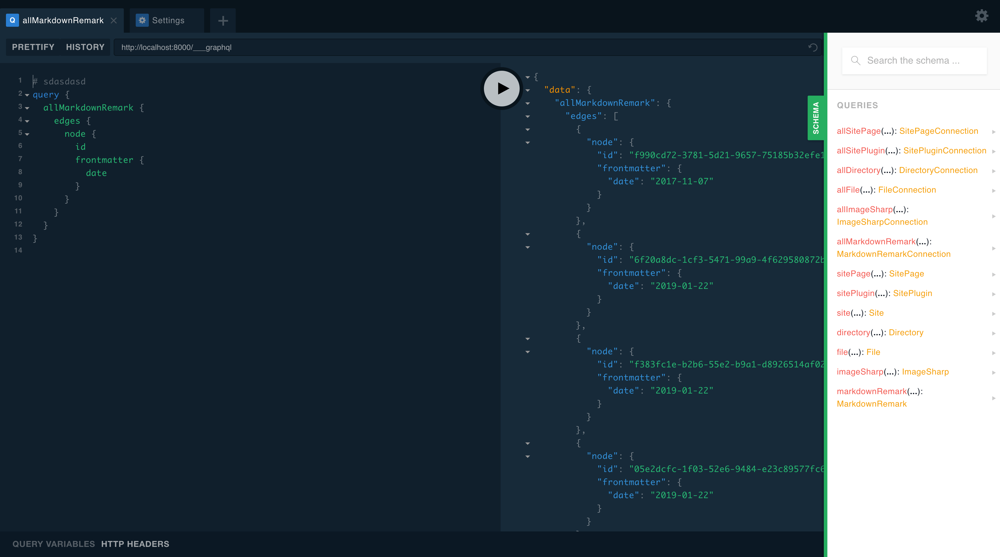

## Intro

This page will introduce you to an alternative to the current IDE for your GraphQL queries: [GraphQL Playground](https://github.com/prisma/graphql-playground).

## What is Prisma's GraphQL Playground?

GraphQL Playground is a way for you to interact with the data your sources and plugins add as schemas. You will be interacting with this data a lot and the Playground will help you greatly with exploring this data.

## Accessing the playground

To access this experimental feature utilizing GraphQL Playground with Gatsby, add `GATSBY_GRAPHQL_IDE` to your `develop` script in your `package.json`, like this:

```json:title=package.json
"develop": "GATSBY_GRAPHQL_IDE=playground gatsby develop",
```

If you are on **Windows** then you should use:

```json:title=package.json
"develop": "cross-env GATSBY_GRAPHQL_IDE=playground gatsby develop",
```

If you haven't installed **cross-env**, you can do it with:

```shell
npm install --save-dev cross-env
```

Use `npm run develop` instead of `gatsby develop` and access it when the development server is running on `http://localhost:8000/___graphql`

To still be able to use `gatsby develop` you would require the dotenv package to your gatsby-config.js file and add an [environment variable](/docs/how-to/local-development/environment-variables/) file, typically called `.env.development`. Finally, add `GATSBY_GRAPHQL_IDE=playground` to the `.env.development` file.


