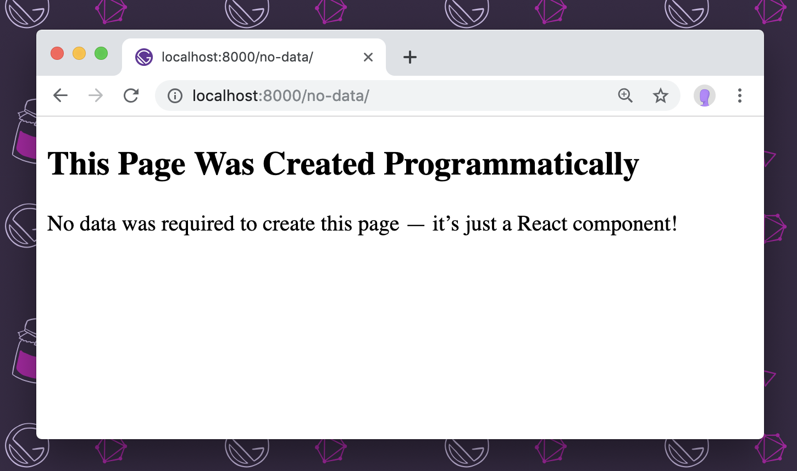
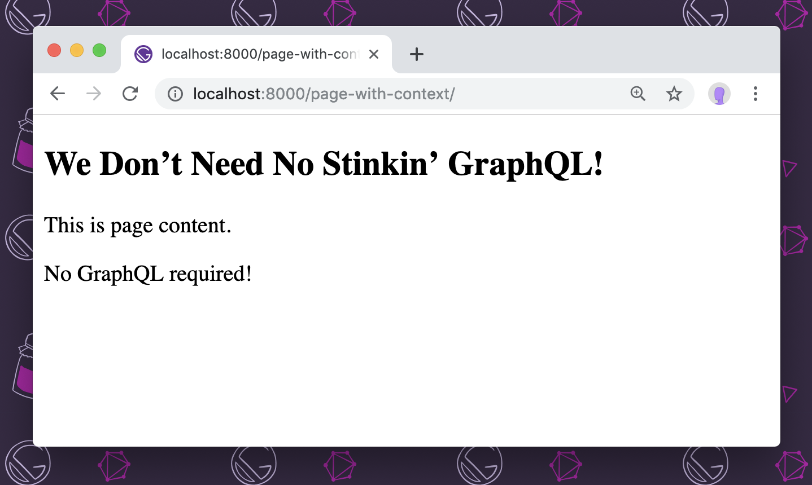
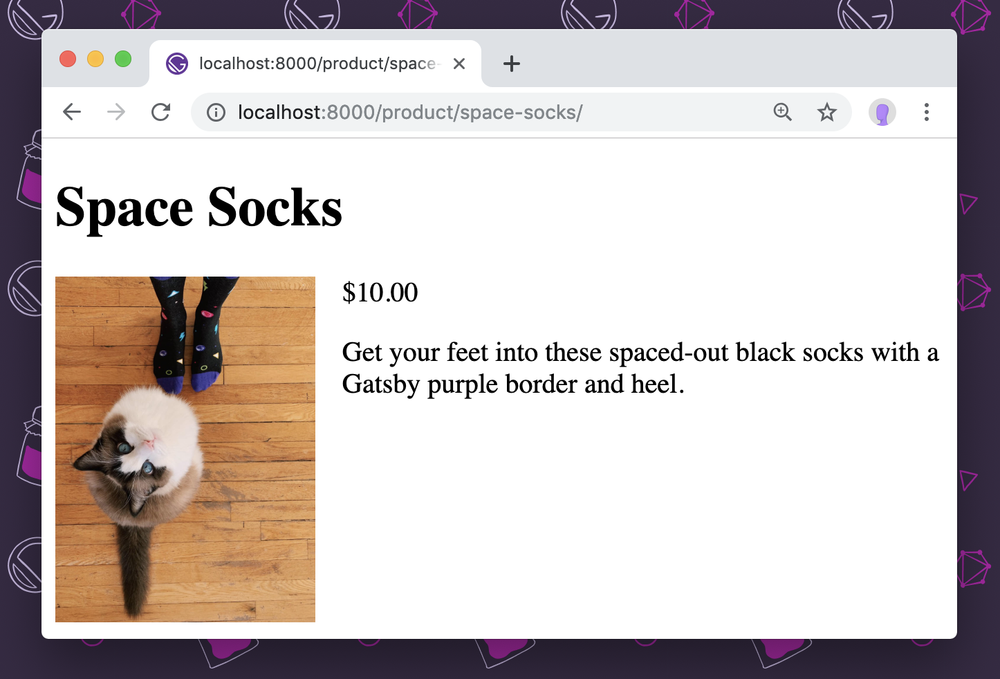
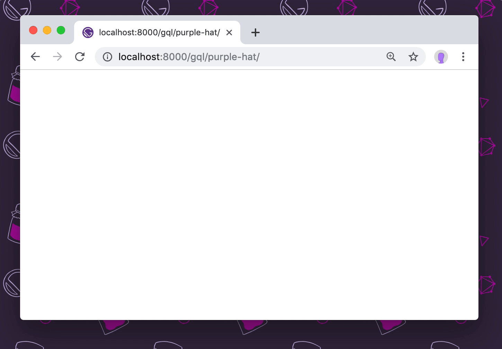

A common question about Gatsby is, “Why does Gatsby use GraphQL? Doesn’t it generate static files?”

Without providing some context, it can seem like GraphQL is overkill for something like Gatsby. In this document, you’ll see what problems arise when creating pages, and how those problems can be solved using GraphQL.

## Create a page without any data

<EggheadEmbed
  lessonLink="https://egghead.io/lessons/gatsby-create-a-gatsby-page-without-any-data"
  lessonTitle="Create a Gatsby Page Without Any Data"
/>

For any kind of pages that aren’t directly created in `src/pages/`, you’ll need Gatsby’s [`createPages` Node API](/docs/reference/config-files/gatsby-node/#createPages) to create pages programmatically.

All that’s required to create a page is a `path` where it should be created and the component that should be rendered there.

For example, if you had the following component:

```jsx:title=src/templates/no-data.js
import React from "react"

const NoData = () => (
  <section>
    <h1>This Page Was Created Programmatically</h1>
    <p>
      No data was required to create this page — it’s just a React component!
    </p>
  </section>
)

export default NoData
```

You could programmatically create a page at `/no-data/` by adding the following to `gatsby-node.js`:

```js:title=gatsby-node.js
exports.createPages = ({ actions: { createPage } }) => {
  createPage({
    path: "/no-data/",
    component: require.resolve("./src/templates/no-data.js"),
  })
}
```

After running `gatsby develop`, you’ll see the following at `http://localhost:8000/no-data/`:



In the simplest cases, this is all that’s required for building pages with Gatsby. However, you’ll often want to pass data to the page so that the template component is reusable.

## Create a page with hard-coded data

<EggheadEmbed
  lessonLink="https://egghead.io/lessons/gatsby-create-a-gatsby-page-with-hard-coded-data"
  lessonTitle="Create a Gatsby Page With Hard-Coded Data"
/>

To pass data to the created pages, you’ll need to pass `context` to the `createPage` call.

In `gatsby-node.js`, you can add context like so:

```js:title=gatsby-node.js
exports.createPages = ({ actions: { createPage } }) => {
  createPage({
    path: "/page-with-context/",
    component: require.resolve("./src/templates/with-context.js"),
    context: {
      title: "We Don’t Need No Stinkin’ GraphQL!",
      content: "<p>This is page content.</p><p>No GraphQL required!</p>",
    },
  })
}
```

The `context` property accepts an object, and you can pass in any data you want the page to be able to access.

> **NOTE:** There are a few reserved names that _cannot_ be used in `context`. They are: `path`, `matchPath`, `component`, `componentChunkName`, `pluginCreator___NODE`, and `pluginCreatorId`.

When Gatsby creates pages, it includes a prop called `pageContext` and sets its value to `context`, so you can access any of the values in your component:

```jsx:title=src/templates/with-context.js
import React from "react"

const WithContext = ({ pageContext }) => (
  <section>
    <h1>{pageContext.title}</h1>
    <div dangerouslySetInnerHTML={{ __html: pageContext.content }} />
  </section>
)

export default WithContext
```

Start the development server with `gatsby develop` and visit `http://localhost:8000/page-with-context/` to see the created page:



In some cases, this approach may be enough. However, it’s often necessary to create pages from data that can't be hard-coded.

## Create pages from JSON with images

<EggheadEmbed
  lessonLink="https://egghead.io/lessons/gatsby-create-pages-from-json-with-images"
  lessonTitle="Create Pages from JSON With Images"
/>

In many cases, the data for pages can't feasibly be hard-coded into `gatsby-node.js`. More likely it will come from an external source, such as a third-party API, local Markdown, or JSON files.

For example, you might have a JSON file with post data:

```json:title=data/products.json
[
  {
    "title": "Vintage Purple Tee",
    "slug": "vintage-purple-tee",
    "description": "<p>Keep it simple with this vintage purple tee.</p>",
    "price": "$10.00",
    "image": "/images/amberley-romo-riggins.jpg"
  },
  {
    "title": "Space Socks",
    "slug": "space-socks",
    "description": "<p>Get your feet into these spaced-out black socks with a Gatsby purple border and heel.</p>",
    "price": "$10.00",
    "image": "/images/erin-fox-and-sullivan.jpg"
  },
  {
    "title": "This Purple Hat Is Blazing Fast",
    "slug": "purple-hat",
    "description": "<p>Add more blazingly blazing speed to your wardrobe with this solid purple laundered chino twill hat.</p>",
    "price": "$10.00",
    "image": "/images/david-bailey-cat-hat.jpg"
  }
]
```

The images need to be added to the `/static/images/` folder. (This is where things start to get hard to manage — the JSON and the images aren’t in the same place.)

Once the JSON and the images are added, you can create product pages by importing the JSON into `gatsby-node.js` and loop through the entries to create pages:

```js:title=gatsby-node.js
exports.createPages = ({ actions: { createPage } }) => {
  const products = require("./data/products.json")
  products.forEach(product => {
    createPage({
      path: `/product/${product.slug}/`,
      component: require.resolve("./src/templates/product.js"),
      context: {
        title: product.title,
        description: product.description,
        image: product.image,
        price: product.price,
      },
    })
  })
}
```

The product template still uses `pageContext` to display the product data:

```jsx:title=src/templates/product.js
import React from "react"

const Product = ({ pageContext }) => (
  <div>
    <h1>{pageContext.title}</h1>
    
    <p>{pageContext.price}</p>
    <div dangerouslySetInnerHTML={{ __html: pageContext.description }} />
  </div>
)

export default Product
```

Run `gatsby develop`, then open `http://localhost:8000/product/space-socks/` to see one of the generated products.



This gets the job done, but it has a few shortcomings that are going to get more complicated as time goes on:

1. The images and the product data are in different places in the source code.
2. The image paths are absolute from the _built_ site, not the source code, which makes it confusing to know how to find them from the JSON.
3. The images are unoptimized, and any optimization you do would have to be manual.
4. To create a preview listing of all products, we’d need to pass _all_ of the product info in `context`, which will get unwieldy as the number of products increases.
5. It’s not very obvious where data is coming from in the templates that render the pages, so updating the data might be confusing later.

To overcome these limitations, Gatsby introduces GraphQL as a data management layer.

## Create pages using GraphQL

There’s a bit more up-front setup required to get data into GraphQL, but the benefits far outweigh the cost.

Using `data/products.json` as an example, by using GraphQL we’re able to solve all of the limitations from the previous section:

1. The images can be collocated with the products in `data/images/`.
2. Image paths in `data/products.json` can be relative to the JSON file.
3. Gatsby can automatically optimize images for faster loading and better user experience.
4. You no longer need to pass all product data into `context` when creating pages.
5. Data is loaded using GraphQL in the components where it’s used, making it much easier to see where data comes from and how to change it.

### Add the necessary plugins to load data into GraphQL

<EggheadEmbed
  lessonLink="https://egghead.io/lessons/gatsby-make-data-queryable-in-graphql-with-gatsby"
  lessonTitle="Make Data Queryable in GraphQL With Gatsby"
/>

In order to load the product and image data into GraphQL, you need to add a few [Gatsby plugins](/plugins/). Namely, you need plugins to:

- Load the JSON file into Gatsby’s internal data store, which can be queried using GraphQL ([`gatsby-source-filesystem`](/plugins/gatsby-source-filesystem/))
- Convert JSON files into a format you can query with GraphQL ([`gatsby-transformer-json`](/plugins/gatsby-transformer-json/))
- Optimize images ([`gatsby-plugin-sharp`](/plugins/gatsby-plugin-sharp/))
- Add data about optimized images to Gatsby’s data store ([`gatsby-transformer-sharp`](/plugins/gatsby-transformer-sharp/))

In addition to the plugins, we’ll use [`gatsby-plugin-image`](/plugins/gatsby-plugin-image/) to display the optimized images with lazy loading.

Install these packages using the command line:

```shell
npm install gatsby-source-filesystem gatsby-transformer-json gatsby-plugin-sharp gatsby-transformer-sharp gatsby-plugin-image
```

Then add them to `gatsby-config.js`:

```js:title=gatsby-config.js
module.exports = {
  plugins: [
    {
      resolve: "gatsby-source-filesystem",
      options: {
        path: "./data/",
      },
    },
    "gatsby-transformer-json",
    "gatsby-transformer-sharp",
    "gatsby-plugin-sharp",
  ],
}
```

To check that this worked, you can use GraphiQL, which is available during development at `localhost:8000/___graphql`, by running:

```shell
gatsby develop
```

One of the available options is `allProductsJson`, which contains “edges”, and those contain “nodes”. The `allProductsJson` option was created by the JSON transformer plugin ([`gatsby-transformer-json`](/plugins/gatsby-transformer-json/)).

The JSON transformer plugin has created one node for each product, and inside the node you can select the data you need for that product.

You can write a query to select each product’s slug like this:

```graphql
{
  allProductsJson {
    edges {
      node {
        slug
      }
    }
  }
}
```

Test this query by entering it into the left-hand panel of GraphiQL, then pressing the play button in the top center.

### Generate pages with GraphQL

<EggheadEmbed
  lessonLink="https://egghead.io/lessons/gatsby-create-pages-in-gatsby-using-graphql"
  lessonTitle="Create Pages in Gatsby Using GraphQL"
/>

In `gatsby-node.js`, you can use the GraphQL query you just wrote to generate pages.

```js:title=gatsby-node.js
exports.createPages = async ({ actions: { createPage }, graphql }) => {
  const results = await graphql(`
    {
      allProductsJson {
        edges {
          node {
            slug
          }
        }
      }
    }
  `)

  results.data.allProductsJson.edges.forEach(edge => {
    const product = edge.node

    createPage({
      path: `/gql/${product.slug}/`,
      component: require.resolve("./src/templates/product-graphql.js"),
      context: {
        slug: product.slug,
      },
    })
  })
}
```

You need to use the `graphql` helper that’s available to the [`createPages` Node API](/docs/reference/config-files/gatsby-node/#createPages) to execute the query. To make sure that the result of the query comes back before continuing, use [`async`/`await`](https://developer.mozilla.org/en-US/docs/Web/JavaScript/Reference/Statements/async_function).

The results that come back are very similar to the contents of `data/products.json`, so you can loop through the results and create a page for each.

However, note that you’re only passing the `slug` in `context` — you’ll use this in the template component to load more product data.

As you’ve already seen, the `context` argument is made available to the template component in the `pageContext` prop. To make queries more powerful, Gatsby _also_ exposes everything in `context` as a GraphQL variable, which means you can write a query that says, in plain English, “Load data for the product with the slug passed in `context`.”

Here’s what that looks like in practice:

```jsx:title=src/templates/product-graphql.js
import React from "react"
import { graphql } from "gatsby"
import { GatsbyImage } from "gatsby-plugin-image"

export const query = graphql`
  query($slug: String!) {
    productsJson(slug: { eq: $slug }) {
      title
      description
      price
      image {
        childImageSharp {
          gatsbyImageData(layout: CONSTRAINED, width: 150)
        }
      }
    }
  }
`

const Product = ({ data }) => {
  const product = data.productsJson

  return (
    <div>
      <h1>{product.title}</h1>
      <GatsbyImage
        image={product.image.childImageSharp.gatsbyImageData}
        alt={product.title}
        style={{ float: "left", marginRight: "1rem" }}
      />
      <p>{product.price}</p>
      <div dangerouslySetInnerHTML={{ __html: product.description }} />
    </div>
  )
}

export default Product
```

A few notes about this file:

1. The result of the query is added to the template component as the `data` prop.
2. The image path was automatically converted by the Sharp transformer into a “child node” that includes optimized versions of the image.
3. The `img` tag has been swapped out for a `gatsby-plugin-image` component named `GatsbyImage`. Instead of a `src` attribute, it accepts an object with optimized image data.

Save this file, run `gatsby develop`, then open `http://localhost:8000/gql/purple-hat/`:



The image is now optimized and lazy loaded.

After the initial setup, loading data with GraphQL is fairly similar to directly loading JSON, but it provides extra benefits like automatically optimizing images and keeping the data loading in the same place where it’s used.

GraphQL is certainly not required, but the benefits of adopting GraphQL are significant. GraphQL will simplify the process of building and optimizing your pages, so it’s considered a best practice for structuring and writing Gatsby applications.
