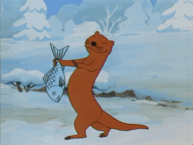

If you're building a blog with Gatsby, chances are you'll want to include some animated GIFs: who wouldn't want to include a dancing otter or cat GIF?

## Including GIFs in components

In Gatsby components and pages, you'll want to import animated GIFs instead of using Gatsby Image because of the way it optimizes image data for the responsive picture element.

Here's an example:

```jsx:title=pages/about.js
import React from 'react'

import Layout from '../components/layout'
import otterGIF from '../gifs/otter.gif'

const AboutPage = () => (
    return (
        <Layout>
            
        </Layout>
    )
)

export default AboutPage;
```

## Including GIFs in Markdown

In Markdown posts and pages, including an animated GIF is the same as a static image:

```markdown

```



Animated GIFs can be quite large in size, however, so be careful not to sabotage your webpages' performance with extremely large files. You could reduce file size by [optimizing the frames](https://skylilies.livejournal.com/244378.html) or converting them to video.

> Note: beware that flashing and autoplaying GIFs can cause accessibility problems. One technique would be to add controls, such as using a package like [react-gif-player](https://www.npmjs.com/package/react-gif-player).
