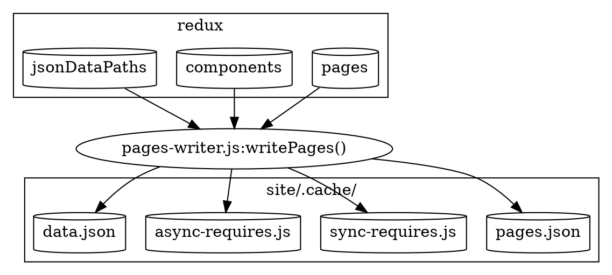

TODO: Make this part of a larger webpack section?

This is one of the last boostrap stages before we hand off to webpack to perform code optimization and code splitting. Webpack builds a web bundle. It has no knowledge of Gatsby's core code. Instead, it operates only on files in the `.cache` directory. It also doesn't have access to all the redux information that was built up during bootstrap. So instead, we create dynamic javascript and json files that are dependend on by the webpack application in the `.cache` directory (see [production-app.js](TODO)).



The dynamic files that are created are (all under the `.cache` directory)

- [pages.json](#pagesjson)
- [sync-requires.js](#syncrequiresjs)
- [async-requires.js](#asyncrequiresjs)
- [data.json](#datajson)

### pages.json

sThis is a collection of page objects, created from redux [pages](TODO) namespace. For each page it includes the 

- [componentChunkName](TODO)
- [jsonName](TODO)
- [path](TODO)
- [matchPath](TODO)

The pages are sorted such that those with `matchPath`s come before those without. This is so to assist [find-page.js](TODO) in selecting pages via regex before trying explicit paths.

TODO: Where is this used

e.g

```javascript
[
    {
        "componentChunkName": "component---src-templates-template-blog-list-js",
        "jsonName": "blog-c06",
        "path": "/blog"
    },
    // more pages
]
```

### sync-requires.js

This is a dynamically generated javascript file that exports `components`. It is an object created by iterating over all components in the [components](TODO) redux namespace. The keys of this object are the [componentChunkName](TODO) (e.g `component---src-templates-template-blog-post-js`), and the values are expressions that require the component. E.g `/home/site/src/templates/template-blog-post.js`. The file will look something like this:

```javascript
exports.components = {
  "component---src-templates-template-blog-post-js": require("/home/site/src/templates/template-blog-post.js"),
  // more components
}
```

TODO: Where used.not used.

### async-requires.js

`async-requires.js` is very similar to `sync-requires.js`, in that it is a dynamically generated javascript file. The difference is that it is written to be used for code splitting via webpack. So, instead of using `require` with the component's path, it instead uses `import` and adds a `webpackChunkName` hint so that we can eventually link the componentChunkName to its resulting file (more info in [webpack docs](TODO)). `components` is a function, so that it can be lazily called.

`async-requires.js` also exports a `data` function that imports `data.json` ([see below](TODO))

An example of async-requires is:

```javascript
exports.components = {
  "component---src-templates-template-blog-list-js": () => import("/home/site/src/templates/template-blog-list.js" /* webpackChunkName: "component---src-templates-template-blog-list-js" */),
  // more components
}

exports.data = () => import("/home/site/.cache/data.json")
```

TODO: Where used

### data.json

This is a generated json file. It contains the entire `pages.json` contents (as above), and the entire `jsonDataPaths` which was created at the end of the [Query Execution](TODO) stage. So, it looks like:

```javascript
{
  pages: [
    {
        "componentChunkName": "component---src-templates-template-blog-list-js",
        "jsonName": "blog-c06",
        "path": "/blog"
    },
    // more pages
 ],
 
 // jsonName -> dataPath
 dataPaths: {
   "blog-2017-05-31-introduction-to-gatsby-48e":"952/path---blog-2017-05-31-introduction-to-gatsby-48-e-160-meTS6Okzenz0aDEeI6epU4DPJuE",
   // more pages
 }
```

TODO: Where used

TODO: Replace terminology stuff
