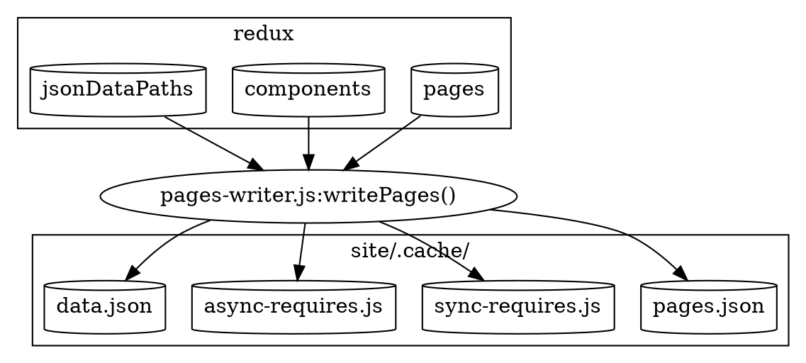

> This documentation isn't up to date with the latest version of Gatsby.
>
> Outdated areas are:
>
> - `data.json` should be replaced with `page-data.json`
> - remove mentions of `pages.json`
> - describe `match-paths.json`
>
> You can help by making a PR to [update this documentation](https://github.com/gatsbyjs/gatsby/issues/14228).

This is one of the last bootstrap stages before we hand off to webpack to perform code optimization and code splitting. webpack builds a web bundle. It has no knowledge of Gatsby's core code. Instead, it operates only on files in the `.cache` directory. It also doesn't have access to all the Redux information that was built up during bootstrap. So instead, we create dynamic JavaScript and JSON files that are dependent on by the webpack application in the `.cache` directory (see [Building the JavaScript App](/docs/production-app/)).

You can think of this step as taking all the data that was generated during bootstrap and saving it to disk for consumption by webpack.



Most of the code backing this section is in [pages-writer.js](https://github.com/gatsbyjs/gatsby/blob/master/packages/gatsby/src/internal-plugins/query-runner/pages-writer.js)

The dynamic files that are created are (all under the `.cache` directory).

- [pages.json](#pagesjson)
- [sync-requires.js](#sync-requiresjs)
- [async-requires.js](#async-requiresjs)
- [data.json](#datajson)

## pages.json

This is a collection of page objects, created from Redux `pages` namespace. For each page it includes the

- [componentChunkName](/docs/gatsby-internals-terminology/#componentchunkname)
- [jsonName](/docs/gatsby-internals-terminology/#jsonname)
- [path](/docs/gatsby-internals-terminology/#path)
- [matchPath](/docs/gatsby-internals-terminology/#matchpath)

The pages are sorted such that those with `matchPath`s come before those without. This is to assist [find-page.js](https://github.com/gatsbyjs/gatsby/blob/master/packages/gatsby/cache-dir/find-page.js) in selecting pages via regex before trying explicit paths. See [matchPaths](/docs/gatsby-internals-terminology/#matchpath) for more info.

e.g

```javascript
;[
  {
    componentChunkName: "component---src-blog-2-js",
    jsonName: "blog-c06",
    path: "/blog",
  },
  // more pages
]
```

`pages.json` is generated for `gatsby develop` purposes only. In `npm run build`, we use [data.json](/docs/write-pages/#datajson) (below) which includes the pages info plus more.

## sync-requires.js

This is a dynamically generated JavaScript file that exports `components`. It is an object created by iterating over the `components` Redux namespace. The keys are the [componentChunkName](/docs/gatsby-internals-terminology/#componentchunkname) (e.g. `component---src-blog-2-js`), and the values are expressions that require the component. E.g. `/home/site/src/blog/2.js`. The file will look something like this:

```javascript
exports.components = {
  "component---src--blog-2-js": require("/home/site/src/blog/2.js"),
  // more components
}
```

It is used during [static-entry.js](https://github.com/gatsbyjs/gatsby/blob/master/packages/gatsby/cache-dir/static-entry.js) so that it can map componentChunkNames to their component implementations. Whereas the [production-app.js](https://github.com/gatsbyjs/gatsby/blob/master/packages/gatsby/cache-dir/production-app.js) must use `async-requires.js` (below) since it performs [code splitting](/docs/how-code-splitting-works/).

## async-requires.js

---

`async-requires.js` is very similar to `sync-requires.js`, in that it is a dynamically generated JavaScript file. The difference is that it is written to be used for code splitting via webpack. So, instead of using `require` with the component's path, it uses `import` and adds a `webpackChunkName` hint so that we can eventually link the componentChunkName to its resulting file (more info in [Code Splitting](/docs/how-code-splitting-works/) docs). `components` is a function, so that it can be lazily initialized.

`async-requires.js` also exports a `data` function that imports `data.json` ([see below](/docs/write-pages/#datajson))

An example of async-requires is:

```javascript
exports.components = {
  "component---src-blog-2-js": () =>
    import(
      "/home/site/src/blog/2.js" /* webpackChunkName: "component---src-blog-2-js" */
    ),
  // more components
}

exports.data = () => import("/home/site/.cache/data.json")
```

Remember, `sync-requires.js` is used during [Page HTML Generation](/docs/html-generation/). And `async-requires.js` is used by [Building the JavaScript App](/docs/production-app/).

## data.json

This is a generated JSON file. It contains the entire `pages.json` contents ([as above](/docs/write-pages/#pagesjson)), and the entire Redux `jsonDataPaths` which was created at the end of the [Query Execution](/docs/query-execution/#save-query-results-to-redux-and-disk) stage. So, it looks like:

```javascript
{
  pages: [
    {
        "componentChunkName": "component---src-blog-2-js",
        "jsonName": "blog-2-c06",
        "path": "/blog/2"
    },
    // more pages
 ],

 // jsonName -> dataPath
 dataPaths: {
   "blog-2-c06":"952/path---blog-2-c06-meTS6Okzenz0aDEeI6epU4DPJuE",
   // more pages
 }
```

`data.json` is used in two places. First, it's lazily imported by `async-requires.js` (above), which in turn is used by `production-app` to [load JSON results](/docs/production-app/#load-page-resources) for a page.

It is also used by [Page HTML Generation](/docs/html-generation/) in two ways:

1. `static-entry.js` produces a `page-renderer.js` webpack bundle that generates the HTML for a path. It requires `data.json` and uses the `pages` to look up the page for the page.
2. To get the `jsonName` from the page object, and uses it to construct a resource path for the actual JSON result by looking it up in `data.json.dataPaths[jsonName]`.

Now that Gatsby has written out page data, it can start on the [webpack section](/docs/webpack-and-ssr/).
