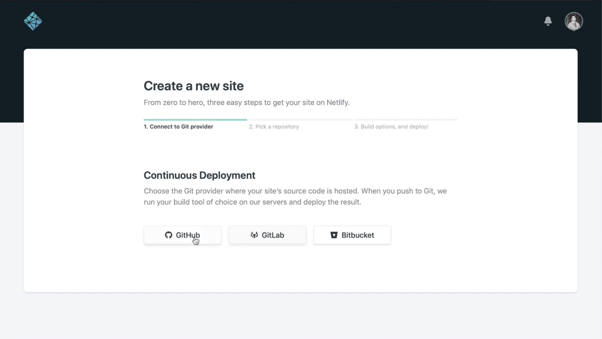
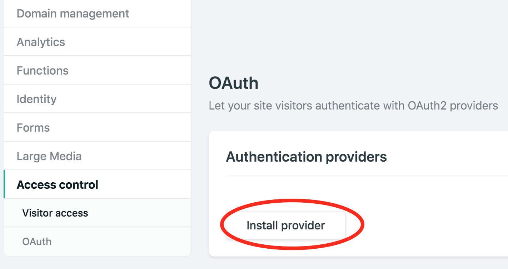

This tutorial will use [gatsby-personal-starter-blog](https://github.com/thomaswang/gatsby-personal-starter-blog), a Gatsby starter based on the official [gatsby-starter-blog](/starters/gatsbyjs/gatsby-starter-blog/). The differences are that `gatsby-personal-starter-blog` is configured to run the blog on a subdirectory, `/blog`, and comes pre-installed with [Netlify CMS](https://www.netlifycms.org/) for content editing. It also adds VS Code highlighting for code blocks.

## Prerequisites

- A GitHub account
- The [Gatsby CLI](/docs/reference/gatsby-cli/) installed

## Set up a Netlify CMS-managed Gatsby site in 5 steps:

### Step 1

Open your Terminal and run the following command from the Gatsby CLI to create a new Gatsby site using [gatsby-personal-starter-blog](https://github.com/thomaswang/gatsby-personal-starter-blog).

```shell
gatsby new [your-project-name] https://github.com/thomaswangio/gatsby-personal-starter-blog
```

### Step 2

Once the Gatsby site is finished installing all the packages and dependencies, you can now go into the directory and run the site locally.

```shell
cd [your-project-name]
gatsby develop
```

Now you can go to `http://localhost:8000` to see your new site, but what's extra cool is that Netlify CMS is pre-installed and you can access it at `http://localhost:8000/admin`

A CMS, or content management system, is useful because you can add content like blog posts from a dashboard on your site, instead of having to add posts manually with Markdown. However, you'll likely want to be able to access the CMS from a deployed website, not just locally. For that, you'll need to deploy to Netlify through GitHub, set up continuous deployment, and do a few configurations. You'll go over this in [Step-5](#step-5).

### Step 3

Open the project in your code editor and open `static/admin/config.yml`. Replace `your-username/your-repo-name` with your GitHub username and project name. This step is important for managing and deploying the Netlify CMS interface.

```diff
backend:
-  name: test-repo

+  name: github
+  repo: your-username/your-repo-name
```

#### Customizing your site

Head into `gatsby-config.js` and you can edit your siteMetadata, add a Google Analytics tracking ID, and your app icon/favicon. Test out the edits for the deployed build by quitting the development server and running `gatsby build && gatsby serve`.

You'll likely also want to edit the `README.md` and `package.json` files to include your own project details.

### Step 4

Open [github.com](https://github.com) and create a new repository, with the same name as your project. Push your new Gatsby site's code to GitHub using the following Terminal commands:

```shell
git init
git add .
git commit -m "initial commit"
git remote add origin https://github.com/[your-username]/[your-repo-name].git
git push -u origin master
```

Then, open [app.netlify.com](https://app.netlify.com) and add a "New site from Git". Choose your newly created repo and click on "Deploy site" with the default deployment settings.

> _Note: if you don't see the correct repo listed, you may need to install or reconfigure the Netlify app on GitHub._



### Step 5

To make sure that Netlify CMS has access to your GitHub repo, you need to set up an OAuth application on GitHub. The instructions for that are here: [Netlify's Using an Authorization Provider](https://www.netlify.com/docs/authentication-providers/#using-an-authentication-provider).

For the "Homepage URL" – you can use your Netlify subdomain, `[name-of-your-site].netlify.com`, or you can use a custom domain. To customize the subdomain, look for the "Edit site name" field under "Domain Management" for your project on the [Netlify app](https://app.netlify.com). To connect your Netlify site to your custom domain instead, see [Netlify’s instructions on custom domains](https://www.netlify.com/docs/custom-domains/).

Once you've configured an authentication provider then you'll be able to use Netlify CMS at your deployed site to add new posts.


Copy the credentials of your new app listed on [GitHub OAuth Apps](https://github.com/settings/developers) and install a new auth provider on Netlify using them.



#### Benefits of Netlify CMS, GitHub, and Netlify Workflow

Congrats! Now that Netlify CMS is successfully configured to your project, every time you add a new post, the content will be stored in your repository and versioned on GitHub because Netlify CMS is Git-based. Also, thanks to [Netlify's Continuous Deployment](https://www.netlify.com/docs/continuous-deployment/), a new version will be deployed every time you add or edit a post.

You can learn more about Netlify CMS and how to configure it further in the [Netlify CMS documentation](https://www.netlifycms.org/docs/intro/).
