In this tutorial, you'll learn how to build a theme plugin for Gatsby. This tutorial is meant as a written companion to the [Gatsby Theme Authoring Egghead course](https://egghead.io/courses/gatsby-theme-authoring). **Note:** The video instructions are slightly outdated at times, thus the written instructions here are the source of truth.

## Set up yarn workspaces

In this section, you'll learn how to structure folders and configure yarn workspaces to develop Gatsby themes. You'll create two workspaces, `gatsby-theme-events` and `site`.

In this example, `gatsby-theme-events` will be a dependency of `site` so you'll run `site` to see everything working.

### Create a new empty folder

Title your folder anything you wish. This example will use `authoring-themes-tutorial`.

### Add a `package.json`

Create a `package.json` file in the new directory, with the following contents:

```json:title=package.json
{
  "private": true,
  "workspaces": ["gatsby-theme-events", "site"]
}
```

### Set up `gatsby-theme-events` and `site`

In the `authoring-themes-tutorial` folder, create two new folders, `gatsby-theme-events`, and `site`.

Create a `package.json` file in each of the new folders. Your file tree will look like this:

```text
.
├── gatsby-theme-events
│   └── package.json
├── site
│   └── package.json
└── package.json
```

In the `package.json` file in `gatsby-theme-events`, add the following:

```json:title=gatsby-theme-events/package.json
{
  "name": "gatsby-theme-events",
  "version": "1.0.0",
  "main": "index.js",
  "license": "MIT"
}
```

- The `"name"` corresponds to the yarn workspace you defined earlier, in the root-level `package.json` folder.
- Because you'll install `gatsby-theme-events` as a package, you have to specify a `"main"` entry point.
  - This file won't do anything, but it does need to resolve, so create a new file in `gatsby-theme-events` called `index.js`.

```javascript:title=gatsby-theme-events/index.js
// boop
```

This file is intentionally empty — because the `main` field is pointing to `index.js`, this file needs to exist for Node to properly resolve the package. To avoid confusion, add a small comment to indicate that the file doesn't do anything; it just needs to exist and was left blank on purpose.

In the `package.json` file in `site`, add the following:

```json:title=site/package.json
{
  "private": true,
  "name": "site",
  "version": "1.0.0",
  "license": "MIT",
  "scripts": {
    "build": "gatsby build",
    "develop": "gatsby develop",
    "clean": "gatsby clean"
  }
}
```

- `"private"` is set to true, because you won't be publishing the site to npm.
- The `"name"` again corresponds to the yarn workspace you defined earlier, in the root-level `package.json` folder.

### Add dependencies to `site`

Now add `gatsby`, `react`, `react-dom`, and `gatsby-theme-events` as dependencies in `site`:

```shell
yarn workspace site add gatsby react react-dom gatsby-theme-events@*
```

> 🚨 If you use [zsh](https://en.wikipedia.org/wiki/Z_shell), the `*` needs to be quoted, e.g. `gatsby-theme-events@"*"` or `"gatsby-theme-events@*"`.

- When you run `yarn workspace site`, it's as if you were running that command while in the `/site` directory. The dependencies will be added to `site`, even though you're not in the `site` directory.
- You're installing `gatsby-theme-events@*`, because you need the workspace to reference the unpublished `gatsby-theme-events` theme.

> 💡 For more details on using yarn workspaces, you might be interested to check out Gatsby's [blog post on setting up yarn workspaces](/blog/2019-05-22-setting-up-yarn-workspaces-for-theme-development/).

You should now see the following dependencies in your `site/package.json`:

```json:title=site/package.json
{
  "dependencies": {
    "gatsby": "^4.15.1",
    "gatsby-theme-events": "*",
    "react": "^18.1.0",
    "react-dom": "^18.1.0"
  }
}
```

If you run `yarn workspaces info`, you'll be able to verify that the site is using the `gatsby-theme-events` from the workspace.

```json
{
  "gatsby-theme-events": {
    "location": "gatsby-theme-events",
    "workspaceDependencies": [],
    "mismatchedWorkspaceDependencies": []
  },
  "site": {
    "location": "site",
    // highlight-start
    "workspaceDependencies": ["gatsby-theme-events"],
    // highlight-end
    "mismatchedWorkspaceDependencies": []
  }
}
```

### Add peer dependencies to `gatsby-theme-events`

Targeting the `gatsby-theme-events` workspace, install `gatsby`, `react`, and `react-dom` as peer dependencies:

```shell
yarn workspace gatsby-theme-events add -P gatsby react react-dom
```

> 💡 The `-P` flag is shorthand for installing peer dependencies.

The `gatsby-theme-events/package.json` file should now include the following:

```json:title=gatsby-theme-events/package.json
{
  "peerDependencies": {
    "gatsby": "^4.15.1",
    "react": "^18.1.0",
    "react-dom": "^18.1.0"
  }
}
```

### Set up `site/gatsby-config.js`

Create a `gatsby-config.js` file inside `site`:

```javascript:title=site/gatsby-config.js
module.exports = {
  plugins: [
    {
      resolve: "gatsby-theme-events",
      options: {},
    },
  ],
}
```

### Run `site`

Run `site` to verify that it's working.

```shell
yarn workspace site develop
```

You should see a Gatsby site successfully running in development mode. Since there's no content, visiting the site should serve a default Gatsby 404 page.

## Add static data to a theme

In this example, you'll source data from a YAML file into the `gatsby-theme-events` theme.

In the `gatsby-theme-events` directory, create a new `data` directory. Inside that, create a new file, `events.yml`.

Add some sample data:

```yaml:title=gatsby-theme-events/data/events.yml
- name: React Rally
  location: Salt Lake City, UT
  start_date: 2019-08-22
  end_date: 2019-08-23
  url: https://www.reactrally.com/

- name: DinosaurJS
  location: Denver, CO
  start_date: 2019-06-20
  end_date: 2019-06-21
  url: https://dinosaurjs.org/

- name: JSHeroes
  location: Cluj-Napoca, Romania
  start_date: 2020-04-23
  end_date: 2020-04-24
  url: https://jsheroes.io/

- name: The Lead Developer
  location: Austin, TX
  start_date: 2019-11-08
  end_date: 2019-11-08
  url: https://austin2019.theleaddeveloper.com/
```

To read this YAML data, you'll need to install a few more dependencies:

```shell
yarn workspace gatsby-theme-events add gatsby-source-filesystem gatsby-transformer-yaml
```

> 💡 `gatsby-source-filesystem` will let you load the `events.yml` file. `gatsby-transformer-yaml` will let you parse it as YAML data.

Create a `gatsby-config.js` file in the `gatsby-theme-events` directory:

```javascript:title=gatsby-theme-events/gatsby-config.js
module.exports = {
  plugins: [
    {
      resolve: "gatsby-source-filesystem",
      options: {
        path: `${__dirname}/data/`,
      },
    },
    {
      resolve: "gatsby-transformer-yaml",
      options: {
        typeName: "Event",
      },
    },
  ],
}
```

With this saved, restart the development server:

```shell
yarn workspace site develop
```

Open up the GraphiQL explorer for the site, and make a test query on `allEvent`:

```graphql
query MyQuery {
  allEvent {
    edges {
      node {
        name
      }
    }
  }
}
```

When you execute the query, you should see the GraphQL server successfully return four event names:

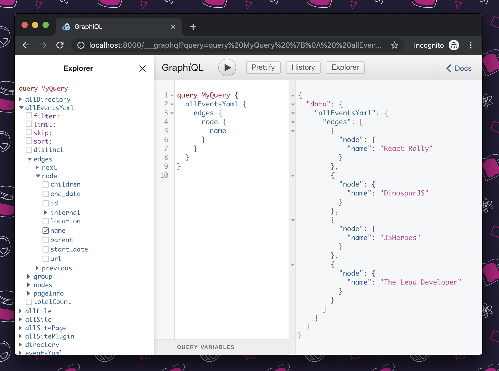

## Create a data directory using the `onPreBootstrap` lifecycle

Create a `gatsby-node.js` file in `gatsby-theme-events`.

If you fire up your theme, and the "data" directory doesn't exist, `gatsby-source-filesystem` will throw an error. To guard against this, you'll use the `onPreBootstrap` API hook to check if the data directory exists, and, if not, create it:

```javascript:title=gatsby-theme-events/gatsby-node.js
const fs = require("fs")

// Make sure the data directory exists
exports.onPreBootstrap = ({ reporter }) => {
  const contentPath = `${__dirname}/data/`

  if (!fs.existsSync(contentPath)) {
    reporter.info(`creating the ${contentPath} directory`)
    fs.mkdirSync(contentPath)
  }
}
```

## Set up to create data-driven pages

To actually create pages, you'll need to:

- Define the `Event` type
- Define resolvers for custom fields on the `Event` type
- Query for events

### Define the "Event" type

```javascript:title=gatsby-theme-events/gatsby-node.js
const fs = require("fs")

// Make sure the data directory exists
exports.onPreBootstrap = ({ reporter }) => {
  const contentPath = `${__dirname}/data/`

  if (!fs.existsSync(contentPath)) {
    reporter.info(`creating the ${contentPath} directory`)
    fs.mkdirSync(contentPath)
  }
}

// highlight-start
// Define the "Event" type
exports.createSchemaCustomization = ({ actions }) => {
  actions.createTypes(`
    type Event implements Node @dontInfer {
      id: ID!
      name: String!
      location: String!
      startDate: Date! @dateformat @proxy(from: "start_date")
      endDate: Date! @dateformat @proxy(from: "end_date")
      url: String!
      slug: String!
    }
  `)
}
// highlight-end
```

1. You'll use the `createTypes` to create the new `Event` type
2. The `Event` type will implement the typical Gatsby `Node` interface.
3. You'll use `@dontInfer`, because rather than Gatsby inferring fields, you'll be defining them explicitly.
4. In addition to an `id` field, you'll create new fields for each data point associated with an event (name, location, startDate, endDate, url). _To read more detail about creating types, check out the [`createTypes` documentation](/docs/reference/config-files/actions/#createTypes)_.
5. You'll also create a `slug` field. You'll notice your event data doesn't include "slug" data. You'll define this in the next step.

### Define resolvers for any custom fields (slug)

Gatsby provides a `createResolvers` API hook. That gives you a function called `createResolvers`. Inside this function, you will set up a base path.

```javascript:title=gatsby-theme-events/gatsby-node.js
const fs = require("fs")

// Make sure the data directory exists
exports.onPreBootstrap = ({ reporter }) => {
  const contentPath = `${__dirname}/data/`

  if (!fs.existsSync(contentPath)) {
    reporter.info(`creating the ${contentPath} directory`)
    fs.mkdirSync(contentPath)
  }
}

// Define the "Event" type
exports.createSchemaCustomization = ({ actions }) => {
  actions.createTypes(`
    type Event implements Node @dontInfer {
      id: ID!
      name: String!
      location: String!
      startDate: Date! @dateformat @proxy(from: "start_date")
      endDate: Date! @dateformat @proxy(from: "end_date")
      url: String!
      slug: String!
    }
  `)
}

// highlight-start
// Define resolvers for custom fields
exports.createResolvers = ({ createResolvers }) => {
  const basePath = "/"

  // Quick-and-dirty helper to convert strings into URL-friendly slugs.
  const slugify = str => {
    const slug = str
      .toLowerCase()
      .replace(/[^a-z0-9]+/g, "-")
      .replace(/(^-|-$)+/g, "")

    return `/${basePath}/${slug}`.replace(/\/\/+/g, "/")
  }

  createResolvers({
    Event: {
      slug: {
        resolve: source => slugify(source.name),
      },
    },
  })
}
// highlight-end
```

Here's a deeper look at what's happening in this `createResolvers` API hook.

You'll default the `basePath` to the root path (`"/"`):

```javascript:title=gatsby-theme-events/gatsby-node.js
exports.createResolvers = ({ createResolvers }) => {
  // highlight-next-line
  const basePath = "/"

  // Quick-and-dirty helper to convert strings into URL-friendly slugs.
  const slugify = str => {
    const slug = str
      .toLowerCase()
      .replace(/[^a-z0-9]+/g, "-")
      .replace(/(^-|-\$)+/g, "")

    return `/${basePath}/${slug}`.replace(/\/\/+/g, "/")
  }

  createResolvers({
    Event: {
      slug: {
        resolve: source => slugify(source.name),
      },
    },
  })
}
```

You'll define a helper, `slugify` to help generate the slugs:

```javascript:title=gatsby-theme-events/gatsby-node.js
exports.createResolvers = ({ createResolvers }) => {
  const basePath = "/"

  // highlight-start
  // Quick-and-dirty helper to convert strings into URL-friendly slugs.
  const slugify = str => {
    const slug = str
      .toLowerCase()
      .replace(/[^a-z0-9]+/g, "-")
      .replace(/(^-|-\$)+/g, "")

    return `/${basePath}/${slug}`.replace(/\/\/+/g, "/")
  }
  // highlight-end

  createResolvers({
    Event: {
      slug: {
        resolve: source => slugify(source.name),
      },
    },
  })
}
```

Then you'll define a resolver for the `slug` field, on the `Event` type:

```javascript:title=gatsby-theme-events/gatsby-node.js
exports.createResolvers = ({ createResolvers }) => {
  const basePath = "/"

  // Quick-and-dirty helper to convert strings into URL-friendly slugs.
  const slugify = str => {
    const slug = str
      .toLowerCase()
      .replace(/[^a-z0-9]+/g, "-")
      .replace(/(^-|-\$)+/g, "")

    return `/${basePath}/${slug}`.replace(/\/\/+/g, "/")
  }

  // highlight-start
  createResolvers({
    Event: {
      slug: {
        resolve: source => slugify(source.name),
      },
    },
  })
  // highlight-end
}
```

> 💡 The resolver function receives the `source`, which in this case is the `Event` node.

Test that this is working by running `site` again:

```shell
yarn workspace site develop
```

If you query this time for `allEvent`, you'll see the `Event` data, including the new slugs:

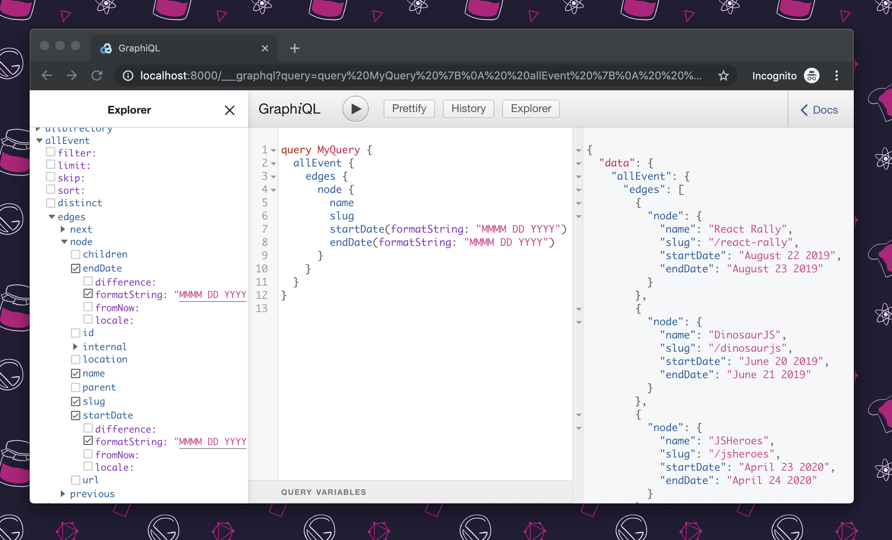

## Create data-driven pages using GraphQL and `createPages`

The last step in `gatsby-node.js` is to create pages for both the event previews and individual event pages. To do that, you'll use the `createPages` API hook.

> 💡 Note that the previous contents of `gatsby-node.js` should be left intact; they are omitted from the code snippets in this section for brevity.

### Set up the call to create the root page

```javascript:title=gatsby-theme-events/gatsby-node.js
// query for events and create pages
// highlight-start
exports.createPages = async ({ actions, graphql, reporter }) => {
  const basePath = "/"
  actions.createPage({
    path: basePath,
    component: require.resolve("./src/templates/events.js"),
  })
}
// highlight-end
```

- You'll default the `basePath` to the root path (`"/"`)
- Then you'll set up the call to the `createPage` action to create a page at the base path.
  - _Note that the component listed doesn't exist yet -- you'll create that shortly._

### Query for events

```javascript:title=gatsby-theme-events/gatsby-node.js
// query for events and create pages
exports.createPages = async ({ actions, graphql, reporter }) => {
  const basePath = "/"
  actions.createPage({
    path: basePath,
    component: require.resolve("./src/templates/events.js"),
  })

  // highlight-start
  const result = await graphql(`
    query {
      allEvent(sort: { startDate: ASC }) {
        nodes {
          id
          slug
        }
      }
    }
  `)

  if (result.errors) {
    reporter.panic("error loading events", result.errors)
    return
  }
  // highlight-end
}
```

- You'll retrieve all events, sorted by start date, in ascending order.
- You'll handle the error, in case the GraphQL query failed.

### Create a page for each event

```javascript:title=gatsby-theme-events/gatsby-node.js
// query for events and create pages
exports.createPages = async ({ actions, graphql, reporter }) => {
  const basePath = "/"
  actions.createPage({
    path: basePath,
    component: require.resolve("./src/templates/events.js"),
  })

  const result = await graphql(`
    query {
      allEvent(sort: { startDate: ASC }) {
        nodes {
          id
          slug
        }
      }
    }
  `)

  if (result.errors) {
    reporter.panic("error loading events", result.errors)
    return
  }

  // highlight-start
  const events = result.data.allEvent.nodes

  events.forEach(event => {
    const slug = event.slug

    actions.createPage({
      path: slug,
      component: require.resolve("./src/templates/event.js"),
      context: {
        eventID: event.id,
      },
    })
  })
  // highlight-end
}
```

- You'll grab the event nodes queried from GraphQL.
- You'll loop over all the events that were returned, and use `createPage` to create a page for each event.
  - _Note the "wishful programming" again -- `"./src/templates/event.js"` doesn't exist yet._

### Create the "events" and "event" template components

The last step to make sure that these pages build is to create the page template components.

Create new files for the event template, and the events template:

#### Events template

```jsx:title=gatsby-theme-events/src/templates/events.js
import React from "react"

const EventsTemplate = () => <p>TODO: Build the events page template</p>

export default EventsTemplate
```

#### Event template

```jsx:title=gatsby-theme-events/src/templates/event.js
import React from "react"

const EventTemplate = () => <p>TODO: Build the event page template</p>

export default EventTemplate
```

### Test that pages are building

To test that the root path (`"/"`) and individual event pages are building successfully, run `site` in develop mode again:

```shell
yarn workspace site develop
```

You should see the placeholder `events.js` component at `http://localhost:8000/`.

If you hit `http://localhost:8000/404` (for example -- or any route that doesn't exist) you should see a listing of event pages, all building with the placeholder `event.js` component.

## Display sorted data with `useStaticQuery`

To show event data, you'll import `graphql` and `useStaticQuery` from Gatsby in the `events.js` component.

```jsx:title=gatsby-theme-events/src/templates/events.js
import React from "react"
// highlight-next-line
import { graphql, useStaticQuery } from "gatsby"

const EventsTemplate = () => <p>TODO: Build the events page template</p>

export default EventsTemplate
```

Refactor the `EventsTemplate` component to include a static query for events data:

```jsx:title=gatsby-theme-events/src/templates/events.js
import React from "react"
import { graphql, useStaticQuery } from "gatsby"

// highlight-start
const EventsTemplate = () => {
  const data = useStaticQuery(graphql`
    query {
      allEvent(sort: { startDate: ASC }) {
        nodes {
          id
          name
          startDate
          endDate
          location
          url
          slug
        }
      }
    }
  `)

  const events = data.allEvent.nodes

  return <p>TODO: Build the events page template</p>
}
// highlight-end

export default EventsTemplate
```

### Create the UI to display event data

Start creating the UI to display the event data.

#### Create a general layout component

Create a new file at `gatsby-theme-events/src/components/layout.js`:

```jsx:title=gatsby-theme-events/src/components/layout.js
import React from "react"

const Layout = ({ children }) => (
  <div>
    <h1>Gatsby Events Theme</h1>
    {children}
  </div>
)

export default Layout
```

#### Create an events list component

Create a new file at `gatsby-theme-events/src/components/event-list.js`:

```jsx:title=gatsby-theme-events/src/components/event-list.js
import React from "react"

const EventList = ({ events }) => <pre>{JSON.stringify(events, null, 2)}</pre>

export default EventList
```

For now, this component will display a stringified object from the JSON data you send it on the `events` prop.

### Add the layout and events list components to the events page

By updating the `events.js` template with the following code, you will:

- Import the two new components.
- Refactor the `render` method to use the new components, and give the `<EventList>` component the events data.

```jsx:title=gatsby-theme-events/src/templates/events.js
import React from "react"
import { graphql, useStaticQuery } from "gatsby"
// highlight-start
import Layout from "../components/layout"
import EventList from "../components/event-list"
// highlight-end

const EventsTemplate = () => {
  const data = useStaticQuery(graphql`
    query {
      allEvent(sort: { startDate: ASC }) {
        nodes {
          id
          name
          startDate
          endDate
          location
          url
          slug
        }
      }
    }
  `)

  const events = data.allEvent.nodes

  // highlight-start
  return (
    <Layout>
      <EventList events={events} />
    </Layout>
  )
  // highlight-end
}

export default EventsTemplate
```

To test that it's working, open up `http://localhost:8000/` again. You should see the "Gatsby Events Theme" header from `<Layout>` component, and the stringified event data from the `<EventList>` component.

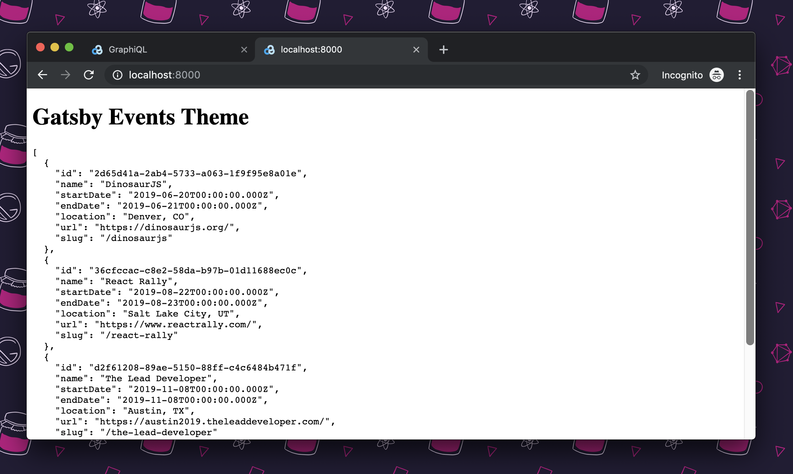

### Update the event list component

Update the event list component to use the `event` data in markup, rather than displaying the raw data:

```jsx:title=gatsby-theme-events/src/components/event-list.js
import React from "react"
// highlight-start
import { Link } from "gatsby"

const EventList = ({ events }) => (
  <>
    <h2>Upcoming Events</h2>
    <ul>
      {events.map(event => (
        <li key={event.id}>
          <strong>
            <Link to={event.slug}>{event.name}</Link>
          </strong>
          <br />
          {new Date(event.startDate).toLocaleDateString("en-US", {
            month: "long",
            day: "numeric",
            year: "numeric",
          })}{" "}
          in {event.location}
        </li>
      ))}
    </ul>
  </>
)
// highlight-end

export default EventList
```

- You've created a header for "Upcoming Events"
- You've mapped over all of the "event" records, displaying:
  - The event name (which links to the event page)
  - The date of the event
  - The location of the event

Checking `http://localhost:8000/` again, you should see the new markup:

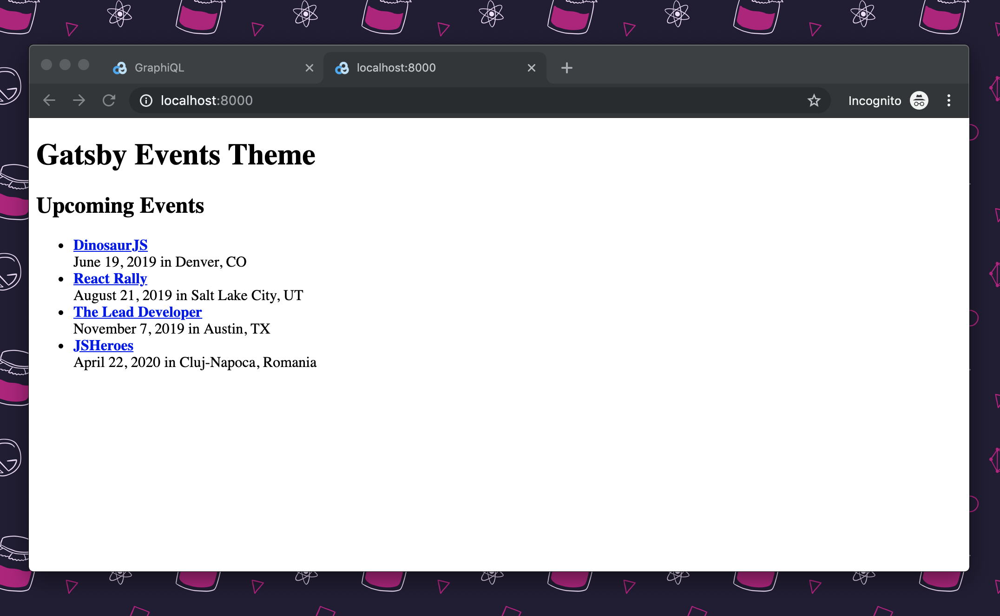

## Display and query data by id with context and static queries

Similar to `EventList`, you'll need to create a React component template for an individual `Event` page.

### Add a page query

First, you'll create a page query to query for individual events by `id`.

```jsx:title=gatsby-theme-events/src/templates/event.js
import React from "react"
// highlight-start
import { graphql } from "gatsby"

export const query = graphql`
  query($eventID: String!) {
    event(id: { eq: $eventID }) {
      name
      url
      startDate(formatString: "MMMM DD YYYY")
      endDate(formatString: "MMMM DD YYYY")
      location
      slug
    }
  }
`
// highlight-end

const EventTemplate = () => <p>TODO: Build the event page template</p>

export default EventTemplate
```

### Modify the event template to access event data

```jsx:title=gatsby-theme-events/src/templates/event.js
import React from "react"
import { graphql } from "gatsby"
// highlight-start
import Layout from "../components/layout"
import Event from "../components/event"
// highlight-end

export const query = graphql`
  query($eventID: String!) {
    event(id: { eq: $eventID }) {
      name
      url
      startDate(formatString: "MMMM DD YYYY")
      endDate(formatString: "MMMM DD YYYY")
      location
      slug
    }
  }
`
// highlight-start
const EventTemplate = ({ data: { event } }) => (
  <Layout>
    <Event {...event} />
  </Layout>
)
// highlight-end

export default EventTemplate
```

There's some wishful programming here again -- the `<Event>` component doesn't exist yet. Create that component in `gatsby-theme-events/src/components/event.js`:

```jsx:title=gatsby-theme-events/src/components/event.js
import React from "react"

const Event = props => <pre>{JSON.stringify(props, null, 2)}</pre>

export default Event
```

To start off, as before, run `JSON.stringify` on the props data getting passed to the component to make sure you're getting the data you expect:

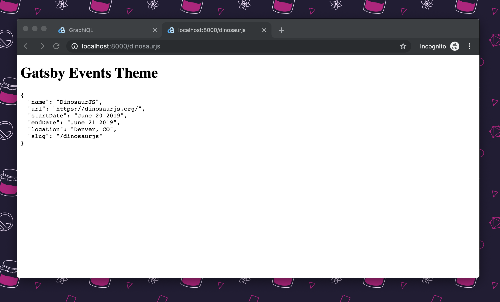

Data is logging on the individual event pages. As before, now update the component to use markup, rather than displaying the raw data:

```jsx:title=gatsby-theme-events/src/components/event.js
import React from "react"

// highlight-start
const Event = ({ name, location, url, startDate, endDate }) => (
  <div>
    <h2>
      {name} ({location})
    </h2>
    <p>
      {startDate}-{endDate}
    </p>
    <p>
      Website: <a href={url}>{url}</a>
    </p>
  </div>
)
// highlight-end

export default Event
```

Now, the individual event page reflects the updated markup:

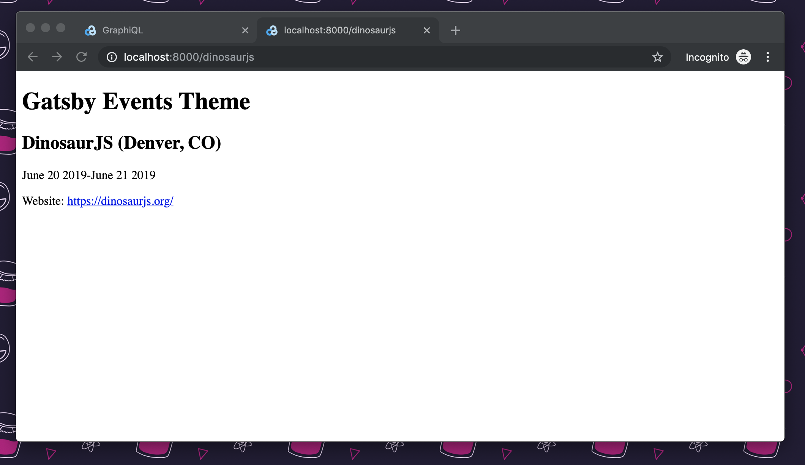

## Style and format dates in React

Now you'll refactor this component with some business logic to display the event dates in a way that's more human-readable.

- If the event is one-day: June 30 2019
- If the event is multi-day: July 4-6, 2019
- If the event spans different months: July 30 - August 2 2019

```jsx:title=gatsby-theme-events/src/components/event.js
import React from "react"

// highlight-start
const getDate = (date, { day = true, month = true, year = true } = {}) =>
  date.toLocaleDateString("en-US", {
    day: day ? "numeric" : undefined,
    month: month ? "long" : undefined,
    year: year ? "numeric" : undefined,
  })

const EventDate = ({ startDate, endDate }) => {
  const start = new Date(startDate)
  const end = new Date(endDate)
  const isOneDay = start.toDateString() === end.toDateString()

  return (
    <>
      <time dateTime={start.toISOString()}>
        {getDate(start, { year: isOneDay })}
      </time>
      {!isOneDay && (
        <>
          –
          <time dateTime={end.toISOString()}>
            {getDate(end, { month: start.getMonth() !== end.getMonth() })}
          </time>
        </>
      )}
    </>
  )
}
// highlight-end

const Event = ({ name, location, url, startDate, endDate }) => (
  <div>
    <h2>
      {name} ({location})
    </h2>
    <p>
      // highlight-start
      <EventDate startDate={startDate} endDate={endDate} />
      // highlight-end
    </p>
    <p>
      Website: <a href={url}>{url}</a>
    </p>
  </div>
)

export default Event
```

> 💡 This tutorial won't go into detail on the date refactor as written.
> For more detail, refer to the [Egghead lesson and transcript](https://egghead.io/lessons/react-style-and-format-dates-in-react).

## Configure a theme to take options

In a Gatsby theme, you can pass options both to `gatsby-config.js`, and to `gatsby-node.js`.

Update the `gatsby-theme-events/gatsby-config.js` to accept options:

```javascript:title=gatsby-theme-events/gatsby-config.js
// highlight-next-line
module.exports = ({ contentPath = `${__dirname}/data/`, basePath = "/" }) => ({
  plugins: [
    {
      resolve: "gatsby-source-filesystem",
      options: {
        // highlight-next-line
        path: contentPath,
      },
    },
    {
      resolve: "gatsby-transformer-yaml",
      options: {
        typeName: "Event",
      },
    },
  ],
})
```

The `contentPath` will default to `${__dirname}/data/`, and the `basePath` will default to the root, "/".

In `gatsby-node.js`, the options that were added to the `gatsby-config.js` function are provided as a second argument to Gatsby's API hooks.

Update the `contentPath` to use the option set in `gatsby-config.js`:

```javascript:title=gatsby-theme-events/gatsby-node.js
// highlight-start
exports.onPreBootstrap = ({ reporter }, options) => {
  const contentPath = options.contentPath || `${__dirname}/data/`
  // highlight-end

  // {...}
}

exports.createSchemaCustomization = ({ actions }) => {
  // {...}
}

// highlight-start
exports.createResolvers = ({ createResolvers }, options) => {
  const basePath = options.basePath || "/"
  // highlight-end

  // {...}
}

// highlight-start
exports.createPages = async ({ actions, graphql, reporter }, options) => {
  const basePath = options.basePath || "/"
  // highlight-end

  // {...}
}
```

Note that the example above sets default values for `options`. This behavior was also included in the prior `gatsby-config.js` example. You only need to set default values once, but both mechanisms for doing so are valid.

> 💡 The function export in `gatsby-config.js` is only supported for themes. Gatsby sites still require the object export in `gatsby-config.js`.

Test out this new options-setting by making some adjustments to `site`.

### Update `site/gatsby-config.js`

Update the `gatsby-config.js` file inside `site`:

```javascript:title=site/gatsby-config.js
module.exports = {
  plugins: [
    {
      resolve: "gatsby-theme-events",
      options: {
        contentPath: "events",
        basePath: "/events",
      },
    },
  ],
}
```

- `contentPath` is set to "events". So, rather than looking in the default "data" directory for content, the site will be looking for content in an "events" directory.
- `basePath` is set to "events". So, rather than creating the events listing at the root (`"/"`), you should see an events listing page at `/events`.

To test this, run the site:

```shell
yarn workspace site develop
```

Once this is running, you'll observe two things:

1. An "events" directory has automatically been generated for you in `site/events`.
2. If you hit `http://localhost:8000/404` (or any other route that doesn't exist), you'll see that the site has created an `/events` page.

However, you don't have any event data in the site. Copy the `events.yml` file from `gatsby-theme-events/data` into `site/events`. Then, restart the dev server:


The events listing page will now be accessible at `http://localhost:8000/events`. Hitting `http://localhost:8000/` will return a 404.

## Make themes extendable with gatsby-plugin-theme-ui

You can make your theme styles extendable using the `gatsby-plugin-theme-ui` package.

Install dependencies:

```shell
yarn workspace gatsby-theme-events add gatsby-plugin-theme-ui theme-ui @theme-ui/mdx @emotion/react
```

Then, add the `gatsby-plugin-theme-ui` plugin to the `gatsby-theme-events/gatsby-config.js` file:

```javascript:title=gatsby-theme-events/gatsby-config.js
module.exports = ({ contentPath = `${__dirname}/data/`, basePath = "/" }) => ({
  plugins: [
    // highlight-next-line
    "gatsby-plugin-theme-ui",
    {
      resolve: "gatsby-source-filesystem",
      options: {
        path: contentPath,
      },
    },
    {
      resolve: "gatsby-transformer-yaml",
      options: {
        typeName: "Event",
      },
    },
  ],
})
```

`gatsby-plugin-theme-ui` takes a global theme context object and makes it available to all themes using `gatsby-plugin-theme-ui`.

To use it, create a `theme.js` file in `gatsby-theme-events/src`:

```javascript:title=gatsby-theme-events/src/theme.js
export const theme = {
  space: [0, 4, 8, 16, 32],
  fonts: {
    body: "-apple-system, BlinkMacSystemFont, Segoe UI, Roboto, sans-serif",
  },
  fontSizes: [16, 18, 20, 22, 27, 36],
  lineHeights: {
    body: 1.45,
    heading: 1.1,
  },
  colors: {
    gray: ["#efefef", "#ddd", "#333", "#111"],
    background: "#fff",
    primary: "rebeccapurple",
  },
  sizes: {
    default: "90vw",
    max: "540px",
  },
  text: {
    heading: {
      backgroundColor: "primary",
      color: "background",
      fontWeight: "bold",
      margin: "0 auto",
      maxWidth: "max",
      padding: 3,
      width: "default",
      a: {
        color: "inherit",
      },
    },
  },
  layout: {
    container: {
      margin: "0 auto",
      maxWidth: "max",
      width: "default",
      padding: 3,
      color: "gray.2",
      fontFamily: "body",
      fontSize: 1,
      lineHeight: "body",
    },
  },
  styles: {
    h1: {
      color: "gray.3",
      fontSize: 5,
      fontWeight: "bold",
      lineHeight: "heading",
      margin: "1rem 0 0",
    },
    ul: {
      borderTop: "1px solid",
      borderColor: "gray.0",
      listStyle: "none",
      padding: 0,
    },
    li: {
      borderBottom: "1px solid",
      borderColor: "gray.1",
      padding: 2,
      "&:focus-within,&:hover": {
        backgroundColor: "gray.0",
      },
    },
  },
}

export default theme
```

`gatsby-plugin-theme-ui` uses [Theme UI](https://theme-ui.com/), which is part of a [System UI network of tools](https://system-ui.com/), all of which follow the [System UI theme specification](https://system-ui.com/theme/).

## Use and override a theme with component shadowing

To use the theme you've defined, you'll need to use component shadowing to override the default theme in `gatsby-plugin-theme-ui`.

> 💡 "Component shadowing" is a mechanism to override the default rendering provided by a Gatsby theme. To dig deeper on component shadowing, check out [this blog post on the subject](/blog/2019-04-29-component-shadowing/).

You'll use component shadowing to activate the custom theme defined in the previous step.

Create a new file at `gatsby-theme-events/src/gatsby-plugin-theme-ui/index.js`:

```javascript:title=gatsby-theme-events/src/gatsby-plugin-theme-ui/index.js
import { theme } from "../theme"

export default theme
```

Now, refactor the `layout.js` component in `gatsby-theme-events` to actually use Theme UI.

First, import the `Header`, and `Container` [components from Theme UI](https://theme-ui.com/components).

```jsx:title=gatsby-theme-events/src/components/layout.js
import React from "react"
// highlight-next-line
import { Heading, Container } from "theme-ui"

const Layout = ({ children }) => (
  <div>
    <h1>Gatsby Events Theme</h1>
    {children}
  </div>
)

export default Layout
```

Next, refactor the `layout.js` component to use the Theme UI components:

```jsx:title=gatsby-theme-events/src/components/layout.js
import React from "react"
import { Heading, Container } from "theme-ui"

// highlight-start
const Layout = ({ children }) => {
  return (
    <div>
      <Heading>Gatsby Events Theme</Heading>
      <Container>{children}</Container>
    </div>
  )
}
// highlight-end

export default Layout
```

Run the site to see the theme changes that are starting to take effect:

```shell
yarn workspace site develop
```

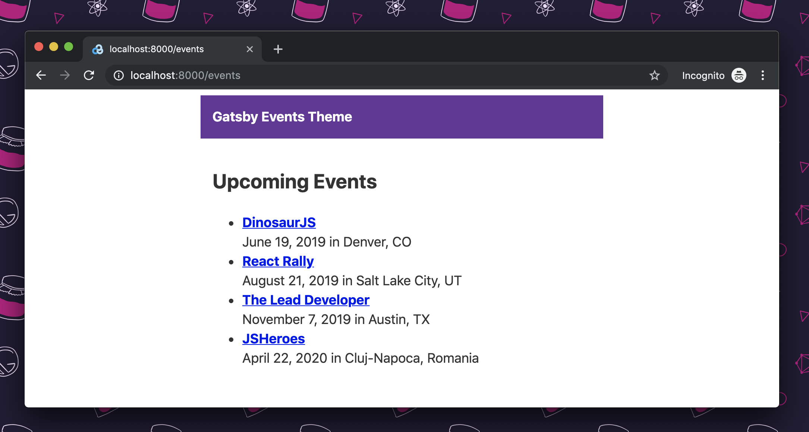

To continue applying theme styles, you can use the [`Themed` import](https://theme-ui.com/themed) from Theme UI. For example, in the `event-list.js` component, change the `<h1>`, `<ul>` and `<li>` elements to reference their themed styles:

```jsx:title=gatsby-theme-events/src/components/event-list.js
import React from "react"
import { Link } from "gatsby"
// highlight-next-line
import { Themed } from "@theme-ui/mdx"

const EventList = ({ events }) => {
  return (
    <>
      // highlight-next-line
      <Themed.h1>Upcoming Events</Themed.h1>
      // highlight-next-line
      <Themed.ul>
        {events.map(event => (
          // highlight-next-line
          <Themed.li key={event.id}>
            <strong>
              <Link to={event.slug}>{event.name}</Link>
            </strong>
            <br />
            {new Date(event.startDate).toLocaleDateString("en-US", {
              month: "long",
              day: "numeric",
              year: "numeric",
            })}{" "}
            in {event.location}
            // highlight-next-line
          </Themed.li>
        ))}
        // highlight-next-line
      </Themed.ul>
    </>
  )
}

export default EventList
```

By replacing the `h1` with `Themed.h1`, `ul` with `Themed.ul`, and `li` with `Themed.li`, the theme styles for those elements have been applied:

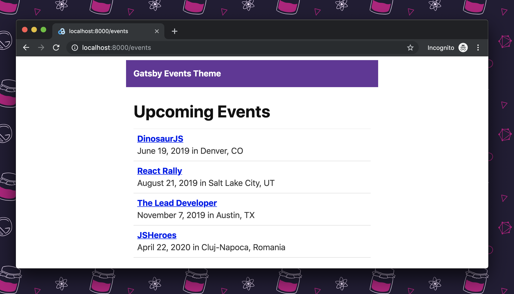

## Publish a theme to npm

By publishing your theme to npm, you make it available to pull in as a dependency for any of your projects, and for anyone in the community to use, too.

> 💡 Please note that publishing your theme is only required if you want to install it on other sites or share it with the community. If you’re only building this theme as a learning exercise, you can skip this step.

### Namespace your theme

It's important to namespace your theme. It helps differentiate between published packages, and avoid naming collisions.

```json:title=gatsby-theme-events/package.json
{
  // highlight-next-line
  "name": "@yournpmusername/gatsby-theme-events",
  "version": "1.0.0",
  "main": "index.js",
  "license": "MIT",
  "scripts": {
    "build": "gatsby build",
    "clean": "gatsby clean",
    "develop": "gatsby develop"
  },
  "peerDependencies": {
    "gatsby": "^3.0.0",
    "react": "^17.0.0",
    "react-dom": "^17.0.0"
  },
  "dependencies": {
    "gatsby-plugin-theme-ui": "^0.10.0",
    "gatsby-source-filesystem": "^3.0.0",
    "gatsby-transformer-yaml": "^3.0.0",
    "theme-ui": "^0.10.0"
  }
}
```

### Make sure you're logged in to npm

To check whether you're logged in to npm, run `npm whoami`:

```shell
npm whoami
```

If you're logged in, it will return your npm username.

If you're not logged in, it will return an error.

To log in, run `npm adduser`:

```shell
npm adduser
```

You'll be prompted for your npm username and password, and an email. (If you don't have one, create one now).

Now that your theme is namespaced, and you're logged in to npm, you're ready to publish.

### Publish your theme

Change directories into the `gatsby-theme-events` directory and run npm publish:

```shell
cd gatsby-theme-events
npm publish --access public
```

> 💡 Because it's namespaced, you'll need to include public access.

Now it's published! After publishing, you'll be able to find your theme on npm at `npmjs.com/{yourpackagename}`

## Consume a theme in a Gatsby application

Now it's time to test the theme you've created!

### Set up a new Gatsby site

Make a new directory called `theme-test`, and set up the project:

```shell
mkdir theme-test
cd theme-test
npm init -y
npm install react react-dom gatsby @jlengstorf/gatsby-theme-events
```

> 💡 Where it says `@jlengstorf/gatsby-theme-events`, use the theme you just published instead! Or if you didn't want to actually publish your test theme, go ahead and use `@jlengstorf/gatsby-theme-events`.

### Configure the theme

Open up the code for this new project.

Create a new `gatsby-config.js` file in the root:

```javascript:title=theme-test/gatsby-config.js
module.exports = {
  plugins: ["@jlengstorf/gatsby-theme-events"],
}
```

### Run the site

Making sure you're in your `/theme-test` directory, run `npm run develop` to start the site.

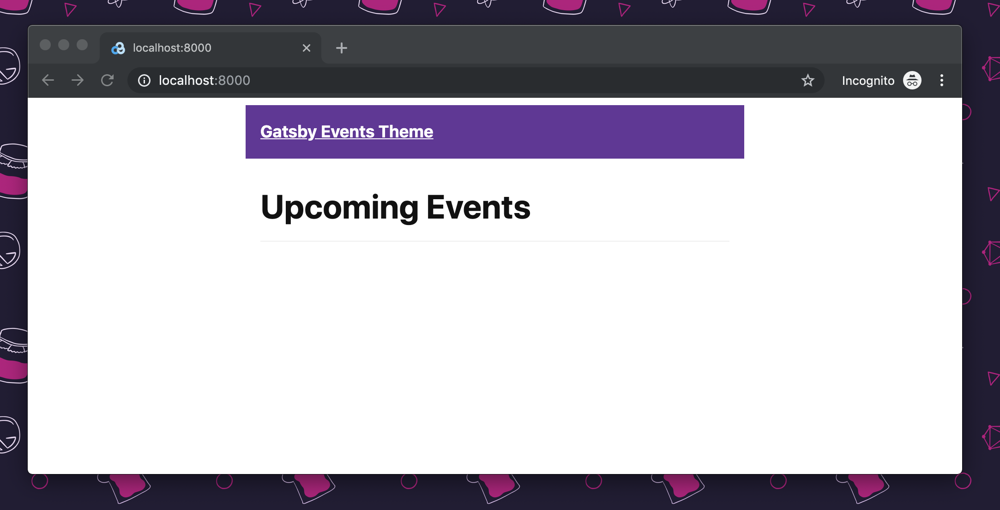

### Add some data

In your project, create a directory, `data`. Inside `data`, create a new file, `events.yml`:

```yaml:title=theme-test/data/events.yml
- name: Party
  location: My House
  start_date: 2019-06-26
  end_date: 2019-06-26
  url: https://jason.af/party
```

Save, and you'll see the new event data in your project:

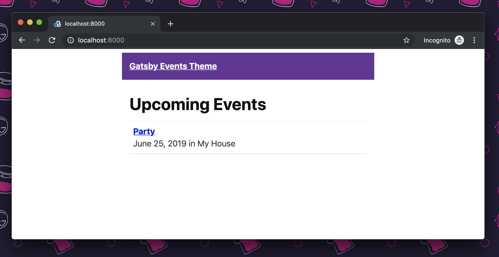

## Use component shadowing to override theme components

"Component shadowing" in Gatsby themes allow you to override or modify components in the theme. Use your new "theme-test" project to experiment with this.

### Override theme colors

In the root of `theme-test`, add a `src` folder. Inside `src`, add a folder titled `gatsby-plugin-theme-ui`.

Inside `gatsby-plugin-theme-ui`, create a new file, `index.js`.

Your file tree will look like this:

```text
.
├── data
│   └── events.yml
├── src
│   └── gatsby-plugin-theme-ui
│       └── index.js
├── .gitignore
├── gatsby-config.js
├── package.json
└── package-lock.json
```

Inside the new `index.js` file, add the following:

```javascript:title=theme-test/src/gatsby-plugin-theme-ui/index.js
import { merge } from "theme-ui"
import { theme } from "@jlengstorf/gatsby-theme-events"

const theme = merge(theme, {
  colors: {
    primary: "blue",
  },
})

export default theme
```

Restart the dev server for `theme-test`. Your local site should now have a blue header instead of a purple one:

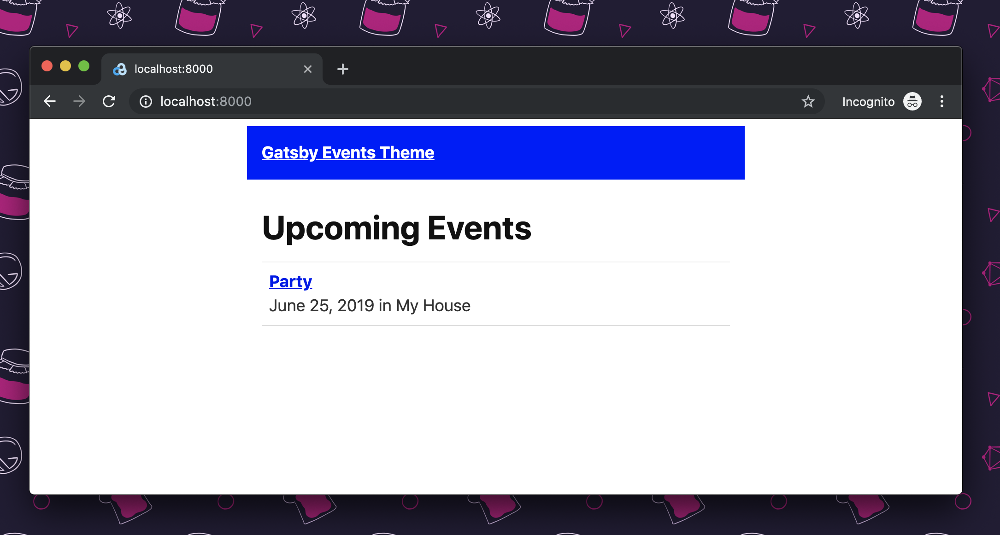

A few notable things are happening in this `index.js` file:

- The `theme` import from `@jlengstorf/gatsby-theme-events` is the base UI theme from `@jlengstorf/gatsby-theme-events`.
- The new object exported from `index.js` uses [`merge` from Theme UI](https://theme-ui.com/guides/merging-themes) to deeply merge the base UI theme with the theme overrides of your choice. In this case, changing the primary color to blue.

### Override an entire component

Inside `src`, create a folder with the same title as your theme.

> 💡 Note, with a namespaced theme, this will be two directories deep. For example, using the example of `@jlengstorf/gatsby-theme-events`, the file tree of your project will look like this:

```text
.
├── data
│   └── events.yml
├── src
│   ├── @jlengstorf
│   │   └── gatsby-theme-events
│   └── gatsby-plugin-theme-ui
│       └── index.js
├── .gitignore
├── gatsby-config.js
├── package.json
└── package-lock.lock
```

Anything inside `theme-test/src/@jlengstorf/gatsby-theme-events` will "shadow" the components in `@jlengstorf/gatsby-theme-events`.

For example, create a new file to override the layout component: `theme-test/src/@jlengstorf/gatsby-theme-events/components/layout.js`.

```jsx:title=theme-test/src/@jlengstorf/gatsby-theme-events/components/layout.js
import React from "react"

export default function Layout({ children }) {
  return <>{children}</>
}
```

If you restart the development server, you'll see all of the styles and structure from the theme have been stripped away, because the component has been completely overridden:

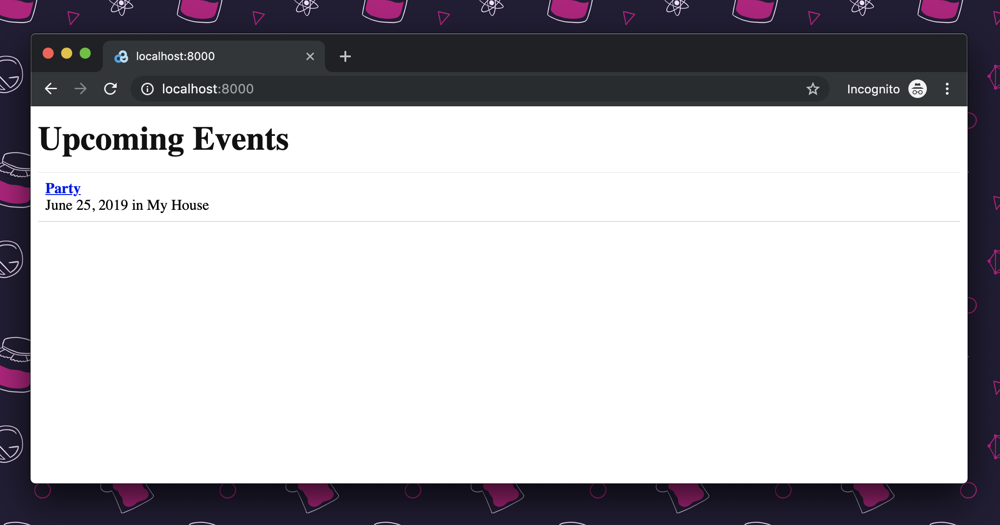

## Conclusion

Congratulations! You've set up, built, and customized your first Gatsby theme!

### Further reading

- Check out the [Gatsby themes docs](/docs/themes/) to keep learning.
- Have an idea for a theme you'd like to build? Get a headstart on a local theme development workspace using the [Theme Workspace starter](https://github.com/gatsbyjs/gatsby/tree/master/starters/gatsby-starter-theme-workspace).
- Have you built a Gatsby starter before? Perhaps [convert that starter to a theme](/docs/themes/converting-a-starter).

### Livestreams

- [Jason Lengstorf and Brent Jackson livestream building a theme](https://www.youtube.com/watch?v=6Z4p-qjnKCQ)
- [Jason Lengstorf and Emma Wedekind livestream building a theme](https://www.youtube.com/watch?v=W2uTfay3doo)
- [Jason Lengstorf and Henry Zhu livestream building a theme](https://www.youtube.com/watch?v=z4ETLpujcqo)
- [Jason Lengstorf and John Otander livestream building a theme](https://www.youtube.com/watch?v=PS2784YfPpw)
