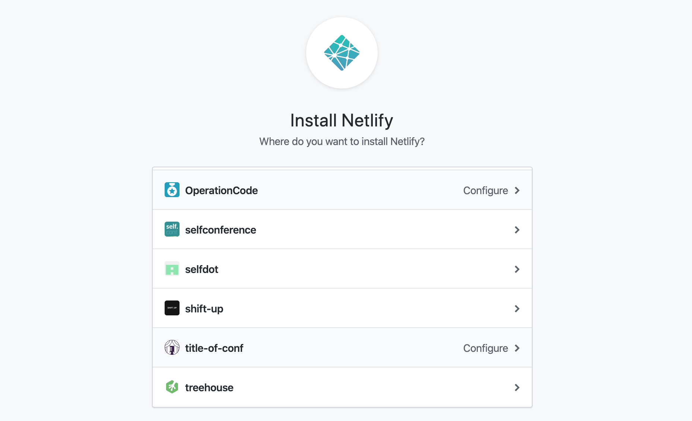

This tutorial will walk you through the process of building a new e-commerce site and beginning to customize it. It is meant to be approachable for both developers and business owners (who are not necessarily developers).

## Why build a site like this?

If you're willing to do a little more of the legwork yourself and make less than \$1,500 in monthly sales, [Snipcart](https://snipcart.com/) may be a lower-cost option for you than other popular options like [Shopify](https://www.shopify.com/). Snipcart also requires far less configuration. Both options use [Stripe](https://stripe.com/) to handle payments, so be sure to factor _Stripe's_ fees into your calculations as well. (Stripe currently charges 2.9% + 30¢ for each transaction.)

The setup described in this tutorial is particularly powerful thanks to [DatoCMS](https://www.datocms.com/). DatoCMS is a content management system (CMS) that allows you to decide exactly how your content should be organized.

_You_ determine what information should be included in each product. You can get started with a free Developer account. You can always upgrade if you need to bring on additional team members or manage many different kinds of data.

All of that mixed with the speed and security of a Gatsby site is a pretty awesome combination!

## Before You Begin

You can sign up for the following accounts now or as you need to use each of them in the course of this tutorial:

- [GitHub](https://github.com/): host your Gatsby code
- [Gatsby Cloud](https://www.gatsbyjs.com/): build and preview your website
- [DatoCMS](https://www.datocms.com/): organize and update your content
- [Snipcart](https://snipcart.com/): add a shopping cart to your site
- [Netlify](https://www.netlify.com/): host your site and register a domain

To edit code locally (affecting files stored on your computer), you'll need the following software. If you don't already know what these are or want additional background information, check out [Step 0 of the Gatsby tutorial](/docs/tutorial/getting-started/part-0/). It includes detailed instructions on how to set up a local development environment.

- [Node.js](https://nodejs.org): run JavaScript on your computer
- [Git](https://git-scm.com/downloads): track changes to your code
- [Gatsby command line interface (CLI)](/docs/tutorial/getting-started/part-0/#using-the-gatsby-cli): run Gatsby commands on your computer

## Provisioning Your Site on Gatsby Cloud

Begin with Gatsby Cloud. Once you have an account, you can log in and follow these instructions:

- Select the "Create new site" option.

- Since you're starting from scratch, choose "I don't have a Gatsby site yet" on the next screen.

- Select the starter labeled "Snipcart with DatoCMS" from the list of ready-made starters (Gatsby sites that you can copy).

At this point, you'll need to come up with a name for your project. This won't be customer-facing. This name will identify your site in Gatsby Cloud and your repository (repo) on GitHub. For now, associate this site with your personal GitHub account. If you're building this site for your company, you can always transfer the project over to a [GitHub organization](https://help.github.com/en/github/setting-up-and-managing-organizations-and-teams/about-organizations) later.


### Connecting to DatoCMS

Authorize Gatsby to connect with your DatoCMS account and hit the "Start my site" button. Once this is done, you should see a link to the corresponding project in DatoCMS and repository on GitHub, both of which have been created for you.


> This automatic provisioning of your website is one of Gatsby Cloud's strengths. Integrations with content management systems like this make it possible for you to spin up and begin publishing content to new sites without ever touching any code.


## Exploring the DatoCMS Project

After successfully linking the DatoCMS you can click on "Start my site" and
follow the link in Gatsby Cloud to go straight to your project in DatoCMS.

Click on "Enter project" and select "Products" from the secondary navigation menu. You'll see a number of products already defined for you. You can delete or edit these as you'd like.


### Editing models in DatoCMS

Clicking on "Settings" in the primary navigation menu reveals the "Models" menu item. You create models in DatoCMS to determine what your data should look like. In the case of your sample Product model, each individual product has a name, image, and price.

Maybe you also want each product to have a description or a release date. You can edit this model to be whatever you want it to be by adding and customizing fields. DatoCMS provides a wide variety of options that you can tweak to fit your needs.


If you already have items you know you want to sell, replace the sample products with a few of your own to get a feel for the interface. If not, you can continue on without making any changes in the CMS for now.

## Exploring the Code

Even if you've never used Git/GitHub, there's no need to fear. You can edit individual files in your web browser using GitHub. For larger changes, though, it probably makes more sense to develop your site locally (editing the files stored on your computer) and then push your changes to your remote repository (hosted on GitHub) in batches. Remember that Gatsby uses changes to the master branch of your remote repository as a signal to rebuild your site.

### Editing in GitHub

> If you're comfortable writing code in a text editor like [Visual Studio Code](https://code.visualstudio.com/) and using the command line, you can skip this section!

You can make small changes to the code from your browser by editing files directly in GitHub. Say, for example, that you always want to display prices in some other currency besides euros. To switch the symbols, head to your repository's page on GitHub and navigate to `src/pages/index.js`.


Select "Edit this file" (the pencil icon) from the menu. Where `product.price` is being displayed, you'll need to update the currency symbol.

```jsx:title=index.js
<div className="Product__price">${product.price}</div>
```

Once you've made your change, you'll need to commit that change. A commit is like a snapshot in time or a save point in a video game. Add a message that concisely describes the changes you've made and then commit those changes.


You've made a change to your master branch, which means Gatsby will build a new version of your site!

The rest of this process is described in the context of using a text editor to make code changes but remember that you can make those same changes in GitHub. One big advantage to developing locally is that you can see your changes reflected in the browser without having to wait for your entire site to rebuild.

### Editing Locally

You can edit your site's code locally by following these steps:

- Clone the project by selecting the "Clone or download" button on your repository's main page, which will display a link for you to copy.

- Copy the project to your computer and install its dependencies, other JavaScript projects that your site relies on to work.

The above is achieved by running these commands after copying the link on GitHub.

```shell
git clone your-repo-link
cd your-repo-name
npm install
```

You'll need to make one change before you try to run the site. The version that Gatsby builds works because Gatsby saves any necessary environment variables when you automatically provision a site. Environment variables help you keep data you need to run your site safe and private. The code references the name of the variable while the actual value is stored elsewhere.

In `gatsby-config.js`, you'll find an array of plugins already installed on your site, including `gatsby-source-datocms`. That section references a variable `process.env.DATO_API_TOKEN`. `process.env` refers to the _environment_ in which you're running your code and `DATO_API_TOKEN` is the name of the particular variable in question.

```js:title=gatsby-config.js
{
  resolve: `gatsby-source-datocms`,
  options: { apiToken: process.env.DATO_API_TOKEN },
},
```

In order to set this variable's value, create a new file in your project's root directory (the folder that contains the entire project) called `.env.development`.

Add your DatoCMS API Token environment variable to this file. You can find your API token in Gatsby under Site Settings > Environment variables. Opening the "Edit" menu will allow you to copy the full token. Set that as the value in `.env.development`.

```text
DATO_API_TOKEN=xxxxxxxxxxxxxxxxxxxxxxxxxxxxxxx
```

Now you should be able to run `gatsby develop` to run your site. If you're using Visual Studio Code, you can open a terminal within the text editor (control + \`) and keep everything in one window. Navigate to `http://locahost:8000/` in your browser to see the example site. It should include whatever products you created in DatoCMS.


## Modifying styles

Chances are you'll want to apply your own branding to this site, so try making some quick changes to strip away some of the strong design elements in this starter. Start with the background gradient. It's quite striking but might not be the best way to show off your own products.

If you're not sure where to look for the code you'll need to change, search for the term "background" and see what comes up! In this case, you'll find one entry in the results that _also_ says something about a gradient...


Remove the following CSS from `src/style/reset.scss`. The result should be a plain white background for your store.

```css:title=reset.scss
body {
  background: linear-gradient(
    to bottom,
    white,
    cyan,
    white,
    MediumVioletRed,
    white,
    Green,
    white,
    cyan
  );
}
```

There's also an interesting, sort of 90s animation going on with the title of the page. The words "My Shop" are constantly "glitching" to reveal blue and red bits underneath. This is a cool effect but not super practical and may be too distracting for many of your customers. Right click (or control + click) on the title and select "Inspect" to open the developer tools. You'll find that the title has a class and you can use that to search the code again.


Once you've found it (in `src/style/Header.scss`), delete the following CSS to remove the animation.

```css:title=Header.scss
&:after,
&:before {
  content: attr(data-text);
  position: absolute;
  top: 0;
  color: white;
  background: #663399;
  overflow: hidden;
  clip: rect(0, 900px, 0, 0);
  display: block;
  padding: 2px;
}

&:after {
  left: 3px;
  text-shadow: -2px 0 red;
  animation: noise-anim 2s infinite linear alternate-reverse;
}

&:before {
  content: attr(data-text);
  left: -3px;
  text-shadow: 2px 0 blue;
  animation: noise-anim-2 3s infinite linear alternate-reverse;
}
```

To remove the flashing text that appears when you hover over the "BUY NOW" buttons, inspect the element again to find its class and search the code for that class. The code to remove it (in `src/style/Product.scss`) is as follows:

```css:title=Product.scss
&:hover {
  text-decoration: underline;

  &:before {
    content: "Yes now";
    position: absolute;
    top: -10px;
    left: 60%;
    white-space: nowrap;
    font-family: "times new roman", times, serif;
    font-weight: normal;
    font-style: italic;
    mix-blend-mode: difference;
    text-transform: lowercase;
    text-decoration: overline;
    color: #00efff;
    font-size: 2em;
    animation: blink 6s steps(4, end) infinite alternate-reverse;
  }
}
```

Since you're not using it anymore, you can also remove the `blink` animation referenced in that last line of CSS. You'll find it just below, in the same file.

```css:title=Product.scss
@keyframes blink {
  $steps: 20;

  @for $i from 0 through $steps {
    #{percentage($i * (1 / $steps) + ((15 - random(30)) / 15) * (1 / $steps))} {
      @if ($i % 3 == 0) {
        opacity: 1;
      } @else {
        opacity: 0;
      }
    }
  }
}
```

Last (for now, at least), change the title of your site to your own company's name! Return to `gatsby-config.js` and edit the `siteName` property on `siteMetadata`. This object holds information that's used throughout the site, so it's a good place to put your name.

```js:title=gatsby-config.js
module.exports = {
  siteMetadata: {
    siteName: 'My Shop',
  },
```

The page should now be a little more sedate and you hopefully have a better idea of how to customize the site's styles. You can poke around from here to change the colors and fonts to better fit your brand.


## Configuring the Shopping Cart

Snipcart is already mostly configured for you. You should only need to swap your own API key for the one included in the sample project. You'll find this information back in `gatsby-config.js`. It's a good idea to move this into a new environment variable.

```js:title=gatsby-config.js
{
  resolve: 'gatsby-plugin-snipcart',
  options: {
    apiKey: 'OWE3MmZmMjQtNTk3Yi00OThhLWEwMmUtZDY4ZWM4NzIwYzZiNjM2NjM0Mzc1NzE0MTUwNzI1',
    autopop: true
  }
},
```

In addition to adding a layer of security, using environment variables gives you a way to change those values based on the environment you're working in. When in development, adding new features or testing out new styles or products, you can use one set of API keys. You can use another for your customer-facing production site.

Find your Snipcart API key by signing up for an account if you haven't already. Go to Account > API Keys and grab your public test API key under ["Credentials"](https://app.snipcart.com/dashboard/account/credentials).

All that's left to do now is make one small change to the HTML that describes each product in your code. In your text editor, look at the existing product HTML in `src/pages/index.js`:

```jsx:title=index.js
render={data => (
  <Layout site={data.site}>
    <div className="Catalogue">
      {
        data.products.edges.map(({ node: product }) => (
          <div className="Catalogue__item" key={product.id}>
            <div
              className="Product snipcart-add-item"
              data-item-id={product.id}
              data-item-price={product.price}
              data-item-image={product.image.url}
              data-item-name={product.name}
              data-item-url={`/`}
            >
              <div className="Product__image">
                
              </div> <div className="Product__details">
                <div className="Product__name">
                  {product.name}
                  <div className="Product__price">
                    ${product.price}
                  </div>
                </div>
                <span className="Product__buy">Buy now</span>
              </div>
            </div>
          </div>
        ))
      }
    </div>
  </Layout>
)}
```

Snipcart looks for those `data-item-*` attributes to understand which parts of your HTML represent products. Your Gatsby site is getting the data from DatoCMS, then both displaying it and making it available to Snipcart. When a user clicks on an element with these attributes, the corresponding product is added to their cart.

The JavaScript that handles the checkout process is already taken care of by `gatsby-plugin-snipcart`, which comes installed with this starter. (Set `autopop` to false in `gatsby-config.js` to keep the shopping cart from popping up every time something is added.)

In the interest of keyboard accessibility, move the `data-item-*` attributes to the "Buy now" button which is not really a button. While you're there, make it a button! The resulting code should look something like this:

```jsx:title=index.js
render={data => (
  <Layout site={data.site}>
    <div className="Catalogue">
      {
        data.products.edges.map(({ node: product }) => (
          <div className="Catalogue__item" key={product.id}>
            <div>
              <div className="Product__image">
                
              </div> <div className="Product__details">
                <div className="Product__name">
                  {product.name}
                  <div className="Product__price">
                    ${product.price}
                  </div>
                </div>
                <button
                  className="Product__buy Product snipcart-add-item"
                  data-item-id={product.id}
                  data-item-price={product.price}
                  data-item-image={product.image.url}
                  data-item-name={product.name}
                  data-item-url={`https://determined-easley-e806d0.netlify.app/`}
                >
                  Add to cart
                </button>
              </div>
            </div>
          </div>
        ))
      }
    </div>
  </Layout>
)}
```

Essentially any element can be turned into a Snipcart “buy” button by adding these attributes!

## Deploying with GitHub and Netlify

You've been working away but all these changes still only exist on your own computer. In order to begin sharing this site with potential customers, you'll need to _host_ this site somewhere else. Your code already lives on GitHub and you can use [Netlify](https://www.netlify.com/) to deploy it.

Use your GitHub account to sign up for Netlify (since you're going to end up connecting these two accounts anyway). Once you're logged in, you should be dropped into the "Sites" page. Take a moment now to push whatever you have so far to your remote repository. You can skip the following section if you already know how to do so.

### Pushing to GitHub

In the root of your project, run:

```shell
git add .
git commit -m "Make basic styling updates"
git push -u origin master
```

The first command adds all your changes to the "staging area" prior to being committed (or saved as a checkpoint in your project's Git timeline). The second command actually makes the commit with a message describing what was changed. The third pushes your changes to your remote (named "origin") repository's master branch. `-u` is short for `--set-upstream` and including it means that, in the future, you'll be able to push changes from your local `master` branch to origin's by running the shorter command `git push`.

### Connecting Your Repo

Over to Netlify! If you haven't already, sign up with your GitHub account. From the "Sites" page, select "New Site from Git" to get started. You'll be presented with a few providers. Since your code is hosted on GitHub, choose that. You'll then need to install and configure the Netlify app to work with your GitHub account. You can give Netlify access to all repositories owned by that account or only select repositories. It's entirely up to you.



The next step is to set your build options and deploy! This should already be prepped for you. Unless you'd like to use a branch other than `master` to kick off automatic deploys, all that's really left to do is hit "Deploy site". Note that Netlify has already detected the fact that this is a Gatsby site and knows the commands it will need to run to build your project.

You should see that your site is building. This first deploy will fail because Netlify doesn't know about that environment variable you set locally earlier. Go to Settings > Build & deploy > Environment and set the same `DATO_API_TOKEN` variable you set before. (As a reminder, you can find this value in Gatsby, where it was set automatically, or your DatoCMS project itself.)

Once that's done, kick off another build by navigating to the Deploys tab and selecting "Deploy site" from the "Trigger deploy" dropdown. Once it's finished building, the deploy will be marked "Published" on your dashboard. You (and everyone else) will be able to see the live site at some randomly generated, likely whimsical URL.

### Integrating with Gatsby Cloud

Back in your Gatsby dashboard, head over to Site Settings > Integrations > Hosting and connect to Netlify. Choose the site you just set up and hit "Save". Now you've got everything all hooked up and any change to your code or content will trigger a new build and, if that build is successful, deploy a new version of your site!


## Setting Up a Custom Domain

That whimsical domain you generated earlier is probably not where you want to send your customers. Netlify will help you get set up with a shiny new custom domain.

If you already have one, that's awesome! You'll need to point it to the code you just hosted on Netlify. The specifics of _how_ to do that will vary slightly and depend on the registrar you went with. Try googling something like "[registrar] Netlify custom domain" to find instructions for your situation. For more information, check out [Netlify's guide on assigning a domain to a site](https://docs.netlify.com/domains-https/custom-domains/#assign-a-domain-to-a-site).

Paying for your domain through Netlify is a little more straightforward. They'll take care of any necessary provisioning for you!

If you still have the "Getting started" prompt, you can select the "Set up a custom domain" option from there. Either way, you can also go to Settings > Domain management > Domains > Custom domains. Input the domain you'd like to use and hit "Verify". If the domain is taken, you'll be prompted to indicate whether or not it's yours. If it isn't taken, you'll be prompted to add a payment method and register it through Netlify.

## Moving to Production

You've already done most of the work needed to launch your new online store. All that remains is to:

- update the value of `data-item-url` in your product HTML
- use your live Snipcart API key

The `data-item-url` attribute needs to match the live page where the products can be bought, which Snipcart crawls to verify the order. In testing, a slash is fine. To get your site ready to go live, you'll need to replace the slash with the actual URL.

```jsx:title=index.js
data-item-url={`URL of your live product page`}
```

Back in Snipcart, you'll need to enter your credit card information and choose a payment gateway in order to generate a _live_ API key. Once that's done, use it to replace your test API environment variable in Netlify. Trigger one more deploy and you should be ready to receive orders!

### Soft Launch

Share this site around to friends and family. Ask them to try ordering something and troubleshoot with them if anything goes wrong. You should see orders come through to your Snipcart account and then into the payment processor you chose to integrate with. If everything is working as you expect, you can start promoting your new site!

## Next Steps

There will always be a million ways you'd like to tweak and improve any site you make. You may decide down the line that you'd like to switch to a different payment processor or shopping cart solution. You might invest in professional services from a designer or developer. This site is extremely flexible and offers you a ton of control. It can adapt and grow along with your business!
