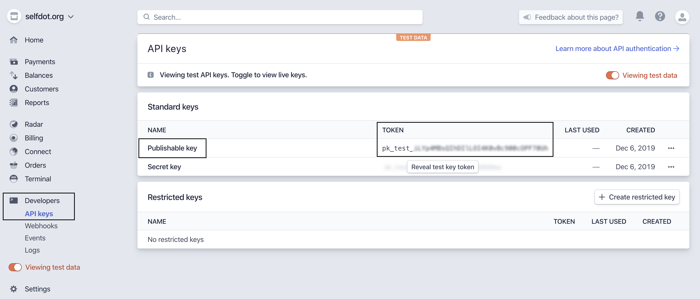
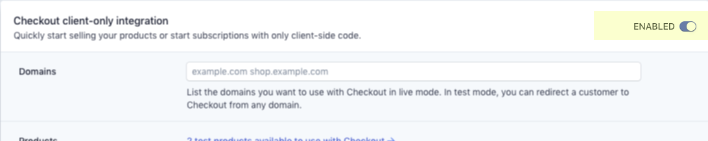

# Table of Contents

- [Table of Contents](#table-of-contents)
- [Why use Gatsby for an e-commerce site?](#why-use-gatsby-for-an-e-commerce-site)
- [Prerequisites](#prerequisites)
  - [How does Gatsby work with Stripe?](#how-does-gatsby-work-with-stripe)
- [Setting up a Gatsby site](#setting-up-a-gatsby-site)
- [Installing the StripeJS plugin](#installing-the-stripejs-plugin)
  - [See your site hot reload in the browser!](#see-your-site-hot-reload-in-the-browser)
  - [How does the StripeJS plugin work?](#how-does-the-stripejs-plugin-work)
  - [Getting your Stripe test keys](#getting-your-stripe-test-keys)
- [Examples](#examples)
  - [Easy: One Button](#easy-one-button)
  - [Advanced: Import SKUs via source plugin](#advanced-import-skus-via-source-plugin)
- [Testing Payments](#testing-payments)

In this advanced tutorial, you’ll learn how to use Gatsby to build the UI for a basic e-commerce site that can accept payments, with [Stripe](https://stripe.com) as the backend for processing payments.

## Why use Gatsby for an e-commerce site?

Benefits of using Gatsby for e-commerce sites include the following:

- Security inherent in static sites
- Blazing fast performance when your pages are converted from React into static files
- Easy to host

You can see the working demo hosted here: https://gatsby-ecommerce-stripe.netlify.com/

## Prerequisites

- Since this is a more advanced tutorial, building a site with Gatsby before will likely make this tutorial less time-consuming ([see the main tutorial here](/tutorial/))
- Stripe account: [register for an account here](https://dashboard.stripe.com/register)

### How does Gatsby work with Stripe?

Stripe is a payment processing service that allows you to securely collect and process payment information from your customers. To try out Stripe for yourself, go to [Stripe’s Quick Start Guide](https://stripe.com/docs/payments/checkout#tryout).

There are alternatives to Stripe, like Square and Braintree, and their setup is very similar to Stripe.

Stripe offers a [hosted checkout](https://stripe.com/docs/payments/checkout) that doesn't require any backend component. You can configure products, SKUs, and subscription plans in the [Stripe Dashboard](https://stripe.com/docs/payments/checkout#configure). If you're selling a single product or subscription (like an eBook) you can hardcode the product's SKU ID in your Gatsby site. If you're selling multiple products, you can use the [Stripe source plugin](https://www.gatsbyjs.org/packages/gatsby-source-stripe/) to retrieve all SKUs at build time. If you want your Gatsby site to automatically update, you can use the Stripe webhook event to [trigger a redeploy](https://www.netlify.com/docs/webhooks/) when a new product or SKU is added.

# Setting up a Gatsby site

Create a new Gatsby project by running the `gatsby new` command in the terminal and change directories into the new project you just started:

```shell
gatsby new ecommerce-gatsby-tutorial
cd ecommerce-gatsby-tutorial
```

## Installing the StripeJS plugin

You can extend the functionality of this default starter with plugins. One such plugin is `gatsby-plugin-stripe`, which you’ll install in this project:

```shell
npm install gatsby-plugin-stripe
```

Open the root site directory in a text editor and navigate to `gatsby-config.js` and add the StripeJS plugin to `gatsby-config.js` in the plugins section. Your `gatsby-config.js` should look like the following code example:

```js:title=gatsby-config.js
module.exports = {
  siteMetadata: {
    title: `Gatsby e-Commerce Starter`,
    description: `Kick off your next, great Gatsby project with this default starter. This barebones starter ships with the main Gatsby configuration files you might need.`,
    author: `@gatsbyjs`,
  },
  plugins: [
    `gatsby-plugin-react-helmet`,
    {
      resolve: `gatsby-source-filesystem`,
      options: {
        name: `images`,
        path: `${__dirname}/src/images`,
      },
    },
    `gatsby-transformer-sharp`,
    `gatsby-plugin-sharp`,
    {
      resolve: `gatsby-plugin-manifest`,
      options: {
        name: `gatsby-starter-default`,
        short_name: `starter`,
        start_url: `/`,
        background_color: `#663399`,
        theme_color: `#663399`,
        display: `minimal-ui`,
        icon: `src/images/gatsby-icon.png`, // This path is relative to the root of the site.
      },
    },
    `gatsby-plugin-stripe`,
  ],
}
```

### See your site hot reload in the browser!

Run `npm run develop` in the terminal, which starts a development server and reloads changes you make to your site so you can preview them in the browser. Open up your browser to [localhost:8000](http://localhost:8000/) and you should see a default homepage.

> **NOTE**: If you have already started your Gatsby development server using `npm run develop`, you will need to restart the server by pressing CTRL + C in the terminal where the command was run and running `npm run develop` again to see changes in your `gatsby-config.js` reflected on [localhost:8000](http://localhost:8000/)

### How does the StripeJS plugin work?

Stripe provides a JavaScript library the allows you to securely redirect your customer to the Stripe hosted checkout page. The Gatsby plugin, `gatsby-plugin-stripe`, will add this snippet:

```html
<script src="https://js.stripe.com/v3/"></script>
```

to the end of the `<body>` tag across all of your pages. This helps facilitate Stripe's [fraud detection](https://stripe.com/docs/stripe-js/reference#including-stripejs).

If you want to further customize the checkout process or pull Stripe data into your site, check out [Gatsby's plugin library for more Stripe plugins](https://www.gatsbyjs.org/plugins/?=stripe).

### Getting your Stripe test keys

View your API credentials by logging into your Stripe account, and then going to Developers > API Keys.



You have 2 keys in both test mode and production mode:

- a publishable key
- a secret key

While testing, you must use the key(s) that include _test_. For production code, you will need to use the live keys. As the names imply, your publishable key may be included in code that you share publicly (for example, on the frontend, and in GitHub), whereas your secret key should not be shared with anyone or committed to any public repo. It’s important to restrict access to this secret key because anyone who has it could potentially read or send requests from your Stripe account and see information about charges or purchases or even refund customers.

### Enabling the "Checkout client-only integration" for your Stripe account

Through this tutorial you will be using the "Checkout client-only integration" from Stripe. To use this integration you need to activate it on the corresponding [Checkout settings](https://dashboard.stripe.com/account/checkout/settings) from your Stripe Dashboard.



> 💡 This change will also modify the interface that Stripe provides to administer your products: keep this in mind in case you have previously used this tool. If you have never used the product administrator, you don't need to worry.

Additionally, you need to set a name for your Stripe account on your [Account settings](https://dashboard.stripe.com/account) to use this integration.

To learn more about this integration you may use the [Stripe docs](https://stripe.com/docs/payments/checkout#configure).

## Examples

You can find an implementation of these examples [on GitHub](https://github.com/thorsten-stripe/ecommerce-gatsby-tutorial).

### Easy: One Button

If you're selling a simple product, like an eBook for example, you can create a single button that will perform a redirect to the Stripe Checkout page:

#### Create a product and SKU

To sell your products, first you need to create them on Stripe using the [Stripe Dashboard](https://dashboard.stripe.com/products) or the [Stripe API](https://stripe.com/docs/api/products/create). This is required for Stripe to validate that the request coming from the frontend is legitimate and to charge the right amount for the selected product/SKU. Stripe requires every SKU used with Stripe Checkout to have a name: be sure to add one to all of your SKUs.

You will need to create both test and live product SKUs in the Stripe Dashboard. Make sure you toggle to "Viewing test data" and then create your products for local development.

#### Create a checkout component that loads StripeJS and redirects to the checkout

Create a new file at `src/components/checkout.js`. Your `checkout.js` file should look like this:

```jsx:title=src/components/checkout.js
import React from "react"

const buttonStyles = {
  fontSize: "13px",
  textAlign: "center",
  color: "#fff",
  outline: "none",
  padding: "12px 60px",
  boxShadow: "2px 5px 10px rgba(0,0,0,.1)",
  backgroundColor: "rgb(255, 178, 56)",
  borderRadius: "6px",
  letterSpacing: "1.5px",
}

const Checkout = class extends React.Component {
  // Initialise Stripe.js with your publishable key.
  // You can find your key in the Dashboard:
  // https://dashboard.stripe.com/account/apikeys
  componentDidMount() {
    this.stripe = window.Stripe("pk_test_jG9s3XMdSjZF9Kdm5g59zlYd")
  }

  async redirectToCheckout(event) {
    event.preventDefault()
    const { error } = await this.stripe.redirectToCheckout({
      items: [{ sku: "sku_DjQJN2HJ1kkvI3", quantity: 1 }],
      successUrl: `http://localhost:8000/page-2/`,
      cancelUrl: `http://localhost:8000/`,
    })

    if (error) {
      console.warn("Error:", error)
    }
  }

  render() {
    return (
      <button
        style={buttonStyles}
        onClick={event => this.redirectToCheckout(event)}
      >
        BUY MY BOOK
      </button>
    )
  }
}

export default Checkout
```

#### What did you just do?

You imported React, added a button with some styles, and introduced some React functions. The `componentDidMount()` and `redirectToCheckout()` functions are most important for the Stripe functionality. The `componentDidMount()` function is a React lifecycle method that launches when the component is first mounted to the DOM, making it a good place to initialize the Stripe.js client. It looks like this:

```jsx:title=src/components/checkout.js
  componentDidMount() {
    this.stripe = window.Stripe("pk_test_jG9s3XMdSjZF9Kdm5g59zlYd")
  }
```

This identifies you with the Stripe platform, validates the checkout request against your products and security settings, and processes the payment on your Stripe account.

```jsx:title=src/components/checkout.js
  async redirectToCheckout(event) {
    event.preventDefault()
    const { error } = await this.stripe.redirectToCheckout({
      items: [{ sku: "sku_DjQJN2HJ1kkvI3", quantity: 1 }],
      successUrl: `http://localhost:8000/page-2/`,
      cancelUrl: `http://localhost:8000/`,
    })

    if (error) {
      console.warn("Error:", error)
    }
  }
```

The `redirectToCheckout()` function validates your checkout request and either redirects to the Stripe hosted checkout page or resolves with an error object. Make sure to replace `successUrl` and `cancelUrl` with the appropriate URLs for your application.

```jsx:title=src/components/checkout.js
  render() {
    return (
      <button
        style={buttonStyles}
        onClick={event => this.redirectToCheckout(event)}
      >
        BUY MY BOOK
      </button>
    )
  }
```

The `render()` function applies your styles to the button and binds the `redirectToCheckout()` function to the button's onclick event.

#### Importing the checkout component into the homepage

Now go to your `src/pages/index.js` file. This is your homepage that shows at the root URL. Import your new checkout component in the file underneath the other imports and add your `<Checkout />` component within the `<Layout>` element. Your `index.js` file should now look similar to this:

```jsx:title=src/pages/index.js
import React from "react"
import { Link } from "gatsby"

import Layout from "../components/layout"
import Image from "../components/image"
import SEO from "../components/seo"

import Checkout from "../components/checkout" // highlight-line

const IndexPage = () => (
  <Layout>
    <SEO title="Home" keywords={[`gatsby`, `application`, `react`]} />
    <h1>Hi people</h1>
    <p>Welcome to your new Gatsby site.</p>
    <p>Now go build something great.</p>
    <Checkout /> {/* highlight-line */}
    <div style={{ maxWidth: `300px`, marginBottom: `1.45rem` }}>
      <Image />
    </div>
    <Link to="/page-2/">Go to page 2</Link>
  </Layout>
)

export default IndexPage
```

If you go back to [localhost:8000](http://localhost:8000/) in your browser and you have `npm run develop` running, you should now see a big, enticing "BUY MY BOOK" button. C'mon and give it a click!

### Advanced: Import SKUs via source plugin

Instead of hardcoding the SKU IDs, you can use the [gatsby-source-stripe plugin](https://www.gatsbyjs.org/packages/gatsby-source-stripe/) to retrieve your SKUs at build time.

#### Add the Stripe source plugin

Add the [gatsby-source-stripe plugin](https://www.gatsbyjs.org/packages/gatsby-source-stripe/) which you can use to pull in the SKUs from your Stripe account.

```shell
npm install gatsby-source-stripe
```

Now you can add the plugin configuration in your `gatsby-config` file:

```js:title=gatsby-config.js
module.exports = {
  siteMetadata: {
    title: `Gatsby e-commerce Starter`,
  },
  plugins: [
    `gatsby-plugin-react-helmet`,
    "gatsby-plugin-stripe",
    {
      resolve: `gatsby-source-stripe`,
      options: {
        objects: ["Sku"],
        secretKey: process.env.STRIPE_SECRET_KEY,
        downloadFiles: true,
      },
    },
  ],
}
```

To retrieve your SKUs from your Stripe account you will need to provide your secret API key. This key needs to be kept secret and must never be shared on the frontend or on GitHub. Therefore you need to set an environment variable to store the secret key. You can read more about the usage of env variables in the [Gatsby docs](/docs/environment-variables/).

In the root directory of your project add a `.env.development` file:

```text:title=.env.development
# Stripe secret API key
STRIPE_SECRET_KEY=sk_test_xxx
```

To use the defined env variable you need to require it in your `gatsby-config.js` or `gatsby-node.js` like this:

```js:title=gatsby-config.js
require("dotenv").config({
  path: `.env.${process.env.NODE_ENV}`,
})
```

Lastly, make sure that your `.gitignore` file excludes all of your `.env.*` files:

```text:title=.gitignore
# dotenv environment variables files
.env
.env.development
.env.production
```

#### Create a component that lists your SKUs

In your components folder add a new `Products` folder. This folder will include the components that interact with the Stripe SKUs. First, you need a component that queries and lists your SKUs:

```jsx:title=src/components/Products/Skus.js
import React from "react"
import { graphql, StaticQuery } from "gatsby"

export default props => (
  <StaticQuery
    query={graphql`
      query SkusForProduct {
        skus: allStripeSku {
          edges {
            node {
              id
              currency
              price
              attributes {
                name
              }
            }
          }
        }
      }
    `}
    render={({ skus }) => (
      <div>
        {skus.edges.map(({ node: sku }) => (
          <p key={sku.id}>{sku.attributes.name}</p>
        ))}
      </div>
    )}
  />
)
```

You can validate your query and see what data is being returned in GraphiQL, which is available at http://localhost:8000/___graphql when running `npm run develop`.

Once you're happy with your query, create a new page where you can import the newly created Sku component:

```jsx:title=src/pages/advanced.js
import React from "react"

import Layout from "../components/layout"
import SEO from "../components/seo"

import Skus from "../components/Products/Skus" // highlight-line

const AdvancedExamplePage = () => (
  <Layout>
    <SEO title="Advanced Example" />
    <h1>This is the advanced example</h1>
    <Skus /> {/* highlight-line */}
  </Layout>
)

export default AdvancedExamplePage
```

When navigating to http://localhost:8000/advanced/ you should now see a list of paragraphs with your SKU names.

#### Create a component that presents a single SKU

To make your SKUs more visually appealing and interactive, create a new `SkuCard` component in your `Products` folder:

```jsx:title=src/components/Products/SkuCard.js
import React from "react"

const cardStyles = {
  display: "flex",
  flexDirection: "column",
  justifyContent: "space-around",
  alignItems: "flex-start",
  padding: "1rem",
  marginBottom: "1rem",
  boxShadow: "5px 5px 25px 0 rgba(46,61,73,.2)",
  backgroundColor: "#fff",
  borderRadius: "6px",
  maxWidth: "300px",
}
const buttonStyles = {
  fontSize: "13px",
  textAlign: "center",
  color: "#fff",
  outline: "none",
  padding: "12px",
  boxShadow: "2px 5px 10px rgba(0,0,0,.1)",
  backgroundColor: "rgb(255, 178, 56)",
  borderRadius: "6px",
  letterSpacing: "1.5px",
}

const formatPrice = (amount, currency) => {
  let price = (amount / 100).toFixed(2)
  let numberFormat = new Intl.NumberFormat(["en-US"], {
    style: "currency",
    currency: currency,
    currencyDisplay: "symbol",
  })
  return numberFormat.format(price)
}

const SkuCard = class extends React.Component {
  async redirectToCheckout(event, sku, quantity = 1) {
    event.preventDefault()
    const { error } = await this.props.stripe.redirectToCheckout({
      items: [{ sku, quantity }],
      successUrl: `http://localhost:8000/page-2/`,
      cancelUrl: `http://localhost:8000/advanced`,
    })

    if (error) {
      console.warn("Error:", error)
    }
  }

  render() {
    const sku = this.props.sku
    return (
      <div style={cardStyles}>
        <h4>{sku.attributes.name}</h4>
        <p>Price: {formatPrice(sku.price, sku.currency)}</p>
        <button
          style={buttonStyles}
          onClick={event => this.redirectToCheckout(event, sku.id)}
        >
          BUY ME
        </button>
      </div>
    )
  }
}

export default SkuCard
```

This component renders a neat card for each individual SKU, with the SKU name, nicely formatted pricing, and a "BUY ME" button. The button triggers the `redirectToCheckout()` function with the corresponding SKU ID.

Lastly, you need to refactor your `Skus` component to initialize the Stripe.js client, and render `SkuCards` while handing down the Stripe.js client in the `props`:

```jsx:title=src/components/Products/Skus.js
import React, { Component } from "react"
import { graphql, StaticQuery } from "gatsby"
import SkuCard from "./SkuCard" // highlight-line

const containerStyles = {
  display: "flex",
  flexDirection: "row",
  flexWrap: "wrap",
  justifyContent: "space-between",
  padding: "1rem 0 1rem 0",
}

class Skus extends Component {
  // Initialise Stripe.js with your publishable key.
  // You can find your key in the Dashboard:
  // https://dashboard.stripe.com/account/apikeys
  // highlight-start
  state = {
    stripe: null,
  }

  componentDidMount() {
    const stripe = window.Stripe(process.env.GATSBY_STRIPE_PUBLIC_KEY)
    this.setState({ stripe })
  }
  // highlight-end

  render() {
    return (
      <StaticQuery
        query={graphql`
          query SkusForProduct {
            skus: allStripeSku {
              edges {
                node {
                  id
                  currency
                  price
                  attributes {
                    name
                  }
                }
              }
            }
          }
        `}
        render={({ skus }) => (
          <div style={containerStyles}>
            {skus.edges.map(({ node: sku }) => (
              <SkuCard key={sku.id} sku={sku} stripe={this.state.stripe} /> {/* highlight-line */}
            ))}
          </div>
        )}
      />
    )
  }
}

export default Skus
```

#### Adding a cart component

You can call `redirectToCheckout()` providing an array of SKUs and their quantities to charge for multiple items at the same time. Instead of each "BUY ME" button redirecting to the checkout page, you can therefore provide a central "GO TO CHECKOUT" button that uses the state of a cart component. You can see the necessary changes for this example [on GitHub](https://github.com/thorsten-stripe/ecommerce-gatsby-tutorial/tree/cart-example).

# Testing Payments

In test mode (when using the API key that includes _test_) Stripe provides [test cards](https://stripe.com/docs/testing#cards) for you to test different checkout scenarios.
