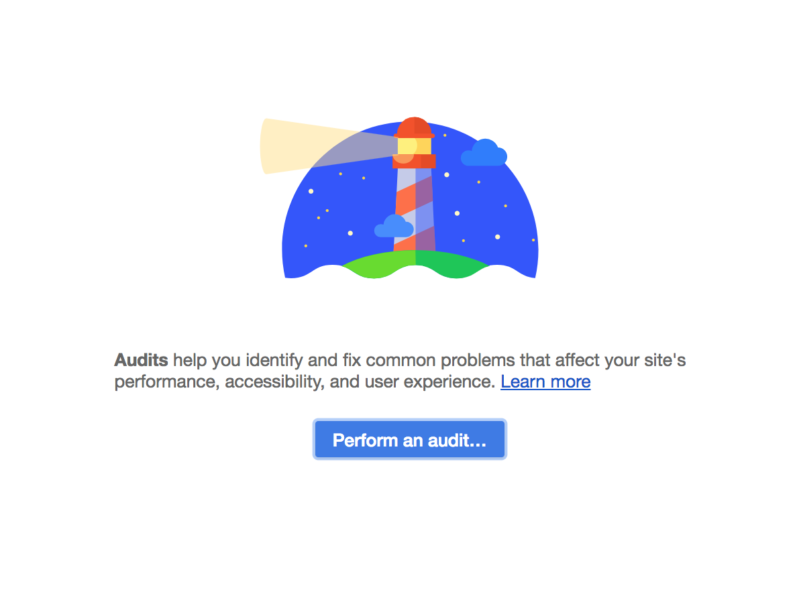
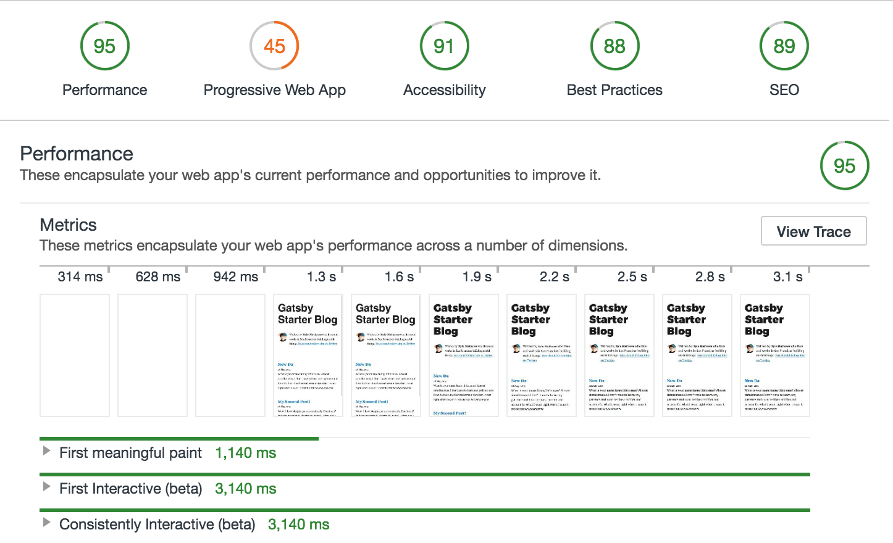

Wow! You've come a long way! You've learned how to:

- create new Gatsby sites
- create pages and components
- style components
- add plugins to a site
- source & transform data
- use GraphQL to query data for pages
- programmatically create pages from your data

All the voices in your head are super proud of you (as am I, the anonymous tutorial instructor)! They rise in great applause! Feel free to take a moment to bow and acknolwedge their admiration 🙇

## What's in this tutorial?

In this final tutorial, we're going to walk through some common steps for preparing a site to go live by introducing a powerful site diagnostic tool called [Lighthouse](https://developers.google.com/web/tools/lighthouse/). Along the way, we'll introduce a few more plugins you'll often want to use in your Gatsby sites.

## Lighthouse

Quoting from the Lighthouse website:

> Lighthouse is an open-source, automated tool for improving the quality of web pages. You can run it against any web page, public or requiring authentication. It has audits for performance, accessibility, progressive web apps, and more.

Lighthouse is included as part of Chrome DevTools. Running its audit and fixing problems it finds is a great way to prepare your site to go live because it helps give you confidence that your site is as fast and accessible as possible.

Let's try it out!

First you need to create a production build of your Gatsby site. The Gatsby development server is optimized for making development fast but the site that it generates, while it closely resembles a production version of the site, isn't as optimized.

Stop the development server (if it's still running) and run:

`gatsby build`

As you learned in part 1 of the tutorial, this does a production build
of your site and outputs the built static files into the `public` directory.

To view the production site locally run:

`gatsby serve`

Once this starts, you can now view your site at `localhost:9000`.

Now let's run your first Lighthouse test. To do so, open the site in Chrome (if you didn't already do so) and then open up the Chrome DevTools. Now click on the "Audits" tab where you'll see a screen that looks like:

Click "Perform an audit..." then "Run audit". It'll then take a minute or so to run the audit.

Once you're done, you should see results that look like:

As you can see, Gatsby's performance is excellent out of the box but we're missing some things for PWA, Accessibility, Best Practices, and SEO that will improve your scores (and in the process make your site much more friendly to visitors and search engines).

Let's go through them.

- gatsby-plugin-manifest
- gatsby-plugin-offline
- add html/title/description.
