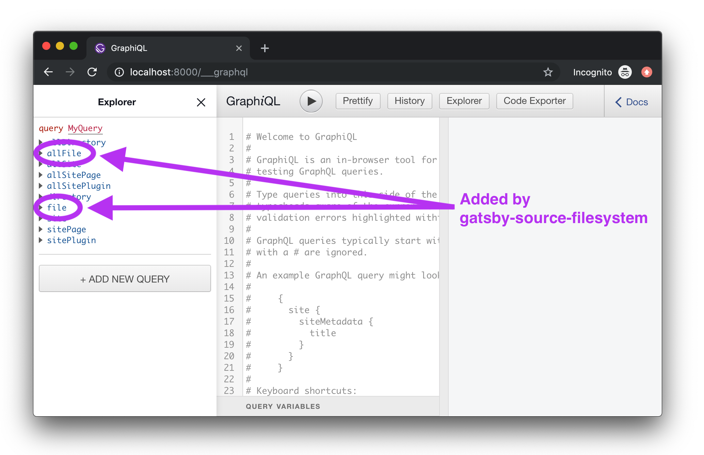
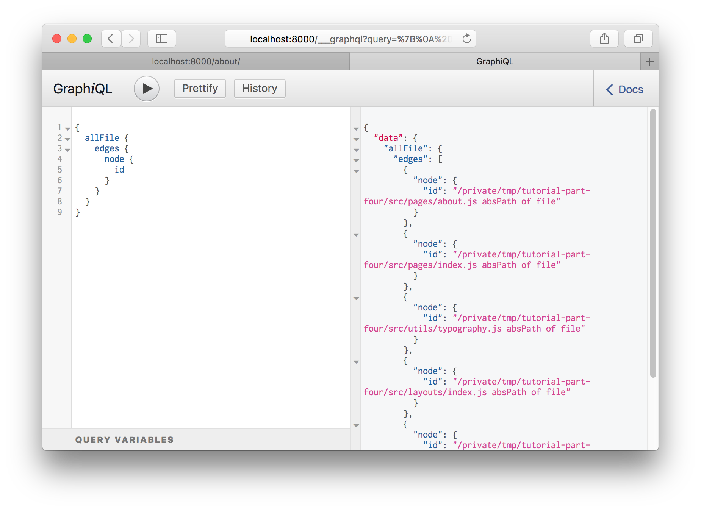
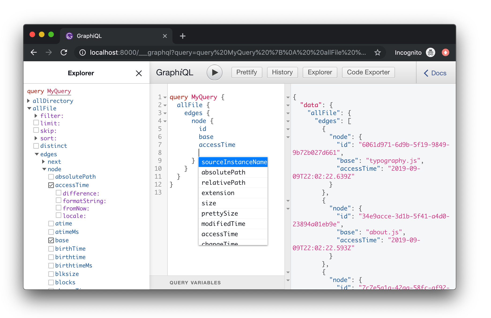
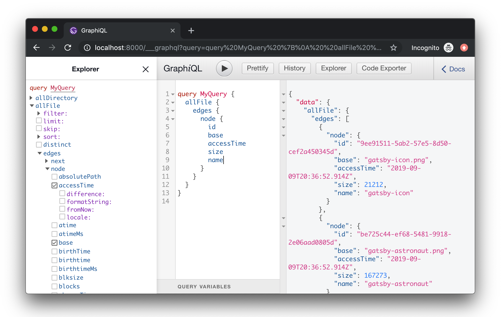
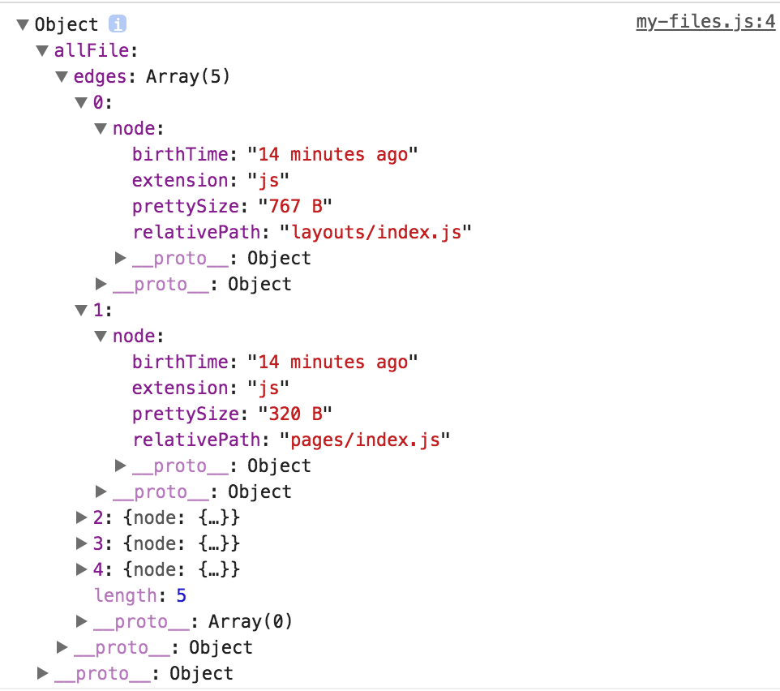
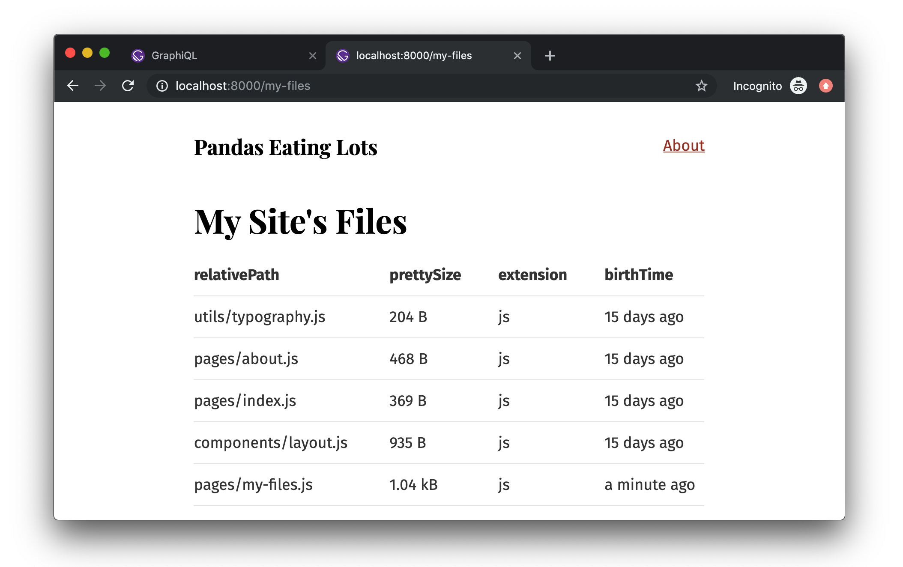

## What's in this tutorial?

In this tutorial, you'll be learning about how to pull data into your Gatsby site using GraphQL and source plugins. Before you learn about these plugins, however, you'll want to know how to use something called Graph_i_QL, a tool that helps you structure your queries correctly.

## Introducing Graph_i_QL

Graph_i_QL is the GraphQL integrated development environment (IDE). It's a powerful (and all-around awesome) tool
you'll use often while building Gatsby websites.

You can access it when your site's development server is running—normally at
<http://localhost:8000/___graphql>.

<video controls="controls" autoplay="true" loop="true">
  <source type="video/mp4" src="/graphiql-explore.mp4"></source>
  <p>Your browser does not support the video element.</p>
</video>

Here you poke around the built-in `Site` "type" and see what fields are available
on it—including the `siteMetadata` object you queried earlier. Try opening
Graph_i_QL and play with your data! Press <kbd>Ctrl + Space</kbd> to bring up
the autocomplete window and <kbd>Ctrl + Enter</kbd> to run the GraphQL query. You'll be
using Graph_i_QL a lot more through the remainder of the tutorial.

## Source plugins

Data in Gatsby sites can come from anywhere: APIs, databases, CMSs,
local files, etc.

Source plugins fetch data from their source. E.g. the filesystem source plugin
knows how to fetch data from the file system. The WordPress plugin knows how to
fetch data from the WordPress API.

Let's add [`gatsby-source-filesystem`](/packages/gatsby-source-filesystem/) and
explore how it works.

First install the plugin at the root of the project:

```sh
npm install --save gatsby-source-filesystem
```

Then add it to your `gatsby-config.js`:

```javascript{6-12}
module.exports = {
  siteMetadata: {
    title: `Pandas Eating Lots`,
  },
  plugins: [
    {
      resolve: `gatsby-source-filesystem`,
      options: {
        name: `src`,
        path: `${__dirname}/src/`,
      },
    },
    `gatsby-plugin-emotion`,
    {
      resolve: `gatsby-plugin-typography`,
      options: {
        pathToConfigModule: `src/utils/typography`,
      },
    },
  ],
}
```

Save that and restart the gatsby development server. Then open up Graph_i_QL
again.

If you bring up the autocomplete window, you'll see:



Hit <kbd>Enter</kbd> on `allFile` then type <kbd>Ctrl + Enter</kbd> to run a
query.



Delete the `id` from the query and bring up the autocomplete again (<kbd>Ctrl +
Space</kbd>).



Try adding a number of fields to your query, pressing <kbd>Ctrl + Enter</kbd>
each time to re-run the query. You'll see something like this:



The result is an array of File "nodes" (node is a fancy name for an object in a
"graph"). Each File object has the fields you queried for.

## Build a page with a GraphQL query

Building new pages with Gatsby often starts in Graph_i_QL. You first sketch out
the data query by playing in Graph_i_QL then copy this to a React page component
to start building the UI.

Let's try this.

Create a new file at `src/pages/my-files.js` with the `allFile` GraphQL query you just
created:

```jsx{6}
import React from "react"
import { graphql } from "gatsby"
import Layout from "../components/layout"

export default ({ data }) => {
  console.log(data)
  return (
    <Layout>
      <div>Hello world</div>
    </Layout>
  )
}

export const query = graphql`
  query {
    allFile {
      edges {
        node {
          relativePath
          prettySize
          extension
          birthTime(fromNow: true)
        }
      }
    }
  }
`
```

The `console.log(data)` line is highlighted above. It's often helpful when
creating a new component to console out the data you're getting from the GraphQL query
so you can explore the data in your browser console while building the UI.

If you visit the new page at `/my-files/` and open up your browser console
you will see something like:



The shape of the data matches the shape of the GraphQL query.

Let's add some code to your component to print out the File data.

```jsx{9-31}
import React from "react"
import { graphql } from "gatsby"
import Layout from "../components/layout"

export default ({ data }) => {
  console.log(data)
  return (
    <Layout>
      <div>
        <h1>My Site's Files</h1>
        <table>
          <thead>
            <tr>
              <th>relativePath</th>
              <th>prettySize</th>
              <th>extension</th>
              <th>birthTime</th>
            </tr>
          </thead>
          <tbody>
            {data.allFile.edges.map(({ node }, index) => (
              <tr key={index}>
                <td>{node.relativePath}</td>
                <td>{node.prettySize}</td>
                <td>{node.extension}</td>
                <td>{node.birthTime}</td>
              </tr>
            ))}
          </tbody>
        </table>
      </div>
    </Layout>
  )
}

export const query = graphql`
  query {
    allFile {
      edges {
        node {
          relativePath
          prettySize
          extension
          birthTime(fromNow: true)
        }
      }
    }
  }
`
```

And… 😲



## What's coming next?

Now you've learned how source plugins bring data _into_ Gatsby’s data system. In the next tutorial, you'll learn how transformer plugins _transform_ the raw content brought by source plugins. The combination of source plugins and transformer plugins can handle all data sourcing and data transformation you might need when building a Gatsby site. Click here for the [next tutorial to learn about transformer plugins](/tutorial/part-six/).
