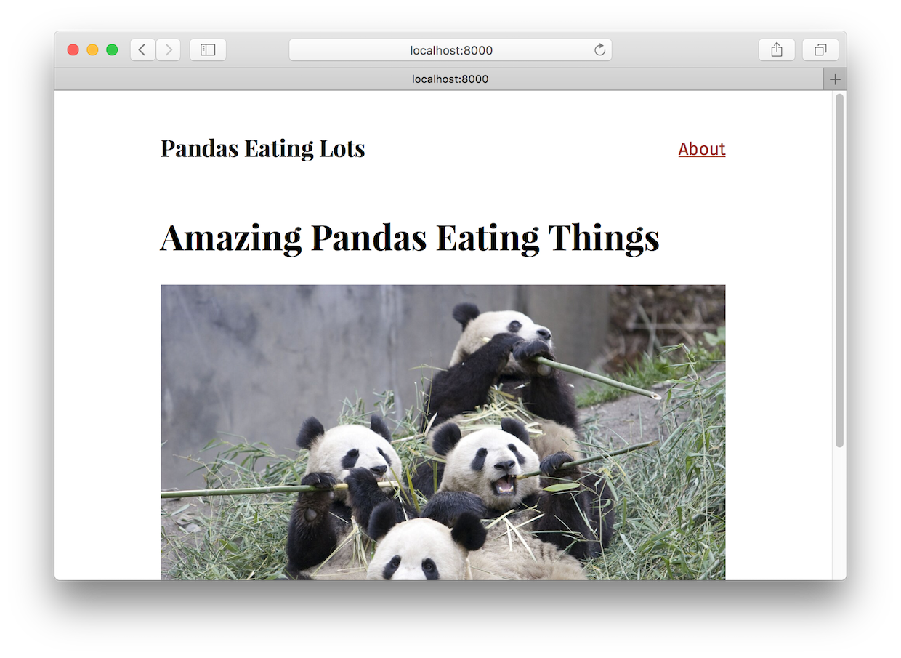
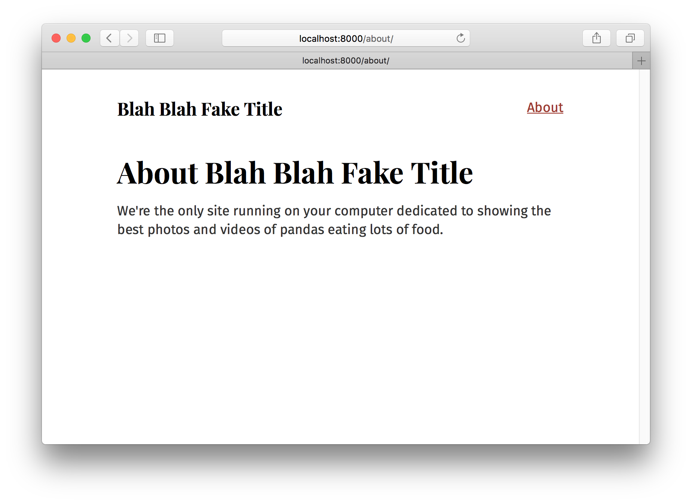

Welcome to Part Four of the tutorial! Halfway through! Hope things are starting to feel pretty comfortable 😀

But don't feel too comfortable 😉. In this tutorial, we're going to travel into some new territory which will requires some brain stretching to fully understand. But don't worry, it'll be worth it. In the next two parts of the tutorial, we'll be diving into the Gatsby data layer!

## Recap of first half of the tutorial

So far we've been learning how to use React.js components to build websites. That we can easily create our own components to act as custom building blocks for building sites.

We've also explored styling components using CSS-in-JS which lets us encapsulate CSS within our components.

## Data

A website has four parts, HTML, CSS, JS, and data. The first half of the tutorial focused on the first three. Let's learn now how to use data in Gatsby sites.

What is data?

A very computer science-y answer would be—data is things like `"strings"`, integers (`42`), objects (`{ pizza: true }`), etc.

For the purpose of working in Gatsby however, a more useful answer is "everything that's not in a React component".

So far we've been writing text and adding images *directly* in components. Which is an *excellent* way to build many websites. But often you want to store data *outside* components and then bring the data *into* the component as needed.

For example, if you're building a site with Wordpress and Gatsby, the *data* for the site (pages and posts) are in Wordpress and you *pull* that data as needed into your components.

Data can also live in markdown, csv, and other files, databases, and APIs of all sort.

**Gatsby's data layer lets us pull data from these (and any other source) directly into our components**—in the shape and form we want our data.

## How Gatsby's data layer uses GraphQL to pull data into components 

If you're familiar with the React world, there's many options for how to load data into components. One of the most popular and robust of these is a technology called [GraphQL](http://graphql.org/).

GraphQL was invented at Facebook to help product engineers pull data into components.

GraphQL is a query language (the *QL* part of its name). If you're familiar with SQL, it works in a very similar way. You describe in code, using a special syntax, the data you want and then that data is given to you.

Gatsby uses GraphQL to let components declare, using GraphQL queries, the data it needs and then gives this data to components.

## Our first GraphQL query

Let's create another new site for this part of the tutorial like in the previous parts. We're going to build a simple markdown blog called "Pandas Eating Lots". It's dedicated to showing off the best pictures & videos of Pandas eating lots of food. Along the way we'll be dipping our toes into GraphQL and Gatsby's markdown support.

```shell
gatsby new tutorial-part-four https://github.com/gatsbyjs/gatsby-starter-hello-world
```

Then install some other needed dependencies. We'll use the Typography theme Kirkham + we'll try out another CSS-in-JS library [Glamorous](https://glamorous.rocks/).

```shell
npm install --save gatsby-plugin-typography gatsby-plugin-glamor glamorous typography-theme-kirkham
```

Let's setup a site similar to what we ended with last time with a layout component and two page components.

`src/pages/index.js`

```jsx
import React from "react"

export default () =>
  <div>
    <h1>Amazing Pandas Eating Things</h1>
    <div>
      
    </div>
  </div>
```

`src/pages/about.js`

```jsx
import React from "react"

export default () =>
  <div>
    <h1>About Pandas Eating Lots</h1>
    <p>
      We're the only site running on your computer dedicated to showing the best
      photos and videos of pandas eating lots of food.
    </p>
  </div>
```

`src/layouts/index.js`

```jsx
import React from "react"
import g from "glamorous"
import { css } from "glamor"
import Link from "gatsby-link"

import { rhythm } from "../utils/typography"

const linkStyle = css({ float: `right` })

export default ({ children }) =>
  <g.Div
    margin={`0 auto`}
    maxWidth={700}
    padding={rhythm(2)}
    paddingTop={rhythm(1.5)}
  >
    <Link to={`/`}>
      <g.H3
        marginBottom={rhythm(2)}
        display={`inline-block`}
        fontStyle={`normal`}
      >
        Pandas Eating Lots
      </g.H3>
    </Link>
    <Link className={linkStyle} to={`/about/`}>
      About
    </Link>
    {children()}
  </g.Div>
```

`src/utils/typography.js`

```javascript
import Typography from "typography"
import kirkhamTheme from "typography-theme-kirkham"

const typography = new Typography(kirkhamTheme)

module.exports = typography
```

`gatsby-config.js`

```javascript
module.exports = {
  plugins: [
    `gatsby-plugin-glamor`,
    {
      resolve: `gatsby-plugin-typography`,
      options: {
        pathToConfigModule: `src/utils/typography`,
      },
    },
  ],
}
```

Add the above files and then run `gatsby develop` like normal and you should see the following:



We have another simple site with a layout and two pages.

Now let's start querying 😋

When building sites, it's common to want to reuse common bits of data across the site. Like the *site title* for example. You'll notice looking at the About page that we have the site title in both the layout component (for the header) as well as the title of the About page. But what if we want to change the site title at some point in the future? We'd have to search across the site for everywhere we put the title. Which is both cumbersome but it's also easy to miss spots, especially as sites get larger and more complex. Much better to store the title in one place and then *pull* that title into components whenever we need it.

To solve this Gatsby supports a simple pattern for adding site "metadata" like the title.

In your `gatsby-config.js` you can add data which you can then easily query in your components. So let's add our site title to `gatsby-config.js` and then query it from our layout and about page!

Edit your `gatsby-config.js`:

```javascript{2-4}
module.exports = {
  siteMetadata: {
    title: `Blah Blah Fake Title`,
  },
  plugins: [
    `gatsby-plugin-glamor`,
    {
      resolve: `gatsby-plugin-typography`,
      options: {
        pathToConfigModule: `src/utils/typography`,
      },
    },
  ],
}
```

Then edit the two components:

`src/pages/about.js`

```jsx{3,6,11-14}
import React from "react"

export default ({ data }) =>
  <div>
    <h1>
      About {data.site.siteMetadata.title}
    </h1>
    <p>
      We're the only site running on your computer dedicated to showing the best
      photos and videos of pandas eating lots of food.
    </p>
  </div>

export const query = graphql`
  query AboutQuery {
    site {
      siteMetadata {
        title
      }
    }
  }
`
```

`src/layouts/index.js`

```jsx{10,19,28-33}
import React from "react"
import g from "glamorous"
import { css } from "glamor"
import Link from "gatsby-link"

import { rhythm } from "../utils/typography"

const linkStyle = css({ float: `right` })

export default ({ children, data }) =>
  <g.Div
    margin={`0 auto`}
    maxWidth={700}
    padding={rhythm(2)}
    paddingTop={rhythm(1.5)}
  >
    <Link to={`/`}>
      <g.H3 marginBottom={rhythm(2)} display={`inline-block`}>
        {data.site.siteMetadata.title}
      </g.H3>
    </Link>
    <Link className={linkStyle} to={`/about/`}>
      About
    </Link>
    {children()}
  </g.Div>

export const query = graphql`
  query LayoutQuery {
    site {
      siteMetadata {
        title
      }
    }
  }
`
```

It worked!! 🎉



But let's restore the real title.

One of the core principles of Gatsby is creators need an immediate connection to what they're creating ([hat tip to Bret Victor](http://blog.ezyang.com/2012/02/transcript-of-inventing-on-principleb/)). Or in other words, when you make any change to code you should immediately see the effect of that change. You manipulate an input of Gatsby and you see the new output showing up on the screen.

So almost everywhere, changes you make will immediately take effect.

Try editing the title in `siteMetadata`—change the title back to "Pandas Eating Lots". The change should show up very quickly in your browser.

## Introduce Graph*i*QL

Graph*i*QL is the GraphQL IDE. It's a powerful (and all-around awesome) tool you'll use often while building Gatsby websites.

You can access when your site's development server is running—normally at http://localhost:8000/___graphql

<video controls="controls" autoplay="true" loop="true">
  <source type="video/mp4" src="/graphiql-explore.mp4"></source>
  <p>Your browser does not support the video element.</p>
</video>

Here we poke around the built-in `Site` "type" and see what fields are available on it—including the `siteMetadata` object we queried earlier. Try opening Graph*i*QL and play with your data! Press "ctrl-space" to bring up the autocomplete window and "ctrl-enter" to run the query. We'll be using Graph*i*QL a lot more through the remainder of the tutorial.

## Source plugins

Data in Gatsby sites can come literally from anywhere. APIs, databases, CMSs, local files, etc.

Source plugins fetch data from their source. E.g. the filesystem source plugin knows how to fetch data from the file system. The Wordpress plugin nows how to fetch data from the Wordpress API.

Let's add [`gatsby-source-filesystem`](/packages/gatsby-source-filesystem/) and explore how it works.

First install the plugin:

```sh
npm install --save gatsby-source-filesystem
```

Then add it to your `gatsby-config.js`:

```javascript{6-12}
module.exports = {
  siteMetadata: {
    title: `Pandas Eating Lots`,
  },
  plugins: [
    {
      resolve: `gatsby-source-filesystem`,
      options: {
        name: `src`,
        path: `${__dirname}/src/`,
      },
    },
    `gatsby-plugin-glamor`,
    {
      resolve: `gatsby-plugin-typography`,
      options: {
        pathToConfigModule: `src/utils/typography`,
      },
    },
  ],
}
```

Save that and restart the gatsby development server. Then open up Graph*i*QL again.

If you bring up the autocomplete window you'll see:	


Hit enter on `allFile` then type `ctrl-enter` to run a query.

But often the source format of the data isn't what you want to use to build your website. For example markdown. Many people use markdown for writing blog posts because it's a simpler format than HTML. For example this tutorial you're working through is written in markdown :-)

Other common formats data is stored in include JSON, CSV, XML, YAML, and many others. To use these, all of them need *transformed* into JavaScript so they're usable within Gatsby React components.

Which is what transformer plugins do.

So it's very common to use source and transformer plugins together. Let's try this out by adding some markdown files to our project and setup a source & transformer plugin to add it to our project.

### `gatsby-source-filesystem`

Add source-filesystem and have them play around with files and show off data it brings up.

Have them create a page listing all the files with the total count at the top.

### `gatsby-transformer-remark`

Add Markdown — now can query markdown files. HTML, excerpt, reading time, front matter.

## Creating pages from Markdown

gatsby-plugin-markdown-pages

component, fragments, etc.

## Index page

Introduce various options for querying e.g. filter, sort, etc.

## Archive page

common to have all posts listed on an archive page. Not necessary of course here since we have so few pages but it's a good exercise.

## Image handling

gatsby-plugin-sharp / gatsby-remark-sharp & gatsby-remark-iframe, gatsby-plugin-twitter, other remark plugins

add mainImage to posts and query those on front page
