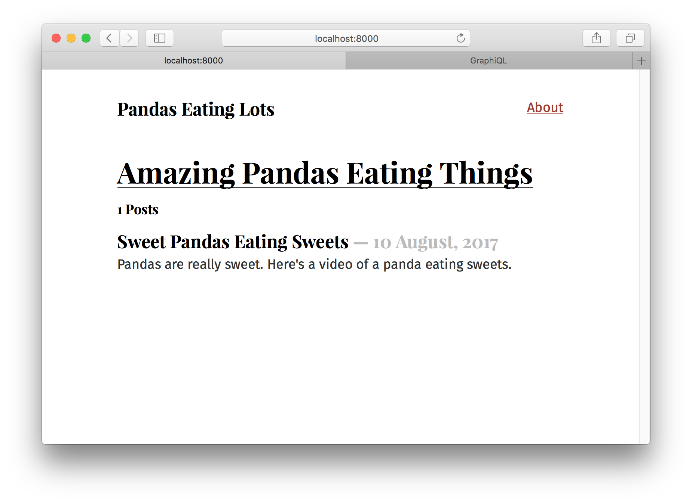
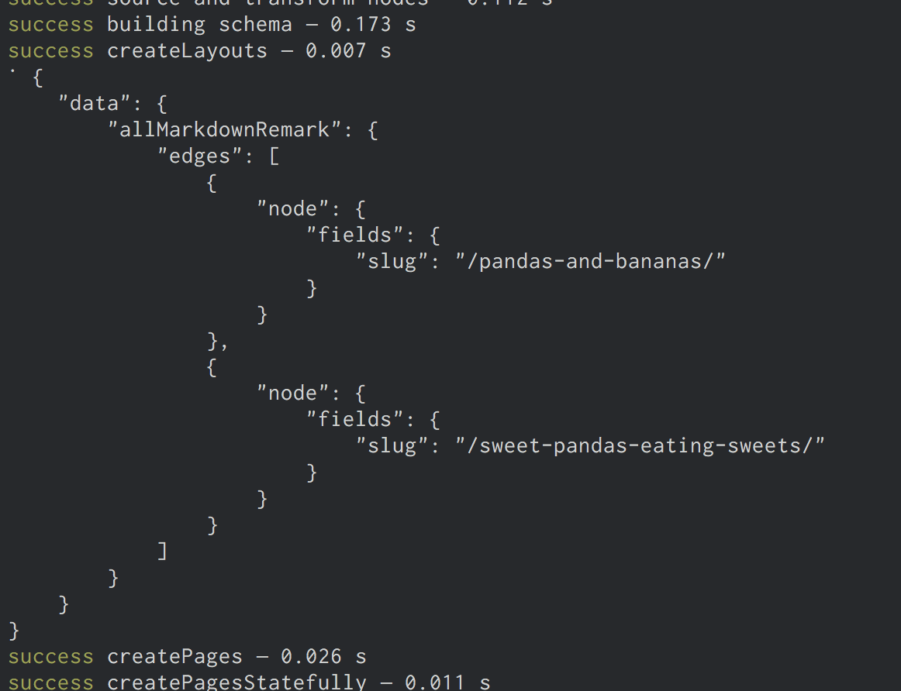
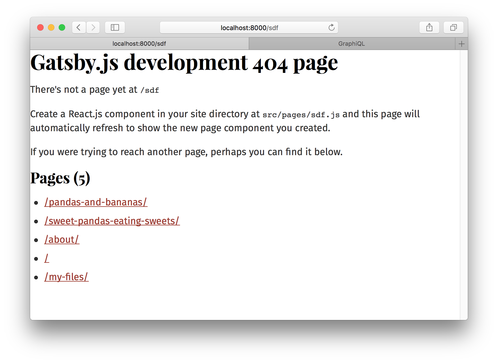

Welcome to Part Four of the tutorial! Halfway through! Hope things are starting
to feel pretty comfortable 😀

But don't get too comfortable 😉. In this tutorial, we're headed to new
territory which will require some brain stretching to fully understand. In the
next two parts of the tutorial, we'll be diving into the Gatsby data layer, which is a
powerful feature of Gatsby that lets you easily build sites from Markdown,
WordPress, headless CMSs, and other data sources of all flavors.

**NOTE:** Gatsby’s data layer is powered by GraphQL. If you’re new to GraphQL,
this section may feel a little overwhelming. For an in-depth tutorial on
GraphQL, we recommend [How to GraphQL](https://www.howtographql.com/).

## Recap of first half of the tutorial

So far, we've been learning how to use React.js—how powerful it is to be able to
create our _own_ components to act as custom building blocks for websites.

We’ve also explored styling components using CSS Modules and CSS-in-JS, which
lets us encapsulate CSS within our components.

## Data in Gatsby

A website has four parts, HTML, CSS, JS, and data. The first half of the
tutorial focused on the first three. Let's learn now how to use data in Gatsby
sites.

What is data?

A very computer science-y answer would be: data is things like `"strings"`,
integers (`42`), objects (`{ pizza: true }`), etc.

For the purpose of working in Gatsby, however, a more useful answer is
"everything that lives outside a React component".

So far, we've been writing text and adding images _directly_ in components.
Which is an _excellent_ way to build many websites. But, often you want to store
data _outside_ components and then bring the data _into_ the component as
needed.

For example, if you're building a site with WordPress (so other contributors
have a nice interface for adding & maintaining content) and Gatsby, the _data_
for the site (pages and posts) are in WordPress and you _pull_ that data, as
needed, into your components.

Data can also live in file types like Markdown, CSV, etc. as well as databases
and APIs of all sorts.

**Gatsby's data layer lets us pull data from these (and any other source)
directly into our components**—in the shape and form we want.

## How Gatsby's data layer uses GraphQL to pull data into components

There are many options for loading data into React components. One of the most
popular and powerful of these is a technology called
[GraphQL](http://graphql.org/).

GraphQL was invented at Facebook to help product engineers _pull_ needed data into
components.

GraphQL is a **q**uery **l**anguage (the _QL_ part of its name). If you're
familiar with SQL, it works in a very similar way. Using a special syntax, you describe
the data you want in your component and then that data is given
to you.

Gatsby uses GraphQL to enable components to declare the data they need.

## Our first GraphQL query

Let's create another new site for this part of the tutorial like in the previous
parts. We're going to build a Markdown blog called "Pandas Eating Lots".
It's dedicated to showing off the best pictures & videos of Pandas eating lots
of food. Along the way we'll be dipping our toes into GraphQL and Gatsby's
Markdown support.

Run this command in a new terminal window:

```shell
gatsby new tutorial-part-four https://github.com/gatsbyjs/gatsby-starter-hello-world
```

Then install some other needed dependencies at the root of the project. We'll use the Typography theme
Kirkham + we'll try out a CSS-in-JS library
[Glamorous](https://glamorous.rocks/). Change to your new `tutorial-part-four` directory and run:

```shell
npm install --save gatsby-plugin-typography gatsby-plugin-glamor glamorous typography-theme-kirkham
```

Let's set up a site similar to what we ended with in Part Three. This site will have a layout
component and two page components:

`src/pages/index.js`

```jsx
import React from "react";

export default () => (
  <div>
    <h1>Amazing Pandas Eating Things</h1>
    <div>
      
    </div>
  </div>
);
```

`src/pages/about.js`

```jsx
import React from "react";

export default () => (
  <div>
    <h1>About Pandas Eating Lots</h1>
    <p>
      We're the only site running on your computer dedicated to showing the best
      photos and videos of pandas eating lots of food.
    </p>
  </div>
);
```

`src/layouts/index.js`

```jsx
import React from "react";
import g from "glamorous";
import { css } from "glamor";
import { Link } from "gatsby";

import { rhythm } from "../utils/typography";

const linkStyle = css({ float: `right` });

export default ({ children }) => (
  <g.Div
    margin={`0 auto`}
    maxWidth={700}
    padding={rhythm(2)}
    paddingTop={rhythm(1.5)}
  >
    <Link to={`/`}>
      <g.H3
        marginBottom={rhythm(2)}
        display={`inline-block`}
        fontStyle={`normal`}
      >
        Pandas Eating Lots
      </g.H3>
    </Link>
    <Link className={linkStyle} to={`/about/`}>
      About
    </Link>
    {children()}
  </g.Div>
);
```

`src/utils/typography.js`

```javascript
import Typography from "typography";
import kirkhamTheme from "typography-theme-kirkham";

const typography = new Typography(kirkhamTheme);

export default typography;
```

`gatsby-config.js` (must be in the root of your project, not under src)

```javascript
module.exports = {
  plugins: [
    `gatsby-plugin-glamor`,
    {
      resolve: `gatsby-plugin-typography`,
      options: {
        pathToConfigModule: `src/utils/typography`,
      },
    },
  ],
};
```

Add the above files and then run `gatsby develop` like normal and you should see
the following:


We have another small site with a layout and two pages.

Now let's start querying 😋

When building sites, it's common to want to reuse common bits of data across the
site. Like the _site title_ for example. Look at the `/about/` page. You'll
notice that we have the site title in both the layout component (the site
header) as well as in the title of the About page. But what if we want to change
the site title at some point in the future? We'd have to search across all our
components for spots using the site title and edit each instance of the title. This process is both cumbersome and
error-prone, especially as sites get larger and more complex. It's much better to
store the title in one place and then _pull_ that title into components whenever
we need it.

To solve this, we can add site "metadata" — like page title or description — to the `gatsby-config.js` file. Let's add our site title to
`gatsby-config.js` file and then query it from our layout and about page!

Edit your `gatsby-config.js`:

```javascript{2-4}
module.exports = {
  siteMetadata: {
    title: `Blah Blah Fake Title`,
  },
  plugins: [
    `gatsby-plugin-glamor`,
    {
      resolve: `gatsby-plugin-typography`,
      options: {
        pathToConfigModule: `src/utils/typography`,
      },
    },
  ],
};
```

Restart the development server.

Then edit the two components:

`src/pages/about.js`

```jsx{3,5-7,14-23}
import React from "react";

export default ({ data }) =>
  <div>
    <h1>
      About {data.site.siteMetadata.title}
    </h1>
    <p>
      We're the only site running on your computer dedicated to showing the best
      photos and videos of pandas eating lots of food.
    </p>
  </div>

export const query = graphql`
  query AboutQuery {
    site {
      siteMetadata {
        title
      }
    }
  }
`
```

`src/layouts/index.js`

```jsx{10,19,28-33}
import React from "react";
import g from "glamorous";
import { css } from "glamor";
import { Link } from "gatsby";

import { rhythm } from "../utils/typography";

const linkStyle = css({ float: `right` })

export default ({ children, data }) =>
  <g.Div
    margin={`0 auto`}
    maxWidth={700}
    padding={rhythm(2)}
    paddingTop={rhythm(1.5)}
  >
    <Link to={`/`}>
      <g.H3 marginBottom={rhythm(2)} display={`inline-block`}>
        {data.site.siteMetadata.title}
      </g.H3>
    </Link>
    <Link className={linkStyle} to={`/about/`}>
      About
    </Link>
    {children()}
  </g.Div>

export const query = graphql`
  query LayoutQuery {
    site {
      siteMetadata {
        title
      }
    }
  }
`
```

It worked!! 🎉


But let's restore the real title.

One of the core principles of Gatsby is creators need an immediate connection to
what they're creating
([hat tip to Bret Victor](http://blog.ezyang.com/2012/02/transcript-of-inventing-on-principleb/)).
Or, in other words, when you make any change to code you should immediately see
the effect of that change. You manipulate an input of Gatsby and you see the new
output showing up on the screen.

So almost everywhere, changes you make will immediately take effect.

Try editing the title in `siteMetadata`—change the title back to "Pandas Eating
Lots". The change should show up very quickly in your browser.

## Wait — where did the graphql tag come from?

You may have noticed that we used a
[tag function](https://developer.mozilla.org/en-US/docs/Web/JavaScript/Reference/Template_literals#Tagged_template_literals)
called `graphql`, but we never actually _import_ a `graphql` tag. So... how does
this not throw an error?

The short answer is this: during the Gatsby build process, GraphQL queries are
pulled out of the original source for parsing.

The longer answer is a little more involved: Gatsby borrows a technique from
[Relay](https://facebook.github.io/relay/) that converts our source code into an
[abstract syntax tree (AST)](https://en.wikipedia.org/wiki/Abstract_syntax_tree)
during the build step. All `graphql`-tagged templates are found in
[`file-parser.js`](https://github.com/gatsbyjs/gatsby/blob/v1.6.3/packages/gatsby/src/internal-plugins/query-runner/file-parser.js#L63)
and
[`query-compiler.js`](https://github.com/gatsbyjs/gatsby/blob/v1.6.3/packages/gatsby/src/internal-plugins/query-runner/query-compiler.js),
which effectively removes them from the original source code. This means that
the `graphql` tag isn’t executed the way that we might expect, which is why
there’s no error, despite the fact that we’re technically using an undefined tag
in our source.

## Introducing Graph_i_QL

Graph_i_QL is the GraphQL integrated development environment (IDE). It's a powerful (and all-around awesome) tool
you'll use often while building Gatsby websites.

You can access it when your site's development server is running—normally at
<http://localhost:8000/___graphql>.

<video controls="controls" autoplay="true" loop="true">
  <source type="video/mp4" src="/graphiql-explore.mp4"></source>
  <p>Your browser does not support the video element.</p>
</video>

Here we poke around the built-in `Site` "type" and see what fields are available
on it—including the `siteMetadata` object we queried earlier. Try opening
Graph_i_QL and play with your data! Press <kbd>Ctrl + Space</kbd> to bring up
the autocomplete window and <kbd>Ctrl + Enter</kbd> to run the query. We'll be
using Graph_i_QL a lot more through the remainder of the tutorial.

## Source plugins

Data in Gatsby sites can come literally from anywhere: APIs, databases, CMSs,
local files, etc.

Source plugins fetch data from their source. E.g. the filesystem source plugin
knows how to fetch data from the file system. The WordPress plugin knows how to
fetch data from the WordPress API.

Let's add [`gatsby-source-filesystem`](/packages/gatsby-source-filesystem/) and
explore how it works.

First install the plugin at the root of the project:

```sh
npm install --save gatsby-source-filesystem
```

Then add it to your `gatsby-config.js`:

```javascript{6-12}
module.exports = {
  siteMetadata: {
    title: `Pandas Eating Lots`,
  },
  plugins: [
    {
      resolve: `gatsby-source-filesystem`,
      options: {
        name: `src`,
        path: `${__dirname}/src/`,
      },
    },
    `gatsby-plugin-glamor`,
    {
      resolve: `gatsby-plugin-typography`,
      options: {
        pathToConfigModule: `src/utils/typography`,
      },
    },
  ],
};
```

Save that and restart the gatsby development server. Then open up Graph_i_QL
again.

If you bring up the autocomplete window you'll see:


Hit <kbd>Enter</kbd> on `allFile` then type <kbd>Ctrl + Enter</kbd> to run a
query.


Delete the `id` from the query and bring up the autocomplete again (<kbd>Ctrl +
Space</kbd>).


Try adding a number of fields to your query, pressing <kbd>Ctrl + Enter</kbd>
each time to re-run the query. You'll see something like this:


The result is an array of File "nodes" (node is a fancy name for an object in a
"graph"). Each File object has the fields we queried for.

## Build a page with a GraphQL query

Building new pages with Gatsby often starts in Graph_i_QL. You first sketch out
the data query by playing in Graph_i_QL then copy this to a React page component
to start building the UI.

Let's try this.

Create a new file at `src/pages/my-files.js` with the `allFile` query we just
created:

```jsx{4}
import React from "react"

export default ({ data }) => {
  console.log(data)
  return <div>Hello world</div>
}

export const query = graphql`
  query MyFilesQuery {
    allFile {
      edges {
        node {
          relativePath
          prettySize
          extension
          birthTime(fromNow: true)
        }
      }
    }
  }
`
```

The `console.log(data)` line is highlighted above. It's often helpful when
creating a new component to console out the data you're getting from the query
so you can explore the data in your browser console while building the UI.

If you visit the new page at `/my-files/` and open up your browser console you
will see:


The shape of the data matches the shape of the query.

Let's add some code to our component to print out the File data.

```jsx{5-37}
import React from "react"

export default ({ data }) => {
  console.log(data)
  return (
    <div>
      <h1>My Site's Files</h1>
      <table>
        <thead>
          <tr>
            <th>relativePath</th>
            <th>prettySize</th>
            <th>extension</th>
            <th>birthTime</th>
          </tr>
        </thead>
        <tbody>
          {data.allFile.edges.map(({ node }, index) =>
            <tr key={index}>
              <td>
                {node.relativePath}
              </td>
              <td>
                {node.prettySize}
              </td>
              <td>
                {node.extension}
              </td>
              <td>
                {node.birthTime}
              </td>
            </tr>
          )}
        </tbody>
      </table>
    </div>
  )
}

export const query = graphql`
  query MyFilesQuery {
    allFile {
      edges {
        node {
          relativePath
          prettySize
          extension
          birthTime(fromNow: true)
        }
      }
    }
  }
`
```

And… 😲


## Transformer plugins

Often, the format of the data we get from source plugins isn't what you want to
use to build your website. The filesystem source plugin lets you query data
_about_ files but what if you want to query data _inside_ files?

To make this possible, Gatsby supports transformer plugins which take raw
content from source plugins and _transform_ it into something more usable.

For example, Markdown files. Markdown is nice to write in but when you build a
page with it, you need the Markdown to be HTML.

Let's add a Markdown file to our site at
`src/pages/sweet-pandas-eating-sweets.md` (This will become our first Markdown
blog post) and learn how to _transform_ it to HTML using transformer plugins and
GraphQL.

```markdown
---
title: "Sweet Pandas Eating Sweets"
date: "2017-08-10"
---

Pandas are really sweet.

Here's a video of a panda eating sweets.

<iframe width="560" height="315" src="https://www.youtube.com/embed/4n0xNbfJLR8" frameborder="0" allowfullscreen></iframe>
```

Once you save the file, look at `/my-files/` again—the new Markdown file is in
the table. This is a very powerful feature of Gatsby. Like the earlier
`siteMetadata` example, source plugins can live reload data.
`gatsby-source-filesystem` is always scanning for new files to be added and when
they are, re-runs your queries.

Let's add a transformer plugin that can transform Markdown files:

```shell
npm install --save gatsby-transformer-remark
```

Then add it to the `gatsby-config.js` like normal:

```javascript{13}
module.exports = {
  siteMetadata: {
    title: `Pandas Eating Lots`,
  },
  plugins: [
    {
      resolve: `gatsby-source-filesystem`,
      options: {
        name: `src`,
        path: `${__dirname}/src/`,
      },
    },
    `gatsby-transformer-remark`,
    `gatsby-plugin-glamor`,
    {
      resolve: `gatsby-plugin-typography`,
      options: {
        pathToConfigModule: `src/utils/typography`,
      },
    },
  ],
};
```

Restart the development server then refresh (or open again) Graph_i_QL and look
at the autocomplete:


Select `allMarkdownRemark` again and run it like we did for `allFile`. You'll
see there the Markdown file we recently added. Explore the fields that are
available on the `MarkdownRemark` node.


Ok! Hopefully some basics are starting to fall into place. Source plugins bring
data _into_ Gatsby's data system and _transformer_ plugins transform raw content
brought by source plugins. This pattern can handle all data sourcing and
data transformation you might need when building a Gatsby site.

## Create a list of our site's Markdown files in `src/pages/index.js`

Let's now create a list of our Markdown files on the front page. Like many
blogs, we want to end up with a list of links on the front page pointing to each
blog post. With GraphQL we can _query_ for the current list of Markdown blog
posts so we won't need to maintain the list manually.

Like with the `src/pages/my-files.js` page, replace `src/pages/index.js` with
the following to add a query with some initial HTML and styling.

```jsx
import React from "react";
import g from "glamorous";

import { rhythm } from "../utils/typography";

export default ({ data }) => {
  console.log(data);
  return (
    <div>
      <g.H1 display={"inline-block"} borderBottom={"1px solid"}>
        Amazing Pandas Eating Things
      </g.H1>
      <h4>{data.allMarkdownRemark.totalCount} Posts</h4>
      {data.allMarkdownRemark.edges.map(({ node }) => (
        <div key={node.id}>
          <g.H3 marginBottom={rhythm(1 / 4)}>
            {node.frontmatter.title}{" "}
            <g.Span color="#BBB">— {node.frontmatter.date}</g.Span>
          </g.H3>
          <p>{node.excerpt}</p>
        </div>
      ))}
    </div>
  );
};

export const query = graphql`
  query IndexQuery {
    allMarkdownRemark {
      totalCount
      edges {
        node {
          id
          frontmatter {
            title
            date(formatString: "DD MMMM, YYYY")
          }
          excerpt
        }
      }
    }
  }
`;
```

Now the frontpage should look like:



But our one blog post looks a bit lonely. So let's add another one at
`src/pages/pandas-and-bananas.md`

```markdown
---
title: Pandas and Bananas
date: "2017-08-21"
---

Do Pandas eat bananas? Check out this short video that shows that yes! pandas do
seem to really enjoy bananas!

<iframe width="560" height="315" src="https://www.youtube.com/embed/4SZl1r2O_bY" frameborder="0" allowfullscreen></iframe>
```


Which looks great! Except… the order of the posts is wrong.

But this is easy to fix. When querying a connection of some type, you can pass a
variety of arguments to the query. You can `sort` and `filter` nodes, set how
many nodes to `skip`, and choose the `limit` of how many nodes to retrieve. With
this powerful set of operators, we can select any data we want—in the format we
need.

In our index page's query, change `allMarkdownRemark` to
`allMarkdownRemark(sort: {fields: [frontmatter___date], order: DESC})`. Save
this and the sort order should be fixed.

Try opening Graph_i_QL and playing with different sort options. You can sort the
`allFile` connection along with other connections.

## Programmatically creating pages from data

So this is great! We have a nice index page where we're querying our Markdown
files. But we don't want to just see excerpts, we want actual pages for our
Markdown files.

Let's get started.

So far, we've created pages by placing React components in `src/pages`. We'll
now learn how to _programmatically_ create pages from _data_. Gatsby is _not_
limited to making pages from files like many static site generators. Gatsby lets
you use GraphQL to query your _data_ and _map_ the data to _pages_—all at build
time. This is a really powerful idea. We'll be exploring its implications and
ways to use it for the remainder of the tutorial.

Creating new pages has two steps:

1. Generate the "path" or "slug" for the page.
2. Create the page.

To create our Markdown pages, we'll learn to use two Gatsby APIs
[`onCreateNode`](/docs/node-apis/#onCreateNode) and
[`createPages`](/docs/node-apis/#createPages). These are two workhorse APIs
you'll see used in many sites and plugins.

We do our best to make Gatsby APIs simple to implement. To implement an API, you export a function
with the name of the API from `gatsby-node.js`.

So let's do that. In the root of your site, create a file named
`gatsby-node.js`. Then add to it the following. This function will be called by
Gatsby whenever a new node is created (or updated).

```javascript
exports.onCreateNode = ({ node }) => {
  console.log(node.internal.type);
};
```

Stop and restart the development server. As you do, you'll see quite a few newly
created nodes get logged to the terminal console.

Let's use this API to add the slugs for our Markdown pages to `MarkdownRemark`
nodes.

Change our function so it now is only looking at `MarkdownRemark` nodes.

```javascript{2-4}
exports.onCreateNode = ({ node }) => {
  if (node.internal.type === `MarkdownRemark`) {
    console.log(node.internal.type)
  }
};
```

We want to use each Markdown file name to create the page slug. So
`pandas-and-bananas.md"` will become `/pandas-and-bananas/`. But how do we get
the file name from the `MarkdownRemark` node? To get it, we need to _traverse_
the "node graph" to its _parent_ `File` node, as `File` nodes contain data we
need about files on disk. To do that, modify our function again:

```javascript{1,3-4}
exports.onCreateNode = ({ node, getNode }) => {
  if (node.internal.type === `MarkdownRemark`) {
    const fileNode = getNode(node.parent)
    console.log(`\n`, fileNode.relativePath)
  }
};
```

There in your terminal you should see the relative paths for our two Markdown
files.


Now let's create slugs. As the logic for creating slugs from file names can get
tricky, the `gatsby-source-filesystem` plugin ships with a function for creating
slugs. Let's use that.

```javascript{1,5}
const { createFilePath } = require(`gatsby-source-filesystem`);

exports.onCreateNode = ({ node, getNode }) => {
  if (node.internal.type === `MarkdownRemark`) {
    console.log(createFilePath({ node, getNode, basePath: `pages` }))
  }
};
```

The function handles finding the parent `File` node along with creating the
slug. Run the development server again and you should see logged to the terminal
two slugs, one for each Markdown file.

Now lets add our new slugs directly onto the `MarkdownRemark` nodes. This is
powerful, as any data we add to nodes is available to query later with GraphQL.
So it'll be easy to get the slug when it comes time to create the pages.

To do so, we'll use a function passed to our API implementation called
[`createNodeField`](/docs/bound-action-creators/#createNodeField). This function
allows us to create additional fields on nodes created by other plugins. Only
the original creator of a node can directly modify the node—all other plugins
(including our `gatsby-node.js`) must use this function to create additional
fields.

```javascript{3,4,6-11}
const { createFilePath } = require(`gatsby-source-filesystem`);

exports.onCreateNode = ({ node, getNode, boundActionCreators }) => {
  const { createNodeField } = boundActionCreators
  if (node.internal.type === `MarkdownRemark`) {
    const slug = createFilePath({ node, getNode, basePath: `pages` })
    createNodeField({
      node,
      name: `slug`,
      value: slug,
    })
  }
};
```

Restart the development server and open or refresh Graph_i_QL. Then run this
query to see our new slugs.

```graphql
{
  allMarkdownRemark {
    edges {
      node {
        fields {
          slug
        }
      }
    }
  }
}
```

Now that the slugs are created, we can create the pages.

In the same `gatsby-node.js` file, add the following. Here we tell Gatsby about
our pages—what are their paths, what template component do they use, etc.

```javascript{15-34}
const { createFilePath } = require(`gatsby-source-filesystem`);

exports.onCreateNode = ({ node, getNode, boundActionCreators }) => {
  const { createNodeField } = boundActionCreators
  if (node.internal.type === `MarkdownRemark`) {
    const slug = createFilePath({ node, getNode, basePath: `pages` })
    createNodeField({
      node,
      name: `slug`,
      value: slug,
    })
  }
};

exports.createPages = ({ graphql, boundActionCreators }) => {
  return new Promise((resolve, reject) => {
    graphql(`
      {
        allMarkdownRemark {
          edges {
            node {
              fields {
                slug
              }
            }
          }
        }
      }
    `).then(result => {
      console.log(JSON.stringify(result, null, 4))
      resolve()
    })
  })
};
```

We've added an implementation of the
[`createPages`](/docs/node-apis/#createPages) API which Gatsby calls to add
pages. We're using the passed in `graphql` function to query for the Markdown
slugs we just created. Then we're logging out the result of the query which
should look like:



We need one other thing to create pages: a page template component. Like
everything in Gatsby, programmatic pages are powered by React components. When
creating a page, we need to specify which component to use.

Create a directory at `src/templates` and then add the following in a file named
`src/templates/blog-post.js`.

```jsx
import React from "react";

export default () => {
  return <div>Hello blog post</div>;
};
```

Then update `gatsby-node.js`

```javascript{1,17,32-41}
const path = require(`path`);
const { createFilePath } = require(`gatsby-source-filesystem`);

exports.onCreateNode = ({ node, getNode, boundActionCreators }) => {
  const { createNodeField } = boundActionCreators
  if (node.internal.type === `MarkdownRemark`) {
    const slug = createFilePath({ node, getNode, basePath: `pages` })
    createNodeField({
      node,
      name: `slug`,
      value: slug,
    })
  }
};

exports.createPages = ({ graphql, boundActionCreators }) => {
  const { createPage } = boundActionCreators
  return new Promise((resolve, reject) => {
    graphql(`
      {
        allMarkdownRemark {
          edges {
            node {
              fields {
                slug
              }
            }
          }
        }
      }
    `).then(result => {
      result.data.allMarkdownRemark.edges.forEach(({ node }) => {
        createPage({
          path: node.fields.slug,
          component: path.resolve(`./src/templates/blog-post.js`),
          context: {
            // Data passed to context is available in page queries as GraphQL variables.
            slug: node.fields.slug,
          },
        })
      })
      resolve()
    })
  })
};
```

Restart the development server and our pages will be created! An easy way to
find new pages you create while developing is to go to a random path where
Gatsby will helpfully show you a list of pages on the site. If you go to
<http://localhost:8000/sdf> you'll see the new pages we created.



Visit one of them and we see:


Which is a bit boring. Let's pull in data from our Markdown post. Change
`src/templates/blog-post.js` to:

```jsx
import React from "react";

export default ({ data }) => {
  const post = data.markdownRemark;
  return (
    <div>
      <h1>{post.frontmatter.title}</h1>
      <div dangerouslySetInnerHTML={{ __html: post.html }} />
    </div>
  );
};

export const query = graphql`
  query BlogPostQuery($slug: String!) {
    markdownRemark(fields: { slug: { eq: $slug } }) {
      html
      frontmatter {
        title
      }
    }
  }
`;
```

And…


Sweet!

The last step is to link to our new pages from the index page.

Return to `src/pages/index.js` and let's query for our Markdown slugs and create
links.

```jsx{3,18-19,29,47-49}
import React from "react"
import g from "glamorous"
import { Link } from "gatsby"

import { rhythm } from "../utils/typography";

export default ({ data }) => {
  return (
    <div>
      <g.H1 display={"inline-block"} borderBottom={"1px solid"}>
        Amazing Pandas Eating Things
      </g.H1>
      <h4>
        {data.allMarkdownRemark.totalCount} Posts
      </h4>
      {data.allMarkdownRemark.edges.map(({ node }) =>
        <div key={node.id}>
          <Link
            to={node.fields.slug}
            css={{ textDecoration: `none`, color: `inherit` }}
          >
            <g.H3 marginBottom={rhythm(1 / 4)}>
              {node.frontmatter.title}{" "}
              <g.Span color="#BBB">— {node.frontmatter.date}</g.Span>
            </g.H3>
            <p>
              {node.excerpt}
            </p>
          </Link>
        </div>
      )}
    </div>
  )
}

export const query = graphql`
  query IndexQuery {
    allMarkdownRemark(sort: { fields: [frontmatter___date], order: DESC }) {
      totalCount
      edges {
        node {
          id
          frontmatter {
            title
            date(formatString: "DD MMMM, YYYY")
          }
          fields {
            slug
          }
          excerpt
        }
      }
    }
  }
`
```

And there we go! A working, albeit small, blog!

Try playing more with the site. Try adding some more Markdown files. Explore
querying other data from the `MarkdownRemark` nodes and adding them to the
frontpage or blog posts pages.

In this part of the tutorial, we've learned the foundations of building with
Gatsby's data layer. You've learned how to _source_ and _transform_ data using
plugins. How to use GraphQL to _map_ data to pages. Then how to build _page
template components_ where you query for data for each page.

## Where next?

Now that you've built a Gatsby site, where do you head to next?

You could take a look at some [example sites](https://github.com/gatsbyjs/gatsby/tree/master/examples#gatsby-example-websites) and [plugins](/docs/plugins/), see what [other people are building with Gatsby](https://github.com/gatsbyjs/gatsby/#showcase), or check out the documentation on [Gatsby's APIs](/docs/api-specification/), [nodes](/docs/node-interface/) or [GraphQL](/docs/graphql-reference/).
