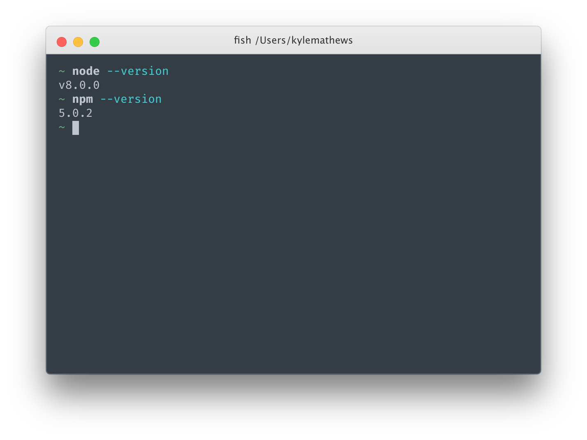
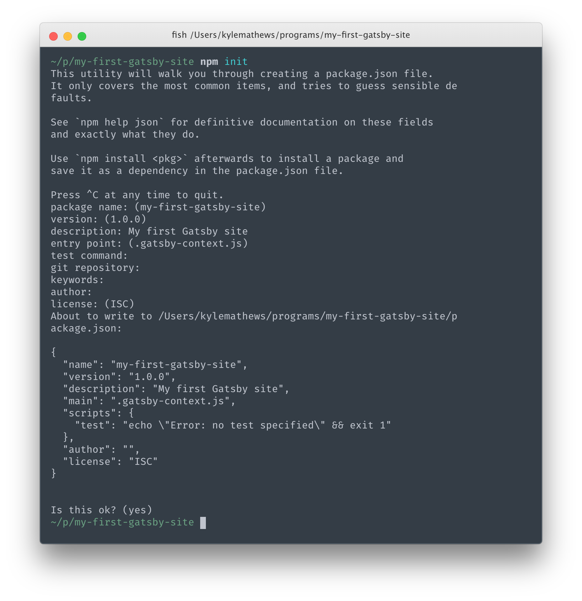
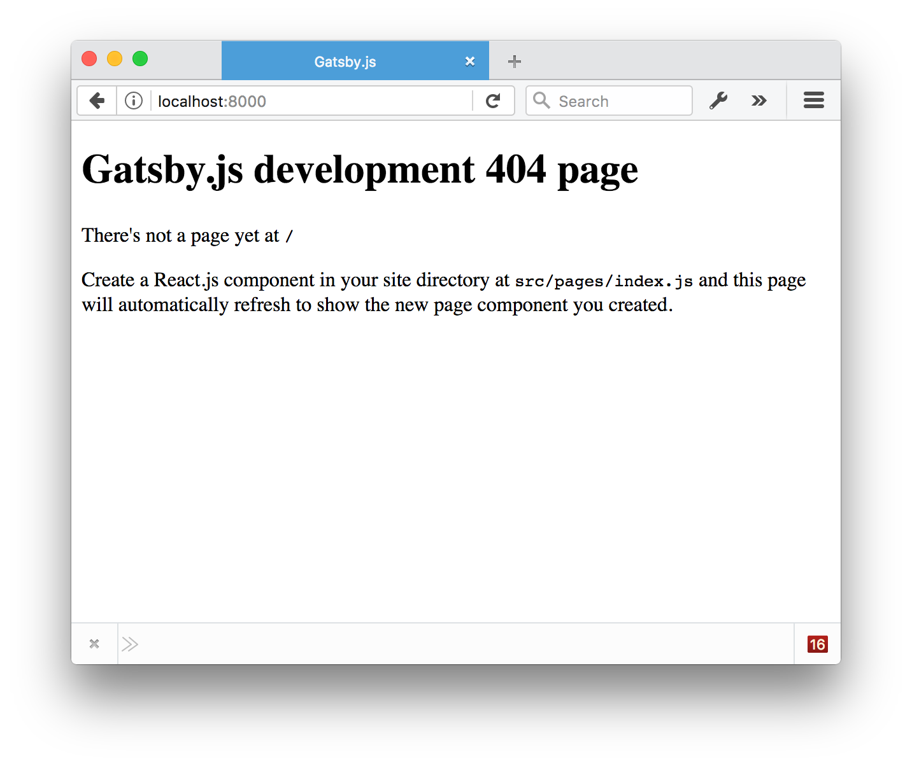
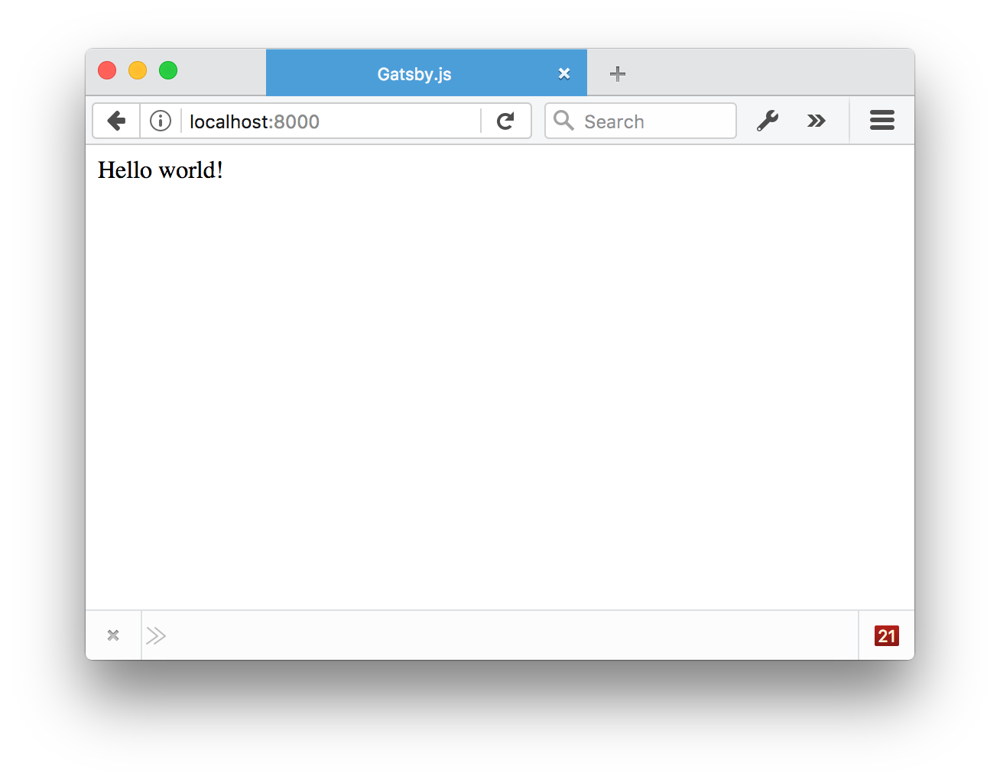

Hello fellow Gatsby-er! Welcome to part one of our community Gatsby.js tutorial.

In this tutorial you'll be gently introduced to the Gatsby development environment, how to create component pages, and how to build and deploy Gatsby sites.

Sit down, buckle up, and let's get going!

## Check Environment

Let's check first that you have everything setup to start working with Gatsby. You will need a recent version of [Node.js](nodejs.org) installed.

Open a terminal window and type `node --version` then `npm --version`.

You should see something like:



Gatsby supports versions of Node back to v4 and NPM to v3.

If you don't have Node.js installed, go to https://nodejs.org/ and install the recommended version for your operating system.

## Creating a Gatsby site from scratch

Go to a directory on your computer for coding projects and create a new directory titled perhaps "my-first-gatsby-site".

Once inside the directory. Type `npm init`. This is a command to start a new Node.js project. You can just press enter through most of the questions.



Now type `ls` to see the list of files in your folder. You should see `package.json`.

Now we'll add the two dependencies required for a Gatsby site—`gatsby` and `gatsby-link`.

```bash
npm install --save gatsby@next gatsby-link@next
```

Installation should take a minute or two.

Now type `cat package.json` and you should see that `gatsby` and `gatsby-link` are now added to the `package.json` as `dependencies`.

```bash
~/p/my-first-gatsby-site: cat package.json
{
  "name": "my-first-gatsby-site",
  "version": "1.0.0",
  "description": "My first Gatsby site",
  "main": "index.js",
  "scripts": {
    "test": "echo \"Error: no test specified\" && exit 1"
  },
  "author": "",
  "license": "ISC",
  "dependencies": {
    "gatsby": "^1.0.0-alpha19",
    "gatsby-link": "^1.0.0-alpha16"
  }
}
```

Sweet! We're making progress 😎

Let's now try running Gatsby!

Gatsby has a built-in development server. Let's start it up. (TODO tell people to use the `gatsby-cli` package once that's built).

Run from your terminal `./node_modules/.bin/gatsby develop`

You should see shortly some text that says `The development server is listening at: http://localhost:8000`. Open that address in your browser.



Yeah! It's working!!!

What you're seeing is the Gatsby.js development 404 page. Let's do what it says and create a React.js component at `src/pages/index.js`.

First create the `src/pages` directory.

```bash
mkdir -p src/pages
```

Then open up `src/pages/index.js` in your editor of choice and type in the "hello world" of components.

```jsx
import React from 'react'

export default () => <div>Hello world!</div>
```

Save that and… 😮😮😮



Too cool 😎

Gatsby's development server is a "hot reloading" server meaning any change you make to your React.js components (and later we'll learn, your data files) will hot reload in the browser.

This is huge because it makes development so much faster and fun.

Let's try it.

Try changing "Hello world!" in the component to "Hello Gatsby!". The text in your browser should change within a second.

Try some other tricks.

1. Gatsby let's you add "inline styles" via a JavaScript style "prop" (we'll learn about other styling options later).

   Try making your component look like this:

```jsx
import React from "react"

export default () => <div style={{ color: `blue` }}>Hello Gatsby!</div>
```

   Change the color to "pink". Then "tomato".

2. Add some paragraph text.

```jsx{5-6}
import React from "react"

export default () =>
 <div style={{ color: `tomato` }}>
   <h1>Hello Gatsby!</h1>
   <p>What a world.</p>
 </div>
```

3. Add an image

```jsx{7}
import React from "react"

export default () =>
 <div style={{ color: `tomato` }}>
   <h1>Hello Gatsby!</h1>
   <p>What a world.</p>
   
 </div>
```

Now your screen should look something like this.


## Linking between pages

Websites are pages and links between pages. While we've now got a pretty sweet first page—one page and no links doesn't feel very webby. So let's create a new page.

First create the link to the new page.

To do that, import the `<Link>` component from the `gatsby-link` package we installed earlier.

Unlike the normal HTML `<a>` element, our `Link` component uses `to` for specifying where you'd like to link to. Let's link to a page with the pathname of `/my-second-gatsby-page/`. Try adding that. Once you're done, the component should look like:

```jsx{2,9-10}
import React from "react"
import Link from "gatsby-link"

export default () =>
  <div style={{ color: `tomato` }}>
    <h1>Hello Gatsby!</h1>
    <p>What a world.</p>
    
    <br />
    <Link to="/my-second-gatsby-page/">Link</Link>
  </div>
```

Click on that link and again we see the development 404 page.

Let's do what it says again and create a new component at `src/pages/my-second-gatsby-page.js` and save it. Make sure to link back to the home page.

Now you should be able to click back and forth between the two pages!

<video controls="controls" autoplay="true" loop="true">
<source type="video/mp4" src="/images/clicking-2.mp4"></source>
<p>Your browser does not support the video element.</p>

</video>


## Interactive page

One nice thing about using Gatsby for building websites vs other tools is it's so easy to add interactivity to your pages. React.js was designed for Facebook.com and is used on 1000s of other high-quality web applications.

Let's see how easy it is to add interactive elements to our pages.

We'll start by creating a new link to a page at `/counter`/.

Add that link to your original `index.js` page, click on it, and then create a "Hello World" component for `/counter/` as before. But instead of using what's called the "functional component" form for React we'll create a "class" component.

```jsx
import React from "react"

class Counter extends React.Component {
  render() {
    return <div>Hello Class Component</div>
  }
}

export default Counter
```

The class form of React allows us to add component state. We'll need that for our counter.

Let's continue to flesh out our counter. Let's add two buttons. One to increment and one to decrement the count of the counter.

```jsx{6-11}
import React from "react"

class Counter extends React.Component {
  render() {
    return (
      <div>
        <h1>Counter</h1>
        <p>current count: 0</p>
        <button>plus</button>
        <button>minus</button>
      </div>
    )
  }
}

export default Counter
```

So now we have everything we need to make a nice counter. Let's make it live.

First we'll setup the component state.

```jsx{4-6,12}
import React from "react"

class Counter extends React.Component {
  constructor() {
    this.state = { count: 0 }
  }

  render() {
    return (
      <div>
        <h1>Counter</h1>
        <p>current count: {this.state.count}</p>
        <button>plus</button>
        <button>minus</button>
      </div>
    )
  }
}

export default Counter
```

We're now rendering the current count from the component state.

Let's now change the state when we click on our buttons.

```jsx{14-19}
import React from "react"

class Counter extends React.Component {
  constructor() {
    super()
    this.state = { count: 0 }
  }

  render() {
    return (
      <div>
        <h1>Counter</h1>
        <p>current count: {this.state.count}</p>
        <button onClick={() => this.setState({ count: this.state.count + 1 })}>
          plus
        </button>
        <button onClick={() => this.setState({ count: this.state.count - 1 })}>
          minus
        </button>
      </div>
    )
  }
}

export default Counter
```

There you go! A working React.js counter inside your static website 👌

One fun thing too is that hot reloading isn't just for content and styles but it works on code as well. Try changing the amount by which clicking on the buttons changes the count.

## Deploying Gatsby.js websites on the web

Gatsby.js is a *static site generator* which makes deploying Gatsby sites to
the web really easy. There are no servers to setup or complicated databases to
deploy.  Instead, the Gatsby `build` command produces a directory of static
HTML and JavaScript files which you can deploy to a static site hosting
service. (TODO link to deployment docs)

Let's try using [Surge](http://surge.sh/) for deploying our first Gatsby website.

First install their terminal tool:

```bash
npm install --global surge
```

Then build your site by running:

```bash
gatsby build
```

Building should take 15-30 seconds. Take a look at the generated files by looking
at the `public` directory:

```bash
ls public
```

Then finally deploy your site by pushing the generated files to surge.sh:

```bash
surge public/
```

## Good work!

In this tutorial, you've installed Gatsby, played in the development
environment, and deployed your first site! Awesome! We hope you're enjoying
yourself so far. Feel free to continue now on to the second part of the tutorial
or go exploring around the rest of the site.
