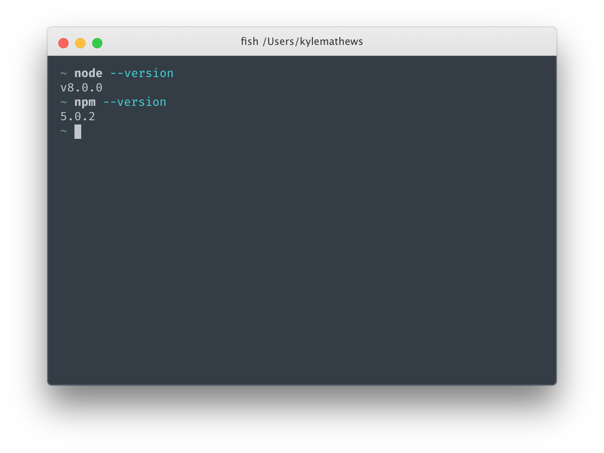
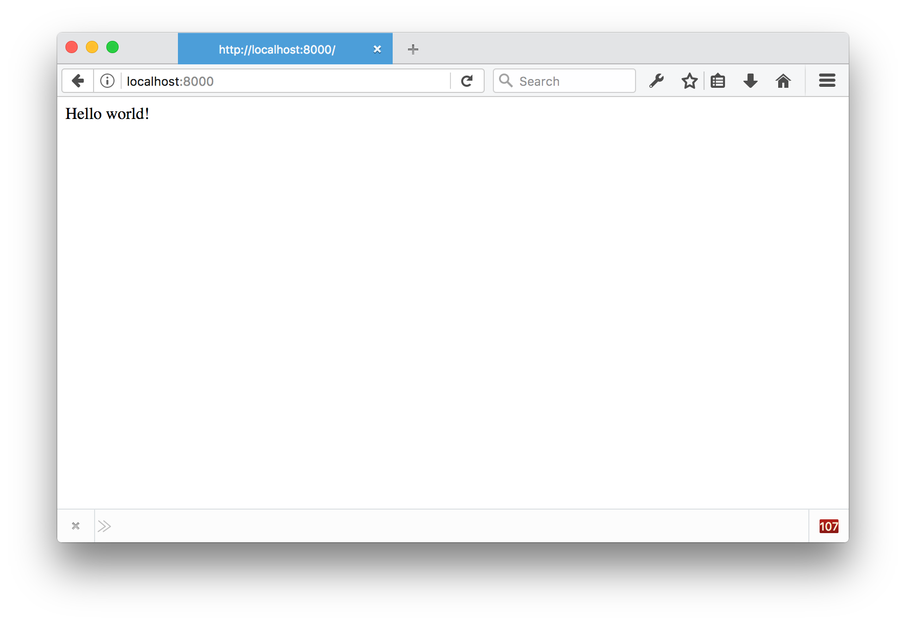
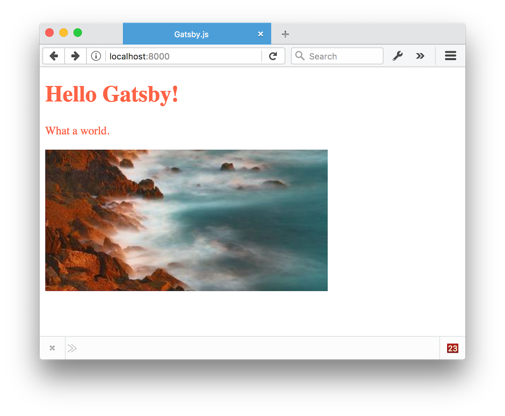
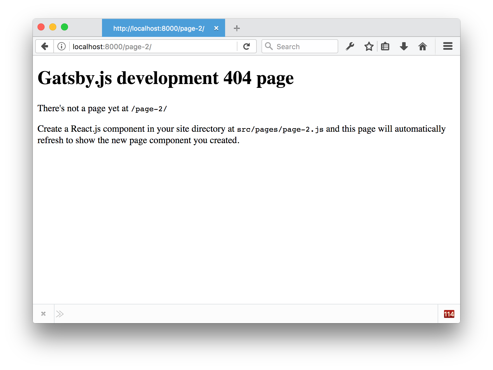
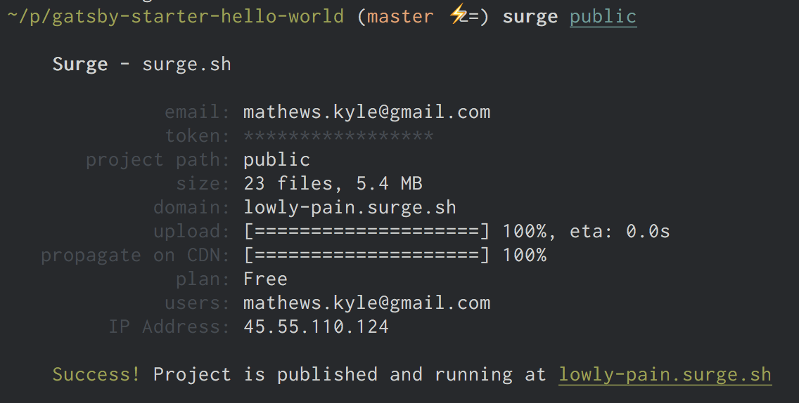

Hello fellow Gatsby-er! Welcome to _part one_ of our community Gatsby.js
tutorial.

In this tutorial you'll be gently introduced to the Gatsby development
environment, how to create component pages, and how to build and deploy Gatsby
sites.

Sit down, buckle up, and let's get going!

## Check your development environment

Let's check first that you have everything set up to start creating with Gatsby.
You will need a recent version of Node.js installed.

Node.js is a programming tool for running JavaScript on servers and in your
computer's terminal. Gatsby is built using Node.js.

Open a terminal window. See
[terminal instructions for Mac users](http://www.macworld.co.uk/feature/mac-software/how-use-terminal-on-mac-3608274/) and
[terminal instructions for Windows users](https://www.quora.com/How-do-I-open-terminal-in-windows). In your terminal window, type `node --version` and hit ENTER, then `npm --version` and hit ENTER.

You should see something like:



Gatsby supports versions of Node back to v6 and npm to v3.

If you don't have Node.js installed, go to https://nodejs.org/ and install the
recommended version for your operating system.

## Install the "Hello World" starter

Gatsby uses "starters" for starting new projects. Starters
are partially built Gatsby sites pre-configured to help you get moving faster.
There are several official starters and many others contributed from the Gatsby
community! [See the Starters page for the full list](/docs/gatsby-starters/).

To install a starter, first install Gatsby's terminal program by typing the
following command into the terminal window and hit ENTER.

```sh
npm install --global gatsby-cli
```

Once that's installed, type the following command in and hit ENTER:

```sh
gatsby new tutorial-part-one https://github.com/gatsbyjs/gatsby-starter-hello-world
```

This command downloads the files for the starter and then installs the needed
npm packages. It should take around 1.5-3 minutes to finish. It may look like
nothing is happening at first; be patient!

Now let's try running Gatsby!

Gatsby has a built-in development server. Let's start it up by typing in the
following commands into the same terminal window you've used so far in this
tutorial.

```sh
cd tutorial-part-one
gatsby develop
```

You should shortly see some text, close to the bottom, that says `The development server is listening at:` [http://localhost:8000](http://localhost:8000). Open that address in your
browser and...



Yeah! It's working!!!

Too cool 😎

Gatsby's development server is a "hot reloading" server, meaning any change you
make to your React.js page components (and later we'll learn, your data files)
will be immediately visible and/or loaded in the browser.

This is huge because it makes development so much faster and fun.

Let's try it.

You'll need code editing software for the next part of this tutorial.
[VS Code](https://code.visualstudio.com/) is a nice one. With your code editor,
open the folder on your computer called "tutorial-part-one," which was
automatically created in the location you chose when you ran the `gatsby new` terminal command above.

Once you've opened the "tutorial-part-one" folder in your code editing
software, it's time to edit your website. You'll see groups of directories and files; find the file in this location: `src/pages/index.js`. Once you open that file, try changing "Hello
world!" in the page component to "Hello Gatsby!". Once you save that change, the text in your browser
should change within a second.

Try some other tricks, like the ones below:

1. Gatsby lets you add "inline styles" via a JavaScript style "prop" (we'll
   learn about other styling options later).

   Try replacing your page component with this:

```jsx
import React from "react";

export default () => <div style={{ color: `blue` }}>Hello Gatsby!</div>;
```

Change the color to "pink". Then to "tomato".

2. Add some paragraph text.

```jsx{5-6}
import React from "react";

export default () =>
 <div style={{ color: `tomato` }}>
   <h1>Hello Gatsby!</h1>
   <p>What a world.</p>
 </div>
```

3. Add an image (in this case, a random one from Unsplash)

```jsx{7}
import React from "react";

export default () =>
 <div style={{ color: `tomato` }}>
   <h1>Hello Gatsby!</h1>
   <p>What a world.</p>
   
 </div>
```

Now your screen should look something like this:



## Linking between pages

Websites are pages and links between pages. While we've now got a pretty sweet
first page—one page and no links doesn't feel very webby. So let's create a new
page.

First create the link to the new page.

To do that, import the `<Link>` component from the `gatsby` package that
was installed along with the starter.

Unlike the normal HTML `<a>` element, Gatsby's `Link` component uses `to` for
specifying the page you want to link to. Let's link to a page with the pathname
of `/page-2/`. Try adding that. Once you're done, the page component should look
like:

```jsx{2,9-12}
import React from "react";
import { Link } from "gatsby";

export default () =>
  <div style={{ color: `tomato` }}>
    <h1>Hello Gatsby!</h1>
    <p>What a world.</p>
    
    <br />
    <div>
      <Link to="/page-2/">Link</Link>
    </div>
  </div>
```

If you click on that link in the browser you should see:



What you're seeing is the Gatsby.js development 404 page. Let's do what it says
and create a React.js page component at `src/pages/page-2.js`.

Make the second page component look something like:

```jsx
import React from "react";
import { Link } from "gatsby";

export default () => (
  <div>
    <p>Hello world from my second Gatsby page</p>
    <Link to="/">back home</Link>
  </div>
);
```

Save that and now you should be able to click back and forth between the two
pages!

<video controls="controls" autoplay="true" loop="true">
  <source type="video/mp4" src="/images/clicking-2.mp4"></source>
  <p>Your browser does not support the video element.</p>
</video>

## Interactive page

One nice thing about using Gatsby for building websites vs. other tools is that itʼs easier to add interactivity to your pages. React.js was designed for
Facebook.com and is used on many other world-class web applications.

Let's see how easy it is to add interactive elements to our pages. Let's start with a counter.

We'll start by creating a new link to a page at `/counter`/ from our original
`index.js` page component `<Link to="/counter/">Counter</Link>`.

```jsx{13-15}
import React from "react";
import { Link } from "gatsby";

export default () =>
  <div style={{ color: `tomato` }}>
    <h1>Hello Gatsby!</h1>
    <p>What a world.</p>
    
    <br />
    <div>
      <Link to="/page-2/">Link</Link>
    </div>
    <div>
      <Link to="/counter/">Counter</Link>
    </div>
  </div>
```

Add that link, click on it, and then we'll create a "Hello World" page component
for `/counter/` as before. But instead of using the "functional component" form
as we did before, we'll create a "class" component.

```jsx
import React from "react";

class Counter extends React.Component {
  render() {
    return <div>Hello Class Component</div>;
  }
}

export default Counter;
```

The class form of React allows us to have component state. We'll need that for
our counter.

Let's continue to flesh out our counter. Let's add two buttons. One to increment
and one to decrement the count of the counter.

```jsx{5-12}
import React from "react";

class Counter extends React.Component {
  render() {
    return (
      <div>
        <h1>Counter</h1>
        <p>current count: 0</p>
        <button>plus</button>
        <button>minus</button>
      </div>
    )
  }
}

export default Counter
```

So now we have everything we need to make a nice counter. Let's make it live.

First we'll set up the component state.

```jsx{4-7,13}
import React from "react";

class Counter extends React.Component {
  constructor() {
    super()
    this.state = { count: 0 }
  }

  render() {
    return (
      <div>
        <h1>Counter</h1>
        <p>current count: {this.state.count}</p>
        <button>plus</button>
        <button>minus</button>
      </div>
    )
  }
}

export default Counter
```

We're now rendering the current count from the component state.

Let's now change the state when we click on our buttons.

```jsx{14-19}
import React from "react";

class Counter extends React.Component {
  constructor() {
    super()
    this.state = { count: 0 }
  }

  render() {
    return (
      <div>
        <h1>Counter</h1>
        <p>current count: {this.state.count}</p>
        <button onClick={() => this.setState({ count: this.state.count +
          1 })}>plus
        </button>
        <button onClick={() => this.setState({ count: this.state.count -
          1 })}>minus
        </button>
      </div>
    )
  }
}

export default Counter
```

There you go! A working React.js counter inside your static website 👌

One fun thing too is that hot reloading isn't just for content and styles but it
works on code as well. Try changing the amount by which clicking on the buttons
changes the count.

## Deploying Gatsby.js websites on the web

Gatsby.js is a _static site generator_, which makes deploying Gatsby sites to the
web much easier vs. traditional CMSs. There are no servers to setup or complicated databases to
deploy. Instead, the Gatsby `build` command produces a directory of static HTML
and JavaScript files which you can deploy to a static site hosting service.

Let's try using [Surge](http://surge.sh/) for deploying our first Gatsby
website. Surge is one of many "static site hosts" which make it really easy to
deploy Gatsby sites.

If you haven't previously installed & setup Surge, open a new terminal window and install their terminal tool:

```bash
npm install --global surge

# Then create a (free) account with them
surge
```

Next, build your site by running the following command in the terminal at the root of your site (tip: make sure you're running this command at the root of your site, in this case in the tutorial-part-one folder, which you can do by opening a new tab in the same window you used to run `gatsby develop`):

```bash
gatsby build
```

Building should take 15-30 seconds. At this point, it's useful to take a look at the files that the `gatsby build` command just prepared to deploy. Take a look at a list of the generated files by typing in the following terminal command into the root of your site, which will let you look at the `public` directory:

```bash
ls public
```

Then finally deploy your site by publishing the generated files to surge.sh.

```bash
surge public/
```

Once this finishes running, you should see in your terminal something like:



Open the web address listed on the bottom line (`lowly-pain.surge.sh` in this
case) and you'll see your newly published site!

## Good work!

In this tutorial, you've installed Gatsby, played in the development
environment, and deployed your first site! Awesome! We hope you're enjoying
yourself so far. Feel free to continue now to
[the second part of the tutorial](/tutorial/part-two/) or go exploring around
the rest of the site.
