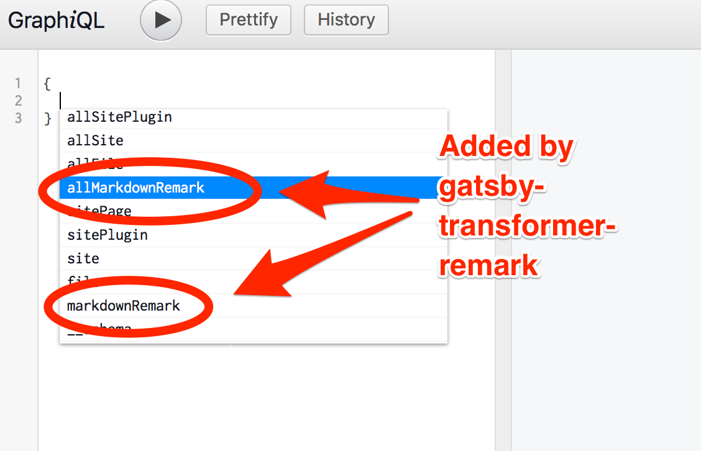
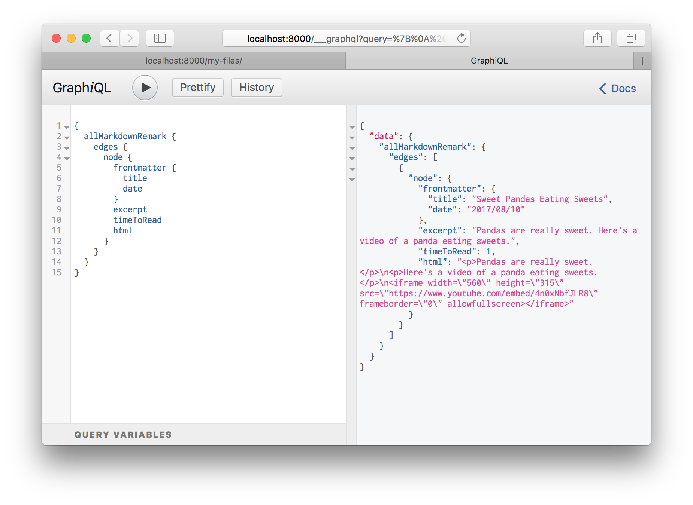
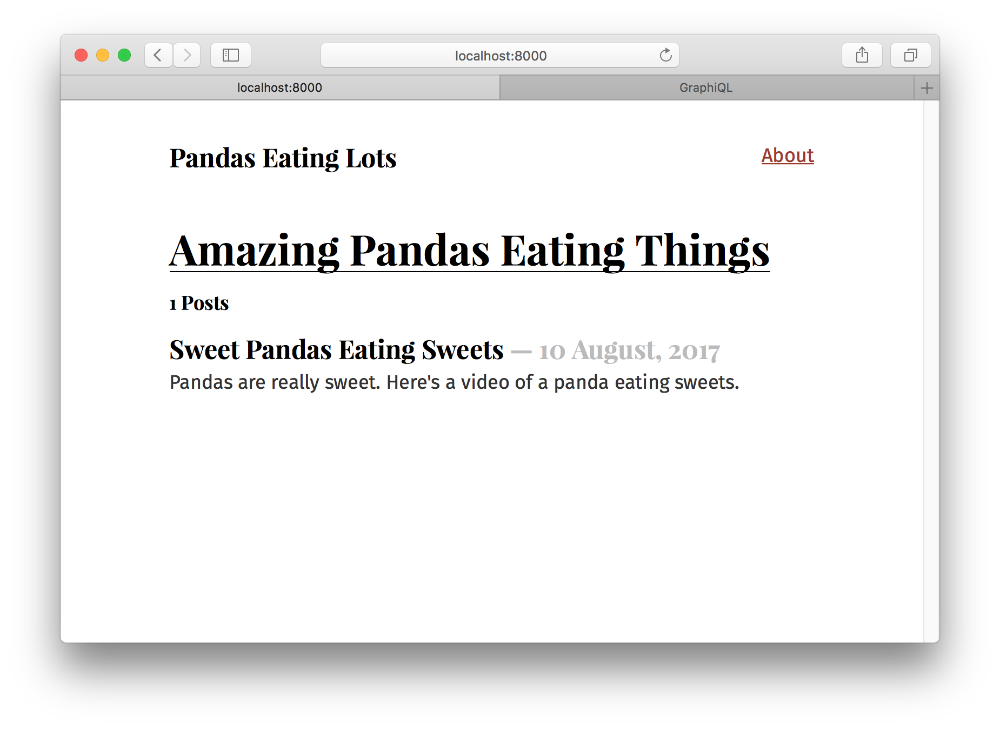
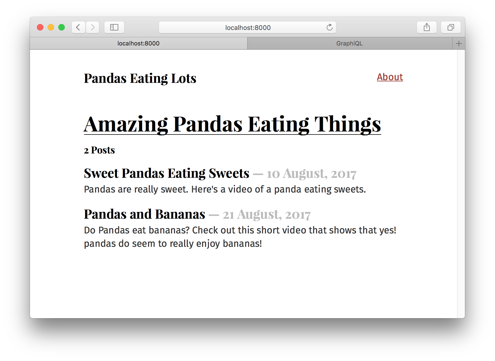

## What's in this tutorial?

The previous tutorial showed how source plugins bring data _into_ Gatsby’s data system. In this tutorial, you'll learn how transformer plugins _transform_ the raw content brought by source plugins. The combination of source plugins and transformer plugins can handle all data sourcing and data transformation you might need when building a Gatsby site.

## Transformer plugins

Often, the format of the data we get from source plugins isn't what you want to
use to build your website. The filesystem source plugin lets you query data
_about_ files but what if you want to query data _inside_ files?

To make this possible, Gatsby supports transformer plugins which take raw
content from source plugins and _transform_ it into something more usable.

For example, Markdown files. Markdown is nice to write in but when you build a
page with it, you need the Markdown to be HTML.

Let's add a Markdown file to our site at
`src/pages/sweet-pandas-eating-sweets.md` (This will become our first Markdown
blog post) and learn how to _transform_ it to HTML using transformer plugins and
GraphQL.

```markdown
---
title: "Sweet Pandas Eating Sweets"
date: "2017-08-10"
---

Pandas are really sweet.

Here's a video of a panda eating sweets.

<iframe width="560" height="315" src="https://www.youtube.com/embed/4n0xNbfJLR8" frameborder="0" allowfullscreen></iframe>
```

Once you save the file, look at `/my-files/` again—the new Markdown file is in
the table. This is a very powerful feature of Gatsby. Like the earlier
`siteMetadata` example, source plugins can live reload data.
`gatsby-source-filesystem` is always scanning for new files to be added and when
they are, re-runs your queries.

Let's add a transformer plugin that can transform Markdown files:

```shell
npm install --save gatsby-transformer-remark
```

Then add it to the `gatsby-config.js` like normal:

```javascript{13}
module.exports = {
  siteMetadata: {
    title: `Pandas Eating Lots`,
  },
  plugins: [
    {
      resolve: `gatsby-source-filesystem`,
      options: {
        name: `src`,
        path: `${__dirname}/src/`,
      },
    },
    `gatsby-transformer-remark`,
    `gatsby-plugin-glamor`,
    {
      resolve: `gatsby-plugin-typography`,
      options: {
        pathToConfigModule: `src/utils/typography`,
      },
    },
  ],
};
```

Restart the development server then refresh (or open again) Graph_i_QL and look
at the autocomplete:



Select `allMarkdownRemark` again and run it like we did for `allFile`. You'll
see there the Markdown file we recently added. Explore the fields that are
available on the `MarkdownRemark` node.



Ok! Hopefully some basics are starting to fall into place. Source plugins bring
data _into_ Gatsby's data system and _transformer_ plugins transform raw content
brought by source plugins. This pattern can handle all data sourcing and
data transformation you might need when building a Gatsby site.

## Create a list of our site's Markdown files in `src/pages/index.js`

Let's now create a list of our Markdown files on the front page. Like many
blogs, we want to end up with a list of links on the front page pointing to each
blog post. With GraphQL we can _query_ for the current list of Markdown blog
posts so we won't need to maintain the list manually.

Like with the `src/pages/my-files.js` page, replace `src/pages/index.js` with
the following to add a query with some initial HTML and styling.

```jsx
import React from "react";
import g from "glamorous";

import { rhythm } from "../utils/typography";

export default ({ data }) => {
  console.log(data);
  return (
    <div>
      <g.H1 display={"inline-block"} borderBottom={"1px solid"}>
        Amazing Pandas Eating Things
      </g.H1>
      <h4>{data.allMarkdownRemark.totalCount} Posts</h4>
      {data.allMarkdownRemark.edges.map(({ node }) => (
        <div key={node.id}>
          <g.H3 marginBottom={rhythm(1 / 4)}>
            {node.frontmatter.title}{" "}
            <g.Span color="#BBB">— {node.frontmatter.date}</g.Span>
          </g.H3>
          <p>{node.excerpt}</p>
        </div>
      ))}
    </div>
  );
};

export const query = graphql`
  query IndexQuery {
    allMarkdownRemark {
      totalCount
      edges {
        node {
          id
          frontmatter {
            title
            date(formatString: "DD MMMM, YYYY")
          }
          excerpt
        }
      }
    }
  }
`;
```

Now the frontpage should look like:



But our one blog post looks a bit lonely. So let's add another one at
`src/pages/pandas-and-bananas.md`

```markdown
---
title: Pandas and Bananas
date: "2017-08-21"
---

Do Pandas eat bananas? Check out this short video that shows that yes! pandas do
seem to really enjoy bananas!

<iframe width="560" height="315" src="https://www.youtube.com/embed/4SZl1r2O_bY" frameborder="0" allowfullscreen></iframe>
```



Which looks great! Except… the order of the posts is wrong.

But this is easy to fix. When querying a connection of some type, you can pass a
variety of arguments to the query. You can `sort` and `filter` nodes, set how
many nodes to `skip`, and choose the `limit` of how many nodes to retrieve. With
this powerful set of operators, we can select any data we want—in the format we
need.

In our index page's query, change `allMarkdownRemark` to
`allMarkdownRemark(sort: {fields: [frontmatter___date], order: DESC})`. Save
this and the sort order should be fixed.

Try opening Graph_i_QL and playing with different sort options. You can sort the
`allFile` connection along with other connections.

## Challenge

Try creating a new page containing a blog post and see what happens to the list of blog posts on the homepage!

## What's coming next?

This is great! We've just created a nice index page where we're querying our Markdown
files and producing a list of blogpost titles and excerpts. But we don't want to just see excerpts, we want actual pages for our Markdown files.

We could continue to create pages by placing React components in `src/pages`. However, we'll
next learn how to _programmatically_ create pages from _data_. Gatsby is _not_
limited to making pages from files like many static site generators. Gatsby lets
you use GraphQL to query your _data_ and _map_ the data to _pages_—all at build
time. This is a really powerful idea. We'll be exploring its implications and
ways to use it in the next tutorial, where you'll learn how to [programmatically create pages from data](/tutorial/part-seven/).
