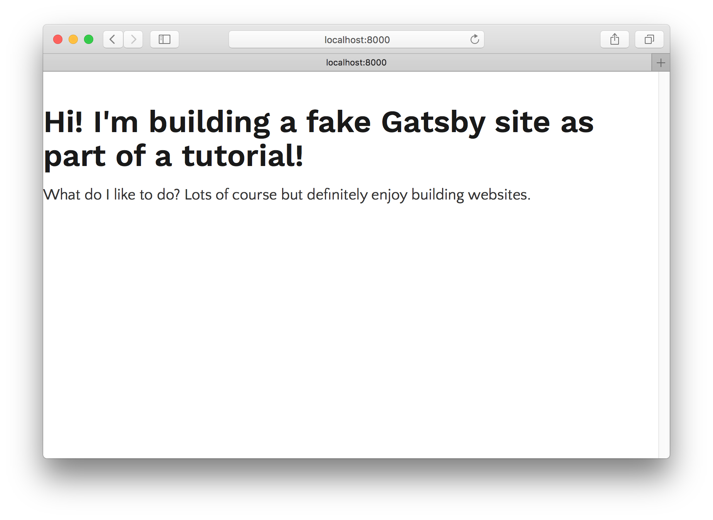
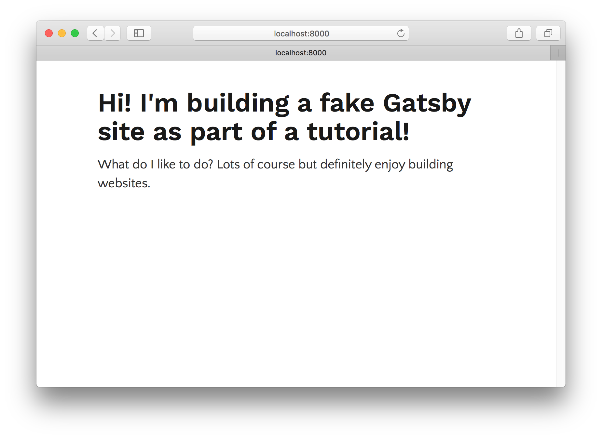
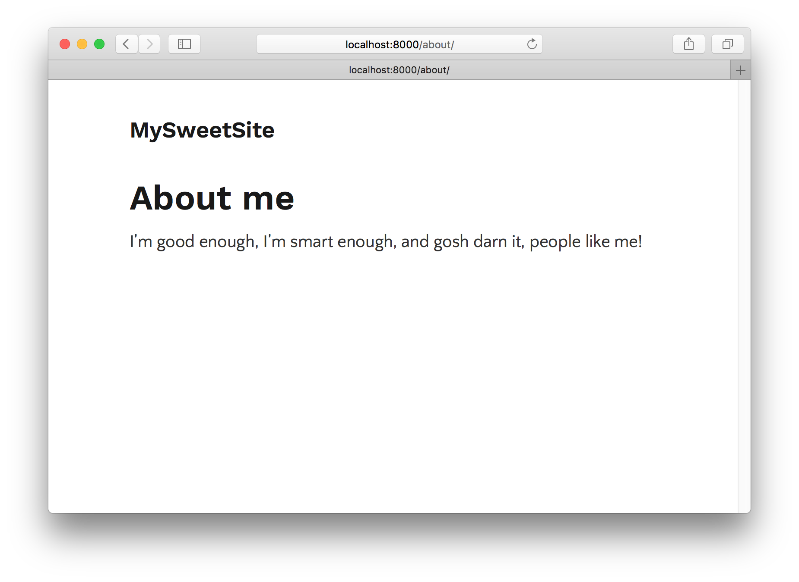
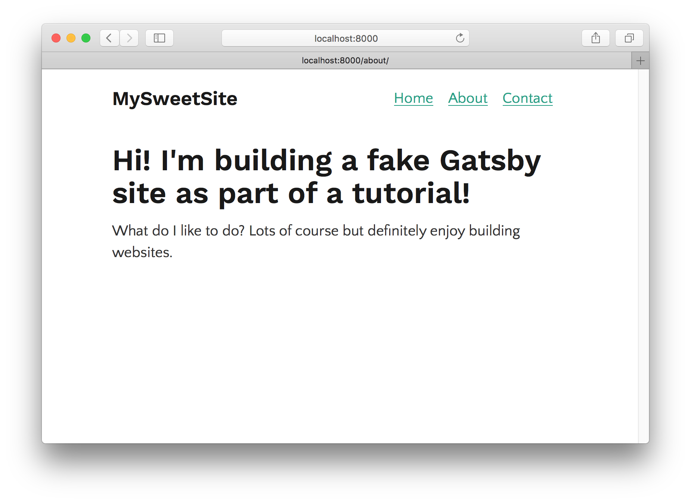

Gatsby lets you easily create "layout components". Layout components are sections of your site that you want to share across multiple pages. For example, Gatsby sites will commonly have a layout component with a shared header and footer. Other common things to add to layouts are a sidebar and navigation menu.

On this page, the sidebar to the left (assuming you're on a larger device) and the header at the top are part of gatsbyjs.org's layout component.

Let's dive in and explore Gatsby layouts.

First create a new site for this part of the tutorial. We'll use the "hello world" starter again.

```shell
gatsby new tutorial-part-three https://github.com/gatsbyjs/gatsby-starter-hello-world
```

Once the site is finished installing, install `gatsby-plugin-typography` and for a Typography.js theme, let's try this time the "Fairy Gates" typography theme.

```shell
npm install --save gatsby-plugin-typography typography-theme-fairy-gates
```

 Set these up in your site directory.

Create the typography config file at `src/utils/typography.js`

```javascript
import Typography from 'typography'
import fairyGateTheme from 'typography-theme-fairy-gates'

const typography= new Typography(fairyGateTheme)

module.exports = typography
```

Then our site's `gatsby-config.js`

```javascript
module.exports = {
  plugins: [
    {
      resolve: 'gatsby-plugin-typography',
      pathToConfigModule: 'src/utils/typography'
    }
  ]
}
```

Now let's add a few different pages, a front page, an about page, and a contact page.

`src/pages/index.js`

```jsx
import React from "react"

export default () =>
  <div>
    <h1>Hi! I'm building a fake Gatsby site as part of a tutorial!</h1>
    <p>
      What do I like to do? Lots of course but definitely enjoy building
      websites.
    </p>
  </div>
```

`src/pages/about.js`

```jsx
import React from "react"

export default () =>
  <div>
    <h1>About me</h1>
    <p>I’m good enough, I’m smart enough, and gosh darn it, people like me!</p>
  </div>
```

`src/pages/contact.js`

```jsx
import React from "react"

export default () =>
  <div>
    <h1>I'd love to talk! Email me at the address below</h1>
    <p>
      <a mailto="me@example.com">me@example.com</a>
    </p>
  </div>
```




We now we have the start of a nice personal site!

But a few problems. First, it'd be nice if the page content was centered on the screen like in part two of the tutorial. And second, we should really have some sort of global navigation so it's easy for visitors to find and visit each of the sub-pages.

Let's tackle these problems by creating our first layout component.

## Our first layout component

First create a new directory at `src/layouts`. All layout components have to be in this directory.

Let's create a very simple layout component at `src/layouts/index.js`

```jsx
import React from "react"

export default ({ children }) =>
  <div style={{ margin: `0 auto`, maxWidth: 650, padding: `0 1rem` }}>
    {children()}
  </div>
```

Stop `gatsby develop` and start it again for the new layout to take effect.



Sweet, the layout is working as now our text is centered and constrained to a column 650 pixels wide as we specified.

Let's now add our site title.

```jsx{5}
import React from "react"

export default ({ children }) =>
  <div style={{ margin: `0 auto`, maxWidth: 650, padding: `0 1rem` }}>
    <h3>MySweetSite</h3>
    {children()}
  </div>
```

If we go to any of our three pages we'll see the same title added e.g. the `/about/` page:



Let's add navigation links to each of our three pages.

```jsx{2-9,12-22}
import React from "react"
import Link from "gatsby-link"

const ListLink = props =>
  <li style={{ display: `inline-block`, marginRight: `1rem` }}>
    <Link to={props.to}>
      {props.children}
    </Link>
  </li>

export default ({ children }) =>
  <div style={{ margin: `0 auto`, maxWidth: 650, padding: `1.25rem 1rem` }}>
    <header style={{ marginBottom: `1.5rem` }}>
      <Link to="/" style={{ textShadow: `none`, backgroundImage: `none` }}>
        <h3 style={{ display: `inline` }}>MySweetSite</h3>
      </Link>
      <ul style={{ listStyle: `none`, float: `right` }}>
        <ListLink to="/">Home</ListLink>
        <ListLink to="/about/">About</ListLink>
        <ListLink to="/contact/">Contact</ListLink>
      </ul>
    </header>
    {children()}
  </div>
```



And there we have it! A three page site with a simple global navigation. With your layout component, you can easily add headers, footers, global navigation, sidebars, etc.
