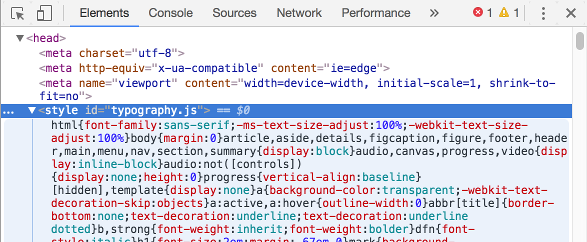
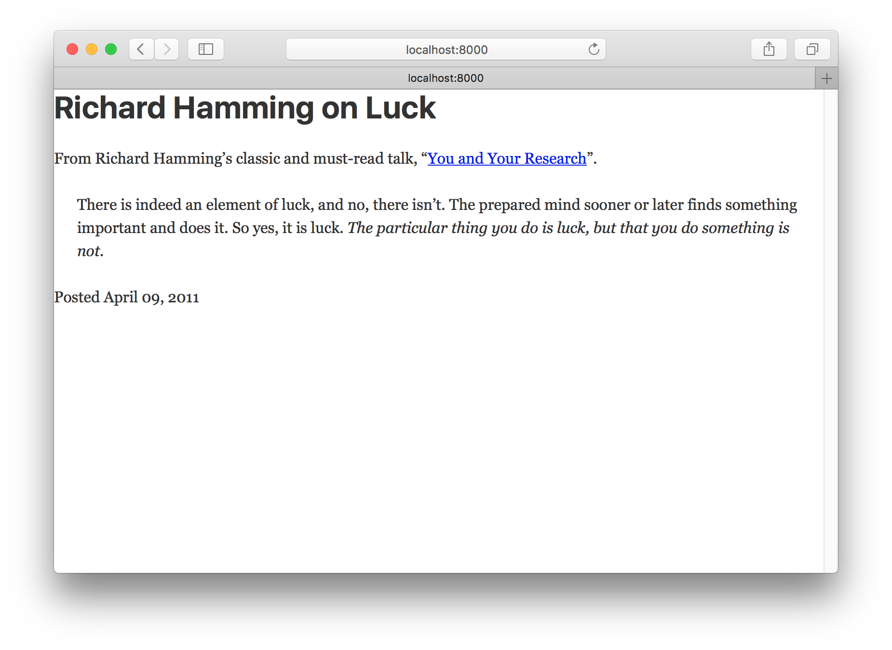
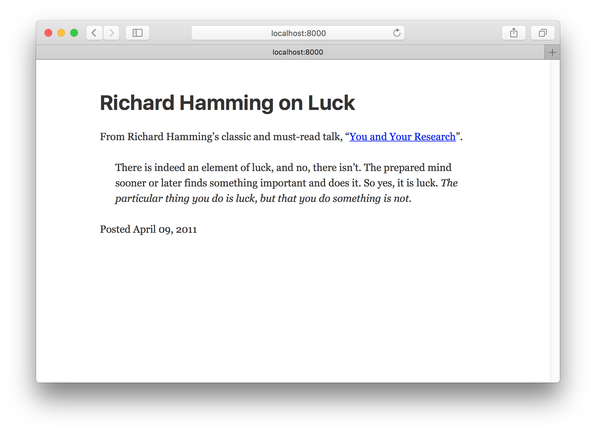
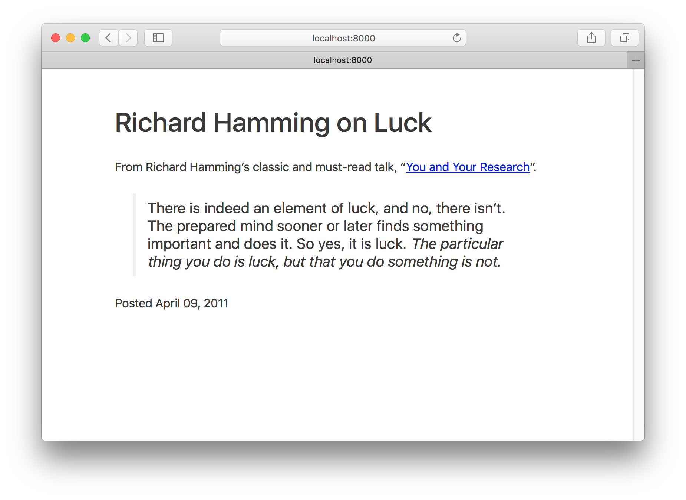
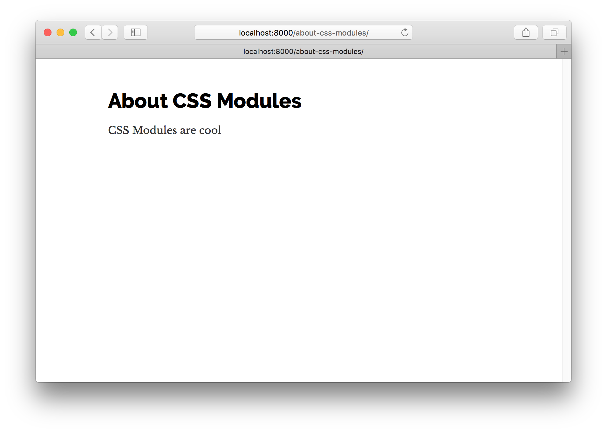
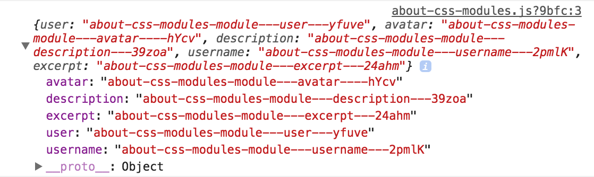
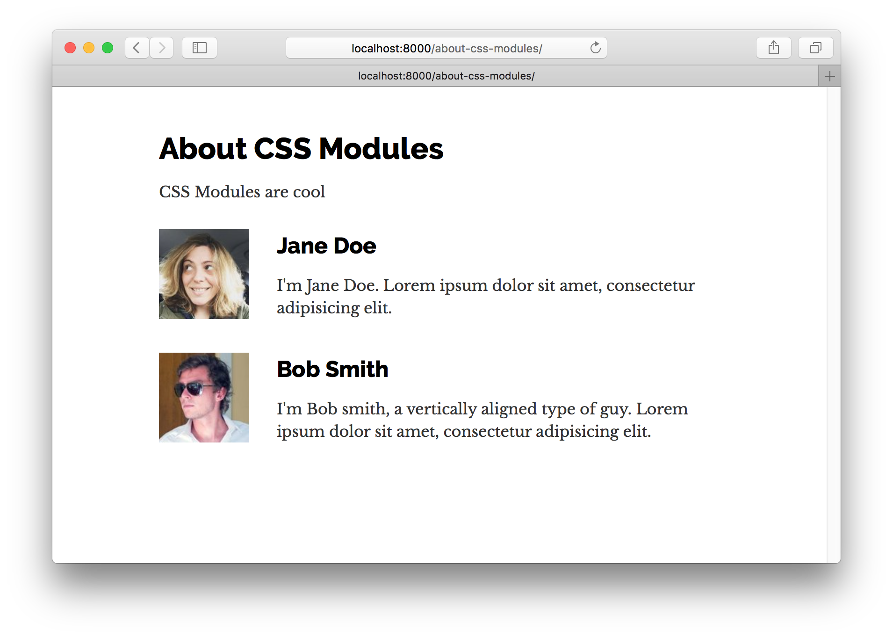
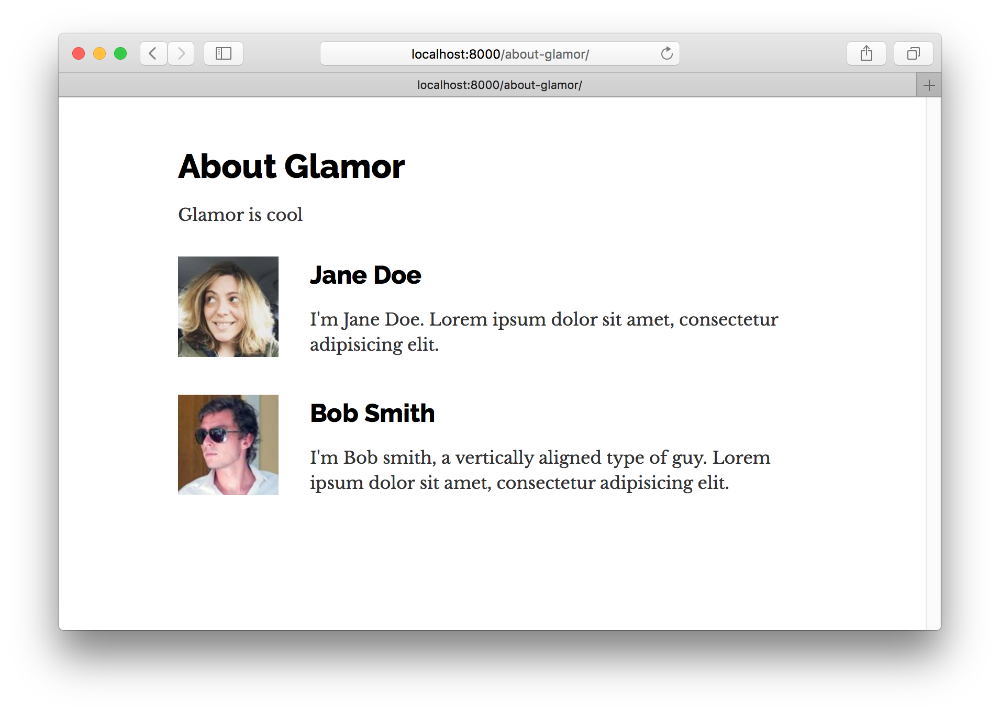

Welcome to part two of the Gatsby tutorial!

In this part we're going to explore options for styling Gatsby websites and dive deeper into using React components for building sites.

## Building with components

One of the big mental shifts you make when starting to build with components is that now your CSS, HTML, and JavaScript are tightly coupled, often living even within the same file.

While a seemingly simple change, it has profound implications for how you think about building websites.

Take the simple example of creating a custom button. In the past you would create a CSS class (perhaps `.primary-button`) with your custom styles and then whenever you want to apply those styles e.g.


```html
<button class="primary-button">
  Click me
</button>
```


In the world of components, you instead create a `PrimaryButton` component with your button styles and use it throughout your site like:

```jsx
<PrimaryButton>Click me</PrimaryButton>
```

Components become the base building blocks of your site. Instead of being limited to what the browser provides e.g. `<button>`, you can easily create new building blocks that elegantly meet the needs of your projects.

## Creating global styles

Every site has some sort of global style. This includes things like the site's typography and background colors. These styles set the overall feel of the site — much like the color and texture of a wall sets the overall feel of a room.

Often people will use something like Bootstrap or Foundation for their global styles. The problem with these however is they're difficult to customize and they're not designed to work well with React components.

So for this tutorial let's explore a JavaScript library called [Typography.js](https://github.com/kyleamathews/typography.js) that generates global styles and works particularly well with Gatsby and React.

### Typography.js

Typography.js is a JavaScript library which generates typographic CSS.

Instead of directly setting the `font-size` of different HTML elements, you tell Typography.js things like your desired `baseFontSize` and `baseLineHeight` and based on these, it generates the base CSS for all your elements.

This makes it trivial to change the font size of all elements on a site without having to directly modify the dozens of CSS rules.

Using it looks something like this:

```javascript
import Typography from 'typography'

const typography = new Typography({
  baseFontSize: '18px',
  baseLineHeight: 1.45,
  headerFontFamily: ['Avenir Next', 'Helvetica Neue', 'Segoe UI', 'Helvetica', 'Arial', 'sans-serif'],
  bodyFontFamily: ['Georgia', 'serif'],
})
```

## Gatsby Plugins

But before we can get back to building and trying out Typography.js, let's make a quick diversion and talk about Gatsby plugins.

You're probably familiar with the idea of plugins. Many software systems support adding custom plugins to add new functionality or even modify the core workings of the software.

Gatsby plugins work the same way.

Community members (like you!) can contribute plugins (small amounts of JavaScript code) that then others can use when building Gatsby sites.

There's already dozens of plugins! Check them out at the [plugins section of the site](/docs/plugins/).

Gatsby plugins are easy to install and use. In almost every Gatsby site you build, you will be installing plugins. While working through the rest of the tutorial, you'll have many opportunities to practice installing and using plugins.

## Installing your first Gatsby plugin

Let's start by creating a new site. Similar to Part One, run the following to create a new site.

```
gatsby new tutorial-part-two https://github.com/gatsbyjs/gatsby-starter-hello-world
```

This creates a new site with the following structure.

```shell
├── package.json
├── src
│   └── pages
│       └── index.js
```

This is the minimal setup for a Gatsby site.

To install a plugin, there's two steps. First you install the plugin's NPM package and second you add the plugin to your site's `gatsby-config.js`.

Typography.js has a Gatsby plugin so let's install that by running.

```shell
npm install --save gatsby-plugin-typography
```

Next create a file at the base of your site named `gatsby-config.js`. This is where you add plugins to a site along with other site configuration.

Copy the following into `gatsby-config.js`

```javascript
module.exports = {
  plugins: [`gatsby-plugin-typography`],
}
```

Gatsby reads the site's config file when starting. Here we tell it to look for a plugin named `gatsby-plugin-typography`. Gatsby knows to look for plugins that are NPM packages so it will find the package we installed previously.

Now run `gatsby develop` again. Once you load the site, if you inspect the generated HTML using the Chrome developer tools, you'll see that the typography plugin added a `<style>` element to the head with its generated CSS.



Copy the following into your `src/pages/index.js` so we can better see the effect of the typography CSS generated by Typography.js. 

```jsx
import React from "react"

export default () =>
  <div>
    <h1>Richard Hamming on Luck</h1>
    <div>
      <p>
        From Richard Hamming’s classic and must-read talk, “<a href="http://www.cs.virginia.edu/~robins/YouAndYourResearch.html">
          You and Your Research
        </a>”.
      </p>
      <blockquote>
        <p>
          There is indeed an element of luck, and no, there isn’t. The prepared
          mind sooner or later finds something important and does it. So yes, it
          is luck.{" "}
          <em>
            The particular thing you do is luck, but that you do something is
            not.
          </em>
        </p>
      </blockquote>
    </div>
    <p>Posted April 09, 2011</p>
  </div>
```

Your site should now look like this:



Let's make a quick improvement. Many sites have a single column of text centered in the middle of the page. To create this, add the following styles to the `<div>` in `src/pages/index.js`.

```jsx{4}
import React from "react"

export default () =>
  <div style={{ margin: '3rem auto', maxWidth: 600 }}>
    <h1>Richard Hamming on Luck</h1>
    <div>
      <p>
        From Richard Hamming’s classic and must-read talk, “<a href="http://www.cs.virginia.edu/~robins/YouAndYourResearch.html">
          You and Your Research
        </a>”.
      </p>
      <blockquote>
        <p>
          There is indeed an element of luck, and no, there isn’t. The prepared
          mind sooner or later finds something important and does it. So yes, it
          is luck.{" "}
          <em>
            The particular thing you do is luck, but that you do something is
            not.
          </em>
        </p>
      </blockquote>
    </div>
    <p>Posted April 09, 2011</p>
  </div>
```



Ah, this is starting to look nice!

What we're seeing here is the default CSS Typography.js produces. We can easily customize it however. Let's do that.

In your site, create a new directory at `src/utils`. There create a file `typography.js`. In it add the following code.

```javascript
import Typography from "typography"

const typography = new Typography({ baseFontSize: '18px' })

export default typography
```

Then set this module to be used by `gatsby-plugin-typography` as its config.

```javascript{2..9}
module.exports = {
  plugins: [
    {
      resolve: `gatsby-plugin-typography`,
      options: {
        pathToConfigModule: `src/utils/typography.js`,
      },
    },
  ],
}
```

Stop `gatsby develop` and then restart it again for our plugin change to take effect.

Now all the text font sizes should be slightly bigger. Try changing the `baseFontSize` to `24px` then `12px`. All elements get resized as their `font-size` is based on the `baseFontSize`.

There are many themes available for Typography.js. Let's try a couple. Run in your terminal at the root of your site:

```shell
npm install --save typography-theme-bootstrap typography-theme-lawton
```

To use the Bootstrap theme, change your typography code to:

```javascript{2,4}
import Typography from "typography"
import bootstrapTheme from "typography-theme-bootstrap"

const typography = new Typography(bootstrapTheme)

export default typography
```



Themes can also add Google Fonts. The Lawton theme we installed along with the Bootstrap theme does this. Replace your typography module code with the following then restart the dev server (necessary to load the new Google Fonts).

```javascript{2-3,5}
import Typography from "typography"
// import bootstrapTheme from "typography-theme-bootstrap"
import lawtonTheme from "typography-theme-lawton"

const typography = new Typography(lawtonTheme)

export default typography
```


Typography.js has more than 30 themes! Check them out at http://kyleamathews.github.io/typography.js/

## Component CSS

Gatsby has a wealth of options available for styling components. Let's explore three very popular and production-ready options. We'll build a simple page three times with each styling option.

Each is a variant on "CSS-in-JS" — which solves many of the problems with traditional CSS.

One of the most important problems they solve is selector name collisions. With traditional CSS, you have to be careful not to overwrite CSS selectors used elsewhere in a site because all CSS selectors live in the same global namespace. This unfortunate restriction can lead to elaborate (and often confusing) selector naming schemes.

With CSS-in-JS you avoid all that as CSS selectors are scoped automatically to their component. Styles are tightly coupled with their components. This makes it very easy to know how to edit a component's CSS as there's never any confusion about how and where CSS is being used.

For some background reading on CSS-in-JS, see [Christopher "vjeux" Chedeau's 2014 presentation that sparked this movement](https://speakerdeck.com/vjeux/react-css-in-js) as well as [Mark Dalgleish's more recent post "A Unified Styling Language"](https://medium.com/seek-blog/a-unified-styling-language-d0c208de2660).

### CSS Modules

Let's explore first **CSS Modules**.

Quoting from [the CSS Module homepage](https://github.com/css-modules/css-modules):

> A **CSS Module** is a CSS file in which all class names and animation names are scoped locally by default.

CSS Modules is very popular as it lets you write CSS like normal but with a lot more safety as the tool automatically makes class and animation names unique so you don't have to worry about selector name collisions.

CSS Modules are highly recommended for those new to building with Gatsby (and React in general).

Gatsby works out of the box with CSS Modules.

Let's build a page using CSS Modules.

First let's create a new `Container` component which we'll use for each of the CSS-in-JS examples. Create a `components` directory at `src/components` and then in this directory, create a file named `container.js` and paste the following.

```javascript
import React from "react"

export default ({ children }) =>
  <div style={{ margin: "3rem auto", maxWidth: 600 }}>
    {children}
  </div>
```


Then create a new component page by creating a file at `src/pages/about-css-modules.js`:

```javascript
import React from "react"

import Container from "../components/container"

export default () =>
  <Container>
    <h1>About CSS Modules</h1>
    <p>CSS Modules are cool</p>
  </Container>
```

You'll notice we imported the `Container` component we just created.

Your page should now look like:



Let's create a simple list of people with names, avatars, and short latin biographies.

First let's create the file for the CSS at `src/pages/about-css-modules.module.css`. You'll notice that the file name ends with `.module.css` instead of `.css` like normal. This is how we tell Gatsby that this CSS file should be processed as CSS modules.

```css
.user {
  display: flex;
  align-items: center;
  margin: 0 auto 12px auto;
}

.user:last-child {
  margin-bottom: 0;
}

.avatar {
  flex: 0 0 96px;
  width: 96px;
  height: 96px;
  margin: 0;
}

.description {
  flex: 1;
  margin-left: 18px;
  padding: 12px;
}

.username {
  margin: 0 0 12px 0;
  padding: 0;
}

.excerpt {
  margin: 0;
}
```

Now import that file into the `about-css-modules.js` page we created earlier. Also log the resulting import so we can see what the processed file looks like.

```javascript
import styles from "./about-css-modules.module.css"
console.log(styles)
```

If you open the developer console in your browser you'll see:



If you compare that to our CSS file, you'll see that each class is now a key in the imported object pointing to a long string e.g. `avatar` points to `about-css-modules-module---avatar----hYcv`. These are the class names CSS Modules generates. They're guaranteed to be unique across your site. And because you have to import them to use the classes, there's never any question about where some CSS is being used.

Let's use our styles to create a simple `User` component.

Let's create the new component inline in the `about-css-modules.js` page component. The general rule of thumb is if you use a component in multiple places on a site, it should be in its own module file in the `components` directory. But if it's used only in one file, create in inline.

Modify `about-css-modules.js` so it looks like the following:

```jsx{6-17,23-30}
import React from "react"
import styles from "./about-css-modules.module.css"

import Container from "../components/container"

const User = props =>
  <div className={styles.user}>
    
    <div className={styles.description}>
      <h2 className={styles.username}>
        {props.username}
      </h2>
      <p className={styles.excerpt}>
        {props.excerpt}
      </p>
    </div>
  </div>

export default () =>
  <Container>
    <h1>About CSS Modules</h1>
    <p>CSS Modules are cool</p>
    <User
      username="Jane Doe"
      avatar="https://s3.amazonaws.com/uifaces/faces/twitter/adellecharles/128.jpg"
      excerpt="I'm Jane Doe. Lorem ipsum dolor sit amet, consectetur adipisicing elit."
    />
    <User
      username="Bob Smith"
      avatar="https://s3.amazonaws.com/uifaces/faces/twitter/vladarbatov/128.jpg"
      excerpt="I'm Bob smith, a vertically aligned type of guy. Lorem ipsum dolor sit amet, consectetur adipisicing elit."
    />
  </Container>
```

The finished page should now look like:



### Glamor

Let's create the same page using [Glamor](https://github.com/threepointone/glamor).

Glamor lets you write *real* CSS inline in your components using the same Object CSS syntax React supports for the `style` prop.

First install the Gatsby plugin for Glamor.

```shell
npm install --save gatsby-plugin-glamor
```

And then add it to your `gatsby-config.js`

```javascript{9}
module.exports = {
  plugins: [
    {
      resolve: `gatsby-plugin-typography`,
      options: {
        pathToConfigModule: `src/utils/typography.js`,
      },
    },
    `gatsby-plugin-glamor`,
  ],
}
```

Restart `gatsby develop` again to enable the Glamor plugin.

Now create the Glamor page at `src/pages/about-glamor.js`

```jsx
import React from "react"

import Container from "../components/container"

export default () =>
  <Container>
    <h1>About Glamor</h1>
    <p>Glamor is cool</p>
  </Container>
```

Let's add the same inline `User` component but this time using Glamor's `css` prop.

```jsx{5-21,27-35}
import React from "react"

import Container from "../components/container"

const User = props =>
  <div
    css={{ display: `flex`, alignItems: `center`, margin: `0 auto 12px auto` }}
  >
    
    <div css={{ flex: 1, marginLeft: 18, padding: 12 }}>
      <h2 css={{ margin: `0 0 12px 0`, padding: 0 }}>
        {props.username}
      </h2>
      <p css={{ margin: 0 }}>
        {props.excerpt}
      </p>
    </div>
  </div>

export default () =>
  <Container>
    <h1>About Glamor</h1>
    <p>Glamor is cool</p>
    <User
      username="Jane Doe"
      avatar="https://s3.amazonaws.com/uifaces/faces/twitter/adellecharles/128.jpg"
      excerpt="I'm Jane Doe. Lorem ipsum dolor sit amet, consectetur adipisicing elit."
    />
    <User
      username="Bob Smith"
      avatar="https://s3.amazonaws.com/uifaces/faces/twitter/vladarbatov/128.jpg"
      excerpt="I'm Bob smith, a vertically aligned type of guy. Lorem ipsum dolor sit amet, consectetur adipisicing elit."
    />
  </Container>
```

The final Glamor page should look identical to the CSS Modules page.



### Styled Components

For our final CSS-in-JS example, we'll try [Styled Components](https://www.styled-components.com/).

Styled Components lets you use actual CSS syntax inside your components.

First, like normal, we'll install the Gatsby plugin for Styled Components.

```sh
npm install --save gatsby-plugin-styled-components
```

Then modify the `gatsby-config.js`. Before we can use Styled Components however, we'll need to remove the Glamor plugin and delete the Glamor component page we created. The two plugins conflict with each other as both want to take control during server rendering.

```javascript{9}
module.exports = {
  plugins: [
    {
      resolve: `gatsby-plugin-typography`,
      options: {
        pathToConfigModule: `src/utils/typography.js`,
      },
    },
    `gatsby-plugin-styled-components`,
  ],
}
```

Then at `src/pages/about-styled-components.js` create:

```jsx
import React from "react"
import styled from "styled-components"

import Container from "../components/container"

const UserWrapper = styled.div`
  display: flex;
  align-items: center;
  margin: 0 auto 12px auto;
  &:last-child {
    margin-bottom: 0;
  }
`

const Avatar = styled.img`
  flex: 0 0 96px;
  width: 96px;
  height: 96px;
  margin: 0;
`

const Description = styled.div`
  flex: 1;
  margin-left: 18px;
  padding: 12px;
`

const Username = styled.h2`
  margin: 0 0 12px 0;
  padding: 0;
`

const Excerpt = styled.p`margin: 0;`

const User = props =>
  <UserWrapper>
    <Avatar src={props.avatar} />
    <Description>
      <Username>
        {props.username}
      </Username>
      <Excerpt>
        {props.excerpt}
      </Excerpt>
    </Description>
  </UserWrapper>

export default () =>
  <Container>
    <h1>About Styled Components</h1>
    <p>Styled Components is cool</p>
    <User
      username="Jane Doe"
      avatar="https://s3.amazonaws.com/uifaces/faces/twitter/adellecharles/128.jpg"
      excerpt="I'm Jane Doe. Lorem ipsum dolor sit amet, consectetur adipisicing elit."
    />
    <User
      username="Bob Smith"
      avatar="https://s3.amazonaws.com/uifaces/faces/twitter/vladarbatov/128.jpg"
      excerpt="I'm Bob smith, a vertically aligned type of guy. Lorem ipsum dolor sit amet, consectetur adipisicing elit."
    />
  </Container>

```


### Other CSS options

Gatsby supports almost every possible styling option (if there isn't a plugin yet for your favorite CSS option, [please contribute one!](/docs/how-to-contribute/))

* [Sass](/packages/gatsby-plugin-sass/)
* [Emotion](/packages/gatsby-plugin-emotion/)
* [JSS](/packages/gatsby-plugin-jss/)
* [Stylus](/packages/gatsby-plugin-stylus/)
* and more!

Now continue on to [Part Three](/tutorial/part-three/) of the tutorial.
