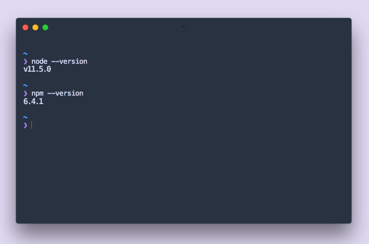
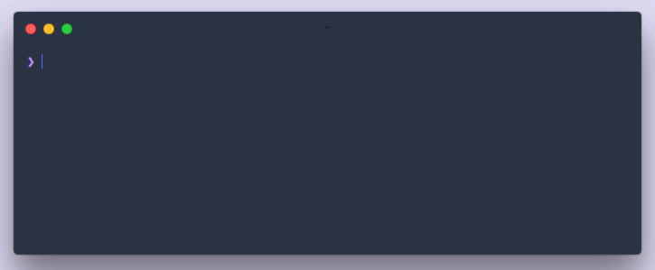

Before you start to code, you’ll need to familiarize with some core web technologies, and make sure that you have installed all required software tools.

## Overview of core technologies

It’s not necessary to be an expert with these already — if you’re not, don’t worry! You’ll pick up a lot through the course of this tutorial series; These are some of the main web technologies you’ll use when building a Gatsby site:

- **HTML**: A markup language that every web browser is able to understand. It stands for HyperText Markup Language. HTML gives your web content a universal informational structure, defining things like headings, paragraphs, and more.
- **CSS**: A presentational language used to style the appearance of your web content (fonts, colors, layout, etc).
- **JavaScript**: A programming language that helps us make the web dynamic and interactive.
- **React**: A code library (built with JavaScript) for building user interfaces. It’s the framework that Gatsby uses to build pages and structure content.
- **GraphQL**: A query language; A programming language that allows you to pull data into your website. It’s the interface that Gatsby uses for managing site data.

> 💡 (Optional!) For a comprehensive introduction to what a website is, HTML, and CSS, check out “[**Building your first web page**](https://learn.shayhowe.com/html-css/building-your-first-web-page/)”. It’s a great place to start learning about the web, from scratch. For a more hands-on introduction to [**HTML**](https://www.codecademy.com/learn/introduction-to-javascript), [**CSS**](https://www.codecademy.com/learn/learn-css) and [**JavaScript**](https://www.codecademy.com/learn/learn-html), check out the tutorials from Codecademy. [**React**](https://reactjs.org/tutorial/tutorial.html) and [**GraphQL**](http://graphql.org/graphql-js/) also have their own introductory tutorials.

## Familiarize with command line

The command line is a text-based interface used to run commands on your computer. (You’ll also often see it referred to as the terminal. In this tutorial we’ll use both interchangeably). It’s a lot like using the Finder on a Mac, or Explorer on Windows. Finder and Explorer are examples of graphical user interfaces (GUI). The command line is a powerful, text-based way to interact with your computer.

Take a moment to locate and open up the command line interface (CLI) for your computer. (Depending on which operating system you are using, see [**instructions for Mac**](http://www.macworld.co.uk/feature/mac-software/how-use-terminal-on-mac-3608274/), or [**instructions for Windows**](https://www.quora.com/How-do-I-open-terminal-in-windows)).

> 💡 For a great introduction to using the command line, check out [**Codecademy’s Command Line tutorial**](https://www.codecademy.com/courses/learn-the-command-line/lessons/navigation/exercises/your-first-command) for Mac and Linux users, and [**this tutorial**](https://www.computerhope.com/issues/chusedos.htm) for Windows users. (Even if you are a Windows user, the first page of the Codecademy tutorial is a valuable read, as it explains what the command line is, not just how to interface with it.)

## Install Node.js

Node.js is an environment that can run JavaScript code. Gatsby is built with Node.js. To get up and running with Gatsby, you’ll need to have a recent version installed on your computer.

### ⌚ Download Node.js

Visit the [**Node.js site**](https://nodejs.org/) and follow the instructions to download and install the recommended version for your operating system. Once you have followed the installation steps, make sure everything was installed properly:

### ✋ Check your Node.js installation

1.  Open up your terminal.
2.  Run `node --version`. (If you’re new to the command line, “run `command`” means “type `node --version` in the command prompt, and hit the Enter key”. From here on, this is what we mean by “run `command`”).
3.  Run `npm --version`.

The output of each of those commands should be a version number. (Your versions may not be the same as those shown below!) If entering those commands doesn’t show you a version number, go back and make sure you have installed Node.js.



## Familiarize with npm

npm is a JavaScript package manager. A package is a module of code that you can choose to include in your projects. If you just downloaded and installed Node.js, npm was installed with it!

npm has three distinct components: the npm website, the npm registry, and the npm CLI (command line interface).

- On the npm website, you can browse what JavaScript packages are available in the npm registry.
- The npm registry is a large database of information about JavaScript packages available on npm.
- Once you’ve identified a package you want, you can use the npm CLI to install it in your project. The npm CLI is what talks to the registry — you generally only interact with the npm website or the npm CLI.

> 💡 Check out npm’s introduction, “[**What is npm?**](https://docs.npmjs.com/getting-started/what-is-npm)”.

## Install the Gatsby CLI

The Gatsby CLI tool lets you quickly create new Gatsby-powered sites, and run commands for developing Gatsby sites. It is a published npm package. You can install the Gatsby CLI from the npm registry, using the npm CLI.

### ✋ Install the Gatsby CLI tool

1.  Navigate to the terminal.
2.  Run `npm install --global gatsby-cli`.

> 💡 If you are unable to successfully install due to a permissions issue, you may want to check out the [npm docs on fixing permissions](https://docs.npmjs.com/getting-started/fixing-npm-permissions), or [this guide](https://github.com/sindresorhus/guides/blob/master/npm-global-without-sudo.md).

A couple of different things are happening here.

```bash
npm install --global gatsby-cli
```

- We’re using the npm CLI to install the Gatsby CLI. `npm install` is the command used to install packages.
- When installing npm packages, you can install them globally, or in a specific project. (We’ll learn about the latter, later). The `--global` flag signals that we want the first option, to install globally. This means our package will be available to us on our computer, outside of the context of a specific project.
- `gatsby-cli` is the exact name our desired package is registered with on the [**npm registry**](https://www.npmjs.com/package/gatsby-cli).

### ✋ Check your Gatsby CLI installation

1.  Open up your terminal.
2.  Run `gatsby --version`.
3.  Run `gatsby --help`.


If successfully installed, running `gatsby --version` should return a version number, and running `gatsby --help` will show different commands available to you using the `gatsby-cli` tool.

## Create a site

Now let’s use the gatsby-cli tool to create your first Gatsby site. Using the tool, you can use “starters”, or partially built sites with some default configuration, to help you get moving faster on creating a certain type of site. The “Hello World” starter we’ll be using here is a starter with the bare essentials needed for a [Gatsby](/) site.

### ✋ Create a Gatsby site

1.  Open up your terminal.
2.  Run `gatsby new hello-world https://github.com/gatsbyjs/gatsby-starter-hello-world#v2`. (_Note: Depending on your download speed, the amount of time this takes will vary_).
3.  Run `cd hello-world`.
4.  Run `gatsby develop`.



What just happened?

```bash
gatsby new hello-world https://github.com/gatsbyjs/gatsby-starter-hello-world
```

- Starting with `gatsby` says, ‘hey, we want to use the gatsby-cli tool!’
- `new` is a gatsby command to create a new Gatsby project.
- Here, `hello-world` is an arbitrary title — you could pick anything. The CLI tool will place the code for your new site in a new folder called “hello-world”.
- Lastly, the Github URL specified points to a code repository that holds the starter code you want to use. If you aren't familiar yet with git and Github, you can [learn more here](https://try.github.io/).

```bash
cd hello-world
```

- This says 'I want to change directories (`cd`) to the “hello-world” subfolder'. Whenever you want to run any commands for your site, you need to be in the context for that site (aka, your terminal needs to be pointed at the directory where your site code lives).

```bash
gatsby develop
```

- This command starts a development server. You will be able to see and interact with your new site in a development environment — local (on your computer, not published to the internet).

### ✋ View your site locally

Open up a new tab in your browser and navigate to [**http://localhost:8000**](http://localhost:8000/).


Congrats! This is the beginning of your very first Gatsby site! 🎉

You’ll be able to visit the site locally at [**_http://localhost:8000_**](http://localhost:8000/) for as long as your development server is running. (That’s the process you started by running the `gatsby develop` command). To stop running that process (or to “stop running the development server”), go back to your terminal window, hold down the “control” key and then hit “c” (ctrl-c). To start it again, run `gatsby develop` again!

## Set up a code editor

A code editor is a program designed specifically for editing computer code. There are many great ones out there; If you haven't worked with a code editor before, we recommend the editor used throughout this tutorial -- [**VS Code**](https://code.visualstudio.com/).

### ✋ Download VS Code

Visit the [VS code site](https://code.visualstudio.com/#alt-downloads), and download the version appropriate for your platform.

### ✋ Install Prettier plugin

We also recommend using [Prettier](https://github.com/prettier/prettier) -- Prettier is a tool that helps format your code, keeping it consistent (and helping to avoid errors!).

You can use Prettier directly in your editor using the [Prettier VS Code plugin](https://github.com/prettier/prettier-vscode):

1. Open the extensions view on VS Code (View => Extensions)
2. Search for "Prettier - Code formatter"
3. Click "Install". After installation you'll be prompted to restart VS Code to enable the extension.

> 💡 If you're not using VS Code, check out the Prettier docs for [install instructions](https://prettier.io/docs/en/install.html) or [other editor integrations](https://prettier.io/docs/en/editors.html).

## ➡️ What’s Next?

To summarize, in this section you:

- Installed and learned about Node.js and the npm CLI tool
- Installed and learned about the Gatsby CLI tool
- Generated a new Gatsby site using the Gatsby CLI tool
- Downloaded a code editor
- Installed a code formatter called Prettier

Now, let’s move on to [**getting to know Gatsby building blocks**](/tutorial/part-one/).
