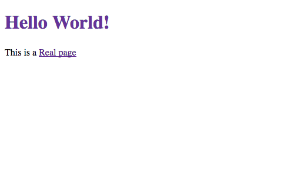

[`gatsby-transformer-remark`](/plugins/gatsby-transformer-remark) empowers developers to translate Markdown into HTML to be consumed via Gatsby's GraphQL API. Blogs and other content based sites can highly benefit from functionality enabled with this plugin. With this plugin, authors of content for the site don't need to worry about how the site is written or structured but can rather focus on writing engaging posts and content!

In certain instances, a developer may want to customize the content of the Markdown file and extend it functionally in useful ways; for example, use cases such as [adding syntax highlighting](/plugins/gatsby-remark-prismjs/), [parsing and creating responsive images](/plugins/gatsby-remark-images), [embedding videos](/plugins/gatsby-remark-embed-video), and many others. In each of these examples, a plugin will be injected with the Markdown Abstract Syntax Tree (AST) and manipulate content based on certain node types or content in particular nodes.

## What you will learn in this tutorial

- Further understanding of the remark Abstract Syntax Tree (AST)
- How to create a plugin that is injected with an AST via `gatsby-transformer-remark`
- How to manipulate the remark AST to add additional functionality

## Prerequisites

There a few things that you should have some understanding with:

- How to work with Remark in Gatsby as described in [Part Six](/docs/tutorial/getting-started/part-6/) and [Part Seven](/docs/tutorial/getting-started/part-7/) of the Gatsby Tutorial.
- Understanding of the Markdown Syntax.

## Understanding the Abstract Syntax Tree

To get an understanding at what is available in the Markdown AST, take a look at the Markdown AST spec that is used in remark and other unist projects: [syntax-tree/mdast](https://github.com/syntax-tree/mdast).

Starting out with a Markdown file as below:

```markdown
# Hello World!

This is a [Real page](https://google.com)
```

Remark would translate this into an AST made available to `gatsby-transformer-remark` plugins. The AST would appear as the following:

```json
{
  "type": "root",
  "children": [
    {
      "type": "heading",
      "depth": 1,
      "children": [
        {
          "type": "text",
          "value": "Hello World!",
          "position": {
            "start": { "line": 1, "column": 3, "offset": 2 },
            "end": { "line": 1, "column": 15, "offset": 14 },
            "indent": []
          }
        }
      ],
      "position": {
        "start": { "line": 1, "column": 1, "offset": 0 },
        "end": { "line": 1, "column": 15, "offset": 14 },
        "indent": []
      }
    },
    {
      "type": "paragraph",
      "children": [
        {
          "type": "text",
          "value": "This is a ",
          "position": {
            "start": { "line": 3, "column": 1, "offset": 16 },
            "end": { "line": 3, "column": 11, "offset": 26 },
            "indent": []
          }
        },
        {
          "type": "link",
          "title": null,
          "url": "https://google.com",
          "children": [
            {
              "type": "text",
              "value": "Real page",
              "position": {
                "start": { "line": 3, "column": 12, "offset": 27 },
                "end": { "line": 3, "column": 21, "offset": 36 },
                "indent": []
              }
            }
          ],
          "position": {
            "start": { "line": 3, "column": 11, "offset": 26 },
            "end": { "line": 3, "column": 42, "offset": 57 },
            "indent": []
          }
        }
      ],
      "position": {
        "start": { "line": 3, "column": 1, "offset": 16 },
        "end": { "line": 3, "column": 42, "offset": 57 },
        "indent": []
      }
    }
  ],
  "position": {
    "start": { "line": 1, "column": 1, "offset": 0 },
    "end": { "line": 4, "column": 1, "offset": 58 }
  }
}
```

As well, [AST Explorer](https://astexplorer.net/#/gist/d9029a2e8827265fbb9b190083b59d4d/3384f3ce6a3084e50043d0c8ce34628ed7477603) is a site that gives you a side-by-side view of the markdown and the outputted AST.

## Setting up a plugin

You are going to create a plugin that colors all top-level headings in the markdown with the color purple.

First create a local plugin by adding a `plugins` folder in your site and generating a `package.json` file for it. As well, create an `index.js` file. In this file, we export a function that will be invoked by `gatsby-transformer-remark`:

```js:title=plugins/gatsby-remark-purple-headers/index.js
module.exports = ({ markdownAST }, pluginOptions) => {
  // Manipulate AST

  return markdownAST
}
```

The first parameter is all of the default properties that can be used in plugins (actions, store, getNodes, schema, etc.) plus a couple just for gatsby-transformer-remark plugins. The most relevant field for our purposes is the `markdownAST` field which is destructured in the code snippet above.

As with other Gatsby plugins, the 2nd parameter is the `pluginOptions` which is obtained from the definition in `gatsby-config.js` file.

Finally, the function will return the `markdownAST` after the fields you wish to be edited are transformed.

## Adding the plugin to your site

You likely will want to grab `gatsby-source-filesystem` to inject the file nodes into Gatsby's GraphQL schema. In this example it is assumed that the Markdown files exist in a `src/data/` directory.

The plugin is now initially set so you can add it as a sub-plugin inside `gatsby-transformer-remark`

```js:title=gatsby-config.js
module.exports = {
  plugins: [
    {
      resolve: "gatsby-source-filesystem",
      options: {
        name: `data`,
        path: `${__dirname}/src/data/`,
      },
    },
    {
      resolve: `gatsby-transformer-remark`,
      options: {
        plugins: [`gatsby-remark-purple-headers`],
      },
    },
  ],
}
```

If you want to add some options, you could switch to the object syntax:

```js
{
  resolve: `gatsby-remark-purple-headers`,
  options: {
    // Options here
  }
}
```

### `gatsby-plugin-mdx`

In case you use `gatsby-plugin-mdx` in place of `gatsby-transformer-remark`, the former takes an array config option named `gatsbyRemarkPlugins` that allows compatibility with Gatsby's remark plugins.

To make `gatsby-plugin-mdx` recognize a local plugin like `gatsby-remark-purple-headers`, you need to point to its location in the project through `require.resolve`.

```js
{
  resolve: `gatsby-plugin-mdx`,
  options: {
    gatsbyRemarkPlugins: [
      {
        resolve: require.resolve(`./plugins/gatsby-remark-purple-headers`),
      }
    ]
  }
}
```

However, if the sub-plugin is published and installed via npm, simply refer to it by name as the case with using `gatsby-transformer-remark`.

## Find and Modify Markdown Nodes

When modifying nodes, you'll want to walk the tree and then implement new functionality on specific nodes.

A node module to help with this is [unist-util-visit](https://github.com/syntax-tree/unist-util-visit), a walker for `unist` nodes. For reference, Unist (Unified Syntax Tree) is a standard for Markdown syntax trees and parsers that include well known parsers in the Gatsby world like Remark and MDX.

As an example from `unist-util-visit`'s README file, it allows for an interface to visit particular nodes based on a particular type:

```js
var remark = require("remark")
var visit = require("unist-util-visit")

var tree = remark().parse("Some _emphasis_, **importance**, and `code`.")

visit(tree, "text", visitor)

function visitor(node) {
  console.log(node)
}
```

Here, it finds all text nodes and will `console.log` the nodes. The second argument can be replaced with any type described in Unist's [Markdown AST (mdast) specification](https://github.com/syntax-tree/mdast#nodes) including types such as `paragraph`, `blockquote`, `link`, `image` or in our usecase, `heading`.

To be able to use `unist-util-visit`, install it into your plugin:

```shell
npm install unist-util-visit@^2
```

**Please note**: You're installing v2 of `unist-util-visit` as newer major versions are ESM and Gatsby doesn't fully support that yet.

With this technique in mind, you can similarly traverse the AST from your plugin and add additional functionality, like so:

```js:title=plugins/gatsby-remark-purple-headers/index.js
const visit = require("unist-util-visit")

module.exports = ({ markdownAST }, pluginOptions) => {
  // highlight-next-line
  visit(markdownAST, "heading", node => {
    // Do stuff with heading nodes
  })

  return markdownAST
}
```

Next, by visiting all heading nodes and passing them into a transformer function, you can manipulate the particular nodes to match your use case.

Looking again at the AST node for heading:

```json
{
  "type": "heading",
  "depth": 1,
  "children": [
    {
      "type": "text",
      "value": "Hello World!",
      "position": {
        "start": { "line": 1, "column": 3, "offset": 2 },
        "end": { "line": 1, "column": 15, "offset": 14 },
        "indent": []
      }
    }
  ],
  "position": {
    "start": { "line": 1, "column": 1, "offset": 0 },
    "end": { "line": 1, "column": 15, "offset": 14 },
    "indent": []
  }
},
```

You have context about the text as well as what depth the heading is (for instance here you have a depth of 1 which would equate to an `h1` element)

With the inner function of the `visit` call, you parse out all of the text and if it will map to a h1, you set the type of the node to `html` and set the node's value to be some custom HTML.

```js:title=plugins/gatsby-remark-purple-headers/index.js
const visit = require("unist-util-visit")
const toString = require("mdast-util-to-string")

module.exports = ({ markdownAST }, pluginOptions) => {
  visit(markdownAST, "heading", node => {
    let { depth } = node

    // Skip if not an h1
    if (depth !== 1) return

    // Grab the innerText of the heading node
    let text = toString(node)

    const html = `
        <h1 style="color: rebeccapurple">
          ${text}
        </h1>
      `

    node.type = "html"
    node.children = undefined
    node.value = html
  })

  return markdownAST
}
```

A small library [mdast-util-to-string](https://github.com/syntax-tree/mdast-util-to-string) by Unified was used to extract the plain text of the inner nodes. This would remove links or other types of nodes inside the heading, but given you have full access to the markdown AST, you can modify it however you wish.

## Using asynchronous behavior

Gatsby supports the usage of asynchronous behavior in plugins, and `gatsby-transformer-remark` uses [unified](https://github.com/unifiedjs/unified) under the hood. The following example shows how the `gatsby-remark-purple-headers` transformer can be converted to asynchronous by adding the `async` keyword to the function declaration.

```js:title=plugins/gatsby-remark-purple-headers/index.js
const visit = require("unist-util-visit")
const toString = require("mdast-util-to-string")

// highlight-next-line
module.exports = async ({ markdownAST }, pluginOptions) => {
  visit(markdownAST, "heading", node => {
    let { depth } = node

    // Skip if not an h1
    if (depth !== 1) return

    // Grab the innerText of the heading node
    let text = toString(node)

    const html = `
        <h1 style="color: rebeccapurple">
          ${text}
        </h1>
      `

    node.type = "html"
    node.children = undefined
    node.value = html
  })

  return markdownAST
}
```

A real-world example of this would be [`gatsby-remark-responsive-iframe`](https://github.com/gatsbyjs/gatsby/blob/master/packages/gatsby-remark-responsive-iframe/src/index.js).

## Loading in changes and seeing effect

At this point, our plugin is now ready to be used. To see the resulting functionality, it is helpful to re-visit [Part 6 of the Gatsby Tutorial](/docs/tutorial/getting-started/part-6/) to programmatically create pages from Markdown data. Once this is set up, you can examine that your plugin works as seen below based on the markdown you wrote earlier.



**Note**: In case you don't see the intended effect, try wiping out the cache by running `gatsby clean`.

## Publishing the plugin

To share this plugin with others, you can extract the plugin to its own directory outside of this site and then publish it to npm so it can be accessed both on npm and [Submitted to the Plugin Library](/contributing/submit-to-plugin-library).

## Summary

You just wrote a local Gatsby plugin that is a sub-plugin for `gatsby-transformer-remark` that manipulates the Remark AST. You should now have a further understanding about the structure of Markdown Abstract Syntax Trees! Yay!

## What's next?

If you wish to see other plugins that manipulate the Remark AST, you can find them in the [plugin library](/plugins/?=gatsby-remark-).
