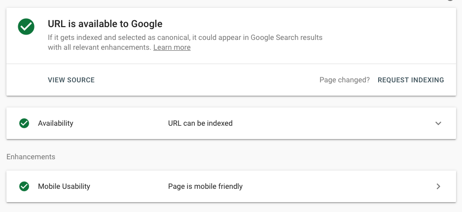

Perhaps you've been approached by an SEO _expert_ who can maximize your revenue and page views by following these **Three Simple Tricks**! Relatively few people make the concerted effort to implement SEO in their web app. This tutorial will share some of the ins and outs of SEO and how you can implement common SEO patterns in your Gatsby web app, today. By the end of this post you'll know how to do the following:

- Implement SEO patterns with [react-helmet][react-helmet]
- Create an optimized social sharing card for Twitter, Facebook, and Slack
- Tweak the SEO component exposed in the default gatsby starter ([`gatsby-starter-default`][gatsby-starter-default])

## Implementation

A core ingredient for SEO is a meaningful `title` tag. Make sure to include related keywords without falling into buzzword bingo. Some crawlers also respect `meta` tags, while Google seems to ignore these tags for ranking and indexing at all.

You probably have seen something like the following:

```html
<title>My Wonderful App</title>
<meta
  name="viewport"
  content="width=device-width, initial-scale=1, shrink-to-fit=no"
/>
<meta
  name="description"
  content="This is probably some earth-shattering excerpt that is around ~200 characters or less"
/>
```

The _bare minimum_ requirement is to include a `title` tag for basic SEO. However, the following describes a powerful combo of content rendered at _build time_ powered by Gatsby and GraphQL.

## Gatsby + GraphQL

GraphQL is a crucial feature enabled via Gatsby (note: you don't [_have_ to use GraphQL with Gatsby][unstructured-data]). Leveraging GraphQL to query your indexable content--wherever it lives (at build time!)--is one of the most powerful and flexible techniques enabled via Gatsby. The following sections are a brief look at the implementation of an extensible and flexible SEO component.

### `StaticQuery`

Gatsby distinguishes between page-level queries and component queries. The former can use page GraphQL queries while the latter can use [`StaticQuery`][gatsby-static-query]. A StaticQuery will be parsed, evaluated, and injected at _build time_ into the component that is requesting the data, allowing to fall back to sane defaults, while also providing an extensible, reusable component.

### Creating the SEO component

Using the power and flexibility of React, you can create a React component to power this functionality.

> Note: `react-helmet` is enabled, by default, in gatsby-starter-default and gatsby-starter-blog.
>
> If you're not using those starters, [follow this guide for installation instructions][gatsby-plugin-react-helmet]

```jsx:title=src/components/seo.js
import React from "react"
// highlight-start
import { Helmet } from "react-helmet"
import { useStaticQuery, graphql } from "gatsby"
// highlight-end

function SEO({ description }) {
  const { site } = useStaticQuery(
    graphql`
      query {
        # highlight-start
        site {
          siteMetadata {
            title
            description
            author
            keywords
            siteUrl
          }
        }
        # highlight-end
      }
    `
  )

  const metaDescription = description || site.siteMetadata.description

  return null
}

export default SEO
```

This component doesn't _do_ anything yet, but it's the foundation for a useful, extensible component. It leverages the `useStaticQuery` functionality enabled via Gatsby to query siteMetadata (e.g. details in `gatsby-config.js`) with description and keywords. At this point, the `SEO` component returns `null` to render nothing. Next, you will _actually_ render something and build out the prototype for this SEO component.

```jsx:title=src/components/seo.js
import React from "react"
import { Helmet } from "react-helmet"
import { useStaticQuery, graphql } from "gatsby"

function SEO({ description, lang, meta }) {
  const { site } = useStaticQuery(
    graphql`
      query {
        site {
          siteMetadata {
            title
            description
            author
            keywords
            siteUrl
          }
        }
      }
    `
  )

  const metaDescription = description || site.siteMetadata.description

  return (
    <Helmet
      htmlAttributes={{
        lang,
      }}
      meta={[
        {
          name: `description`,
          content: metaDescription,
        },
        // highlight-start
        {
          name: "keywords",
          content: site.siteMetadata.keywords.join(","),
        },
        // highlight-end
      ]}
    />
  )
}

// highlight-start
SEO.defaultProps = {
  lang: `en`,
  meta: [],
  description: ``,
}
// highlight-end

export default SEO
```

Whew, getting closer! This will now render the `meta` `description` tag, and will do so using content injected at build-time with the `useStaticQuery` hook. Additionally, it will add the `lang="en"` attribute to the root-level `html` tag to silence that pesky Lighthouse warning 😉.

This is still the bare bones, rudimentary approach to SEO. An additional step is to enhance this functionality and get some useful functionality for sharing a page via social networks like Facebook, Twitter, and Slack.

### Implementing social SEO

In addition to SEO for actual _search_ engines you also want those pretty cards that social networks like Twitter and Slack enable. Specifically, the implementation should feature:

- Description for embedded results
- Title for embedded results
- (Optionally) display an image and a card if an image is passed in to the component

```jsx:title=src/components/seo.js
import React from "react"
import PropTypes from "prop-types" // highlight-line
import { Helmet } from "react-helmet"
import { useStaticQuery, graphql } from "gatsby"

// highlight-next-line
function SEO({ description, lang, meta, image: metaImage, title }) {
  const { site } = useStaticQuery(
    graphql`
      query {
        site {
          siteMetadata {
            title
            description
            author
            keywords
            siteUrl
          }
        }
      }
    `
  )

  const metaDescription = description || site.siteMetadata.description
  // highlight-start
  const image =
    metaImage && metaImage.src
      ? `${site.siteMetadata.siteUrl}${metaImage.src}`
      : null
  // highlight-end

  return (
    <Helmet
      htmlAttributes={{
        lang,
      }}
      title={title}
      titleTemplate={`%s | ${site.siteMetadata.title}`}
      meta={[
        {
          name: `description`,
          content: metaDescription,
        },
        {
          name: "keywords",
          content: site.siteMetadata.keywords.join(","),
        },
        {
          property: `og:title`,
          content: title,
        },
        {
          property: `og:description`,
          content: metaDescription,
        },
        {
          property: `og:type`,
          content: `website`,
        },
        {
          name: `twitter:creator`,
          content: site.siteMetadata.author,
        },
        {
          name: `twitter:title`,
          content: title,
        },
        {
          name: `twitter:description`,
          content: metaDescription,
        },
        // highlight-start
      ]
        .concat(
          metaImage
            ? [
                {
                  property: "og:image",
                  content: image,
                },
                {
                  property: "og:image:width",
                  content: metaImage.width,
                },
                {
                  property: "og:image:height",
                  content: metaImage.height,
                },
                {
                  name: "twitter:card",
                  content: "summary_large_image",
                },
              ]
            : [
                {
                  name: "twitter:card",
                  content: "summary",
                },
              ]
          // highlight-end
        )
        .concat(meta)}
    />
  )
}

SEO.defaultProps = {
  lang: `en`,
  meta: [],
  description: ``,
}

SEO.propTypes = {
  description: PropTypes.string,
  lang: PropTypes.string,
  meta: PropTypes.arrayOf(PropTypes.object),
  title: PropTypes.string.isRequired,
  // highlight-start
  image: PropTypes.shape({
    src: PropTypes.string.isRequired,
    height: PropTypes.number.isRequired,
    width: PropTypes.number.isRequired,
  }),
  // highlight-end
}

export default SEO
```

Woo hoo! You enabled not only SEO for search engines like Google and Bing, but you also laid the groundwork for enhanced sharing capabilities on social networks. Finally, you will learn to add support for one of the more useful functionalities for SEO: a canonical link.

## `link rel="canonical"`

A canonical link is a hint to a search engine that this is the _source_ for this content. It helps resolve duplicate content issues. For instance, if you have several paths to the same content, you can use a canonical link as akin to a soft redirect which will **not** harm your search ranking if implemented correctly.

To implement this functionality, you need to do the following:

1. Enable passing a `pathname` prop to your SEO component
2. Prefix your `pathname` prop with your `siteUrl` (from `gatsby-config.js`)
   - A canonical link should be _absolute_ (e.g. `https://your-site.com/canonical-link`), so you will need to prefix with this `siteUrl`
3. Tie into the `link` prop of `react-helmet` to create a `<link rel="canonical" >` tag

```jsx:title=src/components/seo.js
import React from "react"
import PropTypes from "prop-types"
import { Helmet } from "react-helmet"
import { useStaticQuery, graphql } from "gatsby"

// highlight-next-line
function SEO({ description, lang, meta, image: metaImage, title, pathname }) {
  const { site } = useStaticQuery(
    graphql`
      query {
        site {
          siteMetadata {
            title
            description
            author
            keywords
            siteUrl
          }
        }
      }
    `
  )

  const metaDescription = description || site.siteMetadata.description
  const image =
    metaImage && metaImage.src
      ? `${site.siteMetadata.siteUrl}${metaImage.src}`
      : null
  // highlight-start
  const canonical = pathname ? `${site.siteMetadata.siteUrl}${pathname}` : null
  // highlight-end

  return (
    <Helmet
      htmlAttributes={{
        lang,
      }}
      title={title}
      titleTemplate={`%s | ${site.siteMetadata.title}`}
      // highlight-start
      link={
        canonical
          ? [
              {
                rel: "canonical",
                href: canonical,
              },
            ]
          : []
      }
      //highlight-end
      meta={[
        {
          name: `description`,
          content: metaDescription,
        },
        {
          name: "keywords",
          content: site.siteMetadata.keywords.join(","),
        },
        {
          property: `og:title`,
          content: title,
        },
        {
          property: `og:description`,
          content: metaDescription,
        },
        {
          property: `og:type`,
          content: `website`,
        },
        {
          name: `twitter:creator`,
          content: site.siteMetadata.author,
        },
        {
          name: `twitter:title`,
          content: title,
        },
        {
          name: `twitter:description`,
          content: metaDescription,
        },
      ]
        .concat(
          metaImage
            ? [
                {
                  property: "og:image",
                  content: image,
                },
                {
                  property: "og:image:width",
                  content: metaImage.width,
                },
                {
                  property: "og:image:height",
                  content: metaImage.height,
                },
                {
                  name: "twitter:card",
                  content: "summary_large_image",
                },
              ]
            : [
                {
                  name: "twitter:card",
                  content: "summary",
                },
              ]
        )
        .concat(meta)}
    />
  )
}

SEO.defaultProps = {
  lang: `en`,
  meta: [],
  description: ``,
}

SEO.propTypes = {
  description: PropTypes.string,
  lang: PropTypes.string,
  meta: PropTypes.arrayOf(PropTypes.object),
  title: PropTypes.string.isRequired,
  image: PropTypes.shape({
    src: PropTypes.string.isRequired,
    height: PropTypes.number.isRequired,
    width: PropTypes.number.isRequired,
  }),
  // highlight-next-line
  pathname: PropTypes.string,
}

export default SEO
```

Woo hoo! Lots to digest here, but you've enabled adding an _absolute_ canonical link by passing in a `pathname` prop and prefixing with `siteUrl`.

To bring it all home, it's time to begin actually _using_ this extensible SEO component to show all of these moving parts coming together to deliver a great SEO experience.

## Using the SEO component

You created an extensible SEO component. It takes a `title` prop and then (optionally) `description`, `meta`, `image`, and `pathname` props.

### In a page component

```jsx:title=src/pages/index.js
import React from "react"

import Layout from "../components/layout"
import SEO from "../components/seo" // highlight-line

function Index() {
  return (
    <Layout>
      <SEO title="My Amazing Gatsby App" /> {/* highlight-line */}
      <h1>lol - pretend this is meaningful content</h1>
    </Layout>
  )
}

export default Index
```

### In a template

In many cases, you want to build a Markdown powered blog (see: [this tutorial][gatsby-markdown-blog] for more info). Of course, you want some nice SEO as well as a nifty image for sharing on Twitter, Facebook, and Slack. The following steps are needed:

- Create a Markdown post
- Add an image, and add it to the Markdown posts frontmatter
- Query this image with GraphQL

#### Creating the post

```shell
mkdir -p content/blog/2019-01-04-hello-world-seo
touch content/blog/2019-01-04-hello-world-seo/index.md
```

```markdown:title=content/blog/2019-01-04-hello-world-seo/index.md
---
date: 2019-01-04
featured: images/featured.jpg
---

Hello World!
```

#### Adding the image

Let's see how an attached image will look like. For this tutorial, you can use the following image:


The image will need to be located at `content/blog/2019-01-04-hello-world-seo/images/featured.jpg`.

Make sure to use appropriately sized images for social sharing. Facebook and Twitter have restrictions beyond which they will ignore your image.

#### Querying with GraphQL

```jsx:title=src/templates/blog-post.js
import React from "react"
import { Link, graphql } from "gatsby"

import Bio from "../components/bio"
import Layout from "../components/layout"
import SEO from "../components/seo" // highlight-line
import { rhythm, scale } from "../utils/typography"

class BlogPostTemplate extends React.Component {
  render() {
    const post = this.props.data.markdownRemark
    const siteTitle = this.props.data.site.siteMetadata.title
    const image = post.frontmatter.image
      ? post.frontmatter.image.childImageSharp.resize
      : null // highlight-line

    return (
      <Layout location={this.props.location} title={siteTitle}>
        {/* highlight-start */}
        <SEO
          title={post.frontmatter.title}
          description={post.frontmatter.description || post.excerpt}
          image={image}
          pathname={this.props.location.pathname}
        />
        {/* highlight-end */}
        <h1>{post.frontmatter.title}</h1>
        <div dangerouslySetInnerHTML={{ __html: post.html }} />
      </Layout>
    )
  }
}

export default BlogPostTemplate

export const pageQuery = graphql`
  # highlight-start
  query BlogPostBySlug($slug: String!) {
    site {
      siteMetadata {
        title
        author
      }
    }
    markdownRemark(fields: { slug: { eq: $slug } }) {
      id
      excerpt(pruneLength: 160)
      html
      frontmatter {
        title
        description
        image: featured {
          childImageSharp {
            resize(width: 1200) {
              src
              height
              width
            }
          }
        }
      }
    }
  }
  # highlight-end
`
```

There are a few aspects worth nothing here:

- You're using `pruneLength: 160` for the excerpt; this is because [SEO meta descriptions should be between 150-170 characters][seo-description-length]

- This is a slick feature of Gatsby's GraphQL capabilities, and will truncate (e.g. with a trailing `...`) appropriately. Perfect!

- The image query is intentionally simplified, but a good base to build upon. There are specific size and aspect ratio requirements for [both Facebook][facebook-og-image] and [Twitter][twitter-image].

## The Payoff

Using the techniques outlined in this post, you've made your Gatsby application SEO-friendly as well as shareable on common social networks. Check out the following examples of a sample blog post.

### Google



### Facebook


### Twitter


### Slack


To learn more about these validations, check out how to _validate_ SEO with the following tools from [Google][google-validation], [Twitter][twitter-validation], and [Facebook][facebook-validation].

The SEO resources outlined in this tutorial aren't _only_ a best practice, they're also a best practice enabled, by default. Available **today** in `gatsby-starter-default`, use:

```shell
npm gatsby new my-new-gatsby-app
```

and you'll have the `SEO` component available to maximize your SEO and social sharing capabilities. Check it out!

## Further Learning

This tutorial is merely a shallow dive into the depths of SEO. Consider it a primer for further learning and a gentle introduction to some SEO concepts with a Gatsby twist. To truly master these concepts is outside the scope of this tutorial, but it truly is fascinating stuff that can directly lead to more eyes on your content!

### References

- Facebook uses the [Open Graph][og] tag format
- Twitter uses `twitter:` keywords. See [Twitter Cards][twitter-cards] for more info
- Slack reads tags in the following order ([source][slack-unfurl])
  1. oEmbed server
  2. Twitter cards tags / Facebook Open Graph tags
  3. HTML meta tags
- Both [Google][google-json-ld] and [Apple][apple-json-ld] offer support for JSON-LD, which is _not covered_ in this guide
  - If you'd like to learn more, check out [this excellent guide](https://nystudio107.com/blog/json-ld-structured-data-and-erotica) for more info on JSON-LD
- Check out the [`gatsby-seo-example`][gatsby-seo-example] for a ready-to-use starter for powering your Markdown-based blog.

[gatsby-starter-default]: https://github.com/gatsbyjs/gatsby-starter-default
[gatsby-static-query]: /docs/static-query/
[gatsby-markdown-blog]: /docs/adding-markdown-pages/
[gatsby-plugin-react-helmet]: /packages/gatsby-plugin-react-helmet/
[react-helmet]: https://github.com/nfl/react-helmet
[unstructured-data]: /docs/using-gatsby-without-graphql/
[og]: https://developers.facebook.com/docs/sharing/webmasters/#markup
[twitter-cards]: https://developer.twitter.com/en/docs/tweets/optimize-with-cards/overview/abouts-cards.html
[seo-description-length]: https://yoast.com/shorter-meta-descriptions/
[facebook-og-image]: https://developers.facebook.com/docs/sharing/best-practices#images
[twitter-image]: https://developer.twitter.com/en/docs/tweets/optimize-with-cards/overview/summary-card-with-large-image.html
[slack-unfurl]: https://medium.com/slack-developer-blog/everything-you-ever-wanted-to-know-about-unfurling-but-were-afraid-to-ask-or-how-to-make-your-e64b4bb9254
[google-validation]: https://support.google.com/webmasters/answer/6066468?hl=en
[twitter-validation]: https://cards-dev.twitter.com/validator
[facebook-validation]: https://developers.facebook.com/tools/debug/sharing
[gatsby-seo-example]: https://github.com/DSchau/gatsby-seo-example
[google-json-ld]: https://developers.google.com/search/docs/guides/intro-structured-data
[apple-json-ld]: https://developer.apple.com/library/archive/releasenotes/General/WhatsNewIniOS/Articles/iOS10.html#//apple_ref/doc/uid/TP40017084-DontLinkElementID_2
