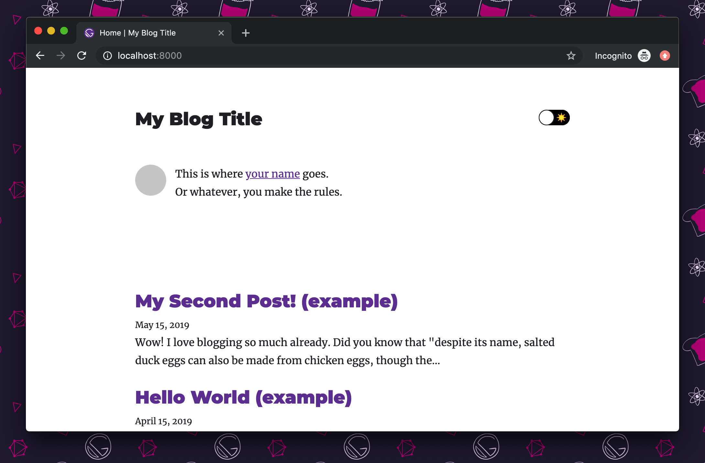
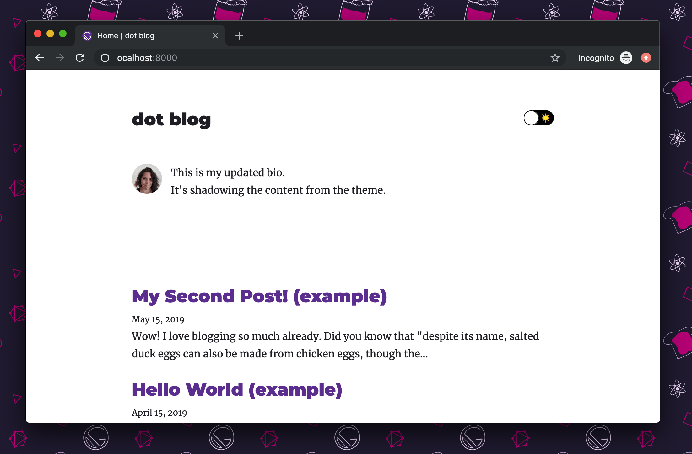
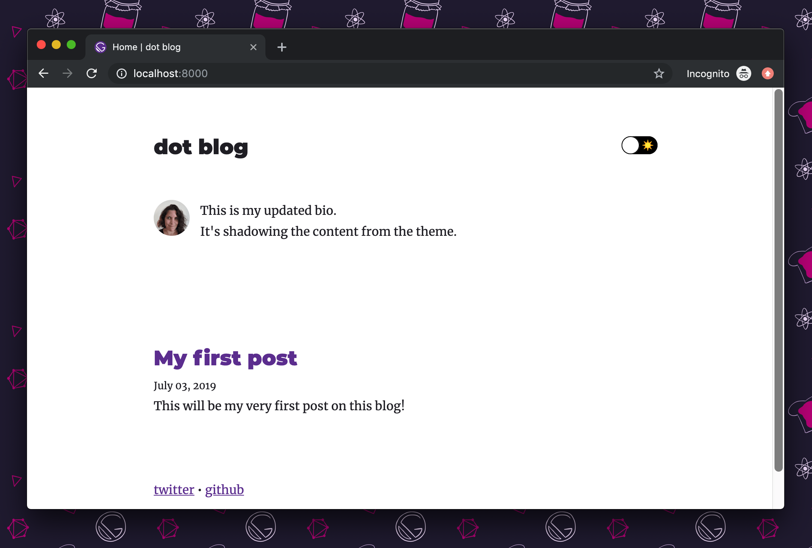
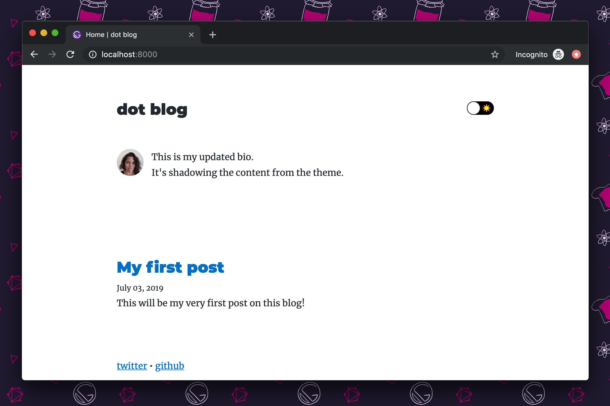

In this tutorial, you'll learn how to use Gatsby themes by creating a new site using the official Gatsby blog theme.

## Create a new site using the blog theme starter

Creating a site using a theme starter starts the same way as using a regular Gatsby starter:

```shell
gatsby new my-blog https://github.com/gatsbyjs/gatsby-starter-blog-theme
```

## Run the site

Creating a new site from the starter installed all of the blog theme's dependencies for you. Next, run the site and see what you have:

```shell
cd my-blog
gatsby develop
```



## Replace your avatar

The blog theme starter ships with a solid gray image for the avatar. Add your own avatar by choosing the image you want, and overwriting the file located at `/content/assets/avatar.png`.

## Update your site metadata

Customize the information on your site by replacing the site metadata in the `gatsby-config.js` file.

```javascript:title=gatsby-config.js
module.exports = {
  plugins: [
    {
      resolve: "gatsby-theme-blog",
      options: {},
    },
  ],
  // Customize your site metadata:
  {/* highlight-start */}
  siteMetadata: {
    title: "My Blog",
    author: "Amberley Romo",
    description: "A collection of my thoughts and writings.",
    siteUrl: "https://amberley.blog/",
    social: [
      {
        name: "twitter",
        url: "https://twitter.com/amber1ey",
      },
      {
        name: "github",
        url: "https://github.com/amberleyromo",
      },
    ],
  },
  {/* highlight-end */}
}
```

## Replace the content of the bio

When using Gatsby themes, you can take advantage of something called component shadowing. This allows you to override the default component included in the theme with a custom one you've created.

The Gatsby blog theme package has a component that contains the content of the site author's biography. The file path to that component (in the blog theme package, not your site) is `src/gatsby-theme-blog/components/bio-content.js`. You can find this path by looking through the theme in your site's `node_modules/gatsby-theme-blog` directory.

If you look at the file tree of your site, you'll see it looks like this:

```text
my-blog
├── content
│   ├── assets
│   │   └── avatar.png
│   └── posts
│       ├── hello-world.mdx
│       └── my-second-post.mdx
├── src
│   └── gatsby-theme-blog
│       ├── components
│       │   └── bio-content.js
│       └── gatsby-plugin-theme-ui
│           └── colors.js
├── gatsby-config.js
└── package.json
```

In the `src` directory of the site, there's a `gatsby-theme-blog` directory. Any file placed in that directory with a path that matches the path of a file in the blog theme directory will completely shadow the theme.

> 💡 The name of the directory (here `gatsby-theme-blog`) must exactly mirror the name of the published theme package, which in this case is [`gatsby-theme-blog`](https://www.npmjs.com/package/gatsby-theme-blog).

Open up the `bio-content.js` file and make some content edits:

```jsx:title=bio-content.js
import React, { Fragment } from "react"

export default function Bio() (
  {/* highlight-start */}
  <Fragment>
    This is my updated bio.
    <br />
    It's shadowing the content from the theme.
  </Fragment>
  {/* highlight-end */}
)
```

At this point, you should have an updated avatar, updated site details, and an updated bio:



## Add your own blog content

Now you can add your first blog post, and get rid of the demo content in the starter.

### Create a new blog post

Create a new file in `my-blog/content/posts`. Name it whatever you'd like (with a `.md` or `.mdx` file extension), and add some content! Here's an example:

```mdx:title=my-blog/content/posts/my-first-post.mdx
---
title: My first post
date: 2019-07-03
---

This will be my very first post on this blog!
```

### Delete the demo posts

Delete the two demo posts in the `/content/posts` directory:

- `my-blog/content/posts/hello-world.mdx`
- `my-blog/content/posts/my-second-post.mdx`

Restart the dev server, and you'll see your updated blog content:



## Change the color theme

The blog theme ships with a default Gatsby purple theme, but you can override and customize the theming of your site to your heart's content. In this tutorial, you'll change a few colors.

Open up `/src/gatsby-theme-blog/gatsby-plugin-theme-ui/colors.js`, and uncomment the code in that file.

```javascript:title=colors.js
import merge from "deepmerge"
import defaultThemeColors from "gatsby-theme-blog/src/gatsby-plugin-theme-ui/colors"

{/* highlight-start */}
const darkBlue = `#007acc`
const lightBlue = `#66E0FF`
const blueGray = `#282c35`
{/* highlight-end */}

export default merge(defaultThemeColors, {
  {/* highlight-start */}
  text: blueGray,
  primary: darkBlue,
  heading: blueGray,
  modes: {
    dark: {
      background: blueGray,
      primary: lightBlue,
      highlight: lightBlue,
    },
  },
  {/* highlight-end */}
})
```

Now, instead of a purple theme, you have a blue theme instead:



In this file, you're pulling in the default color theme (imported as `defaultThemeColors` here), and overriding certain color keys.

To see what other theme colors you can customize, check out the `colors.js` file in the official blog theme (`node_modules/gatsby-theme-blog/src/gatsby-plugin-theme-ui/colors.js`)

## Wrapping up

This was a step-by-step introduction to using a Gatsby theme through looking at a specific example. Note that different themes will be built differently, to accept different customization options. To dive deeper, check out the [Gatsby Theme docs](/docs/themes/).

## What's next?

- [Using multiple themes together](/tutorial/using-multiple-themes-together/)
