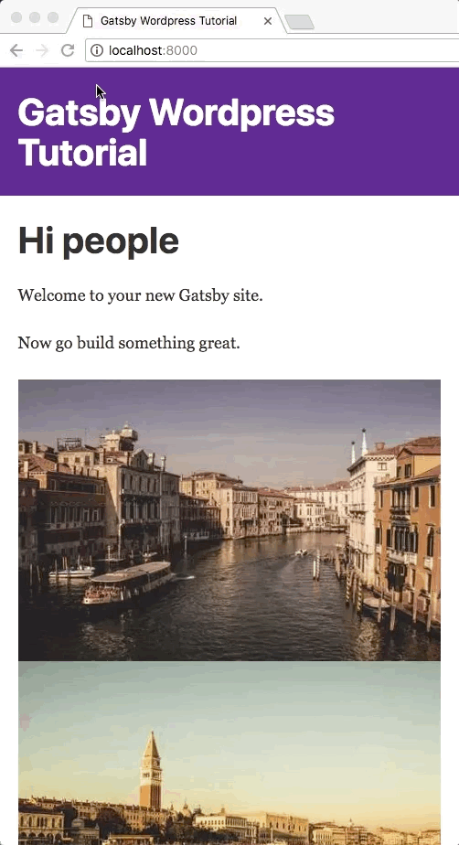
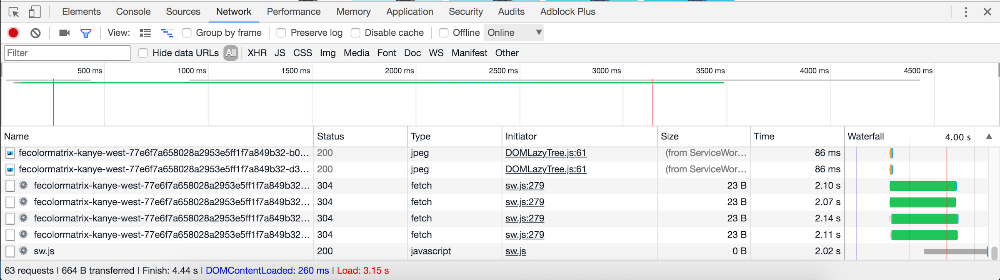
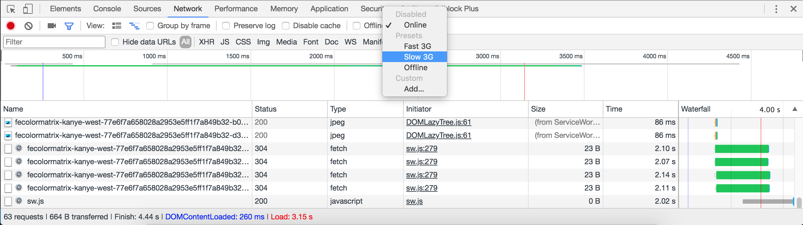

<mark>Warning:</mark>

The version of `gatsby-source-wordpress` that this tutorial uses will soon be deprecated and replaced with a complete rewrite in the next major version (v4). The reason for this is that we've adopted the use of WPGraphQL to support Preview and incremental builds as well as to make the schema generally more stable and consistent.

Please follow the tutorial on [creating a new site with `gatsby-source-wordpress`](https://github.com/gatsbyjs/gatsby/blob/master/packages/gatsby-source-wordpress/docs/tutorials/building-a-new-site-wordpress-and-gatsby.md) instead, as that package is a beta of the next major version of `gatsby-source-wordpress`.

## What this tutorial covers:

In this tutorial, you will install the several image plugins and components in order to pull image data from a WordPress account into your Gatsby site and render that data. This [Gatsby + WordPress demo site](https://using-wordpress.gatsbyjs.org/) shows you a sample of what you’re going to be building in this tutorial, although in this tutorial you’ll just focus on adding images.

## Why go through this tutorial?

Images are one of the most beautiful and striking ways to communicate to people, and are a key part of creating an effective and positive user experience; at the same time, high quality images can load slowly and cause text boxes to jump around, both of which make it difficult for people to be patient with visiting your website.

The Gatsby Way™ of creating images describes a set of best practices that help you optimize performance and responsiveness of images so that you can get the benefits of awesome images that don't slow down your site.

## Installing the `gatsby-source-wordpress` plugin

First you’ll need to install the `gatsby-source-wordpress` plugin that has images ready for you to pull into your site.

Create a new Gatsby project and change directories into the new project you just created:

```shell
gatsby new images-tutorial-site
cd images-tutorial-site
```

Install the `gatsby-source-wordpress` plugin. For extra reading on the plugin’s features and examples of GraphQL queries not included in this tutorial, see the [`gatsby-source-wordpress` plugin’s README file](/plugins/gatsby-source-wordpress/?=wordpress).

```shell
npm install gatsby-source-wordpress
```

Add the `gatsby-source-wordpress` plugin to `gatsby-config.js` using the following code, which you can also find in the [demo site’s source code](https://github.com/gatsbyjs/gatsby/blob/master/examples/using-wordpress/gatsby-config.js).

```javascript:title=gatsby-config.js
module.exports = {
  siteMetadata: {
    title: "Gatsby WordPress Tutorial",
  },
  plugins: [
    // https://public-api.wordpress.com/wp/v2/sites/gatsbyjsexamplewordpress.wordpress.com/pages/
    /*
     * Gatsby's data processing layer begins with “source”
     * plugins. Here the site sources its data from WordPress.
     */
    // highlight-start
    {
      resolve: `gatsby-source-wordpress`,
      options: {
        /*
         * The base URL of the WordPress site without the trailingslash and the protocol. This is required.
         * Example : 'dev-gatbsyjswp.pantheonsite.io' or 'www.example-site.com'
         */
        baseUrl: `dev-gatbsyjswp.pantheonsite.io`,
        // The protocol. This can be http or https.
        protocol: `http`,
        // Indicates whether the site is hosted on wordpress.com.
        // If false, then the assumption is made that the site is self hosted.
        // If true, then the plugin will source its content on wordpress.com using the JSON REST API V2.
        // If your site is hosted on wordpress.com, then set this to true.
        hostingWPCOM: false,
        // If useACF is true, then the source plugin will try to import the WordPress ACF Plugin contents.
        // This feature is untested for sites hosted on WordPress.com
        useACF: true,
      },
    },
    // highlight-end
  ],
}
```

## Installing plugins to help with images

Now you will need to add the `gatsby-transformer-sharp` and `gatsby-plugin-sharp` plugins to `gatsby-config.js`, add a GraphQL query to a page, add an image to the page, and then view the result in the browser.

First, you’ll need to install a few plugins and their dependencies:

```shell
npm install gatsby-transformer-sharp gatsby-plugin-sharp gatsby-image
```

Place these plugins in your `gatsby-config.js` like this:

```javascript:title=gatsby-config.js
module.exports = {
  siteMetadata: {
    title: "Gatsby WordPress Tutorial",
  },
  plugins: [
    // https://public-api.wordpress.com/wp/v2/sites/gatsbyjsexamplewordpress.wordpress.com/pages/
    /*
     * Gatsby's data processing layer begins with “source”
     * plugins. Here the site sources its data from WordPress.
     */
    {
      resolve: `gatsby-source-wordpress`,
      options: {
        /*
         * The base URL of the WordPress site without the trailing slash and the protocol. This is required.
         * Example : 'dev-gatbsyjswp.pantheonsite.io' or 'www.example-site.com'
         */
        baseUrl: `dev-gatbsyjswp.pantheonsite.io`,
        // The protocol. This can be http or https.
        protocol: `http`,
        // Indicates whether the site is hosted on wordpress.com.
        // If false, then the assumption is made that the site is self hosted.
        // If true, then the plugin will source its content on wordpress.com using the JSON REST API V2.
        // If your site is hosted on wordpress.org, then set this to false.
        hostingWPCOM: false,
        // If useACF is true, then the source plugin will try to import the WordPress ACF Plugin contents.
        // This feature is untested for sites hosted on WordPress.com
        useACF: true,
      },
    },
    // highlight-start
    "gatsby-transformer-sharp",
    "gatsby-plugin-sharp",
    // highlight-end
  ],
}
```

## Creating GraphQL queries that pull in images from WordPress

Now you are ready to create a GraphQL query to pull in some images from the WordPress site.

Run:

```shell
npm run develop
```

Open `http://localhost:8000` and `http://localhost:8000/___graphql`.

Here’s an example of creating specific widths and heights for images:

```graphql
{
  allWordpressPost {
    edges {
      node {
        childWordPressAcfPostPhoto {
          photo {
            localFile {
              childImageSharp {
                # Try editing the "width" and "height" values.
                fixed(width: 200, height: 200) {
                  # In the GraphQL explorer, use field names
                  # like "src". In your site's code, remove them
                  # and use the fragments provided by Gatsby.
                  src

                  # This fragment won't work in the GraphQL
                  # explorer, but you can use it in your site.
                  # ...GatsbyImageSharpFixed_withWebp
                }
              }
            }
          }
        }
      }
    }
  }
}
```

Here’s an example query for generating different sizes of an image:

```graphql
{
  allWordpressPost {
    edges {
      node {
        childWordPressAcfPostPhoto {
          photo {
            localFile {
              childImageSharp {
                # Try editing the "maxWidth" value to generate resized images.
                fluid(maxWidth: 500) {
                  # In the GraphQL explorer, use field names
                  # like "src". In your site's code, remove them
                  # and use the fragments provided by Gatsby.
                  src

                  # This fragment won't work in the GraphQL
                  # explorer, but you can use it in your site
                  # ...GatsbyImageSharpFluid_withWebp
                }
              }
            }
          }
        }
      }
    }
  }
}
```

## Rendering the images to `index.js`

Here is what your `index.js` should look like with the query added:

```jsx:title=src/pages/index.js
import React from "react"
import { graphql, Link } from "gatsby"
import Img from "gatsby-image"

const IndexPage = ({ data }) => {
  const imagesResolutions = data.allWordpressPost.edges.map(
    edge =>
      edge.node.childWordPressAcfPostPhoto.photo.localFile.childImageSharp.fixed
  )
  return (
    <div>
      <h1>Hi people</h1>
      <p>Welcome to your new Gatsby site.</p>
      <p>Now go build something great.</p>
      {imagesResolutions.map(imageRes => (
        
      ))}
      <Link to="/page-2/">Go to page 2</Link>
    </div>
  )
}

export default IndexPage

export const query = graphql`
  query {
    allWordpressPost {
      edges {
        node {
          childWordPressAcfPostPhoto {
            photo {
              localFile {
                childImageSharp {
                  # edit the maxWidth value to generate resized images
                  fixed(width: 500, height: 500) {
                    ...GatsbyImageSharpFixed_withWebp
                  }
                }
              }
            }
          }
        }
      }
    }
  }
`
```

Your demo site should look something like this:



## Testing your image loading speed and effects

It is useful and can be fun to purposefully slow down your browser to see image effects animate more slowly.

Open your browser console and change the network speed to something slower. In Chrome, you can click on the “network” tab, then on the drop down arrow next to the word “Online.” Then click “Slow 3G.” Now, reload your page and watch the blur-up effect in action. The network tab also shows statistics on when each image loaded and how much time it took them to load.




