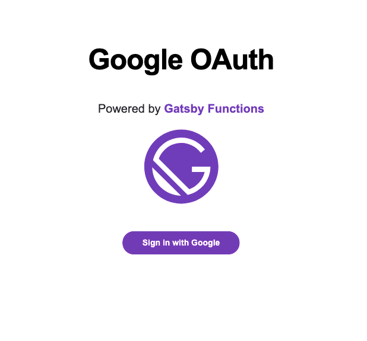

# Gatsby Functions + Google OAuth Example

This example illustrates logging in with Google 0Auth via Gatsby Functions and defining a [private client route behind this authentication](https://www.gatsbyjs.com/tutorial/authentication-tutorial/). The primary focus is on the Functions aspect, not the client side routing/authentication. [This article](https://soshace.com/react-user-login-authentication-using-usecontext-and-usereducer/#crayon-60c920bddc105062139412) has a good example for setting up the client side auth provider you could layer on top of this example.



## 🚀 Quick start

1.  **Set up Google OAuth Client.**

    This sample uses google oAuth client to authenticate into the Google inbox api. Obtain an oAuth credential from the Google Cloud [API & Services Credentials Page](https://console.cloud.google.com/apis/credentials?)

    - Generate an Oauth Client ID. You can follow the steps highlighted in [Account Authentication - Service Account](https://theoephraim.github.io/node-google-spreadsheet/#/getting-started/authentication?id=oauth). Make sure to set up at least one **Authorized redirect URI** to be `http://localhost:8000`

2.  **Add the Google Oauth Credentials to your `.env.development` file**

    There are **2** environment variable you'll need to add to your project:

    - `GOOGLE_CLIENT_ID`: Fetch the ClientId from the newly created OAuth 2.0 Client ID. You can find it in the [Google Credentials Console](https://console.cloud.google.com/apis/credentials)
    - `GOOGLE_CLIENT_SECRET`: Fetch the Client Secret from the newly created OAuth 2.0 Client ID. You can find it in the [Google Credentials Console](https://console.cloud.google.com/apis/credentials)

    You'll also want to add these as environment variables when deploying to Gatsby Cloud.

3.  **Start developing.**

    To get started, run `npm install` to add all necessary packages.

    When developing locally, you include environment variables to your `.env.development`. Read more about how Gatsby handles `.env` files and environment variables in the [Gatsby Docs](https://www.gatsbyjs.com/docs/how-to/local-development/environment-variables/)

    ```shell
    cd examples/functions-google-oauth
    npm install
    npm run develop
    ```

4.  **Open the code and start customizing!**

    Your site is now running at http://localhost:8000! You can use the UI on the index page to test the functions or directly access them at http://localhost:8000/api/{function_name}

    Edit `src/pages/index.js` to see your site update in real-time!

5.  **Deploy**

You can deploy this example on Gatsby Cloud by copying the example into a new repo and [connecting that to Gatsby Cloud](https://www.gatsbyjs.com/docs/how-to/previews-deploys-hosting/deploying-to-gatsby-cloud/#set-up-an-existing-gatsby-site). **Note** The live URLs of your site will need to be set in the [Google Cloud allowed URLs](https://console.cloud.google.com/apis/credentials) settings for your Client ID and the environment variables need to be set in Gatsby Cloud for:

- GOOGLE_REDIRECT_URI="{YOUR_DOMAIN}/api/googleAccessToken"
- APP_REDIRECT_URI="{YOUR_DOMAIN}/auth-redirect"
- APP_HOSTNAME="{YOUR_DOMAIN}"
