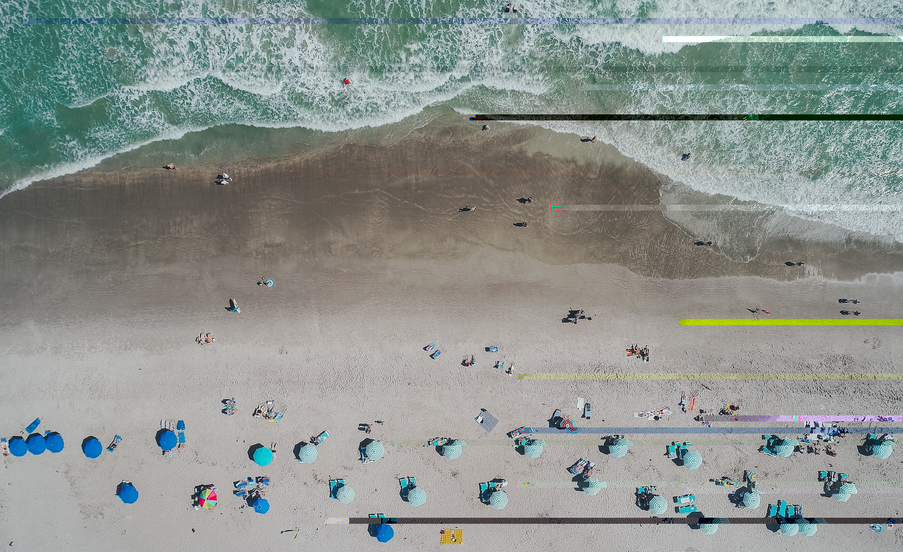
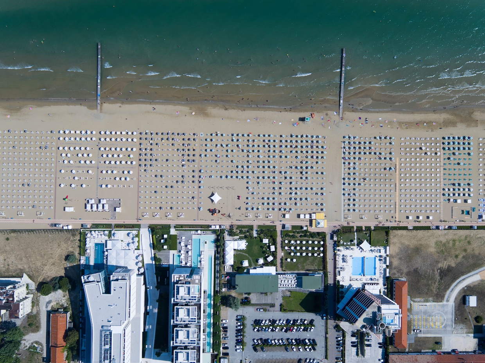

*Photo by [Mikael Cho](https://unsplash.com/@mikael) via [Unsplash](https://unsplash.com/@mikael?photo=_3TDkAttcaM)*

[gatsby-remark-build-images][1] and [gatsby-remark-responsive-iframe][2]
are here to take care of all your basic Markdown image and iframe issues.

## Images

[gatsby-remark-build-images][1] provides _out-of-the-box progressive image
loading_ (as popularized by [Medium][3] and [Facebook][4]) for all local JPGs
and PNGs in your Markdown documents.

Let's see some more photos by [Max Boettinger](https://unsplash.com/@maxboettinger) ([I](https://unsplash.com/photos/T7Lnl3PFISM), [II](https://unsplash.com/@maxboettinger?photo=SUFS6CPjB5Q)):

### Okay, nice! But what about GIFs?

Sadly, [Sharp](https://github.com/lovell/sharp) – the library that does the
actual image processing for us in [gatsby-plugin-sharp][5] – is not able to
write out the GIF file format. We will just copy them over for you, instead,
and also do that with SVGs.

An animated GIF of the Select2 Logo: 

An inline example  SVG. Tremendous!

And here's an awesome SVG tiger:

## iFrames and video embeds

Let's add a YouTube video to show off responsive iFrames real quick:

<iframe width="560" height="315" src="https://www.youtube.com/embed/hbjR5N6IhDU" frameborder="0" allowfullscreen></iframe>

[1]: https://www.gatsbyjs.org/docs/packages/gatsby-remark-build-images/
[2]: https://www.gatsbyjs.org/docs/packages/gatsby-remark-responsive-iframe/
[3]: https://jmperezperez.com/medium-image-progressive-loading-placeholder/
[4]: https://code.facebook.com/posts/991252547593574/the-technology-behind-preview-photos/
[5]: https://www.gatsbyjs.org/docs/packages/gatsby-plugin-sharp/
