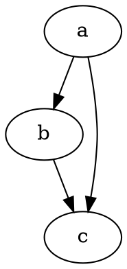
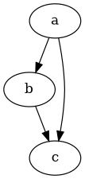
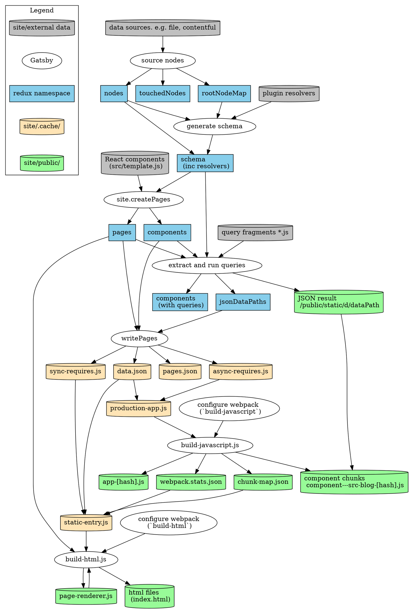

## Rendering dot code blocks

By adding [gatsby-remark-graphviz](https://www.gatsbyjs.com/plugins/gatsby-remark-graphviz/) to your Gatsby site, you can create graphs powered by [Viz.js](https://github.com/mdaines/viz.js) by adding `dot` code blocks in your Markdown files:

    ```dot
    digraph graphname {
      a -> b;
      b -> c;
      a -> c;
    }
    ```

Will render as:



A code block without a `dot` or `circo` will not be processed:

```
digraph graphname {
  a -> b;
  b -> c;
  a -> c;
}
```

## Adding custom attributes

You can add custom attributes to the resulting SVG:

    ```dot id="small-digraph" style="border: solid 3px tomato; box-shadow: 5px 5px 5px; padding: 15px; box-sizing: content-box" class="graphviz-figure" data-mydata123
    digraph graphname {
      a -> b;
      b -> c;
      a -> c;
    }
    ```

Will render as:

```dot id="small-digraph" style="border: solid 3px tomato; box-shadow: 5px 5px 5px; padding: 15px; box-sizing: content-box" class="graphviz-figure" data-mydata123
digraph graphname {
  a -> b;
  b -> c;
  a -> c;
}
```

Don't be shy, go ahead and inspect that SVG and see all the attributes added to it.

## Width, height and responsiveness

You can control the layout, spacing and size of the rendered SVG by using [Graphviz attributes](https://graphviz.gitlab.io/_pages/doc/info/attrs.html) like this:

    ```dot
    digraph graphname {
      graph [size="1.5,1.5"];
      a -> b;
      b -> c;
      a -> c;
    }
    ```

This will give you a slightly smaller SVG:



Alternatively, you can overwrite those values by passing custom SVG attributes like this:

    ```dot width="178pt" height="auto"
    digraph graphname {
      a -> b;
      b -> c;
      a -> c;
    }
    ```

Whoa!


By default, gatsby-remark-graphviz is adding the following inline style to every rendered SVG:

```css
max-width: 100%;
height: auto;
```

This will make graphs work as expected most of the time - small graphs will remain small and big ones will shrink to fit the parent's box. Graphs can get really big ([from Gatsby the docs](https://www.gatsbyjs.com/docs/behind-the-scenes/)):



You can overwrite the `style` attribute if you don't like that behaviour:

    ```dot style=""
    digraph graphname {

      node [ style = filled, fillcolor = white ];

      ## Legend

      subgraph cluster_legend {
        ...
    ```

There:


