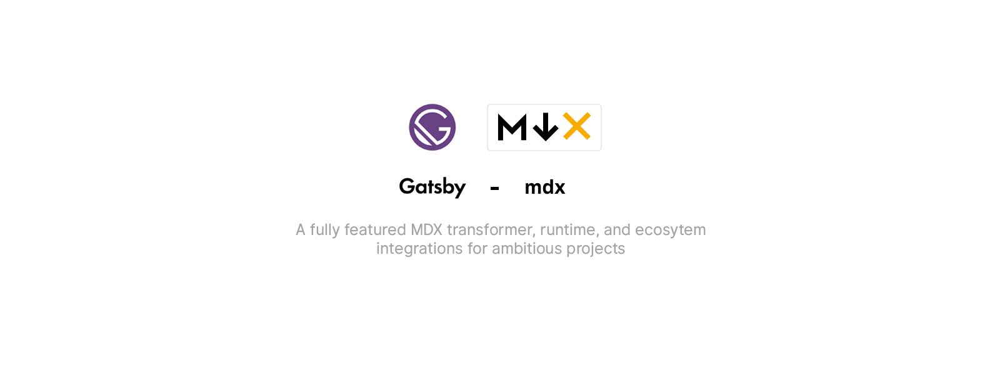

> `gatsby-plugin-mdx` is the official integration for using [MDX](https://mdxjs.com)
> with [Gatsby](https://www.gatsbyjs.org/).

# What’s MDX?

MDX is markdown for the component era. It lets you write JSX embedded inside
markdown. It’s a great combination because it allows you to use markdown’s often
terse syntax (such as `# heading`) for the little things and JSX for more advanced
components.

## Why MDX?

Before MDX, some of the benefits of writing Markdown were lost when integrating with JSX. Implementations were often template string-based which required lots of escaping and cumbersome syntax.

MDX seeks to make writing with Markdown and JSX simpler while being more expressive. Writing is fun again when you combine components, that can even be dynamic or load data, with the simplicity of Markdown for long-form content.

### Read more about MDX

- [📚 Gatsby guide](https://www.gatsbyjs.org/docs/mdx/)
- [📣 Language](https://mdxjs.com)
- [👩‍🔬 Specification](https://github.com/mdx-js/specification)

## Table of contents

- [What’s MDX?](#whats-mdx)
  - [Why MDX?](#why-mdx)
    - [Read more about MDX](#read-more-about-mdx)
  - [Table of contents](#table-of-contents)
  - [Installation](#installation)
  - [Usage](#usage)
    - [Configuration](#configuration)
      - [Extensions](#extensions)
      - [Default layouts](#default-layouts)
      - [Imports](#imports)
      - [Shortcodes](#shortcodes)
      - [Gatsby remark plugins](#gatsby-remark-plugins)
      - [MD plugins](#md-plugins)
      - [HAST plugins](#hast-plugins)
      - [Media types](#media-types)
        - [Explanation](#explanation)
    - [Components](#components)
      - [MDXProvider](#mdxprovider)
        - [Related](#related)
      - [MDXRenderer](#mdxrenderer)
  - [License](#license)

## Installation

Install with npm:

```shell
npm install --save gatsby-plugin-mdx @mdx-js/mdx @mdx-js/react
```

Install with yarn:

```shell
yarn add gatsby-plugin-mdx @mdx-js/mdx @mdx-js/react
```

## Usage

After installing `gatsby-plugin-mdx` you can add it to your plugins list in your
`gatsby-config.js`.

```js
module.exports = {
  plugins: [
    {
      resolve: `gatsby-source-filesystem`,
      options: {
        name: `pages`,
        path: `${__dirname}/src/pages/`,
      },
    },
    `gatsby-plugin-mdx`,
  ],
}
```

By default, this configuration will allow you to automatically create pages
with `.mdx` files in `src/pages` and will process any Gatsby nodes
with Markdown media types into MDX content.

Note that `gatsby-plugin-mdx` requires gatsby-source-filesystem to be present
and configured to process local markdown files in order to
generate the resulting Gatsby nodes.

To automatically create pages with `.mdx` from other sources, you also need
to configure gatsby-plugin-page-creator.

```js
module.exports = {
  plugins: [
    {
      resolve: `gatsby-source-filesystem`,
      options: {
        name: `posts`,
        path: `${__dirname}/src/posts/`,
      },
    },
    {
      resolve: "gatsby-plugin-page-creator",
      options: {
        path: `${__dirname}/src/posts`,
      },
    },
    `gatsby-plugin-mdx`,
  ],
}
```

### Configuration

`gatsby-plugin-mdx` exposes a configuration API that can be used similarly to
any other Gatsby plugin. You can define MDX extensions, layouts, global
scope, and more.

| Key                                                                       | Default                                | Description                                                           |
| ------------------------------------------------------------------------- | -------------------------------------- | --------------------------------------------------------------------- |
| [`extensions`](#extensions)                                               | `[".mdx"]`                             | Configure the file extensions that gatsby-plugin-mdx will process     |
| [`defaultLayouts`](#default-layouts)                                      | `{}`                                   | Set the layout components for MDX source types                        |
| [`gatsbyRemarkPlugins`](#gatsby-remark-plugins)                           | `[]`                                   | Use Gatsby-specific remark plugins                                    |
| [`remarkPlugins`](#remark-plugins)                                        | `[]`                                   | Specify remark plugins                                                |
| [`rehypePlugins`](#rehype-plugins)                                        | `[]`                                   | Specify rehype plugins                                                |
| [`mediaTypes`](#media-types)                                              | `["text/markdown", "text/x-markdown"]` | Determine which media types are processed by MDX                      |
| [`shouldBlockNodeFromTransformation`](#shouldblocknodefromtransformation) | `(node) => false`                      | Disable MDX transformation for nodes where this function returns true |

#### Extensions

By default, only files with the `.mdx` file extension are treated as MDX when
using `gatsby-source-filesystem`. To use `.md` or other file extensions, you can
define an array of file extensions in the `gatsby-plugin-mdx` section of your
`gatsby-config.js`.

```js
// gatsby-config.js
module.exports = {
  plugins: [
    {
      resolve: `gatsby-plugin-mdx`,
      options: {
        extensions: [`.mdx`, `.md`],
      },
    },
  ],
}
```

#### Default layouts

`defaultLayouts` takes an object where the `key` is the `name` key of
the `gatsby-source-filesystem` configuration you want to
target. `default` applies to any MDX file that doesn't already have a
layout defined, even if it's imported manually using `import MDX from './thing.mdx`.

```js
// gatsby-config.js
module.exports = {
  plugins: [
    {
      resolve: `gatsby-source-filesystem`,
      options: {
        name: `pages`,
        path: `${__dirname}/src/pages/`,
      },
    },
    {
      resolve: `gatsby-source-filesystem`,
      options: {
        name: `posts`,
        path: `${__dirname}/src/posts/`,
      },
    },
    {
      resolve: "gatsby-plugin-page-creator",
      options: {
        path: `${__dirname}/src/posts`,
      },
    },
    {
      resolve: `gatsby-plugin-mdx`,
      options: {
        defaultLayouts: {
          posts: require.resolve("./src/components/posts-layout.js"),
          default: require.resolve("./src/components/default-page-layout.js"),
        },
      },
    },
  ],
}
```

MDX has the concept of a layout that is different than the Gatsby
concept of a layout. MDX's layouts are written using the default
export JavaScript syntax in a single MDX file. An MDX layout will wrap
the MDX content in an additional component, so this can be a good
place for page layout depending on how you are using MDX.

```javascript
export default ({ children }) => (
  <div>
    <h1>My Layout</h1>
    <div>{children}</div>
  </div>
)

# My MDX

some content
```

or as an import:

```javascript
import PageLayout from './src/components/page-layout';

export default PageLayout

# My MDX

some content
```

Sometimes you don't want to include the layout in every file, so `gatsby-plugin-mdx`
offers the option to set default layouts in the `gatsby-config.js` plugin
config. Set the key to the `name` set in the `gatsby-source-filesystem` config.
If no matching default layout is found, the `default` default layout is used.

You can also set `options.defaultLayouts.default` if you only want to
use one layout for all MDX pages that don't already have a layout defined.

```js
module.exports = {
  siteMetadata: {
    title: `Gatsby MDX Kitchen Sink`,
  },
  plugins: [
    {
      resolve: `gatsby-plugin-mdx`,
      options: {
        defaultLayouts: {
          posts: require.resolve("./src/components/posts-layout.js"),
          default: require.resolve("./src/components/default-page-layout.js"),
        },
      },
    },
    {
      resolve: `gatsby-source-filesystem`,
      options: {
        name: `posts`,
        path: `${__dirname}/src/posts/`,
      },
    },
    {
      resolve: "gatsby-plugin-page-creator",
      options: {
        path: `${__dirname}/src/posts`,
      },
    },
  ],
}
```

#### Imports

When importing a react component into your MDX, you can import it using the `import`
statement as in JavaScript.

```mdx
import { SketchPicker } from "react-color"

# Hello, world!

Here's a color picker!

<SketchPicker />
```

_**Note:** You should rerun your Gatsby development environment to update imports in MDX files. Otherwise, you'll get a `ReferenceError` for new imports. You can use the shortcodes approach if that is an issue for you._

#### Shortcodes

If you want to allow usage of a component from anywhere (often referred to as a
shortcode), you can pass it to the
[MDXProvider](https://www.gatsbyjs.org/docs/mdx/customizing-components/).

```js
// src/components/layout.js
import React from "react"
import { MDXProvider } from "@mdx-js/react"
import { Link } from "gatsby"
import { YouTube, Twitter, TomatoBox } from "./ui"

const shortcodes = { Link, YouTube, Twitter, TomatoBox }

export default ({ children }) => (
  <MDXProvider components={shortcodes}>{children}</MDXProvider>
)
```

Then, in any MDX file, you can navigate using `Link` and render `YouTube`, `Twitter`, and `TomatoBox` components without
an import.

```mdx
# Hello, world!

Here's a YouTube embed

<TomatoBox>
  <YouTube id="123abc" />
</TomatoBox>
```

[Read more about MDX shortcodes](https://mdxjs.com/blog/shortcodes)

#### Gatsby remark plugins

This config option is used for compatibility with a set of plugins many people
[use with remark](https://www.gatsbyjs.org/plugins/?=gatsby-remark-) that require
the gatsby environment to function properly. In some cases, like
[gatsby-remark-prismjs](https://www.gatsbyjs.org/packages/gatsby-remark-prismjs/?=gatsby-remark-),
it makes more sense to use a library like
[prism-react-renderer](https://github.com/FormidableLabs/prism-react-renderer)
to render codeblocks using a [React
component](/api-reference/mdx-provider). In other cases, like
[gatsby-remark-images](https://www.gatsbyjs.org/packages/gatsby-remark-images/?=gatsby-remark-),
the interaction with the Gatsby APIs is well deserved because the
images can be optimized by Gatsby and you should continue using it.

```js
// gatsby-config.js
module.exports = {
  plugins: [
    {
      resolve: `gatsby-plugin-mdx`,
      options: {
        gatsbyRemarkPlugins: [
          {
            resolve: `gatsby-remark-images`,
            options: {
              maxWidth: 590,
            },
          },
        ],
      },
    },
  ],
}
```

Using a string reference is also supported for `gatsbyRemarkPlugins`.

```js
gatsbyRemarkPlugins: [`gatsby-remark-images`]
```

#### MD plugins

This is a configuration option that is [mirrored from the core MDX
processing pipeline](https://mdxjs.com/plugins). It enables the use of
[remark
plugins](https://github.com/remarkjs/remark/blob/master/doc/plugins.md)
for processing MDX content.

```js
// gatsby-config.js
module.exports = {
  plugins: [
    {
      resolve: `gatsby-plugin-mdx`,
      options: {
        remarkPlugins: [require("remark-abbr")],
      },
    },
  ],
}
```

#### HAST plugins

This is a configuration option that is [mirrored from the core MDX
processing pipeline](https://mdxjs.com/plugins). It enables the use of
[rehype
plugins](https://github.com/rehypejs/rehype/blob/master/doc/plugins.md)
for processing MDX content.

```js
// gatsby-config.js
module.exports = {
  plugins: [
    {
      resolve: `gatsby-plugin-mdx`,
      options: {
        rehypePlugins: [require("rehype-slug")],
      },
    },
  ],
}
```

#### Media types

Deciding what content gets processed by `gatsby-plugin-mdx`. This is an
advanced option that is useful for dealing with specialized generated
content. It is not intended to be configured for most users.

```js
// gatsby-config.js
module.exports = {
  plugins: [
    {
      resolve: `gatsby-plugin-mdx`,
      options: {
        mediaTypes: [`text/markdown`, `text/x-markdown`],
      },
    },
  ],
}
```

##### Explanation

Gatsby includes the media-type of the content on any given node. For
`file` nodes, we choose whether to process the content with MDX or not
by the file extension. For remote content or generated content, we
choose which nodes to process by looking at the media type.

#### shouldBlockNodeFromTransformation

Given a function `(node) => Boolean` allows you to decide for each node if it should be transformed or not.

```js
// gatsby-config.js
module.exports = {
  plugins: [
    {
      resolve: `gatsby-plugin-mdx`,
      options: {
        shouldBlockNodeFromTransformation(node) {
          return (
            [`NPMPackage`, `NPMPackageReadme`].includes(node.internal.type) ||
            (node.internal.type === `File` &&
              path.parse(node.dir).dir.endsWith(`packages`))
          )
        },
      },
    },
  ],
}
```

### Components

MDX and `gatsby-plugin-mdx` use components for different things like rendering
and component mappings.

#### MDXProvider

`MDXProvider` is a React component that allows you to replace the
rendering of tags in MDX content. It does this by providing a list of
components via context to the internal `MDXTag` component that handles
rendering of base tags like `p` and `h1`. There are two special tags
that can be replaced too: `inlineCode` and `wrapper`. `inlineCode` is
for inline `<code>` and `wrapper` is the special element that wraps
all of the MDX content.

```jsx
import { MDXProvider } from "@mdx-js/react"

const MyH1 = props => <h1 style={{ color: "tomato" }} {...props} />
const MyParagraph = props => <p style={{ fontSize: "18px", lineHeight: 1.6 }} />

const components = {
  h1: MyH1,
  p: MyParagraph,
}

export const wrapRootElement = ({ element }) => (
  <MDXProvider components={components}>{element}</MDXProvider>
)
```

The following components can be customized with the MDXProvider:

| Tag             | Name                                                                 | Syntax                                              |
| --------------- | -------------------------------------------------------------------- | --------------------------------------------------- |
| `p`             | [Paragraph](https://github.com/syntax-tree/mdast#paragraph)          |                                                     |
| `h1`            | [Heading 1](https://github.com/syntax-tree/mdast#heading)            | `#`                                                 |
| `h2`            | [Heading 2](https://github.com/syntax-tree/mdast#heading)            | `##`                                                |
| `h3`            | [Heading 3](https://github.com/syntax-tree/mdast#heading)            | `###`                                               |
| `h4`            | [Heading 4](https://github.com/syntax-tree/mdast#heading)            | `####`                                              |
| `h5`            | [Heading 5](https://github.com/syntax-tree/mdast#heading)            | `#####`                                             |
| `h6`            | [Heading 6](https://github.com/syntax-tree/mdast#heading)            | `######`                                            |
| `thematicBreak` | [Thematic break](https://github.com/syntax-tree/mdast#thematicbreak) | `***`                                               |
| `blockquote`    | [Blockquote](https://github.com/syntax-tree/mdast#blockquote)        | `>`                                                 |
| `ul`            | [List](https://github.com/syntax-tree/mdast#list)                    | `-`                                                 |
| `ol`            | [Ordered list](https://github.com/syntax-tree/mdast#list)            | `1.`                                                |
| `li`            | [List item](https://github.com/syntax-tree/mdast#listitem)           |                                                     |
| `table`         | [Table](https://github.com/syntax-tree/mdast#table)                  | `--- | --- | ---`                                   |
| `tr`            | [Table row](https://github.com/syntax-tree/mdast#tablerow)           | `This | is | a | table row`                         |
| `td`/`th`       | [Table cell](https://github.com/syntax-tree/mdast#tablecell)         |                                                     |
| `pre`           | [Pre](https://github.com/syntax-tree/mdast#code)                     |                                                     |
| `code`          | [Code](https://github.com/syntax-tree/mdast#code)                    |                                                     |
| `em`            | [Emphasis](https://github.com/syntax-tree/mdast#emphasis)            | `_emphasis_`                                        |
| `strong`        | [Strong](https://github.com/syntax-tree/mdast#strong)                | `**strong**`                                        |
| `delete`        | [Delete](https://github.com/syntax-tree/mdast#delete)                | `~~strikethrough~~`                                 |
| `inlineCode`    | [InlineCode](https://github.com/syntax-tree/mdast#inlinecode)        |                                                     |
| `hr`            | [Break](https://github.com/syntax-tree/mdast#break)                  | `---`                                               |
| `a`             | [Link](https://github.com/syntax-tree/mdast#link)                    | `<https://mdxjs.com>` or `[MDX](https://mdxjs.com)` |
| `img`           | [Image](https://github.com/syntax-tree/mdast#image)                  | ``                   |

It's important to define the `components` you pass in in a stable way
so that the references don't change if you want to be able to navigate
to a hash. That's why we defined `components` outside of any render
functions in these examples.

You can also expose any custom component to every mdx file using
`MDXProvider`. See [Shortcodes](#shortcodes)

##### Related

- [MDX components](https://mdxjs.com/getting-started/#mdxprovider)

#### MDXRenderer

`MDXRenderer` is a React component that takes _compiled_ MDX content and
renders it. You will need to use this if your MDX content is coming
from a GraphQL page query or `StaticQuery`.

`MDXRenderer` takes any prop and passes it on to your MDX content,
just like a normal React component.

```jsx
<MDXRenderer title="My Stuff!">{mdx.body}</MDXRenderer>
```

Using a page query:

```jsx
import { MDXRenderer } from "gatsby-plugin-mdx"

export default class MyPageLayout {
  render() {
    return <MDXRenderer>{this.props.data.mdx.body}</MDXRenderer>
  }
}

export const pageQuery = graphql`
  query MDXQuery($id: String!) {
    mdx(id: { eq: $id }) {
      id
      body
    }
  }
`
```

## License

MIT
