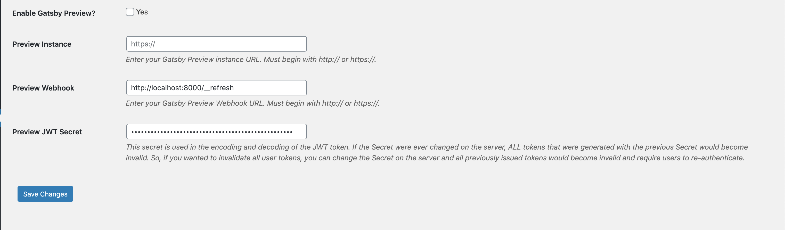
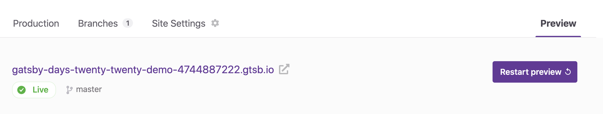
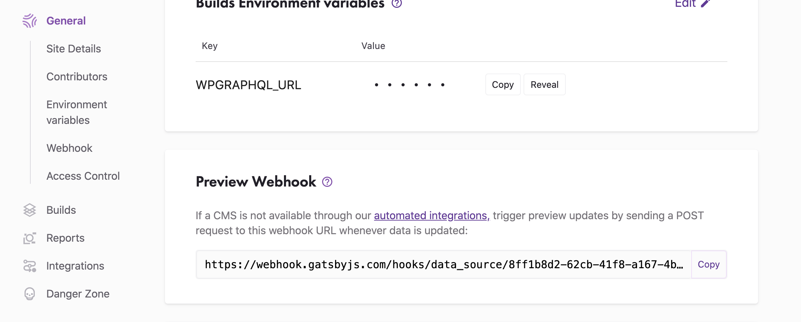

## Setting Up Preview

Once configured in the GatsbyJS settings page in wp-admin, Previews will work out of the box as long as your Gatsby pages have the corresponding node id as part of their pageContext. See [this starter's gatsby-node.js](https://github.com/gatsbyjs/gatsby/blob/master/starters/gatsby-starter-wordpress-blog/tree/master/gatsby-node.js) for an example of how to set up your Gatsby pages. See the [feature page on Preview](../features/preview.md) for more information about how Preview works, considerations you should keep in mind while writing Preview-ready templates, and how to debug Preview templates.

### Connecting Preview

To get started, set up a Preview instance on [Gatsby Cloud](https://www.gatsbyjs.com/) or set up your [self-hosted Preview instance](https://www.gatsbyjs.com/docs/running-a-gatsby-preview-server/). If you want to try out Preview but aren't sure whether you want to subscribe to Gatsby Cloud or self-host, you can start a free 2 week Gatsby Cloud trial with no credit card to help you make up your mind!

#### WordPress Settings

Navigate to your GatsbyJS WordPress settings by visiting this path in your WP instance `/wp-admin/options-general.php?page=gatsbyjs` or by hovering on "Settings" in the WordPress admin menu and clicking on "GatsbyJS".

You will see 4 fields related to Gatsby Preview. "Enable Gatsby Preview?", "Preview Instance", "Preview Webhook", and "Preview JWT secret".

If you don't see this settings page, or you don't see these 4 fields, make sure the latest version of [WPGatsby](https://github.com/gatsbyjs/wp-gatsby) is installed in your WordPress instance.

#### 1. Check the "Enable Gatsby Preview?" Checkbox

When this checkbox is checked, WPGatsby will override the functionality of the WordPress "preview" button in the page/post edit screen. Clicking "preview" will open the regular WordPress preview template, but the WP frontend will be replaced with your Gatsby Preview instance.

#### 2. Fill the "Preview Instance" Field

This field should be filled with the public frontend URL of your Gatsby Preview instance.

To find your **Preview Instance URL**, navigate to the "Preview" tab in [Gatsby Cloud](https://www.gatsbyjs.com/dashboard/sites), wait for your first Preview build to complete, and then copy the frontend URL from above the build history list in the center of the page.

#### 3. Fill the "Preview Webhook" Field

You can find your **Preview webhook** by navigating to "Site Settings" in Gatsby Cloud and then navigating to "Webhooks" via the left-side menu.

#### 4. Double check the "Preview JWT secret" field

This field should be filled for you automatically with a cryptocraphically secure key when you install WPGatsby. If this field is empty, feel free to copy a salt from the [WordPress salts generator page](https://api.wordpress.org/secret-key/1.1/salt) and use that as your JWT secret key.

This secret key is used to authenticate short-lived JWT tokens when you're viewing previews from WordPress so a very strong key should be used to prevent security issues.

### Using your Preview

Now that you've configured WPGatsby for your Preview instance, visit a page or post you'd like to preview, edit it, and press "preview" in the top right corner of the edit screen like you usually would in WordPress. You should see a new tab pop open with your Preview instance and previewed content visible!

:point_left: [Back to Features](./index.md)
