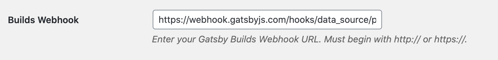
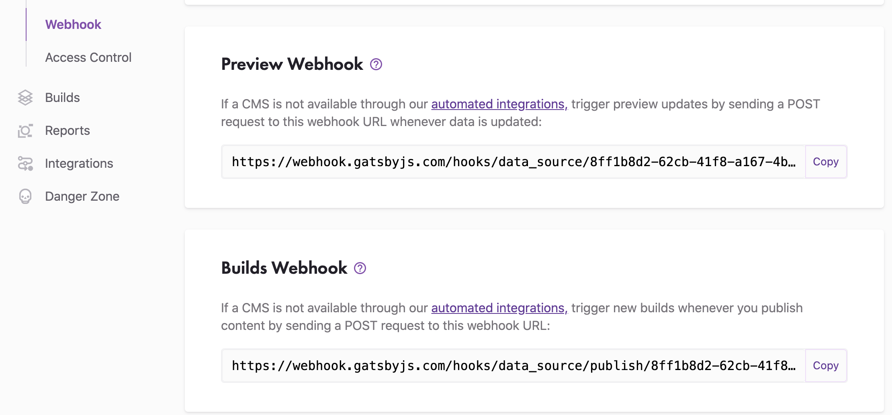

# Configuring WPGatsby

WPGatsby is a required plugin which modifies WPGraphQL and WordPress to work with Gatsby. It enables builds and previews. See [Installation](../getting-started.md#required-wordpress-dependencies) for more info about WPGatsby.

1. [Setting up Builds](#setting-up-builds)
2. [Setting up Preview](#setting-up-preview)

## Setting Up Builds

Whether you're using a regular CI service like Netlify (I would encourage you to try the free tier of Gatsby Cloud if you are!), or you're using a supercharged CI service like Gatsby Cloud with Incremental Builds, you will set things up the same way.

Navigate to your GatsbyJS WordPress settings by visiting this path in your WP instance `/wp-admin/options-general.php?page=gatsbyjs` or by hovering on "Settings" in the WordPress admin menu and clicking on "GatsbyJS".

You should see the following "Builds Webhook" field at the top of the page:

Enter the Webhook that should be used, a POST request will be sent to the Webhook when content is updated in WordPress.

If you're using [Gatsby Cloud](https://www.gatsbyjs.com/dashboard/sites), you can find this webhook by navigating to the "Site Settings" tab for your Gatsby instance and then navigating to "Webhook" in the left-side menu.

Below your "Preview Webhook" you should see your "Builds Webhook". Copy this webhook and enter it into your WordPress settings.

Now that your Builds webhook is set up, when content is updated in WordPress your content will update in 4 to 12 seconds if you're using Gatsby Cloud with Incremental Builds, and in 45 seconds to a few minutes (and beyond) if you're using other services! :rocket:

## Setting Up Preview

Once configured in the GatsbyJS settings page in wp-admin, Previews will work out of the box. See the [feature page on Preview](../features/preview.md) for more information about how Preview works. WPGatsby has been updated to use Gatsby Cloud's new Content Sync service, which is a service that handles the loading view, error handling, and redirection for users that are previewing content. Make sure you've upgraded to the latest versions of WPGatsby, `gatsby`, and `gatsby-source-wordpress`. For documentation about legacy previews where the preview loader used to live on the WordPress side [see here](./configuring-previews-legacy.md).

Note that this feature will work on the latest version of Gatsby but will be more reliable on `gatsby@3.13.0-alpha-node-manifests.26`.

### Connecting Preview

To get started, set up a Preview instance on [Gatsby Cloud](https://www.gatsbyjs.com/).

#### WordPress Settings

Navigate to your GatsbyJS WordPress settings by visiting this path in your WP instance `/wp-admin/options-general.php?page=gatsbyjs` or by hovering on "Settings" in the WordPress admin menu and clicking on "GatsbyJS".

You will see 5 fields related to Gatsby Preview. "Enable Gatsby Preview?", "Use Gatsby Content Sync?", "Content Sync URL", "Preview Webhook", and "Preview JWT secret".

If you don't see this settings page, or you don't see these 4 fields, make sure the latest version of [WPGatsby](https://github.com/gatsbyjs/wp-gatsby) is installed in your WordPress instance.

#### 1. Check the "Enable Gatsby Preview?" Checkbox

When this checkbox is checked, WPGatsby will override the functionality of the WordPress "preview" button in the page/post edit screen. Clicking "preview" will open the regular WordPress preview template, but the WP frontend will be replaced with your Gatsby Preview instance.

#### 2. Check the "Use Gatsby Content Sync?" Checkbox

When this checkbox is checked, WPGatsby will use the new Gatsby Cloud Content Sync service for previews. Instead of WPGatsby handling loading previews and redirecting to the right page, Gatsby Cloud will now do it instead. This is optional but recommended as this will become the default in the future and [legacy previews](./configuring-previews-legacy.md) will be removed.

#### 3. Fill the "Gatsby Content Sync URL" Field

This field should be filled with the Content Sync URL of your Gatsby Preview instance.

To find your **Content Sync URL**, navigate to the "Site Settings" tab in [Gatsby Cloud](https://www.gatsbyjs.com/dashboard/sites), scroll down until you see the "Content Sync URL", and copy the URL displayed there.

#### 4. Fill the "Preview Webhook" Field

You can find your **Preview webhook** by navigating to "Site Settings" in Gatsby Cloud and then navigating to "Webhooks" via the left-side menu.

#### 5. Double check the "Preview JWT secret" field

This field should be filled for you automatically with a cryptocraphically secure key when you install WPGatsby. If this field is empty, feel free to copy a salt from the [WordPress salts generator page](https://api.wordpress.org/secret-key/1.1/salt) and use that as your JWT secret key.

This secret key is used to authenticate short-lived JWT tokens when you're viewing previews from WordPress so a very strong key should be used to prevent security issues.

### Using your Preview

Now that you've configured WPGatsby for your Preview instance, visit a page or post you'd like to preview, edit it, and press "preview" in the top right corner of the edit screen like you usually would in WordPress. You should see a new tab pop open with your Preview instance and previewed content visible!

:point_left: [Back to Features](./index.md)
