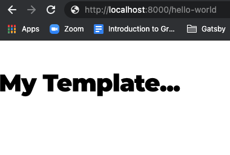
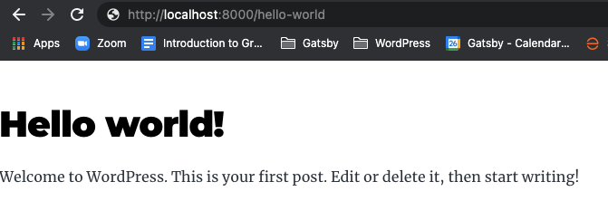
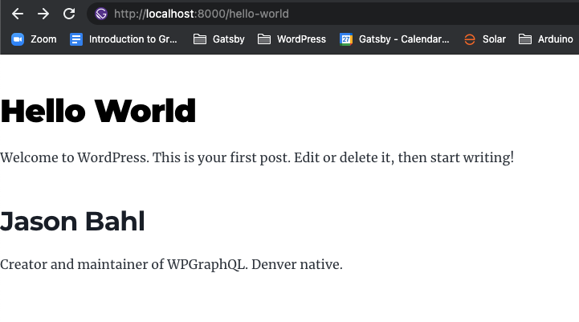

# Querying WordPress Data with Gatsby Source WordPress

This tutorial assumes that you already have a [Gatsby site running](https://github.com/gatsbyjs/gatsby/blob/master/packages/gatsby-source-wordpress/docs/getting-started.md)
with Gatsby Source WordPress active and pointing at a WordPress site's GraphQL endpoint powered
by [WPGraphQL](https://wordpress.org/plugins/wp-graphql/).

It would also be helpful to be familiar with our guide on [Gatsby, GraphQL and WordPress](../features/graphql-wordpress-and-gatsby.md).

In this guide, you will learn:

- How to query Gatsby's GraphQL API to use WordPress data to:
  - Create Pages
  - Add data to Pages

## Querying Data in Gatsby

Now that we have a basic understanding of how Gatsby gets data from WordPress using WPGraphQL and
creates a GraphQL Schema similar to the Schema provided by WPGraphQL, we can move onto using GraphQL
to fetch data and use that data in our Gatsby sites.

The two most common ways to query WordPress data for a Gatsby site are:

- Build pages
- Populate the pages with data

Let's dive in!

### Using GraphQL to Build Pages for your WordPress data

In this section, we're going to explore using Gatsby's GraphQL API to query data that came from
WordPress, and use that data to create pages.

#### Hook into createPages action

In your site's `gatsby-node.js` add the following:

```js
exports.createPages = async ({ actions, graphql, reporter }) => {
  // code for the next steps will go in here.
}
```

This snippet hooks into Gatsby's `createPages` lifecycle and allows us to tell Gatsby what pages to
create.

We know we want to create pages for all WordPress posts, so we will need to write a GraphQL Query
to get the posts.

#### Query WordPress Posts

We already learned about GraphiQL, so we can use that to build a GraphQL Query.

The query we create should include minimal identifying information about the Posts we want to create
pages for. We don't want to query all the fields we want to display on the page in this query. We
will use a [page query](https://www.gatsbyjs.com/docs/how-to/querying-data/page-query/) to do that
later in this tutorial.

Let's use the following query:

```graphql
{
  allWpPost {
    nodes {
      id
      uri
    }
  }
}
```

We can add this to our previous snippet, so it will become the following:

```js
exports.createPages = async ({ actions, graphql, reporter }) => {
  const result = await graphql(`
    {
      allWpPost {
        nodes {
          id
          uri
        }
      }
    }
  `)
}
```

Here, we're using the GraphQL function that's passed through `createPages` to query data from Gatsby's
GraphQL API.

#### Create Pages from WordPress Posts

Next, we'll want to use the data that's returned to create pages.

Below the query we just added, add the following:

```js
if (result.errors) {
  reporter.error("There was an error fetching posts", result.errors)
}

const { allWpPost } = result.data

// Define the template to use
const template = require.resolve(`./src/templates/WpPost.js`)

if (allWpPost.nodes.length) {
  allWpPost.nodes.map(post => {
    actions.createPage({
      // It's best practice to use the uri field from WPGraphQL nodes when
      // building
      path: post.uri,
      component: template,
      context: post,
    })
  })
}
```

This snippet checks if the results of our query returned any errors, and if so it uses Gatsby's
reporter to report an error, which would be output in the command line.

The results of a GraphQL query come back under the "data" key, so the next line
`const { allWpPost } = result.data;` gets the posts out of the data.

Next, we define a template that our page will use:

```js
const template = require.resolve(`./src/templates/WpPost.js`)
```

You can make this path whatever path you like, just make sure you have a file with that name created.

> NOTE: We'll take a look at building that template in the next section.

Next, we iterate over all the posts that were returned from our GraphQL Query, and use the
`createPage` function to create pages.

```js
if (allWpPost.nodes.length) {
  allWpPost.nodes.map(post => {
    actions.createPage({
      path: post.uri,
      component: template,
      context: post,
    })
  })
}
```

#### Using createPage function

The `createPage` function needs the following information:

- **path:** This is the path that the page will live at, relative to the domain. (ex: `/your-page/`).
- **component:** This is the component that will be used to build the page.
- **context:** This is contextual data that is passed to the component that's used to build the page.

In our case, we pass the following data to the `createPage` function:

- **path:** `post.uri` | The uri field of the Post is used as the path for Gatsby. This allows
  WordPress internal links to work, even when Gatsby is used as the front-end. It also ensures the
  paths are unique.
- **component:** `template` | Here we pass the file path to a template (Component) we defined (and
  will be building later)
- **context:** `post` | We pass the post node (which includes the id and uri of the post). This
  context is passed to the component used to build the page and can be used to make page queries and
  populate the page with data.

The full snippet should now look like the following:

```js
exports.createPages = async ({ actions, graphql, reporter }) => {
  const result = await graphql(`
    {
      allWpPost {
        nodes {
          id
          uri
        }
      }
    }
  `)

  if (result.errors) {
    reporter.error("There was an error fetching posts", result.errors)
  }

  const { allWpPost } = result.data

  // Define the template to use
  const template = require.resolve(`./src/templates/WpPost.js`)

  if (allWpPost.nodes.length) {
    allWpPost.nodes.map(post => {
      actions.createPage({
        path: post.uri,
        component: template,
        context: post,
      })
    })
  }
}
```

## Building the Page Template

Now that we have a page being built at `/templates/WpPost.js`, let's take a look at how we can build
a specific page.

The first thing we need, is a default component to export. Let's add that:

```js
import React from "react"

const WpPost = () => {
  return <h1>My Template...</h1>
}

export default WpPost
```

At this point, if we were to run `gatsby develop` or `gatsby build`, Gatsby would use our query that
we wrote to fetch all posts, iterate through them, and create pages for each of them using the WpPost
template.

If we had a post with the WordPress uri of `hello-world`, then we should be able to visit
`http://localhost:8000/hello-world` and see our new template.



Our template right now simply returns an `<h1>` with the words "My Template...".

We would be able to visit any of the uri's of the posts in WordPress and see the template.

### Page Queries

Of course, we don't actually want to have "My Template..." output, we want real data.

This is where Gatsby's Page Queries come in.

When the page is created, the context that is passed (in our case the post node, with the `id` and
`uri` fields) is made available to the template.

This context can be used as variables within a page query to query a specific node and it's fields.

Let's take a look.

Add this import to the top of the file:

```js
import { graphql } from "gatsby"
```

Then, below the component we created, add the following:

```js
export const query = graphql`
  query ($id: String) {
    wpPost(id: { eq: $id }) {
      id
      title
      content
    }
  }
`
```

This query is asking for the `wpPost` where the id is equal to the ID that was passed through in
context. And in response we're asking for the `id`, `title` and `content` of the Post.

So, for each post that used this template, a query will execute to get the Post matching the ID.

We're asking for the data, but we're not using it yet. Let's adjust our component to use the data:

```js
const WpPost = ({
  data: {
    wpPost: { title, content, id },
  },
}) => {
  return (
    <div className={`post-${id}`}>
      <h1>{title}</h1>
      <div dangerouslySetInnerHTML={{ __html: content }} />
    </div>
  )
}
```

The data from the page query is passed to the component as `data.wpPost`. We're destructuring the
`title`, `content` and `id` from the response, then using it in our markup.

At this point, we now should be able to visit the same uri and see the template with data:



### GraphQL Fragments

Now that we're getting WordPress data into our Template, let's look at how we can use GraphQL Fragments
to break our pages into smaller Components.

Let's say we wanted to have an Author bio on each of our posts.

For this, we would want to query for the Post's author, in addition to whatever Post fields we needed.

We might end up with a query like so:

```graphql
query ($id: String) {
  wpPost(id: { eq: $id }) {
    id
    title
    uri
    content
    author {
      node {
        id
        name
        description
      }
    }
  }
}
```

What's happening here, though, is that we would have one big component responsible for the Post _and_
the Author, when we could split these into their own components, one for the Post, and one for the
Author.

Let's create a new component at `/components/AuthorBio.js` with the following:

```javascript
import React from "react"
import { graphql } from "gatsby"

export const AuthorFragment = graphql`
  fragment AuthorBio on WpUser {
    id
    name
    description
  }
`

const AuthorBio = ({ author: { id, name, description } }) => {
  return (
    <div className={`author-${id}`}>
      <h2>{name}</h2>
      <div dangerouslySetInnerHTML={{ __html: description }} />
    </div>
  )
}

export default AuthorBio
```

This gives us a component to render the Author Bio, and it declares the data that it needs with a
GraphQL Fragment.

This allows the component that renders the data to be responsible for HTML needed to render the output,
and declaring the data that it needs from GraphQL, which allows components to have smaller
responsibilities. This can help greatly with building re-usable components and scaling applications.

This AuthorBio component can now be used anywhere a WpUser is asked for. Here, we'll use it within
the Post component to show the Post's author. We'll change the WpPost Component like so:

```js
import React from "react"
import { graphql } from "gatsby"
import AuthorBio from "../components/AuthorBio"

const WpPost = ({ data }) => {
  const {
    wpPost: { title, content, id, author },
  } = data
  return (
    <div className={`post-${id}`}>
      <h1>{title}</h1>
      <div dangerouslySetInnerHTML={{ __html: content }} />
      <AuthorBio author={author.node} />
    </div>
  )
}

export const query = graphql`
  query ($id: String) {
    wpPost(id: { eq: $id }) {
      id
      title
      content
      author {
        node {
          ...AuthorBio
        }
      }
    }
  }
`

export default WpPost
```

At the top, we import the AuthorBio component. Then, we ask for the `author` in our data
destructuring at the top of the component.

Then, we add the `<AuthorBio author={author.node} />` to our Post Component.

Last, we update our Query to ask for the Author, and reference the Fragment that was defined in our
AuthorBio component. Gatsby keeps track of all fragments, so we can reference our AuthorBio fragment
within our query for the WpPost and it will work!

So now, we have a Post component that's responsible for asking for the data it needs, and an Author
Component that is responsible for asking for what it needs.

And now we have a template that looks like the following:



## Conditional Templates / Template Hierarchy

At this point, we've used GraphQL to query WordPress Posts from Gatsby's GraphQL API, and used that
data to create pages.

This was a simple example showing how to create pages for WordPress posts. But WordPress has
different types of content, such as Custom Post Types and Pages, Users, Taxonomy Terms and more.

You can use the same technique to create pages for any type of content you want.

One thing you can also do, is use a query such as `contentNodes` to get WordPress posts of _any_
Post Type, and implement logic to use different templates based on the Type it is.

For example, instead of this query which returns only Posts:

```graphql
{
  allWpPost {
    nodes {
      id
      uri
    }
  }
}
```

You could use this query:

```graphql
{
  allWpContentNode {
    nodes {
      id
      uri
      __typename
    }
  }
}
```

And then use the `__typename` to determine the template to use, like so:

```js
// at the top of the file
const fs = require("fs")

if (allContent.nodes.length) {
  allContent.nodes.map(node => {
    // Set the default template to use if a specific one doesn't exist
    let template = require.resolve(`./src/templates/WpContentNode.js`)

    // Try to find the template path for the specific Post Type
    let templatePath = `./src/templates/${node.__typename}.js`
    try {
      if (fs.existsSync(templatePath)) {
        template = require.resolve(templatePath)
      }
    } catch (err) {
      console.error(err)
    }

    if (node.uri.length) {
      actions.createPage({
        path: node.uri,
        component: template,
        context: node,
      })
    }
  })
}
```

This would allow for a fallback template to live at `/templates/WpContentNode.js` and be overridden
by adding a template for the specific post type at `/templates/{$typename}.js`.
