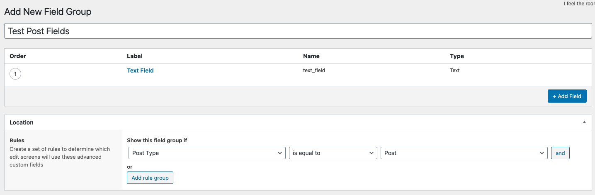
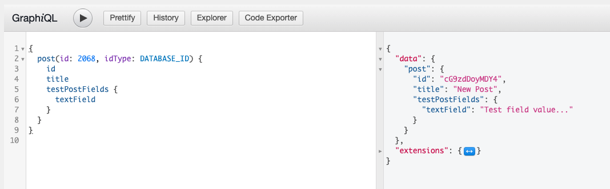
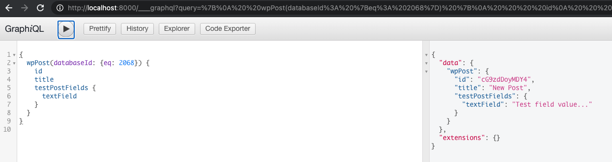

# Using Advanced Custom Fields with Gatsby

This tutorial assumes that you already have a [Gatsby site running](https://github.com/gatsbyjs/gatsby/blob/master/packages/gatsby-source-wordpress/docs/getting-started.md)
with Gatsby Source WordPress active and pointing at a WordPress site's GraphQL endpoint powered
by [WPGraphQL](https://wordpress.org/plugins/wp-graphql/).

It would also be helpful to be familiar with our guide on [Gatsby, GraphQL and WordPress](../features/graphql-wordpress-and-gatsby.md).

In this guide, you will learn:

- What is Advanced Custom Fields
- How to use Advanced Custom Fields with WPGraphQL
- How to use Advanced Custom Fields with Gatsby
- Example Usage

## What is Advanced Custom Fields?

[Advanced Custom Fields](https://www.advancedcustomfields.com/) is a WordPress plugin that allows
users to create robust forms for editing additional content in WordPress.

## How to use Advanced Custom Fields with WPGraphQL

While Advanced Custom Fields is not the only option available for creating custom fields for
WordPress, it's one of the most popular, and one that has an integration with WPGraphQL.

In order to use Advanced Custom Fields with WPGraphQL, you need to install the free
[WPGraphQL for Advanced Custom Fields](https://github.com/wp-graphql/wp-graphql-acf) WordPress plugin.

Once WPGraphQL and WPGraphQL for Advanced Custom Fields are active, you can configure your ACF Field
Groups to show in the WPGraphQL Schema.

Refer to the [WPGraphQL for ACF docs](https://github.com/wp-graphql/wp-graphql-acf/blob/master/README.md)
for more information on the supported fields and configuration.

## How to use Advanced Custom Fields with Gatsby

Once you have your ACF Field Groups configured to show in GraphQL, you can start using them in Gatsby.

Because WPGraphQL for ACF is an extension of WPGraphQL, it means the data exposed by it is also
available to Gatsby.

## Example Usage

Below, we will look at what it takes to configure an ACF Field Group to show in the GraphQL Schema,
then look at how to query the data in WPGraphQL and Gatsby.

### Create the ACF Field Group

ACF provides a user interface for configuring field groups and we'll use that in this example.

First, we will create a new Field Group in our WordPress Dashboard, and add a field to it.

For example sake, we're naming the Field Group "Test Post Fields" and adding a single Text field
with the name "text_field". And we set the "Location Rules" to be "Post Type is equal to Post".



Then, toward the bottom of the Settings are fields to configure whether the Field Group should be
exposed to GraphQL or not.


We've selected "Yes" for the "Show in GraphQL" setting. And for the "GraphQL Field Name" setting we
named it `testPostFields`.

Publishing this field group adds the field group to the Post edit screen, and WPGraphQL for ACF adds
the Field Group to the `Post` type in the GraphQL Schema (inferred from the location rules).

### Editing a Post

We can now go edit a post and save data to the ACF field.

Here, we can see the "Test Post Fields" field group on the Edit Post screen, and we've added the
value `Test field value...` to the "Text Field".


### Query ACF Field with WPGraphQL

We can now confirm that the field is queryable using the GraphiQL IDE in the WordPress dashboard
and the following query (our created post ID is `2068`).

```graphql
{
  post(id: 2068, idType: DATABASE_ID) {
    id
    title
    testPostFields {
      textField
    }
  }
}
```



### Query ACF Field in Gatsby

Now, we can also query the field with Gatsby's GraphQL API with the following query:

```graphql
{
  wpPost(databaseId: { eq: 2068 }) {
    id
    title
    testPostFields {
      textField
    }
  }
}
```


