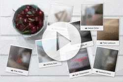

# Gatsby SQIP plugin

<p align="center">
  <a href="https://www.npmjs.com/package/gatsby-transformer-sqip">
    
  </a>
  &nbsp;
  <a href="http://npm-stat.com/charts.html?package=gatsby-transformer-sqip">
    
  </a>
</p>

<p align="center">
  <a href="demo.mp4">
    
  </a>
</p>

> Generates vectorized primitive version of images to be used as preview thumbnails.

## Disclaimer

This project can create beautiful results, but this comes with the cost of processing power. It may take several seconds on your machine to generate the preview. **Make sure to invest some time and to cache your `public` folder to avoid regeneration of the previews on every build.**

Netlify users might use [gatsby-plugin-netlify-cache](https://github.com/axe312ger/gatsby-plugin-netlify-cache).

<details>
<summary><strong>Table of contents:</strong></summary>

- [Usage](#usage)
  - [Configuring and getting the previews](#configuring-and-getting-the-previews)
    - [Options](#options)
    - [Sharp](#sharp)
    - [Contentful](#contentful)
  - [Displaying the previews](#displaying-the-previews)
    - [Pure JSX](#pure-jsx)
    - [Gatsby Image](#gatsby-image)
- [Configuration recommendations](#configuration-recommendations)

</details>

## Usage

### Configuring and getting the previews

With `gatsby-transformer-sharp`:

```graphql
image {
  sqip(numberOfPrimitives: 12, blur: 12, width: 256, height: 256) {
    dataURI
  },
  fluid(maxWidth: 400, maxHeight: 400) {
    ...GatsbyImageSharpFluid_noBase64
  }
}
```

With `gatsby-source-contentful`:

```graphql
image {
  sqip(numberOfPrimitives: 30, blur: 0) {
    dataURI
  },
  fixed {
    ...GatsbyContentfulFixed_withWebp_noBase64
  }
}
```

#### Options

##### `numberOfPrimitives`: Integer, default: `10`

Number of primitive shapes of the image. This has a strong impact on the resulting size of the image. See below for more information.

##### `mode`: Integer, default: `0`

Determines which type of shapes are used to generate the image.

- 0: Combo
- 1: Triangles
- 2: Rectangles
- 3: Ellipses
- 4: Circles
- 5: Rotated Rectangles
- 6: Bezier Curves
- 7: Rotated Ellipses
- 8: Polygons

##### `blur`: Integer, default: `1`

Blur factor of the image. Reflects the deviation value of the [SVG Gaussian Blur](https://developer.mozilla.org/en-US/docs/Web/SVG/Element/feGaussianBlur) filter. `0` disables the blur completely.

##### `width`: Integer, default: `256`

Width of the input image, which is used to generate the preview. 256px is an ideal width which provides enough details and is small enough to ensure a quick generation. It is recommended to keep this value as it is.

##### `height`: Integer, default: `auto`

The height of the input image, which is used to generate the preview. By default this value is calculated automatically to keep the aspect ratio of the input image. Make sure to adjust the value to reflect the desired aspect ratio of your generated sharp/Contentful thumbnails.

#### Sharp

##### `grayscale`: GraphQLBoolean, default: `false`

Uses Sharp's greyscale to convert the source image to 8-bit greyscale, 256 shades of grey, e.g.

See: https://github.com/gatsbyjs/gatsby/tree/master/packages/gatsby-plugin-sharp#grayscale

##### `duotone`: DuotoneGradientType, default: `false`

See: https://github.com/gatsbyjs/gatsby/tree/master/packages/gatsby-plugin-sharp#duotone

##### `cropFocus`: ImageCropFocusType, default: `sharp.strategy.attention`

See: https://github.com/gatsbyjs/gatsby/tree/master/packages/gatsby-plugin-sharp#cropfocus

##### `rotate`: GraphQLInt, default: `0`

See: https://github.com/gatsbyjs/gatsby/tree/master/packages/gatsby-plugin-sharp#rotate

#### Contentful

##### `resizingBehavior`: ImageResizingBehavior

See: https://www.contentful.com/developers/docs/references/images-api/#/reference/resizing-&-cropping/change-the-resizing-behavior

##### `cropFocus`: ImageCropFocusType, default: `null`

See: https://www.contentful.com/developers/docs/references/images-api/#/reference/resizing-&-cropping/specify-focus-area-for-resizing

##### `background`: GraphQLString, default: `null`

See: https://www.contentful.com/developers/docs/references/images-api/#/reference/image-manipulation/background-color

### Displaying the previews

#### Pure JSX

```jsx
<div className="image-wrapper">
  
  
</div>
```

```css
.image-wrapper {
  position: relative;
  overflow: hidden;
}
.image-wrapper img {
  display: block;
}

.image-wrapper img.image {
  position: absolute;
  left: 0;
  top: 0;
  bottom: 0;
  width: 100%;
  height: auto;
  z-index: 1;
}
```

**Pros:**

- No client-side JavaScript required
- Browser cache ensures previews are not shown when a user visits the page a second time

**Cons:**

- All images are loaded, no matter if they are in the viewport or not

#### Gatsby Image

Just use it as usual with the exception that you overwrite the base64 value with your SQIP dataURI.

```jsx
const Img = require(`gatsby-image`)


// or


```

**Pros:**

- Nice fade-in effect
- Only images within the viewport are loaded

**Cons:**

- Requires client-side JavaScript
- Images fade in all the time, even when the image is already in the browser cache

## Configuration recommendations

The plugin offers a wide variety of settings, which affect the size of the resulting preview image.

The maximum size of your previews really depend on your current html payload size and your personal limits.

- Smaller thumbnails should range between 500-1000byte
- A single header image or a full sized hero might take 1-10kb
- For frequent previews like article teasers or image gallery thumbnails I’d recommend 15-25 shapes
- For header and hero images you may go up to 50-200 shapes

**Generally:** Keep it as small as possible and test the impact of your image previews via [webpagetest.org](https://www.webpagetest.org/) on a 3G connection.

You may use my research repository for more detailed insights on how much the configuration can affect your payload size: https://axe312ger.github.io/embedded-svg-loading-impact-research/
