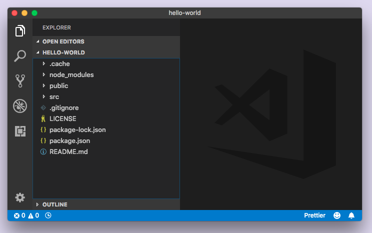
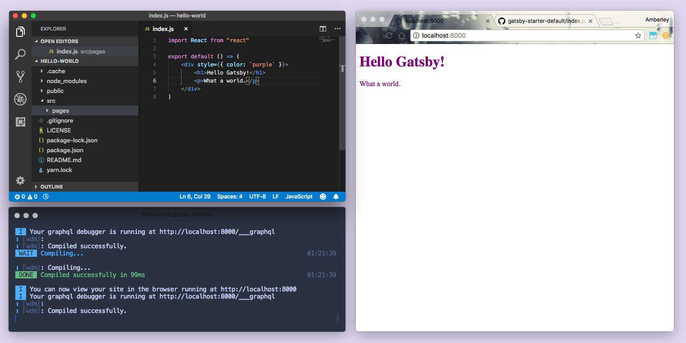
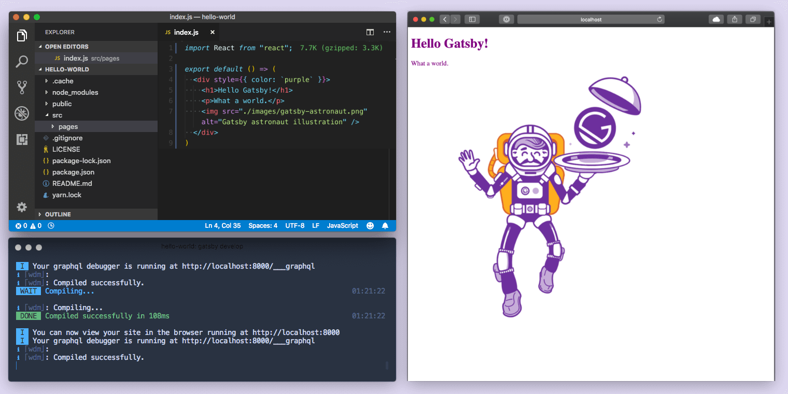
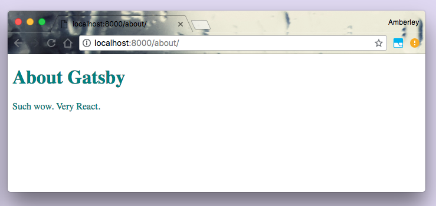
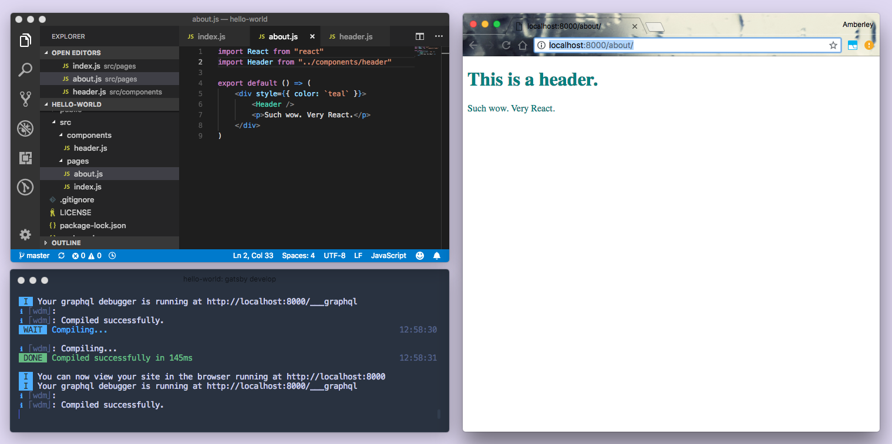
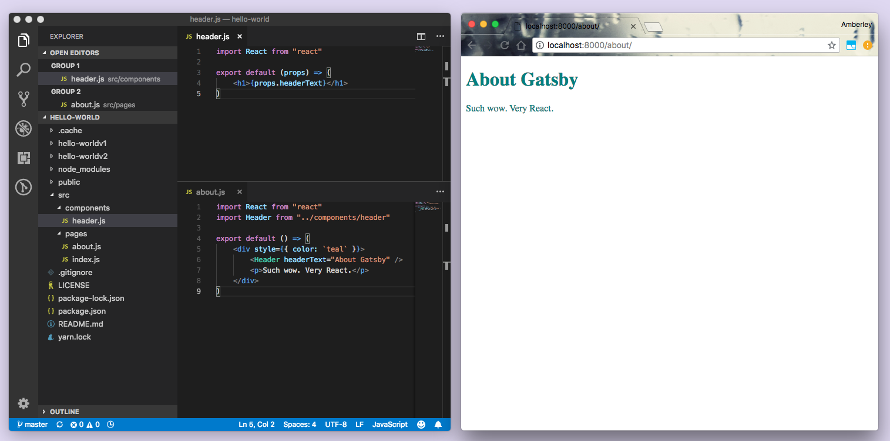
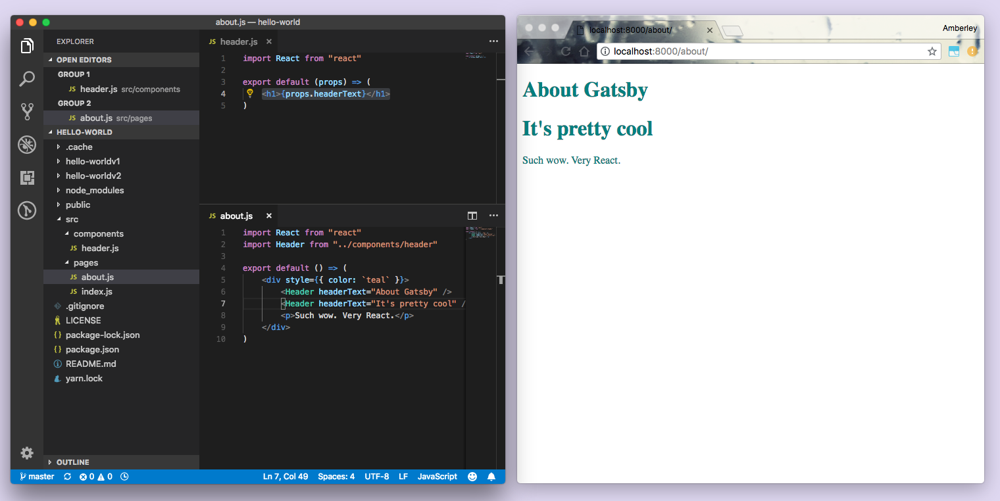
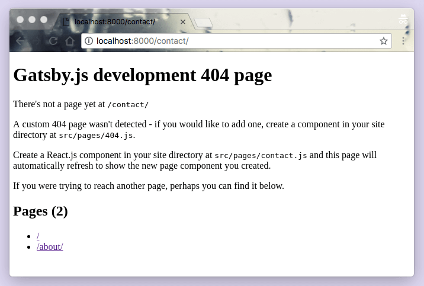

En la [**sección previa**](/tutorial/part-zero/), preparaste tu entorno de desarrollo local instalando el software necesario y creando tu primer sitio Gatsby utilizando el iniciador [**"hello world"**](https://github.com/gatsbyjs/gatsby-starter-hello-world). Ahora, profundiza en el código generado por ese iniciador.

## Usando los arrancadores de Gatsby

En el [**tutorial parte cero**](/tutorial/part-zero/), creaste un nuevo sitio basado en el inicio "hello world" utilizando el siguiente comando:

```bash
gatsby new hello-world https://github.com/gatsbyjs/gatsby-starter-hello-world
```

Al crear un nuevo sitio de Gatsby, puedes usar la siguiente estructura de comando para crear un nuevo sitio basado en cualquier iniciador de Gatsby existente:

```bash
gatsby new [NOMBRE_DEL_DIRECTORIO] [URL_DEL_REPO_INICIADOR]
```

> 💡 Ver una lista de los [**iniciadores oficiales y comunitarios**](/docs/gatsby-starters/)!

Si omites una URL desde el final, Gatsby generará automáticamente un sitio para ti en función del [**iniciador predeterminado**](https://github.com/gatsbyjs/gatsby-starter-default). Para esta sección del tutorial, nos quedaremos con el sitio "Hello World" que ya creaste en la parte cero del tutorial.

### ✋ Abre el código.

En tu editor de código, abre el código generado para tu sitio "Hello World" y echa un vistazo a los diferentes directorios y archivos contenidos en el directorio 'hello-world'. Debería verse algo como esto:



_Nota: Nuevamente, el editor que se muestra aquí es Visual Studio Code. Si usas un editor diferente, se verá un poco diferente._

Echemos un vistazo al código que impulsa la página de inicio.

> 💡 Si detuvo su servidor de desarrollo después de ejecutar `gatsby develop` en la sección anterior, vuelva a iniciarlo ahora - ¡hora de realizar algunos cambios en el sitio de hello-world!

## Familiarizándose con las páginas de Gatsby

Abre el directorio `/src` en tu editor de código. Dentro hay un solo directorio: `/pages`.

Abre el archivo en `/src/pages/index.js`. El código en este archivo crea un componente que contiene un solo div y algo de texto, apropiadamente, "¡Hola mundo!"

### ✋ Haz cambios en la página de inicio de "Hello World"

1. Cambia el texto "Hello World!" A "¡Hola Gatsby!" Y guarda el archivo. Si tus ventanas están una al lado de la otra, puedes ver que el código y los cambios de contenido se reflejan casi instantáneamente en el navegador después de guardar el archivo.

<video controls="controls" autoplay="true" loop="true">
  <source type="video/mp4" src="../../../../../docs/tutorial/part-one/02-demo-hot-reloading.mp4"></source>
  <p>Sorry! You browser doesn't support this video.</p>
</video>

> 💡 Gatsby usa **hot reloading** para acelerar su proceso de desarrollo. Esencialmente, cuando ejecutas un servidor de desarrollo de Gatsby, los archivos del sitio de Gatsby se "observan" en segundo plano: cada vez que guardes un archivo, tus cambios se reflejarán inmediatamente en el navegador. No necesitas actualizar la página o reiniciar el servidor de desarrollo, tus cambios simplemente aparecen.

1. Hagamos nuestros cambios un poco más visibles. Intenta reemplazar el código en `/src/pages/index.js` con el siguiente código y vuelve a guardarlo. Verás cambios en el texto; El color del texto será violeta y el tamaño de la fuente será mayor.

```jsx
import React from "react"

export default () => (
  <div style={{ color: `purple`, fontSize: `72px` }}>¡Hola Gatsby!</div>
)
```

> 💡 Cubriremos más sobre los estilos en Gatsby en la segunda parte del tutorial.

3. Elimine el estilo de tamaño de fuente. Cambia el texto "¡Hola Gatsby!" A un encabezado de nivel uno. Agrega un párrafo debajo del encabezado.

```jsx
import React from "react"

export default () => (
  // highlight-start
  <div style={{ color: `purple` }}>
    <h1>¡Hola Gatsby!</h1>
    <p>Increíble.</p>
    {/* highlight-end */}
  </div>
)
```



4.  Añade una imagen. (En este caso, una imagen aleatoria desde unsplash).

```jsx
import React from "react"

export default () => (
  <div style={{ color: `purple` }}>
    <h1>¡Hola Gatsby!</h1>
    <p>Increíble.</p>
    {" "}
    {/* highlight-line */}
  </div>
)
```



### Espera... ¿HTML en nuestro JavaScript?

_Si estás familiarizado con React y JSX, siéntete libre de omitir esta sección._ Si no haz trabajado antes con el Framework React, te estarás preguntando qué está haciendo HTML en una función de JavaScript. O por qué estamos importando `React` en la primera línea pero aparentemente no lo estamos usando en ninguna parte. Este híbrido "HTML-en-JS" es en realidad una extensión de sintaxis de JavaScript, para React, llamado JSX. Puedes seguir este tutorial sin experiencia previa con React, pero si tienes curiosidad, aquí hay una breve introducción...

Considere los contenidos originales del archivo `/src/pages/index.js`:

```jsx
import React from "react"

export default () => <div>Hello world!</div>
```

En JavaScript puro, luce algo así:

```javascript
import React from "react"

export default () => React.createElement("div", null, "Hello world!")
```

¡Ahora puedes detectar el uso de la importación de `'react'` Pero espera. Estamos escribiendo JSX, no HTML y JavaScript puros. ¿Cómo lo lee el navegador? La respuesta corta: no. Los sitios de Gatsby vienen con herramientas ya configuradas para convertir su código fuente en algo que los navegadores pueden interpretar.

## Construir con componentes

La página de inicio que estábamos editando se creó al definir un componente de página. ¿Qué es exactamente un "componente"?

Ampliamente definido, un componente es un bloque de construcción para su sitio; Es una pieza de código independiente que describe una sección de UI (interfaz de usuario).

Gatsby está basado en React. Cuando hablamos sobre el uso y la definición de **componentes**, realmente estamos hablando de **componentes de react** - piezas de código independientes (por lo general, escritas con JSX) que pueden aceptar entradas y devolver elementos de React que describen una sección de UI.

Uno de los grandes cambios mentales que se producen al comenzar a construir con componentes (si ya eres un desarrollador) es que ahora tu CSS, HTML y JavaScript están estrechamente relacionados y, a menudo, viven incluso dentro del mismo archivo.

Si bien es un cambio aparentemente simple, esto tiene profundas implicaciones sobre cómo piensas acerca de la construcción de sitios web.

Toma el ejemplo de crear un botón personalizado. En el pasado lo harías creando una clase de CSS (quizás `.primary-button`) con sus estilos personalizados y luego los aplicas a cada elemento que lo requiera.

```html
<button class="primary-button">
  Click
</button>
```

En el mundo de los componentes, en su lugar creas un componente `PrimaryButton` con los estilos de tus botones y lo usas de la siguiente manera:

<!-- prettier-ignore -->
```jsx
<PrimaryButton>Click me</PrimaryButton>
```

Los componentes se convierten en los bloques de construcción básicos de tu sitio. En vez de ser
limitado a los bloques de construcción que el navegador proporciona, ejemplo: `<button />`, puedes crear fácilmente nuevos bloques de construcción que satisfagan elegantemente las necesidades de tus proyectos.

> 💡 Consulta la página [Building with Components](/docs/building-with-components/) para obtener más información sobre componentes en Gatsby y enlaces a otros recursos.

### ✋ Uso de componentes de página

Cualquier componente de React definido en `/src/pages/*.js` se convertirá automáticamente en una página. Veamos esto en acción.

Ya tenemos un archivo `/src/pages/index.js` que viene con el inicio "Hello World". Vamos a crear una página de a cerca.

1. Crea un nuevo archivo en `/src/pages/about.js`, copie el siguiente código en el nuevo archivo y guárdelo.

```jsx
import React from "react"

export default () => (
  <div style={{ color: `teal` }}>
    <h1>A cerca de Gatsby</h1>
    <p>Es fácil usar react en Gatsby.</p>
  </div>
)
```

2.  Dirigete a http://localhost:8000/about/.



Con solo poner un componente de React en el archivo `/src/pages/about.js`, ahora tenemos una página accesible en`/about`.

### ✋ Uso de subcomponentes

Digamos que tanto la página de inicio como la de 'acerca de' se agrandaron bastante y estuvimos reescribiendo muchas cosas. Podemos usar subcomponentes para dividir la UI en piezas reutilizables. Ambas páginas tienen encabezados `<h1>`; creemos un componente que describa un `Encabezado`.

1. Cree un nuevo directorio en `/src/components`, y un archivo dentro de ese directorio llamado `header.js`.
2. Agregue el siguiente código al nuevo archivo `/src /components/header.js`.

```jsx
import React from "react"

export default () => <h1>Este es un encabezado.</h1>
```

3. Modifica el archivo `about.js` para importar el componente `Header`. Reemplace el marcado `h1` con `<Header />`:

```jsx
import React from "react"
import Header from "../components/header" // highlight-line

export default () => (
  <div style={{ color: `teal` }}>
    <Header /> {/* highlight-line */}
    <p>Es fácil usar react en Gatsby.</p>
  </div>
)
```



En el navegador, el texto del encabezado "Acerca de Gatsby" ahora debería reemplazarse por "Esto es un encabezado". Pero no queremos que la página "Acerca de" diga "Esto es un encabezado". Queremos que diga ". Acerca de Gatsby ".

4. Regrese a `/src/components/header.js`, y haga el siguiente cambio:

```jsx
import React from "react"

// highlight-next-line
export default props => <h1>{props.headerText}</h1>
```

5. Regresa a `/src/pages/about.js` y haz el siguiente cambio:

```jsx
import React from "react"
import Header from "../components/header"

export default () => (
  <div style={{ color: `teal` }}>
    <Header headerText="A cerca de Gatsby" /> {/* highlight-line */}
    <p>Es fácil usar react en Gatsby.</p>
  </div>
)
```



¡Ahora deberías ver nuevamente el texto del encabezado "Acerca de Gatsby"!

### ¿Qué son las "props"?

Anteriormente definimos los componentes de React como piezas reutilizables de código que describen una IU. Para que estas piezas reutilizables sean dinámicas, debemos poder proporcionarles datos diferentes. Hacemos eso con una entrada llamada "props". Los props son propiedades (apropiadamente suficientes) suministradas a los componentes de React.

En `about.js` pasamos una propiedad `headerText` con el valor de `"Acerca de Gatsby"` al subcomponente `Header` importado:

```jsx
<Header headerText="About Gatsby" />
```

En "header.js", el componente del encabezado espera recibir la propiedad `headerText` (porque lo hemos escrito para esperarlo) Para que podamos acceder a él de la siguiente manera:

```jsx
<h1>{props.headerText}</h1>
```

> 💡 En JSX, puedes incrustar cualquier expresión de JavaScript envolviéndola con `{}`. Así es como podemos acceder a la propiedad `headerText` (o" prop! ") Desde el objeto "props".

Si hubiéramos pasado otra propiedad a nuestro componente `<Header />`, como...

```jsx
<Header headerText="About Gatsby" arbitraryPhrase="is arbitrary" />
```

...también podríamos acceder al atributo `arbitraryPhrase`:`{props.arbitraryPhrase}`.

6. Para enfatizar cómo esto hace que nuestros componentes sean reutilizables, agreguemos un componente adicional `<Header />` a la página de a cerca de. Agrega el siguiente código al archivo `/src/pages/about.js` y guárdalo.

```jsx
import React from "react"
import Header from "../components/header"

export default () => (
  <div style={{ color: `teal` }}>
    <Header headerText="A cerca de Gatsby" />
    <Header headerText="Es asombroso" /> {/* highlight-line */}
    <p>Es fácil usar react en Gatsby.</p>
  </div>
)
```



Y ahí lo tenemos; Un segundo encabezado, sin reescribir ningún código, al pasar datos diferentes usando props.

### Uso de componentes de layout

Los componentes de layout son para las secciones de un sitio que desea compartir en varias páginas. Por ejemplo, los sitios de Gatsby generalmente tienen un componente de layout con un encabezado y un pie de página compartidos. Otras cosas comunes para agregar a los diseños incluyen una barra lateral y / o un menú de navegación.

Exploraremos los componentes de layout en la [parte tres](/tutorial/part-three).

## Enlaces entre páginas

A menudo querrás vincular las páginas. Veamos el enrutamiento en un sitio de Gatsby.

### ✋ Usando el componente `<Link />`

1. Abre el componente de la página índice (`/src/pageindex.js`). Importe el componente `<Link />` de Gatsby. Agregue un componente `<Link />` debajo del encabezado y asígnele una propiedad `to`, con el valor de `"/contact/"`para el nombre de ruta:

```jsx
import React from "react"
import { Link } from "gatsby" // highlight-line
import Header from "../components/header"

export default () => (
  <div style={{ color: `purple` }}>
    <Link to="/contact/">Contacto</Link> {/* highlight-line */}
    <Header headerText="!Hola Gatsby!" />
    <p>Increible</p>
    
  </div>
)
```

Al hacer clic en el nuevo enlace "Contacto" en la página de inicio, deberías ver...



...la página Gatsby development 404. ¿Por qué? Porque estamos intentando vincular a una página que aún no existe.

> 💡 ¿Quieres saber más sobre 404 páginas en Gatsby? Consulta [los documentos](/docs/add-404-page/).

1. Creemos un componente de página para nuestra nueva página de "Contacto" en `src/pages/contact.js`, y hagamos que enlace a la página de inicio:

```jsx
import React from "react"
import { Link } from "gatsby"
import Header from "../components/header"

export default () => (
  <div style={{ color: `teal` }}>
    <Link to="/">Home</Link>
    <Header headerText="Contacto" />
    <p>¡Envíanos un mensaje!</p>
  </div>
)
```

Después de guardar el archivo, deberías ver la página de contacto y poder establecer un vínculo entre ella y la página de inicio.

<video controls="controls" loop="true">
  <source type="video/mp4" src="./10-linking-between-pages.mp4"></source>
  <p>Disculpa! Tu navegador no apoya Este video.</p>
</video>

El componente `<Link />` de Gatsby es para vincular las páginas de tu sitio. Para enlaces externos a páginas que no maneja tu sitio Gatsby, usa la etiqueta de HTML `<a>`.

> 💡 Ve más detalles sobre el enrutamiento en Gatsby en [API docs para Gatsby Link](/docs/gatsby-link/).

## Desplegando un sitio de Gatsby

Gatsby.js es un _generador de páginas estáticas_, lo que significa que no hay servidores para configurar o bases de datos complicadas por implementar. En cambio, el comando `build` de Gatsby produce un directorio de archivos HTML y JavaScript estáticos que puede implementar en un servicio de alojamiento de sitios estáticos.

Tratemos de usar [Surge](http://surge.sh/) para desplegar tu primer sitio web de Gatsby. Surge es uno de los muchos "hosts de sitios estáticos" que hacen posible implementar sitios de Gatsby.

Si no has instalado y configurado Surge anteriormente, abre una nueva ventana de terminal e instala tu herramienta de terminal:

```bash
npm install --global surge

# Una vez instalado crea una cuenta.
surge
```

A continuación, crea tu sitio ejecutando el siguiente comando en la terminal en la raíz de tu sitio (consejo: asegúrate de ejecutar este comando en la raíz de tu sitio, en este caso en la carpeta tutorial-part-one, puedes hacerlo abriendo una nueva pestaña en la misma ventana que usaste para ejecutar `gatsby develop`):

```bash
gatsby build
```

La construcción debería tomar de 15 a 30 segundos. Una vez que la construcción finaliza, es interesante echar un vistazo a los archivos que el comando `gatsby build` acaba de preparar para implementar.

Echa un vistazo a la lista de archivos generados escribiendo el siguiente comando de terminal en la raíz de tu sitio, que te permitirá ver el directorio `public`:

```bash
ls public
```

Luego, finalmente implementa tu sitio al publicar los archivos generados en surge.sh.

```bash
surge public/
```

Una vez que esto termine de ejecutarse, deberías ver en tu terminal algo como:


Abre la dirección web que figura en la línea inferior (`low-pain.surge.sh` en este
caso) y verás tu sitio recién publicado. ¡Buen trabajo!

## ➡️ ¿Qué sigue?

En esta sección nosotros:

- Aprendimos sobre los iniciadores de Gatsby y cómo usarlos para crear nuevos proyectos
- Aprendimos sobre la sintaxis de JSX
- Aprendimos sobre los componentes
- Aprendimos acerca de los componentes y subcomponentes de las páginas de Gatsby
- Aprendimos sobre React, "props" y reutilizando los componentes de React

Ahora pasemos a [**añadiendo estilos a nuestro sitio**](/tutorial/part-two/)!
